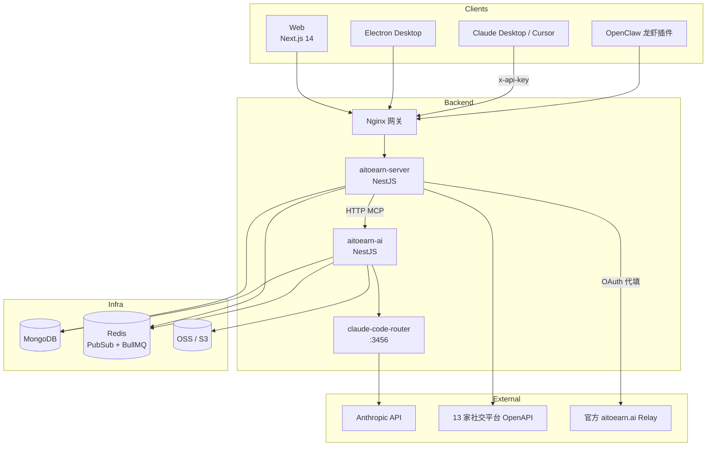
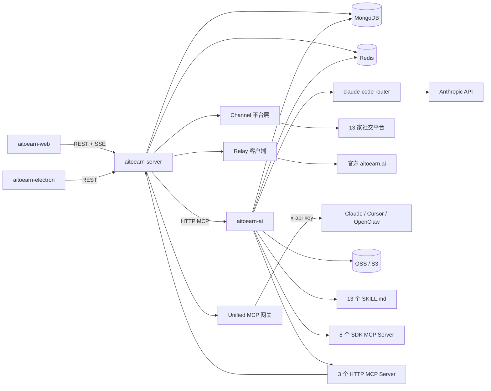
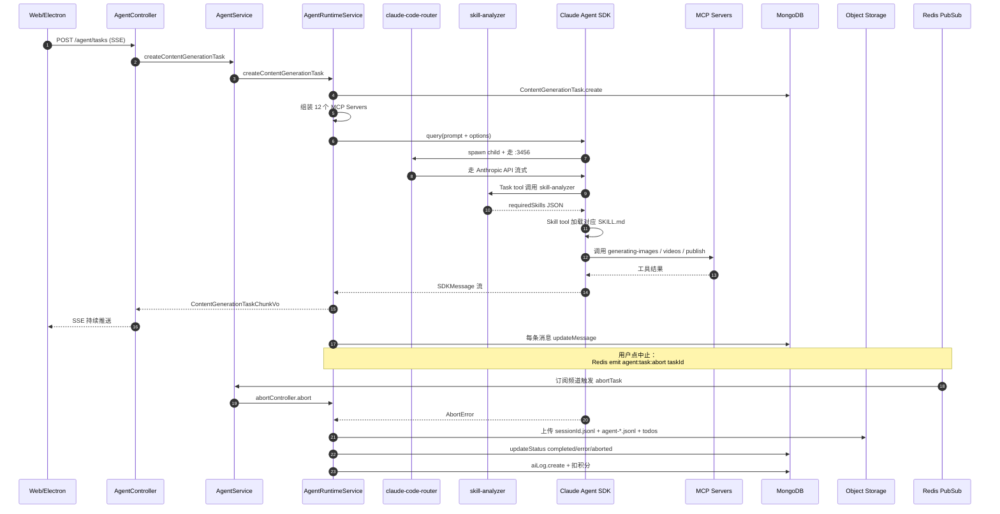
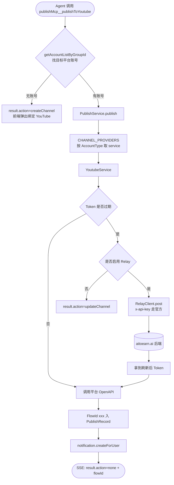

# AiToEarn 源码学习笔记

> 仓库地址：[yikart/AiToEarn](https://github.com/yikart/AiToEarn)
> 学习日期：2026/05/22

---

> **以下为 AI 源码分析**
>
> ### 一句话概括
>
> AiToEarn 是一个面向"一人公司 / 内容创作者"的 AI Agent 内容生产 + 多平台分发 + 变现一体化平台，核心是用 Claude Agent SDK + 13 个 Skill + 12 个 MCP Server 编排出"想 → 写 → 拍 → 发"的全自动流水线，并通过 Relay 借用官方 OAuth 凭据降低自部署门槛。
>
> ### 要点速览
>
> | 子项目 | 角色 | 技术栈 | 关键看点 |
> |--------|------|--------|----------|
> | `project/aitoearn-backend` | 服务端核心 | Nx + NestJS 11 + MongoDB + Redis + BullMQ | 双 app（`aitoearn-server`/`aitoearn-ai`）、统一 MCP、Relay 代理、Claude Code Router 内嵌 |
> | `project/aitoearn-ai/core/agent` | Agent 运行时 | `@anthropic-ai/claude-agent-sdk` + RxJS + SSE | 任务编排、子 Agent（polling-task / skill-analyzer）、Skill 热加载、Session 持久化到 S3 |
> | `project/aitoearn-server/core/channel/platforms` | 平台适配层 | 各平台 OpenAPI / OAuth | 13 个平台共享 `PlatformBaseService`，注册到 `CHANNEL_PROVIDERS` 工厂 Map |
> | `project/aitoearn-electron` | 桌面客户端 | Electron + React 18 + 自研 IoC 装饰器 + SQLite | `Module/Inject/Icp/Et/Scheduled` 仿 NestJS 装饰器、平台插件 BrowserWindow 注入 |
> | `project/aitoearn-web` | Web 前端 | Next.js 14 (App Router) + Zustand + Antd + shadcn/ui | `[lng]` 多语言、`fetch-event-source` 接 SSE、Lexical/Tiptap 富文本 |

---

## 项目简介

AiToEarn（哎哟赚）面向 OPC（一人公司）、个人创作者、品牌方提供"赚钱（Monetize）+ 发布（Publish）+ 互动（Engage）+ 创作（Create）"四件套：用户用一句中文需求即可触发 AI Agent 自动生成图文/视频内容、按平台规则改写文案、一键分发到 13 家以上社交平台（抖音、小红书、快手、B 站、视频号、TikTok、YouTube、Facebook、Instagram、Threads、Twitter/X、Pinterest、LinkedIn），并接入"内容交易市场"按 CPS/CPE/CPM 三种模式结算。仓库同时开源了 Web 应用、Electron 客户端、后端服务、MCP 接入能力，使其既能 SaaS 直用，也能 Docker 自部署，还能挂到 Claude Desktop / Cursor / OpenClaw 等任何支持 MCP 的 Host 中作为"赚钱 Agent"。

## 技术栈

| 类别 | 技术 |
|------|------|
| 语言 | TypeScript 5.9（前后端 / Electron 全栈），少量 EJS 模板 |
| 框架 | NestJS 11、Next.js 14、Electron 32+、React 18、Antd 5、shadcn/ui、Tailwind |
| Agent / AI | `@anthropic-ai/claude-agent-sdk`、`@anthropic-ai/sdk`、`@musistudio/claude-code-router`、LangChain（Gemini）、`zod` 结构化输出 |
| 数据 / 队列 | MongoDB（mongoose）、Redis（Pub/Sub + BullMQ）、Redlock、SQLite（better-sqlite3，仅 Electron 端） |
| 构建工具 | Nx 22.7（后端 monorepo）、Vite（Electron）、Next 内建（Web）、`electron-builder` |
| 依赖管理 | `pnpm@10.33`（后端 / Web）、`npm`（Electron） |
| 测试框架 | Vitest（后端）、Playwright（Web E2E）、`vitest run`（Electron） |
| 部署 | Docker Compose（`docker-compose.yml` 一键起 server + AI + MongoDB + Redis + Nginx），CI 未公开 |

## 目录结构

```text
AiToEarn/
├── docker-compose.yml          # 一键起整套服务（含 Nginx 反向代理）
├── nginx/                      # 网关配置
├── presentation/               # README 用截图 / 演示资源
├── scripts/                    # 部署 / 工具脚本
└── project/
    ├── aitoearn-backend/       # NestJS Nx monorepo（核心后端）
    │   ├── apps/
    │   │   ├── aitoearn-server # 业务侧（账号、内容、发布、MCP、Relay）
    │   │   └── aitoearn-ai     # AI 侧（Agent 运行时、AI 模型代理、草稿生成）
    │   └── libs/               # 17 个共享库（auth/queue/mongodb/redis/nest-mcp/...）
    ├── aitoearn-electron/      # Electron 桌面客户端
    │   ├── electron/main/      # 主进程（自研 IoC、IPC 控制器、平台插件）
    │   ├── electron/plat/      # 各平台浏览器窗口注入脚本（XHS/抖音/快手/视频号）
    │   └── src/                # 渲染进程（React + Antd）
    └── aitoearn-web/           # Next.js 14 SaaS 前端
        ├── src/app/[lng]/      # 多语言路由段（chat / accounts / brand-promotion / ...）
        ├── src/api/            # 后端 REST + SSE 客户端封装
        └── src/store/          # Zustand store
```

## 架构设计

### 整体架构

AiToEarn 采用"一前端两后端 + 桌面端"四端结构：

- **接入层**：Web（Next.js）/ 桌面（Electron）/ Claude Desktop & Cursor（通过 MCP）/ OpenClaw 龙虾插件，全部通过 `https://aitoearn.ai/api/unified/mcp` 与 `https://aitoearn.ai/api/...` 进入后端；
- **业务层 `aitoearn-server`**：账号、内容素材、平台发布、API Key、短链、消息通知、统一 MCP 网关、Relay OAuth 中转；
- **AI 层 `aitoearn-ai`**：Claude Agent 运行时、AI 模型聚合（chat/image/video/aideo）、草稿批量生成、积分扣费 / 退款、AI 可用性监控；
- **基础设施**：MongoDB（业务主存）、Redis（Pub/Sub + 分布式锁 + BullMQ 队列）、对象存储（阿里 OSS / AWS S3，封装在 `@yikart/assets`）、`@musistudio/claude-code-router`（本地模型路由代理，监听 127.0.0.1:3456）。



### 核心模块

#### 1. `aitoearn-ai/core/agent` — Agent 运行时（最具学习价值）

- **职责**：把"用户一句话"转换为"可执行 Agent 任务"，编排 Skill / MCP / 子 Agent，按 SSE 把过程消息推流回前端，落库到 `ContentGenerationTask`。
- **核心文件**：
  - `agent.controller.ts` — `POST /agent/tasks` 标记 SSE，绑定 `AbortController`；
  - `agent.service.ts` — 任务 CRUD、分享、转发、超时回收；订阅 Redis 频道 `agent:task:abort` 实现跨实例终止；
  - `services/agent-runtime.service.ts` — **整个仓库最复杂的文件（约 1040 行）**，封装 `claude-agent-sdk` 的 `query` 调用、子 Agent 定义、PostToolUse hook、Session JSONL 上传/下载到 S3；
  - `claude-code-router/claude-code-router.service.ts` — 在 `OnModuleInit` 阶段 spawn `@musistudio/claude-code-router` 作为子进程并写入 `.claude-session/.claude-code-router/config.json`，把所有 Claude 流量经过本机 3456 端口路由（用 `default/background/think` 三类模型组）；
  - `skill-init.service.ts` — 启动时把 13 个 SKILL 目录拷贝到 `.claude-session/.claude/skills/`，让 SDK 的 `Skill` tool 能扫到；
  - `mcp/*.mcp.ts` — 8 个 SDK MCP Server（Media、Aideo、Util、VideoEdit、DramaRecap、StyleTransfer、ImageEdit、Subtitle、VideoUtils），通过 `createSdkMcpServer` 与 `wrapTool` 包装；
  - `agent.constants.ts` — `SYSTEM_PROMPT`（300+ 行的中英文混编 SOP）、`POLLING_TASK_AGENT_PROMPT`、`SKILL_ANALYZER_AGENT_PROMPT`，强制每次生成前先调用 `skill-analyzer` 子 Agent 决定加载哪几个 Skill。
- **关键设计**：
  - SSE 数据流由 RxJS 串起来：`firstMessage$`（提取 sessionId 入库）+ `restMessages$`（消息转 VO 落库）+ `keepAlive$`（5s 一次心跳）+ `titleUpdateStream$`（异步标题更新工具）通过 `merge` 合并；
  - 子 Agent 注册：`polling-task`（haiku，专门轮询 Veo/Grok/Aideo 等异步任务，最大 20min）+ `skill-analyzer`（haiku，根据用户意图返回 JSON `{requiredSkills, optionalSkills, reasoning}`）；
  - 任务结束时按 `total_cost_usd * 100` 折算积分写入 `aiLogRepo`，并扣 `CreditsType.AiService`；失败时由 `AiTaskRefundConsumer` 走 BullMQ 退款。

#### 2. `aitoearn-server/core/channel` — 13 平台适配层

- **职责**：把"统一发布请求"翻译成各平台特定 API；维护账号 OAuth 凭据；提供二次抓取（统计、互动、监测）能力。
- **核心文件**：
  - `platforms/platforms.module.ts` — 用 `useFactory` 把所有平台 service 注入到 `CHANNEL_PROVIDERS` 这个 `Record<AccountType, PlatformBaseService>` 字典，业务侧通过 `PlatformService` 按 `accountType` 取对应 service；
  - `platforms/base.service.ts` — 抽象基类，约束 `getAccessTokenStatus / getWorkLinkInfo / validateOwnedWorkLink / deletePost / syncAccountStatisticsOnAuth` 等方法；
  - `platforms/<platform>/*.service.ts` — 13 个平台各自实现 OAuth、发布、抓取（`bilibili / kwai / youtube / meta(facebook,instagram,threads,linkedin) / tiktok / twitter / pinterest / wx-plat / xiaohongshu / douyin / google-business`）；
  - `publish.controller.ts` + `publishing/` — 统一发布门面；`publish.mcp.controller.ts` 暴露给 Agent 调用的 publish MCP；
  - `engagement/`、`interact/`、`data-cube/` — 互动 Agent / 数据看板支撑；
  - `twitter.mcp.controller.ts` — Twitter 单独维护一份 MCP（基于 `@xdevplatform/xdk`）。

#### 3. `aitoearn-server/core/relay` — OAuth 代填中转

- **职责**：Docker 自部署用户没法给抖音 / TikTok 注册开发者凭据，Relay 直接走官方 `aitoearn.ai/api` 借用其 OAuth 应用并把回调结果转发回本地。
- **核心文件**：
  - `relay-client.service.ts` — 统一封装 `axios` 请求，所有调用带 `x-api-key`；
  - `relay-oauth.controller.ts` — 暴露 `/relay-callback`，作为各平台 OAuth 的统一回调；
  - `relay-account.exception.ts` / `relay-auth.exception.ts` / `relay-exception.filter.ts` — 区分账号侧 / 鉴权侧 / 通用异常并由 filter 转 HTTP 响应。

#### 4. `aitoearn-server/core/unified-mcp` — 统一 MCP 网关

- **职责**：把 `account / publish / content` 三个业务模块的 MCP Controller 重新挂载到 `unified` 前缀下，对外暴露一个 `/api/unified/mcp` 入口，供 Claude Desktop、Cursor、OpenClaw 等 Host 直接接入。
- **核心文件**：`unified-mcp.module.ts`（基于自研 `@yikart/nest-mcp` 库的 `McpModule.forRoot`）、`draft-generation.mcp.controller.ts`。

#### 5. `aitoearn-ai/core/draft-generation` — 批量草稿生成

- **职责**：基于 LangChain + Gemini 给一份"长视频 / 图文素材 / 平台清单"批量生成各平台符合规范的标题、描述、Topics、封面，对应 README 提到的"批量生成 / 矩阵账号铺量"能力。
- **核心文件**：`draft-generation.service.ts`、`draft-generation-planner.service.ts`、`draft-generation-memory.service.ts`、`draft-generation.consumer.ts`（BullMQ 消费者）、`draft-generation-platforms.ts`（按平台限制反推兼容账号类型）。

#### 6. `aitoearn-electron/electron/main` — 自研 IoC + IPC 框架

- **职责**：把"NestJS 风格"搬到 Electron 主进程，把 `ipcMain.handle / EventEmitter / node-schedule` 折叠成装饰器，让客户端代码风格与后端保持一致。
- **核心文件**：
  - `core/decorators.ts` — `Module / Controller / Injectable / Inject / Icp / Et / Scheduled` 7 个装饰器；
  - `core/container.ts` — 极简 DI 容器（registerProvider / get / setController / hasController）；
  - `app.ts` — 根 Module 聚合 `Tools/User/Account/Publish/Backup/Test/Reply/AutoRun/Interaction/Tracing` 子模块；
  - `index.ts` — Electron 入口：BrowserWindow + 系统托盘 + KwaiPub 监听；
  - `plat/platforms/{douyin,Kwai,wxSph,xhs}` — 把目标平台站点装载到独立 BrowserWindow 中，通过预注入脚本在 webview 上下文操作 DOM 完成发布（小红书、抖音不开放 OpenAPI 时的兜底方案）。

#### 7. `aitoearn-web` — Next.js SaaS 前端

- **职责**：聊天式 Agent 界面（`[lng]/chat`）、账号矩阵（`accounts`）、AI 社交（`ai-social`）、草稿箱（`draft-box`）、品牌推广（`brand-promotion`）、任务历史（`tasks-history`）。
- **核心文件**：
  - `src/api/agent.ts` — 用 `@microsoft/fetch-event-source` 接 Agent SSE，定义 `TaskStatus / TaskMessage / TaskListItem` 等类型；
  - `src/api/{account,channel,content,...}.ts` — 普通 REST 客户端；
  - `src/middleware.ts` — Next.js 中间件做语言重定向；
  - `src/store/` — Zustand 用于全局用户态、聊天态。

### 模块依赖关系



## 核心流程

### 流程一：内容生成 Agent 任务全生命周期

最能反映"AI Agent 仓库"价值的流程，覆盖 SSE 推流、Skill 选择、子 Agent 调度、Session 持久化、积分扣费、跨实例终止。



要点说明：

1. `AgentController` 用 `@SetMetadata(SSE_METADATA, true)` + 一组 `Cache-Control / X-Accel-Buffering` Header 强制走 SSE，并主动 `res.on('close')` 监听断连。
2. `claude-code-router` 在模块初始化时通过 `require.resolve('@musistudio/claude-code-router/dist/cli.js')` 找到 CLI 路径并 `spawn`，进程崩溃后由 `'exit'` 监听器自动重启。`ANTHROPIC_BASE_URL=http://127.0.0.1:3456 + ANTHROPIC_AUTH_TOKEN=ccr` 让 SDK 走本机路由，便于做模型分组（`default/background/think`）和兜底切换。
3. `skill-analyzer` 子 Agent 用 `haiku` 模型，prompt 中以表格列出 13 个 Skill 的关键词，并强制返回 **纯 JSON** 不带 markdown，与本仓库 `agent/code-reviewer.md` 的输出契约保持一致。
4. 中止流程用 Redis Pub/Sub 而不是单实例 Map：`AGENT_TASK_ABORT_CHANNEL = 'agent:task:abort'`，`AgentService.onModuleInit` 订阅；任意实例都能终止任意实例上的任务。
5. Session 持久化：把 `~/.claude-session/.claude/projects/<projectDir>/<sessionId>.jsonl`、子 Agent JSONL（按正则提取 `agentId`）、`todos/*.json` 全部上传到 S3 路径 `claude-session/.claude/projects/<projectDir>/...`，**恢复对话**时 `dto.taskId` 命中后会反向 `getObject` 落地到本机文件系统再 `resume: sessionId` 给 SDK。

### 流程二：跨平台一键发布与"无开发者凭据"OAuth

第二个核心闭环：发布动作的鉴权与平台分发，体现 Relay 与 `CHANNEL_PROVIDERS` 工厂的合作。



要点说明：

1. `SYSTEM_PROMPT` 在 Step 7 强制要求"先 `getAccountGroupList` → `getAccountListByGroupId` 找账号，再决定 publish vs createChannel"，避免无账号情况下的失败 API 调用。
2. 13 个平台 service 全部继承 `PlatformBaseService`，由 `'CHANNEL_PROVIDERS'` Provider 用 `useFactory` 把 13 个 service 实例注入成 `Record<AccountType, PlatformBaseService>` 字典，`PlatformService.get(accountType)` 按 enum 直接取，新增平台只需在 `AccountType` 枚举 + `platforms.module.ts` 工厂中各加一项。
3. **Relay 是关键差异点**：自部署用户在 `RELAY_API_KEY / RELAY_SERVER_URL` 配好后，所有第三方 OAuth Refresh / 上传签名都改走 `RelayClientService.request`（带 `x-api-key`），不需要在抖音 / TikTok / YouTube 各自申请开发者账号；callback 由本地 `relay-oauth.controller.ts` 的 `/relay-callback` 接收。
4. 抖音、小红书因平台不开放上传 API，Web/Server 端直接走"action=navigateToPublish"返回，由 **Electron 桌面端**把目标站点装入 BrowserWindow 用注入脚本完成 DOM 级发布——这就是 `electron/plat/platforms/{douyin,xhs,Kwai,wxSph}` 的存在原因。

## 关键设计亮点

### 1. 把 Claude Agent SDK + Claude Code Router 嵌进后端进程

**问题**：要给 SaaS 用户提供"跑 Claude Code Agent"的能力，又要支持模型分组（默认 / 后台 / Thinking）、私有路由、平滑切换。

**实现**：`ClaudeCodeRouterService.onModuleInit` 在 NestJS 启动时即用 `require.resolve('@musistudio/claude-code-router/dist/cli.js')` 找到 CLI，写 `config.json` 后 `spawn('node', [cliPath, 'start'])`，并在 `'exit'` 时自重启；同时 `watch` 会话目录里的 `.claude-code-router.pid` 文件做清理。`AgentRuntimeService.claudeQuery` 把 `ANTHROPIC_BASE_URL=http://127.0.0.1:3456` + `ANTHROPIC_AUTH_TOKEN=ccr` 注入到 SDK 的 `env`，SDK spawn 出来的 Claude Code 子进程也跟着走本机路由。

**为什么**：等价于在每台后端机器上跑了一个"Anthropic 反向代理"，路由配置变更（换模型、限流、加 PROXY_URL）只需改 `config.json`，不需要重启后端；`Router.background = haiku-4-5` 让 `polling-task` / `skill-analyzer` 这些子 Agent 自动用便宜模型，省钱省 token。

### 2. Skill + 子 Agent + MCP 三层组合替代"硬编码工作流"

**问题**：用户的需求千变万化（生成图、生成视频、风格转换、批量发布……），写 if-else 难以维护。

**实现**：`SYSTEM_PROMPT` 强制每个任务先调用 `skill-analyzer` 子 Agent（haiku，纯 JSON 输出 `{requiredSkills}`），再调用 `Skill` tool 真正加载对应 `SKILL.md`，最后才进入 `Skill` 内部的工作流；长任务（Veo/Grok/Aideo）丢给 `polling-task` 子 Agent 异步轮询；具体能力封装为 12 个 MCP Server（8 个 SDK 内构、3 个 HTTP MCP 通过 `aitoearn-server` 暴露 + 1 个 SessionTools），`generateAllowedTools` 按 enum 自动给 SDK 拼出 `mcp__<server>__<tool>` 白名单。

**为什么**：新增能力 = 加一个 `SKILL.md` + 加一个 MCP Server，**不需要改 Agent 主循环**；模型自己根据语义选择技能链，遇到 Veo 失败时 prompt 明确写了"必须再加载 `editing-videos` Skill 切回剪辑兜底"，让模型在工作流之间无缝切换。

### 3. SSE + Redis PubSub + S3 三件套支持的多实例 Agent

**问题**：Agent 任务是长流（分钟到 30 分钟）+ 中途可能断线 + 集群多实例部署 + 用户随时取消。

**实现**：
- **断线续传**：SSE 流推不动时前端走 `GET /agent/tasks/:taskId/messages?lastMessageId=...` 拉缓存的 `task.messages`；`messages` 数组每条消息带 `uuid`，按 lastMessageId 切片回放；
- **跨实例取消**：`POST /agent/tasks/:taskId/abort` 不直接终止当前进程，而是 `redisPubSubService.emit('agent:task:abort', taskId)`，所有实例的 `AgentService.onModuleInit` 都订阅了该频道，命中本机 `runningTasks` 才执行 `abortController.abort()`；
- **会话恢复**：`uploadAgentSession` 把 `<sessionId>.jsonl`、子 Agent JSONL、todos 全部 PUT 到 S3，下次 `dto.taskId` 携带恢复时 `downloadAgentSession` 反向落盘后 `resume: sessionId`，把 Claude Agent SDK 当成"无状态"消费的同时保留多轮对话能力。

**为什么**：避免把 Agent 进程绑死在单实例上；给 K8s 滚动升级、Pod 漂移留余地；每个任务的"思考过程"就成了可审计 / 可分享的资产（`createPublicShare` 直接基于这份 JSONL）。

### 4. 13 个平台用 `CHANNEL_PROVIDERS` Map + `PlatformBaseService` 抽象

**问题**：每个平台 OAuth、上传、统计 API 都不一样，但发布 / 查作品 / 查统计的语义一致。

**实现**：抽象基类 `PlatformBaseService`（`platforms/base.service.ts`）声明 `getAccessTokenStatus / getWorkLinkInfo / validateOwnedWorkLink / deletePost / syncAccountStatisticsOnAuth`，并通过 `@Inject` 直接注入 `OAuth2CredentialRepository / AccountRepository`；具体 service 只实现差异部分。然后 `PlatModule` 用 `useFactory + inject` 把 13 个 service 折叠到 `'CHANNEL_PROVIDERS'` Map（key 为 `AccountType` 枚举），调用方 `PlatformService` 按 `accountType` 直接索引。

**为什么**：避免 13 个 if-else 散落各处；新增平台一处枚举 + 一处工厂注入即可；每个平台 service 内的方法签名完全一致，方便 MCP Tool 套用同一份 zod schema。

### 5. 自研"NestJS 风格 IoC"把 Electron IPC 写成装饰器

**问题**：Electron 的 `ipcMain.handle('channel', handler)` + 渲染端 `ipcRenderer.invoke('channel', payload)` 的胶水代码极度冗长且易写错。

**实现**：`electron/main/core/decorators.ts` 用 100 多行实现 `Module / Controller / Injectable / Inject / Icp / Et / Scheduled`；`@Icp('channel')` 直接把方法挂到 `ipcMain.handle`，`@Et('eventName')` 挂到内部 `EtEvent` EventEmitter，`@Scheduled('0 */5 * * * *')` 挂到 `node-schedule`。`@Module` 收集 providers / controllers，靠 `Reflect.getMetadata(INJECT_METADATA_KEY, target.constructor)` 自动注入。

**为什么**：让客户端代码风格与服务端 NestJS 高度一致，新人一处习惯就能两端写代码；同时避免引入完整 NestJS 在 Electron 中的体积代价（仅 `reflect-metadata` 一个依赖）。

---

## 学习收获 / 复用建议

- **想自己做"Claude Agent SaaS"**：照抄 `aitoearn-ai/core/agent` 的 SSE + claude-code-router + skill-analyzer + polling-task 套路即可，关键文件不到 5 个；
- **想自己做"多平台分发"**：直接看 `aitoearn-server/core/channel/platforms`，13 个平台都有完整 OAuth / 发布参考实现，比绝大多数博客片段更系统；
- **想理解 MCP 工程化**：`libs/nest-mcp` + `unified-mcp.module.ts` + 各业务模块的 `*.mcp.controller.ts` 是一份"NestJS + MCP"的完整模板，比 spec 示例真实；
- **想给 Electron 写胶水更优雅**：`electron/main/core/decorators.ts` 是低成本"Mini Nest"的样板。

> 未深入分析的部分：`aitoearn-server/core/channel/data-cube`（数据看板）、`aitoearn-electron/electron/main/{interaction,reply,backup,autoRun}`（互动 / 回复 / 备份 / 自动执行）、`aitoearn-web` 富文本与画布相关的 Lexical/Tiptap/Annotorious 集成、`aitoearn-ai/core/ai/{aideo,settlement,pricing}` 的计费明细。
