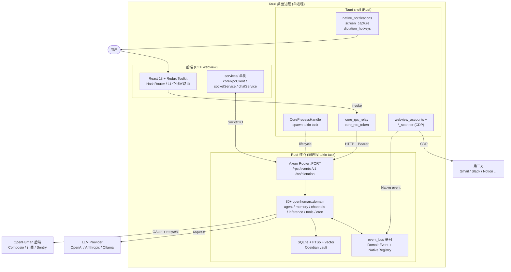
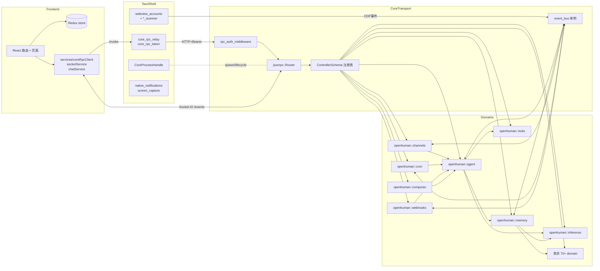
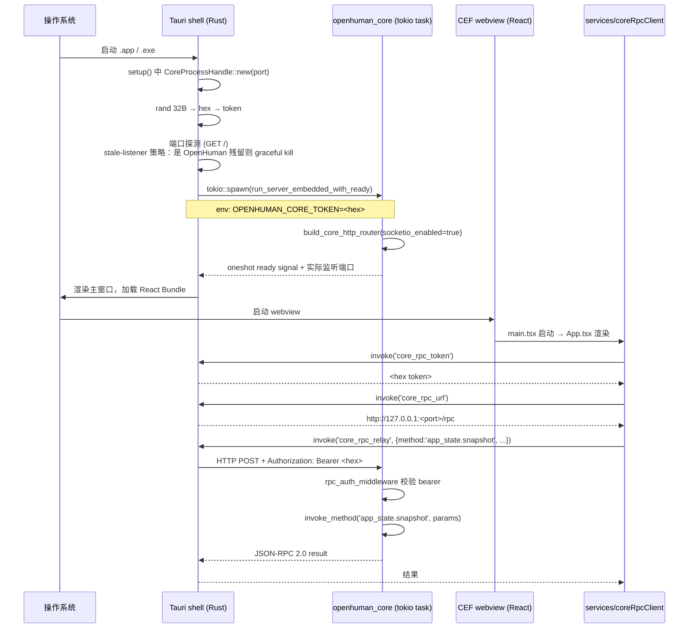
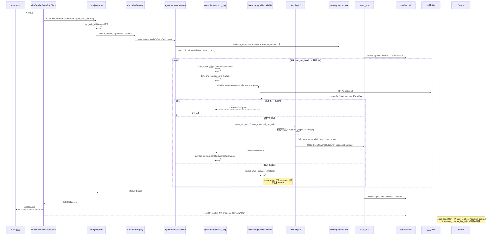

# openhuman 源码学习笔记

> 仓库地址：[tinyhumansai/openhuman](https://github.com/tinyhumansai/openhuman)
> 学习日期：2026-05-22

---

> **以下为 AI 源码分析**
>
> ### 一句话概括
>
> OpenHuman 是一款"私有 + 简单 + 强大"的开源个人 AI Agent 桌面应用，由 **Tauri v2 (vendored CEF) 桌面壳 + React 前端 + Rust 核心 (Axum/JSON-RPC + 事件总线 + Memory Tree)** 三段式架构组成，将 LLM 工具调用循环、118+ 第三方集成、本地化记忆树和 token 压缩层全部塞进同一个进程。
>
> ### 要点速览
>
> | 模块 | 职责 | 关键文件 / 目录 |
> |------|------|----------------|
> | `src/main.rs` + `src/lib.rs` | Rust 二进制入口、Sentry 初始化 + 密钥脱敏 | `run_core_from_args()` |
> | `src/core/` | **传输层**：CLI、JSON-RPC over Axum、Socket.IO、事件总线、`ControllerSchema` | `core/jsonrpc.rs`、`core/cli.rs`、`core/event_bus/` |
> | `src/openhuman/` | **领域层**：80+ 业务 domain（agent、memory、channels、inference、cron、tools、composio…），每个 domain 自带 `rpc.rs` + `schemas.rs` + `ops.rs` | `openhuman/agent/harness/`、`openhuman/memory/tree/`、`openhuman/channels/providers/` |
> | `app/src/` | React + Redux Toolkit + redux-persist 前端 UX | `App.tsx`、`AppRoutes.tsx`、`store/`、`services/coreRpcClient.ts` |
> | `app/src-tauri/` | 桌面壳：`CoreProcessHandle` 把 Rust 核心当 tokio 任务跑、CDP webview 抓取、原生通知/截屏 | `src-tauri/src/core_process.rs`、`src-tauri/src/webview_accounts/` |
> | `gitbooks/` `docs/` | 架构文档、用户/开发者手册 | `gitbooks/developing/architecture/` |

---

## 项目简介

OpenHuman 把"agent 客户端 + 集成中枢 + 本地知识库"打包成一个跨 macOS / Windows / Linux 的桌面应用：用户安装即用，无需配置 LLM Key、无需自建插件 server。它通过一次 OAuth 接入 Gmail / Notion / Slack / GitHub / Calendar 等 118+ 第三方服务，每 20 分钟把这些数据通过 LLM 抽取成 ≤3k token 的 Markdown 块写进**本地 SQLite + Obsidian 兼容的 vault**（Memory Tree），形成"记得你一切"的个人知识图谱。Agent 的工具调用、模型路由、TokenJuice 压缩、语音 STT/TTS、Mascot 桌宠、Google Meet 直播参会等能力默认开箱可用。整体技术亮点是把传统会"分裂为前端 + 后端 + 沙盒 + worker"的 agent 架构折叠成**一个 Tauri 进程**：React 负责 UI，Rust 核心通过内嵌 Axum 暴露 JSON-RPC + Socket.IO，再通过 `core_rpc_relay` Tauri 命令绕开 CORS 直连本地核心。

## 技术栈

| 类别 | 技术 |
|------|------|
| 语言 | Rust (核心 / Tauri shell) + TypeScript (React 前端) + 少量 Shell / PowerShell / Node 脚本 |
| 框架 | Tauri v2 (vendored CEF tauri-cli) · Axum 0.8 · tokio · React 18 · Redux Toolkit · redux-persist · React Router HashRouter · Vite · Vitest · WDIO · socketioxide |
| 构建工具 | Cargo (workspace + feature flags) + pnpm 10.10 (workspace) + Vite + 自研 `pnpm debug` 包装脚本 |
| 依赖管理 | Cargo (`Cargo.toml` + `Cargo.lock`) · pnpm (`pnpm-workspace.yaml`) |
| 测试框架 | `cargo test` (Rust 单元 / 集成) · Vitest + 共享 `mock-api-server.mjs` (前端) · WDIO + tauri-driver / Appium Mac2 (桌面 E2E) · `cargo-llvm-cov` + `diff-cover` (≥80% 改动行覆盖率门禁) |

关键依赖：`reqwest`、`rusqlite (bundled)`、`schemars`、`opentelemetry`、`sentry`、`whisper-rs`（语音）、`whatsapp-rust`（feature gated）、`socketioxide`、`@tauri-apps/api`、`@reduxjs/toolkit`、`@sentry/react`。

## 目录结构

```
openhuman/
├── src/                          # Rust 库 crate `openhuman`
│   ├── main.rs                   # 二进制入口：Sentry + scrub_secrets + run_core_from_args
│   ├── lib.rs                    # 顶层导出 api/core/openhuman/rpc 四个 mod
│   ├── core/                     # ── 传输层（transport-only）──
│   │   ├── cli.rs                # ASCII banner + 子命令分发：run/serve, mcp, call, agent, memory…
│   │   ├── jsonrpc.rs            # build_core_http_router + run_server_embedded(_with_ready)
│   │   ├── all.rs                # 所有 domain controller 注册点（all_*_registered_controllers）
│   │   ├── dispatch.rs           # 老式 switch 分支（已逐 domain 迁移到 controller registry）
│   │   ├── auth.rs               # rpc_auth_middleware（Bearer 鉴权）
│   │   ├── socketio.rs           # attach_socketio + spawn_web_channel_bridge
│   │   ├── event_bus/            # 单例事件总线：DomainEvent + NativeRegistry
│   │   ├── observability.rs      # Sentry before_send 过滤器（瞬态错误降噪）
│   │   └── types.rs              # ControllerSchema、FieldSchema、TypeSchema、AppState
│   ├── openhuman/                # ── 领域层 (80+ domain)──
│   │   ├── agent/                #   多 agent 编排：harness/session/runtime + tool_loop + triage
│   │   ├── memory/               #   Memory Tree：traits → store(SQLite+FTS5+vector) → ingestion → tree
│   │   ├── channels/             #   消息渠道：Slack/Discord/Telegram/WhatsApp/Email/IRC/Matrix…
│   │   ├── inference/            #   LLM Provider 抽象 + reliable.rs (retry+fallback) + /v1 OpenAI 兼容
│   │   ├── tools/                #   工具注册表 + 工具实现 (impl/agent, impl/system…)
│   │   ├── composio/             #   Composio 连接器：托管 OAuth + trigger 事件桥
│   │   ├── cron/                 #   调度器：scheduler.rs + bus.rs（CronDeliverySubscriber）
│   │   ├── webhooks/             #   入口/出口 webhook，触发走 agent::triage
│   │   ├── tokenjuice/           #   token 压缩层
│   │   ├── tree_summarizer/      #   层级摘要（Memory Tree 的 "tree_*" 系列）
│   │   ├── voice/ meet/ meet_agent/  # 语音、Google Meet 实时参会
│   │   ├── about_app/ approval/ billing/ wallet/ referral/ team/ … (其余约 60 个 domain)
│   │   └── config/, encryption/, credentials/, security/, scheduler_gate/
│   ├── api/, rpc/                # 对外 API/RPC schema 辅助
│   └── bin/                      # 辅助二进制：slack_backfill, gmail_backfill_3d, inference_probe…
├── app/                          # pnpm workspace `openhuman-app` (v0.53.45)
│   ├── src/                      # ── React 前端 ──
│   │   ├── main.tsx              # 入口：mascot/overlay/main 三窗口分支 + Sentry/GA + redux-persist 预热
│   │   ├── App.tsx               # Provider 链：Sentry → Redux → PersistGate → Theme → I18n → BootCheck → CoreState → Socket → ChatRuntime → HashRouter → Command → ServiceBlocking → AppShell
│   │   ├── AppRoutes.tsx         # 路由：/onboarding /home /human /intelligence /skills /chat /channels /settings/*
│   │   ├── store/                # Redux Toolkit 切片（accounts、chatRuntime、thread、socket、mascot…）+ userScopedStorage
│   │   ├── services/             # 单例：apiClient、socketService、coreRpcClient、coreCommandClient、chatService、coreHealthMonitor…
│   │   ├── providers/            # CoreStateProvider / SocketProvider / ChatRuntimeProvider / ThemeProvider
│   │   ├── lib/                  # 横向库：ai/, mcp/, channels/, coreState/, i18n/, nativeNotifications/, webviewNotifications/
│   │   ├── features/             # human/, meet/, voice/, wallet/, screen-intelligence/, autocomplete/…
│   │   ├── pages/, components/   # 路由页面 + 通用组件
│   │   ├── mascot/, overlay/     # 独立窗口入口（main.tsx 通过 ?window= 区分）
│   │   └── utils/config.ts       # 唯一允许读 import.meta.env 的地方
│   └── src-tauri/                # ── Tauri 桌面壳 ──
│       ├── src/lib.rs            # tauri::Builder + invoke_handler 注册所有 IPC 命令
│       ├── src/core_process.rs   # CoreProcessHandle：把 openhuman_core::core::jsonrpc::run_server_embedded_with_ready spawn 为 tokio task
│       ├── src/core_rpc.rs       # core_rpc_relay：用 Tauri IPC 转 HTTP 避开 CORS
│       ├── src/webview_accounts/ # CEF 子 webview 管理（whatsapp/slack/discord/telegram 等"零注入"）
│       ├── src/{slack,discord,telegram,whatsapp,gmessages,imessage,meet}_scanner/  # CDP 抓取 + 通知
│       ├── src/meet_audio/, meet_call/, meet_video/, fake_camera/, screen_capture/
│       ├── src/{cdp,cef_preflight,cef_profile,mascot_native_window,native_notifications,process_kill,process_recovery,window_state}.rs
│       └── tauri.conf.json
├── packages/                     # 安装包脚手架：deb / homebrew / homebrew-core / npm
├── scripts/                      # 大量 shell/mjs 工具：debug/, agent-batch/, deep-work/, rabbit/, shortcuts/
├── e2e/                          # macOS/Linux 双轨 E2E 容器化运行
├── tests/                        # cargo 集成测试（json_rpc_e2e、agent_*_public、memory_*_e2e…）
├── docs/                         # 内部深度设计（excalidraw、sentry、memory LLD…）
├── gitbooks/                     # 公开开发者文档（architecture / e2e-testing / features…）
├── remotion/                     # Mascot 视频帧 Remotion 渲染管线
├── design-previews/              # UI 设计稿
└── CLAUDE.md / AGENTS.md         # 给 AI 协作者的开发规范（649 行 + 311 行）
```

## 架构设计

### 整体架构

OpenHuman 把"以前散在四五个进程里的 agent 系统"折叠到**一个 Tauri 桌面进程**里完成：CEF webview 渲染 React 前端，前端通过 Tauri 的 IPC 调 `core_rpc_relay`，shell 把消息转发到内嵌 Axum 服务的 `http://127.0.0.1:<port>/rpc`，Rust 核心在同一个进程的 tokio 任务里处理 RPC、读写 SQLite、调 LLM、跑工具循环、推 Socket.IO 事件。`OPENHUMAN_CORE_TOKEN` 是一段每次启动重新生成的 hex bearer，shell 既写到核心进程的环境变量里又通过 `core_rpc_token` Tauri 命令暴露给前端，保证只有同一个 GUI 实例可以访问本地核心。



### 核心模块

#### A. Rust 核心传输层 `src/core/`

- **职责**：把 80+ domain 的 controller 暴露为 CLI 子命令、JSON-RPC 方法、Socket.IO 事件，提供事件总线、鉴权、可观测性、关停信号统一入口。
- **关键文件**
  - `core/jsonrpc.rs::build_core_http_router(socketio_enabled)`：注册 `/`, `/health`, `/schema`, `/events`, `/events/webhooks`, `/rpc`, `/ws/dictation`, `/auth/telegram`, `/v1/...`，再叠加 `cors_middleware` → `rpc_auth_middleware` → `http_request_log_middleware` 三层中间件，最后挂 socketio layer。
  - `core/jsonrpc.rs::run_server_embedded_with_ready`：内嵌模式入口，被 `app/src-tauri/src/core_process.rs:264` `tokio::spawn` 起来。
  - `core/cli.rs::run_from_cli_args`：纯 CLI 入口，含 ASCII banner、grouped_schemas() 帮助、`run/serve | mcp | call | agent | memory | screen-intelligence | text-input | tree-summarizer` 等子命令分发。
  - `core/all.rs`：每个 domain 在这里注册 `all_<domain>_registered_controllers`，新 domain 的 controller 必须在这里登记才能被 RPC/CLI 路由到。
  - `core/types.rs`：`ControllerSchema { namespace, function, inputs, outputs }` + `TypeSchema` + `FieldSchema` 是整个项目的"接口签名"统一格式。
  - `core/auth.rs::rpc_auth_middleware`：每个请求都校验 `Authorization: Bearer <OPENHUMAN_CORE_TOKEN>`，未授权直接 401，连 schema 都不返回。
  - `core/event_bus/`：见下文专题。
  - `core/observability.rs`：定义 Sentry before_send 过滤函数（`is_transient_provider_http_failure` / `is_session_expired_event` / `is_max_iterations_event` …），把"用户可见、可恢复"的错误从 Sentry 流量里剔除。
- **与其他模块关系**：传输层向下只调 `crate::openhuman::*` 的 controller，向上只暴露 HTTP/CLI；它**不应**包含业务逻辑（`AGENTS.md` / `CLAUDE.md` 反复强调"No heavy domain logic in `src/core/`"）。

#### B. 事件总线 `src/core/event_bus/`

- **职责**：解耦 80+ domain 的横向通信，同时承担"零序列化、跨模块直接调用"的进程内 RPC。
- **核心 API**：
  - 广播：`publish_global(event)` + `subscribe_global(handler)`，建在 `tokio::sync::broadcast` 之上，多对多 fire-and-forget。
  - 原生请求：`register_native_global::<Req, Resp, _, _>(method, handler)` + `request_native_global(method, req)`，按 `"<domain>.<verb>"` 字符串路由，**保留 Rust 原生类型**（`Arc`、`mpsc::Sender`、trait object），不走 JSON。
- **关键类型**：`DomainEvent`（`#[non_exhaustive]` 枚举，含 `AgentTurnStarted`、`SubagentSpawned`、`MemoryStored`、`MemoryIngestionCompleted`、`ChannelInboundMessage` 等约 30+ 变体）、`EventHandler`（async trait，可选 `domains()` 过滤）、`SubscriptionHandle`（RAII，drop 即取消订阅）。
- **使用约定**：每个 domain 拥有自己的 `bus.rs`（如 `cron/bus.rs::CronDeliverySubscriber`、`channels/bus.rs::ChannelInboundSubscriber`、`webhooks/bus.rs::WebhookRequestSubscriber`），命名 `<Purpose>Subscriber` + `name() = "<domain>::<purpose>"`。

#### C. Agent 运行时 `src/openhuman/agent/`

- **职责**：拥有 LLM 工具调用循环、子 agent 调度、对话 transcript、外部触发事件分诊（triage）pipeline、bundled prompt 资源。
- **核心文件**
  - `agent/harness/session/{types.rs,builder.rs,turn.rs,runtime.rs}`：`Agent` 与 `AgentBuilder` —— 任何聊天回合的入口。
  - `agent/harness/tool_loop.rs::run_tool_call_loop`：核心工具调用循环，含**上下文水位 guard、stop hooks、token budget 削减、payload summarizer 摘要、native tool / XML / JSON / P-Format 三态工具协议**、KV cache 重用 fork、最大迭代次数（默认 10）保险栓。
  - `agent/harness/subagent_runner/`：`run_subagent` 让父 agent 在工具循环里递归启动子 agent。
  - `agent/harness/definition.rs`：`AgentDefinition` + `AgentDefinitionRegistry`，从 builtin + workspace TOML 加载 agent 原型（orchestrator / planner / researcher / code_executor / summarizer / archivist / trigger_triage…）。
  - `agent/triage/`：`run_triage` + `apply_decision`，把外部 trigger（cron tick、webhook、Composio 事件、channel 消息）分类成 `TriageAction`，必要时升级为子 agent。
  - `agent/dispatcher.rs`：`ToolDispatcher` trait，抽象掉模型厂商之间的工具调用格式差异。
- **被谁调用**：`channels/runtime/dispatch.rs`（消息入流）、`cron/scheduler.rs`（定时触发）、`webhooks/ops.rs`（webhook 入流）、`composio/bus.rs`（Composio trigger）、`tools/impl/agent/{dispatch,spawn_subagent}.rs`（子 agent 工具）、`local_ai/`（本地推理后端）。
- **RPC 暴露**：`agent.chat`、`agent.chat_simple`、`agent.server_status`、`agent.list_definitions`、`agent.get_definition`、`agent.reload_definitions`、`agent.triage_evaluate`。

#### D. Memory（记忆树）`src/openhuman/memory/`

- **职责**：本地化、可被 Obsidian 浏览的"个人知识图谱"。同一份内容在 SQLite + 向量库里可被 RAG 召回，又在文件系统的 vault 里以 Markdown 存在。
- **分层（README.md 同心结构）**
  1. `traits.rs`：`Memory` 后端契约（任何替换实现都要满足此 trait）。
  2. `store/`：`UnifiedMemory`（SQLite + FTS5 关键词检索 + 向量表 + 实体/关系图表）+ `MemoryClient` async 句柄。
  3. `ingestion/`：把文档切块 → 抽取实体/关系/embedding → 投入 `IngestionQueue` 后台 worker。
  4. `tree/`：bucket-seal LLD 检索新架构（canonicalize → chunker/content_store → score/retrieval → tree_source/tree_topic/tree_global → background jobs）。新旧两套并存，正在迁移。
  5. `conversations/` + `slack_ingestion/`：领域适配层。
- **关键 RPC**：`memory.{init, query_namespace, recall_context, doc_put, doc_ingest, kv_set, kv_get, graph_upsert, graph_query, …}` + `memory.tree.*`。
- **依赖**：`local_ai/`（embedding 模型 + 抽取 LLM）、`embeddings/`、`encryption/`（at-rest KV）、`event_bus`（`MemoryStored`、`MemoryIngestionStarted/Completed`）。

#### E. Inference（LLM Provider 路由）`src/openhuman/inference/`

- **职责**：抽象 LLM 提供商，提供 reliable 路由层（重试 + fallback）+ OpenAI 兼容协议解析 + `/v1/chat/completions` HTTP 入口。
- **关键文件**：
  - `inference/provider/traits.rs`：`Provider` trait + `ChatRequest`/`ChatMessage`/`ChatResponse`/`ProviderDelta`/`ProviderCapabilityError`。
  - `inference/provider/reliable.rs`：401/408/429/5xx 分类 → 退避 + provider 间 fallback；这一层与 `core/observability.rs` 协同把瞬态错误从 Sentry 拦下。
  - `inference/provider/router.rs` + `factory.rs`：根据任务（reasoning / fast / vision）选模型。
  - `inference/http/`：`/v1/...` Axum 子路由，让 OpenHuman 反过来作为一个 OpenAI-compatible server。
  - `inference/openai_oauth/`、`inference/openhuman_backend.rs`：托管订阅模式（一份 OpenHuman 订阅多 LLM）。

#### F. Channels（消息渠道）`src/openhuman/channels/`

- **职责**：把 14+ 即时通讯/邮件/IRC/语音协议抽象成统一 `Channel` trait，运行时 supervisor 启停连接，入站消息走 `runtime/dispatch.rs` 进 agent，出站消息走 `proactive.rs`。
- **支持渠道**（默认 + feature gate）：CLI / Slack / Discord / Telegram / WhatsApp / Web / Email / IRC / iMessage / Lark / Linq / Mattermost / DingTalk / QQ / Signal / `MatrixChannel`(`channel-matrix`) / `WhatsAppWebChannel`(`whatsapp-web`)。
- **关键 RPC**：`channels.{list, describe, connect, disconnect, status, test, telegram_login_*, discord_link_*, send_message, send_reaction, create_thread, list_threads}`。
- **协同**：`channels/bus.rs::ChannelInboundSubscriber` 把 `ChannelInboundMessage` 事件路由到 agent 入口；`memory/conversations/bus.rs` 把同样事件落库为对话记忆。

#### G. Tauri shell `app/src-tauri/`

- **职责**：桌面级"宿主"，提供进程生命周期、原生通知、系统托盘、屏幕共享、CDP webview 抓取、CEF 渲染。
- **关键文件**
  - `core_process.rs::CoreProcessHandle`：生成 32 字节 hex bearer → 设 `OPENHUMAN_CORE_TOKEN` → `tokio::spawn(openhuman_core::core::jsonrpc::run_server_embedded_with_ready)`。包含**stale-listener policy**：先用 `GET /` 探测端口上是不是 OpenHuman 自己留下的进程，是的话 graceful kill 后重启，否则报错而不是盲目附加（避免 401 风暴）。`OPENHUMAN_CORE_REUSE_EXISTING=1` 可退化到老的"附加任意监听"行为，方便外部 debug。
  - `core_rpc.rs::core_rpc_relay`：把 `invoke('core_rpc_relay', { method, params })` 转成对内嵌服务的 HTTP POST，绕开 fetch() 触发的 CORS preflight。
  - `webview_accounts/mod.rs`：embedded provider webview（whatsapp/slack/discord/telegram）的"**零 JS 注入**"约束 —— 全部通过 CDP `Network.* / Emulation.* / Input.* / Page.*` 在 Rust 侧完成抓取，新代码不允许添加 init script。
  - `*_scanner/`：每个 provider 一套 CDP 监听器，把抓到的事件 emit 到 React + 写回 event_bus。
  - `mascot_native_window.rs`（macOS only）：用 `NSPanel + WKWebView` 在 Tauri 之外渲染半透明桌宠（vendored CEF 不支持透明窗）。`main.tsx` 通过 URL 参数 `?window=mascot` 区分这个窗口并装载 `MascotWindowApp`。

#### H. React 前端 `app/src/`

- **入口**：`main.tsx` 根据 URL `?window=` 区分 main / mascot / overlay 三种窗口；调 Rust `getActiveUserIdFromCore()` 把 `userScopedStorage` 命名空间钉到当前用户后再 hydrate redux-persist（避免用户切换时读到上一个用户的 blob）；最后渲染 `<App>` / `<MascotWindowApp>` / `<OverlayApp>`。
- **Provider 链** (`App.tsx`)：`Sentry.ErrorBoundary` → `Provider(store)` → `PersistGate` (loading=`PersistRehydrationScreen`) → `ThemeProvider` → `I18nProvider` → `BootCheckGate` → `CoreStateProvider` → `SocketProvider` → `ChatRuntimeProvider` → `HashRouter` → `CommandProvider` → `ServiceBlockingGate` → `<AppShell>`（含 `AppRoutes` + `BottomTabBar` + 全局 walkthrough/mascot/snackbars）。
- **路由** (`AppRoutes.tsx`，HashRouter)：`/`(Welcome) → `/onboarding/*` → `/home`、`/human`、`/intelligence`、`/skills`、`/chat`（统一 agent + 已连接 web 应用）、`/channels`、`/invites`、`/notifications`、`/rewards`、`/settings/*`，DefaultRedirect 兜底。
- **状态管理** (`store/index.ts`)：`@reduxjs/toolkit` 切片：`accounts/agentProfile/channelConnections/chatRuntime/companion/connectivity/coreMode/locale/mascot/notification/providerSurface/socket/theme/thread`；按"是否用户级"选择 `userScopedStorage` 或 `localStorageAdapter` 持久化。**用户级 token 不进 redux-persist**，只存活在内嵌核心，避免持久化敏感凭证。
- **服务层** (`services/`)：`coreRpcClient` 封装 JSON-RPC over Tauri IPC，统一处理 timeout、token、错误分类（`auth_expired / provider_auth / transport / timeout / rate_limited / budget_exceeded / thread_not_found`）；`coreCommandClient` 是它的命令式表亲；`socketService` 通过 socket.io 监听 `/events`；`coreHealthMonitor` + `internetStatusListener` 监控核心和网络可用性。
- **Lib** (`lib/`)：`ai/`（bundled prompt + ?raw 导入 + `ai_get_config` Tauri 命令）、`mcp/`（基于 Socket.IO 的 JSON-RPC 传输）、`coreState/`（snapshot store）、`bootCheck/`、`channels/`、`composio/`、`nativeNotifications/`、`webviewNotifications/` 等横向库。
- **Mascot / Overlay**：独立窗口，分别由 `mascot/MascotWindowApp.tsx` 与 `overlay/OverlayApp.tsx` 装配，复用同一份 services / store。

### 模块依赖关系



## 核心流程

### 流程一：核心进程启动 + 鉴权握手

GUI 启动 → Tauri shell 生成 token + spawn 内嵌 Axum → React 通过 `core_rpc_token` Tauri 命令拿到 bearer → 后续所有 RPC 走 `core_rpc_relay` 转 HTTP。



关键点：

- **token 时序**：`CoreProcessHandle::new` 不会马上发布 token —— 必须等 `ensure_running()` 把 token 写进核心进程的环境变量并启动后才发布到全局静态 `CURRENT_RPC_TOKEN`，避免在"附加现有进程"分支里前端拿到一个没人认得的 token 触发 401（见 `core_process.rs` 注释）。
- **CORS 规避**：前端**禁止**直接 `fetch('http://127.0.0.1:port/rpc')`，必须走 `core_rpc_relay`，原因是 fetch 会触发 OPTIONS preflight，给 IPC 层带来一次额外往返。
- **嵌入式 vs 独立**：`pnpm core:stage` 已经废弃（注释说 sidecar 在 PR #1061 移除）；如需独立调试核心，运行 `./target/debug/openhuman-core serve`，token 会写到 `{workspace}/core.token`。

### 流程二：一次聊天回合（agent.chat）的工具调用循环



要点解析：

- **工具协议三态**：`Provider::supports_native_tools()` 决定走 OpenAI/Anthropic 原生 function-calling，否则降级到 XML/JSON/P-Format 文本协议（`agent::dispatcher::ToolDispatcher` 抽象），让同一个 tool registry 能同时服务多家厂商。
- **可见性 + 注入**：`run_tool_call_loop` 接收 `visible_tool_names: Option<&HashSet<String>>` 与 `extra_tools: &[Box<dyn Tool>]`，前者按 agent 定义裁剪暴露，后者按回合动态合成（如 `delegate_to_integrations_agent` 由当前 Composio 集成列表生成）。
- **ContextGuard / token_budget**：每轮调用前根据 `context_window_for_model` 计算水位，必要时触发 compaction（写入摘要替换历史）。
- **stop hooks**：`current_stop_hooks()` 返回的钩子可以在每轮迭代前判断"已到预算 / 已到时间 / 用户取消"，返回 `StopDecision::Stop { reason }` 可立即终止当前回合，错误以 `Error: ...` 形式渲染到聊天，不进 Sentry（`is_max_iterations_event`）。
- **进度反馈**：`on_progress` mpsc Sender 将 `TurnStarted / IterationStarted / ToolStarted / ToolFinished / TurnCompleted` 推到 socket.io，前端 `chatRuntimeSlice` 用它驱动"思考中…"状态条。
- **失败降噪**：`core/observability.rs` 提供 7 个 `is_*_event` 谓词，`main.rs` 的 Sentry `before_send` 链式调用它们 + `scrub_secrets` 正则脱敏（Bearer / api-key / token / `sk-…`）。

## 关键设计亮点

### 亮点 1：单进程 in-process 核心 + 强制 Bearer 鉴权

- **解决问题**：传统"GUI + sidecar 后端"模型在用户 Cmd+Q 时常留 zombie 进程，跨进程 IPC 还要加 socket / pipe；又因为本地 HTTP 端口默认是公开的，第三方页面/local 软件可能直接读取个人数据。
- **实现方式**：`app/src-tauri/src/core_process.rs::CoreProcessHandle` 把 `openhuman_core::core::jsonrpc::run_server_embedded_with_ready` `tokio::spawn` 进同一个进程；启动时生成 32 字节 hex bearer 注入子任务环境变量 `OPENHUMAN_CORE_TOKEN`；`core/auth.rs::rpc_auth_middleware` 在每个请求上比对该 bearer。前端通过 `core_rpc_token` Tauri 命令读取（同进程内存读取，不走 HTTP），并经 `core_rpc_relay` 走 IPC → HTTP，绕开 CORS preflight。`stale-listener policy` 在端口被占时主动 `GET /` 鉴别是不是同一个产品的残留，必要时优雅 kill 后重建，避免静默挂到旧版核心。
- **为什么这么设计**：Cmd+Q 后核心进程跟着 GUI 一起死，避免泄漏；bearer 让本机 127.0.0.1:port 也不会被其他本地进程读到；IPC relay 让前端代码与 web 版几乎一致（仍是 fetch-like client），同时享受桌面应用的安全边界。

### 亮点 2：ControllerSchema 统一接口表 + 多 transport 自动派生

- **解决问题**：80+ domain × CLI/JSON-RPC/Socket.IO/MCP 多协议，如果每个出口手写参数解析、help 文本、JSON Schema，会形成上千行的胶水。
- **实现方式**：`src/core/types.rs` 定义 `ControllerSchema { namespace, function, description, inputs: Vec<FieldSchema>, outputs: Vec<FieldSchema> }` 与 `TypeSchema`（Bool/I64/U64/F64/String/Json/Bytes/Array/Map/Option/Enum/Object/Ref）。每个 domain 在 `<domain>/schemas.rs` 暴露 `all_controller_schemas` + `all_registered_controllers`，再在 `src/core/all.rs` 集中登记。CLI (`core/cli.rs`)、HTTP-RPC (`core/jsonrpc.rs`)、`/schema` 端点、autocomplete (`autocomplete_cli_adapter.rs`)、CLI 帮助 (`grouped_schemas`) 全部读同一份 schema 派生。控制器在 `<domain>/rpc.rs` 写真正的逻辑，再由 `<domain>/schemas.rs` 的 `handle_*` 包装出统一签名。
- **为什么这么设计**：单一信源避免 schema 漂移（CLAUDE.md 明确禁止在 `core/cli.rs` / `core/jsonrpc.rs` 写 domain 分支），新增 RPC 方法不再需要触碰 transport 代码；`controller_schema_inventory_is_stable` 这类回归测试 (`agent/schemas.rs:393-410`) 还能在 schema 出现意外变更时直接失败。

### 亮点 3：双面事件总线（broadcast + 零序列化 native request）

- **解决问题**：进程内的"我有新邮件 → 触发 agent → 同时落 Memory → 同时通知 UI"这种 fan-out，既需要广播解耦，又有些场景必须传递 `Arc<dyn Trait>` / `mpsc::Sender` 这类无法 JSON 化的对象（例如把一个流式 token 通道交给另一个模块写入）。
- **实现方式**：`core/event_bus/` 把 `tokio::sync::broadcast` 包成单例 `EventBus`，提供 `publish_global / subscribe_global` 多对多广播；同时单独维护 `NativeRegistry`，按 `"<domain>.<verb>"` 字符串做一对一类型化分派（`register_native_global::<Req,Resp>` + `request_native_global`），通过 `TypeId` 在运行时校验类型，**完全不走 serde**，性能与"在 trait 上直接调方法"基本等价但保留模块边界。每个 domain 的 `bus.rs` 集中注册自己的 subscriber/handler，启动时统一拉起。
- **为什么这么设计**：广播总线让"加一个新订阅者"成本接近零，并由 `SubscriptionHandle` 的 RAII 自动管理生命周期；native registry 让"另一个域临时持有一个写通道"这种紧耦合需求不必再公开顶层 API，又能避免序列化/反序列化的 CPU + 内存放大；测试时直接 `re-register` 同一 method 名即可 mock，符合 Unix-style 模块边界。

### 亮点 4：Memory Tree —— SQLite + FTS5 + 向量 + Obsidian vault 四合一

- **解决问题**：agent 想要"记住一切"，但 RAG 场景常见的"向量库 + 元数据库 + 文件系统副本"三件套各自成体系、容易漂移；用户也希望能用 Obsidian 直接看本地知识库。
- **实现方式**：`openhuman/memory` 把同一份内容同时落到（a）`UnifiedMemory` SQLite 后端（FTS5 关键词 + vector 表 + 实体/关系图表），（b）Obsidian-style 文件系统 vault（每个 chunk ≤ 3k token 的 `.md`）。新一代 `tree/` 子模块按 LLD 文档实现 bucket-seal 流程：`canonicalize` 规范化 → `chunker` 切块 → `content_store` 持久化 → `score`/`retrieval` 排序 → `tree_source/tree_topic/tree_global` 三层"同心圆"摘要树 → `jobs` 后台 sealing/summary。后台 `IngestionQueue` 串行单例处理 LLM 抽取，避免本地 GPU 撞车，并通过 `MemoryIngestionStarted/Completed` 事件让 UI 实时显示进度（`memory/ingestion_queue.rs` + `event_bus`）。
- **为什么这么设计**：把"可读副本"和"可检索副本"绑定到同一个 ingest 流程后，用户可以在 Obsidian 直接编辑笔记并被 OpenHuman 重新吸收（karpathy 提到的 "obsidian-wiki" 工作流）；旧 `store/` 与新 `tree/` 并存的策略允许逐 RPC 迁移，新功能用 tree、老功能保留 store，不阻塞主线开发。`agentmemory` 后端是另一个可选 backend（`memory.backend = "agentmemory"`），意味着团队特意保持后端可替换以服务跨工具共享记忆。

### 亮点 5：CEF 子 webview 的"零 JS 注入"原则

- **解决问题**：Hermes / OpenClaw 等开源 agent 抓取 WhatsApp Web、Telegram Web、Slack Web 时常往第三方页面注入大段脚本，这些 JS 既增加运维复杂度又是合规/安全的攻击面（被 WhatsApp 加固时容易封号）。
- **实现方式**：`app/src-tauri/src/webview_accounts/mod.rs` 与 `*_scanner/` 模块对所有"已迁移 provider"（whatsapp / telegram / slack / discord / browserscan）禁止任何 init script、`Page.addScriptToEvaluateOnNewDocument`、`Runtime.evaluate`。所有抓取与可观测性走 **Rust 侧 CDP**（`Network.* / Emulation.* / Input.* / Page.*`）+ CEF 原生 handler（`on_navigation / on_new_window / LoadHandler::OnLoadStart / CefRequestHandler::*`）。`tauri-plugin-opener` 默认会注入 `init-iife.js` 全局点击监听，团队特意要求加新插件时审计 `js_init_script` 调用并 opt out。
- **为什么这么设计**：CLAUDE.md 把"任何在第三方源代码里跑的宿主控制 JS"定义为 *scraping/attack-surface liability*。设计上要求"如果某个特性必须靠 JS 才能实现，应当上报限制而不是注入" —— 这是一种把"安全 / 合规 / 可维护"做成硬约束的工程文化，值得借鉴的不只是技术细节，还包括用代码评审规则把这种约束固化下来的方法。

### 亮点 6：覆盖率 + Sentry before_send 双层降噪 = 工程纪律

- **解决问题**：大型 agent 客户端在用户机器上跑各种网络/外设/上下文环境，错误流量极大；若全量上报，Sentry 会被瞬态 4xx、用户级"会话过期"、"工具迭代封顶"等可预期事件淹没，团队既看不到真问题，PR 又难判断是否引入回归。
- **实现方式**：
  1. **覆盖率门禁**：`.github/workflows/coverage.yml` 用 `diff-cover` 在合并 Vitest（`app/coverage/lcov.info`）+ `cargo-llvm-cov`（核心 + Tauri shell）的 lcov 后，要求**改动行 ≥ 80% 覆盖**才能合 PR。这个粒度比"全仓覆盖率"更严格 —— 你不能靠老代码的高覆盖稀释新代码的零覆盖。
  2. **Sentry 多层 filter**：`src/main.rs` 的 `before_send` 是一系列 `is_*_event` 谓词的链式短路：`is_transient_provider_http_failure` → `is_budget_event` → `is_max_iterations_event` → `is_transient_backend_api_failure` → `is_transient_integrations_failure` → `is_updater_transient_event` → `is_channel_message_not_found_event` → `is_session_expired_event` → 最后还做 `scrub_secrets` 正则脱敏 + `event.user` 用户 ID 注入但**抹掉 hostname / PII**。每个谓词的注释都写明了对应的 OPENHUMAN-TAURI 编号事件量级（如 `-2E ~1393 events`），说明这些 filter 是被真实噪声驱动加上去的。
- **为什么这么设计**：覆盖率门禁确保改动行被新增测试覆盖，让"改一行旧逻辑顺手加测试"成为习惯；Sentry filter 把可观测性预算花在真实未知错误上。两者共同构成"看得见 + 守得住"的可持续工程体系，是这种规模的桌面 AI 应用能保持稳定迭代的关键。
