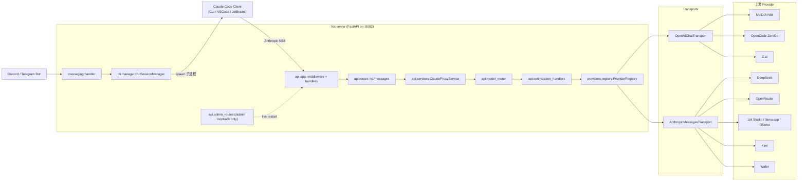
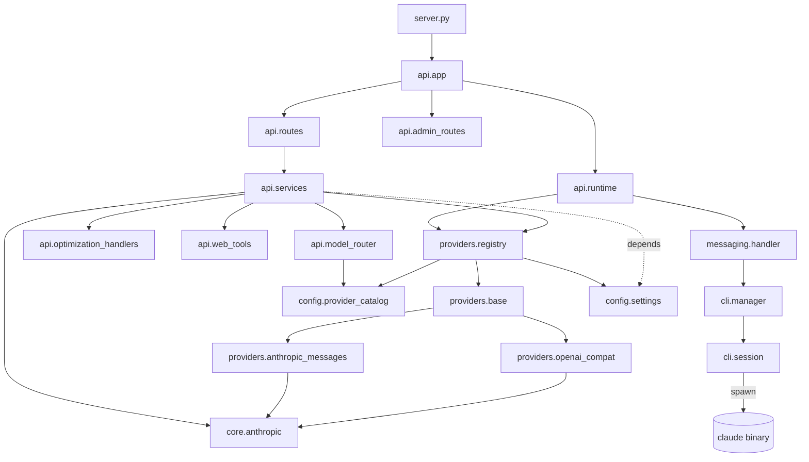
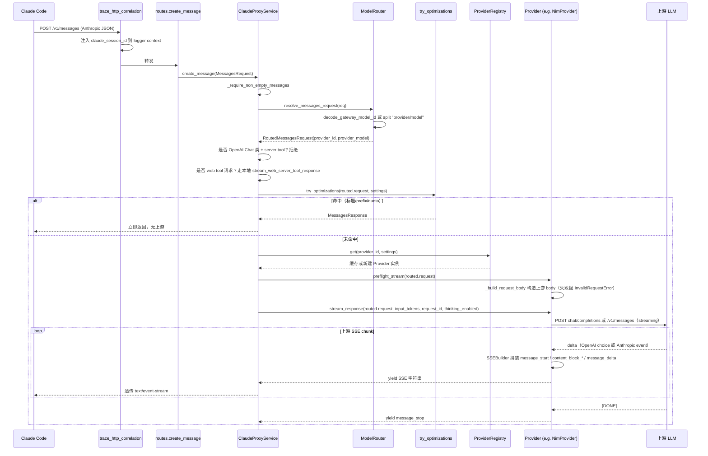
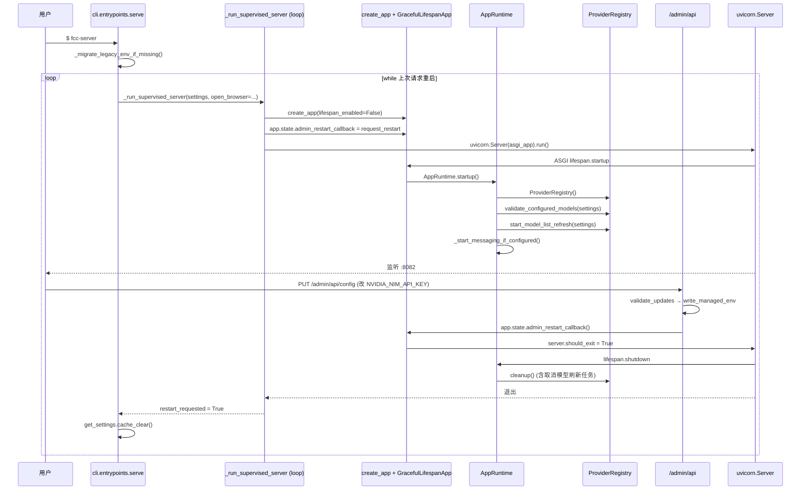

# free-claude-code 源码学习笔记

> 仓库地址：[Alishahryar1/free-claude-code](https://github.com/Alishahryar1/free-claude-code)
> 学习日期：2026/05/22

---

> **以下为 AI 源码分析**
>
> ### 一句话概括
>
> 在本机起一个伪装成 Anthropic Messages API 的 FastAPI 反向代理，把 Claude Code 客户端的请求按模型分级路由到 12 家第三方 / 本地 LLM 提供商，并把每家的协议双向翻译回 Claude Code 期望的 SSE 流。
>
> ### 要点速览
>
> | 模块 | 职责 | 关键文件 |
> |------|------|---------|
> | `server.py` + `api/app.py` | ASGI 入口与 FastAPI 工厂，挂载路由、中间件、异常处理器 | `server.py`、`api/app.py` |
> | `api/routes.py` + `api/services.py` | 暴露 `/v1/messages`、`/v1/messages/count_tokens`、`/v1/models` 等 Anthropic 端点 | `api/routes.py:166`、`api/services.py:102` |
> | `api/model_router.py` | 把 Claude 模型名（含 gateway 编码）解析为 `(provider_id, provider_model)` | `api/model_router.py:43` |
> | `api/optimization_handlers.py` | 在不调用上游的前提下短路标题生成、quota 探测等"廉价"请求 | `api/optimization_handlers.py:41` |
> | `providers/` | Provider 注册表 + 两套 transport 基类（OpenAI Chat / 原生 Anthropic Messages） | `providers/registry.py`、`providers/openai_compat.py`、`providers/anthropic_messages.py` |
> | `core/anthropic/` | Anthropic SSE 拼装、stop_reason 映射、thinking/tool_use/工具流的状态机 | `core/anthropic/sse.py`、`core/anthropic/conversion.py` |
> | `cli/` | `fcc-server`、`fcc-claude`、`fcc-init` 命令入口；管理 Claude Code 子进程 | `cli/entrypoints.py` |
> | `config/` | `pydantic-settings` 配置层 + provider catalog（解耦元数据与工厂） | `config/settings.py`、`config/provider_catalog.py` |
> | `messaging/` | 可选的 Discord/Telegram bot wrapper、CLI 会话池、树形消息队列 | `messaging/handler.py`、`messaging/trees/queue_manager.py`、`cli/manager.py` |
> | `api/admin_routes.py` + `admin_static/` | 仅限 loopback 的本地 Admin UI（编辑/校验配置、热重启） | `api/admin_routes.py:64` |

---

## 项目简介

free-claude-code（包名 `free-claude-code`，CLI 前缀 `fcc-*`）是一个本地 ASGI 服务，对 Claude Code 客户端伪装成 Anthropic Messages API（默认监听 `127.0.0.1:8082`）。它解决的问题是：Claude Code 的请求结构、流式协议、tool_use / thinking block 全部锁死在 Anthropic 私有的 SSE 协议上，普通用户没有 Anthropic 官方账号就无法使用。该项目通过在中间插入一个协议翻译层，把 Anthropic Messages 双向映射到 11 家上游（NVIDIA NIM、Kimi、Wafer、OpenRouter、DeepSeek、LM Studio、llama.cpp、Ollama、OpenCode Zen、OpenCode Go、Z.ai，外加 Fireworks 工厂）的协议，使得 Claude Code 的全部 client 能力（CLI、VS Code 插件、JetBrains ACP、Discord/Telegram bot）都可以接到任意免费、付费或本地模型上。

## 技术栈

| 类别 | 技术 |
|------|------|
| 语言 | Python 3.14（要求最新 final 版） |
| 框架 | FastAPI + Uvicorn（ASGI），openai 官方 SDK，httpx，pydantic v2，pydantic-settings |
| 构建工具 | hatchling（PEP 517） |
| 依赖管理 | uv（lock 文件 `uv.lock`，统一通过 `uv tool install` 分发） |
| 测试框架 | pytest + ty（类型）+ ruff（lint/format） |
| 协议层 | Anthropic Messages SSE（自实现）、OpenAI Chat Completions（openai SDK） |
| 周边 | loguru 日志、tiktoken 计 token、python-telegram-bot、discord.py、可选 NVIDIA Riva / 本地 Whisper |

## 目录结构

```text
free-claude-code/
├── server.py                    # ASGI 入口：构建 app 并起 uvicorn
├── api/                         # FastAPI 路由 / 服务层 / 模型路由 / 优化短路
│   ├── app.py                   # create_app + GracefulLifespanApp（启动失败优雅上报）
│   ├── routes.py                # /v1/messages、/v1/models、/health 等
│   ├── services.py              # ClaudeProxyService：编排路由 → 优化 → provider 流
│   ├── model_router.py          # gateway model id 解码 + provider/model 解析
│   ├── optimization_handlers.py # 标题生成、prefix 检测、quota 探测的本地短路
│   ├── runtime.py               # AppRuntime：lifespan 资源（registry、messaging、cli）
│   ├── dependencies.py          # require_api_key（X-API-Key/Bearer 常量时间比较）
│   ├── admin_routes.py          # /admin REST 接口（仅 loopback 来源放行）
│   ├── admin_static/            # 内置纯静态 Admin UI（无前端构建）
│   ├── web_tools/               # 本地处理 web_search / web_fetch server tool
│   └── models/                  # MessagesRequest / TokenCountRequest 等 pydantic 模型
├── core/                        # 与 provider 无关的协议工具
│   └── anthropic/               # SSE 拼装、tool/think 状态机、stop_reason 映射
├── providers/                   # 12 家 provider 的实现 + 两套 transport 基类
│   ├── base.py                  # BaseProvider（抽象 stream_response / list_model_ids）
│   ├── openai_compat.py         # OpenAIChatTransport（NIM / opencode / zai 等）
│   ├── anthropic_messages.py    # AnthropicMessagesTransport（OpenRouter / DeepSeek / Ollama 等）
│   ├── registry.py              # ProviderRegistry：缓存、模型清单刷新、validate
│   ├── error_mapping.py         # 上游错误 → Anthropic 错误格式映射
│   ├── rate_limit.py            # GlobalRateLimiter（按 provider 维度限流）
│   └── nvidia_nim/ | open_router/ | ... | zai/   # 每家上游一个子包
├── config/                      # pydantic-settings 配置 + provider 元数据
│   ├── settings.py              # Settings（合并 .env + ~/.fcc/.env）
│   └── provider_catalog.py      # PROVIDER_CATALOG（凭证、base_url、能力标签）
├── cli/                         # 命令入口与 Claude 子进程管理
│   ├── entrypoints.py           # fcc-server / fcc-claude / fcc-init
│   ├── manager.py               # CLISessionManager（按会话 id 复用子进程）
│   └── session.py               # 单条 CLISession（一对一对应 Claude Code 进程）
├── messaging/                   # 可选 Discord / Telegram 集成
│   ├── handler.py               # ClaudeMessageHandler：树形消息编排
│   ├── trees/queue_manager.py   # 树形消息队列（reply 形成分支，按树串行）
│   ├── platforms/               # discord.py / Telegram bot 适配器
│   └── rendering/               # Markdown 渲染配置（两个平台分别对应）
└── tests/ smoke/                # 单测 + 上游冒烟（按 provider 拆目录）
```

## 架构设计

### 整体架构

整体遵循"协议适配 + 工厂注册 + 流式状态机"三段式：

1. **入口层**：`server.py` 通过 `create_asgi_app()` 构造一个 `GracefulLifespanApp`，包了一层 ASGI 钩子，让 startup 失败时不抛 Starlette traceback、改走 `lifespan.startup.failed` 上报（`api/app.py:46`）。Uvicorn 拉起后，由 `AppRuntime`（`api/runtime.py:84`）负责创建 `ProviderRegistry`、可选启动 messaging platform、warm 模型清单缓存。
2. **API 层**：`api/routes.py` 暴露 `/v1/messages`、`/v1/messages/count_tokens`、`/v1/models`、`/health` 等。Claude Code 的探测请求会同时收到 `HEAD/OPTIONS` 204 兼容回包。`require_api_key` 依赖项使用 `secrets.compare_digest` 做常量时间比较，未配置 token 时直接放行。
3. **服务层**：`ClaudeProxyService.create_message`（`api/services.py:102`）按照固定顺序处理一次请求：①`ModelRouter` 解析 → ②若 provider 是 OpenAI Chat 类（NIM/opencode/zai）则拒绝带 server tool 的请求 → ③本地 web_search/web_fetch 短路 → ④`try_optimizations` 短路廉价探测 → ⑤拉 provider，`preflight_stream` 提前构建 body 检测错误 → ⑥`provider.stream_response()` 输出 Anthropic SSE。
4. **Provider 层**：每个 provider 都继承 `OpenAIChatTransport` 或 `AnthropicMessagesTransport` 两个基类之一，自身只需实现 `_build_request_body` 和（可选）模型清单解析。基类负责 streaming、tool_use 翻译、thinking block 处理、错误映射、限流。
5. **可选 messaging**：当配置里有 Telegram/Discord bot token 时，runtime 会拉起 `ClaudeMessageHandler`，它通过 `CLISessionManager` 把每个会话映射到一个本地 `claude` 子进程，bot 消息进 → CLI 进程在 → CLI 输出经事件流解析 → 消息编辑回 IM 平台。



### 核心模块

#### 1. `api/` — HTTP/服务层

- **职责**：暴露 Anthropic 兼容 REST、组合启动期资源、做请求级路由 & 优化。
- **核心文件**：
  - `app.py`：`create_app` 注册路由、`trace_http_correlation` 中间件给日志注入 `claude_session_id`，三类异常处理器（`RequestValidationError`、`ProviderError`、`Exception`）统一返回 Anthropic 错误格式。
  - `routes.py`：`/v1/models` 把 `SUPPORTED_CLAUDE_MODELS` + 已配置 `MODEL_*` + 实时发现的上游模型并集起来返回，并对每个 provider 模型生成"普通"和"no thinking"两种 gateway id 变体（`_append_provider_model_variants`，`api/routes.py:98`）。
  - `services.py`：`ClaudeProxyService` 是请求处理 orchestrator；用 `traced_async_stream` 把 provider 的 SSE iterator 包一层 trace，拿 `request_id` 作为 logger context。
  - `model_router.py`：见下方"流程一"。
  - `optimization_handlers.py`：定义 `try_prefix_detection` / `try_quota_mock` / `try_title_skip` 等独立函数，每个匹配特定的请求形态（如 prompt 是 `<command-name>` 包裹的标题生成请求）就直接构造 `MessagesResponse` 返回，避免打到上游。
  - `runtime.py`：`AppRuntime` 把 lifespan 拆成 startup / shutdown，封装 `best_effort` 包装器让所有 cleanup 步骤都带超时、不抛错。`startup_failure_message` 让 `ServiceUnavailableError` 直接透出友好文案。
  - `web_tools/`：当请求里出现 `web_search` / `web_fetch` 这两个 Anthropic server tool 时（且 provider 不是原生支持的）由本地实现：`egress.py` 做 SSRF 防护（默认拒绝私网/非 https），`outbound.py` 抓取页面，`streaming.py` 把结果包成 Anthropic SSE 的 `server_tool_use` 块返回。
  - `admin_routes.py`：通过 `require_loopback_admin` 强制只允许 127.0.0.1/::1 来访，并校验 `Origin` 同源；改完配置后通过 `app.state.admin_restart_callback` 通知 supervisor 重启 uvicorn（见 `cli/entrypoints.py:99`）。

#### 2. `providers/` — 上游适配层

- **职责**：把多家上游协议双向翻译成 Anthropic Messages SSE。
- **核心文件**：
  - `base.py`：`BaseProvider` 抽象 `stream_response` / `cleanup` / `list_model_ids` / `preflight_stream`。`_is_thinking_enabled` 在请求级、配置级双重判定 thinking 开关。
  - `openai_compat.py`：`OpenAIChatTransport` 是 NIM、OpenCode、Z.ai 共用的基类，封装 `AsyncOpenAI` 客户端、`GlobalRateLimiter`、tool 调用流式解析（`_process_tool_call` 处理 `delta.tool_calls` 这种 OpenAI 的 chunk，转换为 Anthropic 的 `content_block_start/delta/stop`）、heuristic tool parser（用 think tag 文本里夹杂的 JSON 构造伪 tool_use）。
  - `anthropic_messages.py`：`AnthropicMessagesTransport` 用 httpx 直接打上游的 `/v1/messages`，支持 `line` / `event` 两种 chunk 解析模式。`EmittedNativeSseTracker` + `transform_native_sse_block_event` 负责对上游已经是 Anthropic 格式的 SSE 做"有限改写"——比如插入 thinking block 起止、补齐空白 message 字段。
  - `registry.py`：见 `PROVIDER_FACTORIES`（id → 工厂函数 + descriptor）。`ProviderRegistry` 持有进程内 provider 实例、缓存模型列表、以及后台 `start_model_list_refresh` 异步任务，避免每次 `/v1/models` 查询都打上游。`validate_configured_models` 在启动时拉一次每家的模型清单，对比 `MODEL_*` 配置，缺失的 model id 会被聚合成 `ServiceUnavailableError`。
  - `nvidia_nim/`、`deepseek/` 等子包：每家只放具体的 `_build_request_body` 实现 + 上游特定参数（如 NIM 的 temperature / top_p）。

#### 3. `core/anthropic/` — 协议状态机

- **职责**：把"OpenAI delta 流"或"上游 Anthropic SSE"统一转成 Claude Code 客户端期望的事件序列。
- **关键能力**：
  - `sse.py`：`SSEBuilder`、`ToolCallState`、`map_stop_reason`（`stop`→`end_turn`，`tool_calls`→`tool_use` 等）。
  - `conversion.py` / `tools.py`：tool/think tag 双向转换。
  - `native_sse_block_policy.py`：原生上游 SSE 的事件级整形（哪些事件透传、哪些丢弃、哪些补齐）。
  - `provider_stream_error.py`：上游中途断流时合成一个 Anthropic 风格的错误事件。

#### 4. `config/` — 解耦元数据

- `provider_catalog.py` 是关键设计——所有 provider 的元数据（环境变量名、文档链接、默认 base_url、proxy attr）都写在 `PROVIDER_CATALOG` 字典里，**不引用任何 `providers.*` 实现模块**，因此 `config` 是单向依赖。`providers/registry.py:122` 的 assert 强制 `PROVIDER_CATALOG`、`PROVIDER_FACTORIES`、`SUPPORTED_PROVIDER_IDS` 三者键集合一致——加 provider 时漏改任何一处都会启动失败。
- `settings.py` 用 `pydantic-settings` 合并 `.env` 和 `~/.fcc/.env`，并对 `MODEL` / `MODEL_OPUS` / `MODEL_SONNET` / `MODEL_HAIKU` 解析成 `ConfiguredChatModelRef`。

#### 5. `messaging/` — 远程 bot 编排

- `handler.py:39` 的 `ClaudeMessageHandler` 维护一个 `TreeQueueManager`，把 IM 上的"reply 关系"映射成消息树：新消息建一棵树根，回复变成子节点，每棵树内部串行处理但树间并行。
- `cli/manager.py:17` 的 `CLISessionManager` 维护 `session_id → CLISession` 字典；新会话先生成 `pending_xxx` 临时 id，CLI 输出第一个 system event 含真实 session_id 时再做 `_temp_to_real` 映射，避免临时和真实 id 拿到不同的子进程。

### 模块依赖关系



## 核心流程

### 流程一：`/v1/messages` 一次完整请求的处理

这是 Claude Code 主 loop 每条消息都会走的路径。重点在"短路 + 路由 + 流翻译"三段。



关键细节：

- **gateway model id**：Claude Code 的 `/model` picker 会让用户选 `nvidia_nim/nvidia/nemotron-3-super-120b-a12b` 这种带斜杠的字符串，但 Anthropic 协议不允许斜杠，于是 `gateway_model_ids.py` 用一种可逆编码把 provider/model 编进一个合法 model id。`decode_gateway_model_id` 负责反解，并能再附带一个 "no thinking" 标记位（`api/routes.py:115`）。
- **request_id**：服务层生成 `req_<12hex>` 注入 logger context，整个 stream 的 trace 事件都带这个 id。
- **错误格式**：`api/app.py:141` 把 `ProviderError` 统一转成 Anthropic 顶层 `{"type":"error","error":{...}}` 的 JSON，保证 Claude Code 客户端只见到一种错误形态。

### 流程二：`fcc-server` 启动 + Admin UI 热重启

这是把"运行中可改配置"做扎实的关键设计。



关键细节：

- **GracefulLifespanApp**：`api/app.py:37` 自定义 ASGI 包装，把 startup 异常转成 `lifespan.startup.failed` 一行错误消息。否则 Uvicorn 默认会打整段 traceback——配错 API key 时这段噪声很扰民。
- **进程级守护**：`cli/process_registry.py` 维护"已 spawn 的子进程 PID 表"，`fcc-server` 退出时 `kill_all_best_effort()` 兜底杀掉所有 `fcc-claude` / Whisper 等子进程，避免遗留僵尸进程。
- **常量时间凭证比较**：`api/dependencies.py:91` `require_api_key` 用 `secrets.compare_digest`，并把可能跟在 token 后的 `:model_name` 一并切掉再比，兼容 Claude Code 的 token 拼写。

## 关键设计亮点

### 1. Catalog–Factory–Settings 三向校验，避免 provider 漏配

`config/provider_catalog.py` 把 provider 的"可声明性元数据"（凭证 env 名、官方文档 URL、默认 base_url、proxy 字段）集中到一个 `dict[str, ProviderDescriptor]`，**完全不 import provider 实现**。`providers/registry.py:107` 的 `PROVIDER_FACTORIES` 才负责真正的 import-on-call（每个工厂内部 `from providers.<name> import ...`）。模块加载时 `providers/registry.py:122` 强校验三个集合一致：
```python
if set(PROVIDER_DESCRIPTORS) != set(SUPPORTED_PROVIDER_IDS) or set(PROVIDER_FACTORIES) != set(SUPPORTED_PROVIDER_IDS):
    raise AssertionError(...)
```
- **解决了什么问题**：12 家 provider 的元数据散落在多处时，新增/删除 provider 容易漏改某一边导致运行时奇怪报错。
- **为什么这样设计**：让 `config` 始终保持没有 provider 实现依赖，单元测试可以 import `config.provider_catalog` 而不启动整个 provider 注册系统。`providers.registry` 中 `from providers.<x> import ...` 写在工厂函数内部，避免在模块导入阶段就把 12 个 provider 子包都拉起来（启动时间 + 反向依赖问题）。

### 2. 双 transport 基类把"协议形状"抽离

把 12 家 provider 按上游协议分成两类基类（`providers/openai_compat.py:60` 与 `providers/anthropic_messages.py:62`），子类只负责实现 `_build_request_body`（把 `MessagesRequest` 转成上游期望的 JSON）和可选的 `_handle_extra_reasoning` / `_get_retry_request_body`。
- **解决了什么问题**：tool_use streaming、thinking 块、stop_reason 映射、限流、错误映射这些"难写但通用"的逻辑只写一次。
- **具体实现**：`OpenAIChatTransport._process_tool_call`（`providers/openai_compat.py:228`）处理 OpenAI 协议里 `delta.tool_calls` 的 chunk，逐 index 维护 `ToolCallState`，把流式的 function name + arguments 拼成 Anthropic 的 `content_block_start` + 多次 `input_json_delta` + `content_block_stop`。`AnthropicMessagesTransport` 路径走 `EmittedNativeSseTracker`，仅在事件流上做小幅整形（确保 thinking block 边界、过滤上游不该出现的事件）。
- **为什么这样设计**：协议的"形态差异"远大于"参数差异"。把形态差异封到基类，子类的代码量被压到几十行，易于增加新 provider（README 的"Extending"段提到的就是这两个基类）。

### 3. 用本地短路把廉价请求挡在上游之外

Claude Code 频繁地发"标题生成"、"prefix 推断"、"quota check"、"建议模式"几类小请求，每条都打 LLM 一次很浪费。`api/optimization_handlers.py` 把这些请求识别出来后直接本地构造一个 `MessagesResponse`（合成一个看起来正常的 token 数）返回——既省 quota 又把延迟压到 0。
- **关键代码**：`api/services.py:141`：
```python
optimized = try_optimizations(routed.request, self._settings)
if optimized is not None:
    trace_event(stage="routing", event="api.optimization.short_circuit", ...)
    return optimized
```
- **为什么这样设计**：检测函数（如 `is_title_generation_request`、`is_quota_check_request`）依据 Claude Code 真实 prompt 的特征字符串而不是 model 字段，避免被 Claude Code 协议升级时悄悄绕过。每一项都有独立的 settings 开关（如 `fast_prefix_detection`、`enable_network_probe_mock`），便于 A/B。

### 4. Admin UI 热重启 + supervisor loop

普通做法是"改配置 → 重启 fcc-server"。这里把 supervisor 内嵌进 `cli/entrypoints.py:50`：
- `serve()` 是个 `while True` 循环，每轮 `_run_supervised_server` 起一遍 uvicorn。
- `app.state.admin_restart_callback = request_restart`（`cli/entrypoints.py:111`）把"请重启"绑到 FastAPI app 的状态里。
- Admin UI 校验+写盘后调用这个 callback，置 `server.should_exit = True`，uvicorn 优雅退出本轮，外层循环 `get_settings.cache_clear()` 重读配置再起一次。

**为什么这样设计**：用户编辑 API key、切 provider 时不用关掉终端窗口，Admin UI 体验类似"应用重启"而不是"系统重启"。`GracefulLifespanApp` 的存在让重启过程中 startup 失败（比如新 API key 无效）也只是一行错误，不会污染日志。

### 5. 树形消息队列把"reply 关系"映射成并发模型

Discord/Telegram 消息天然是树形（reply 形成分支），`messaging/trees/queue_manager.py` 把它直接当作并发模型：
- 一棵树（一个 root message）= 一个会话 = 一个 `CLISession` 子进程。
- 树内的 reply 节点串行处理（保证父消息处理完才轮到子消息），节点状态机 `PENDING → IN_PROGRESS → COMPLETED/ERROR`。
- 跨树并行（多个 root 各自独立处理）。
- `messaging/handler.py` 的 `update_queue_positions` / `mark_node_processing` 回调让 UI 能实时更新"队列里第 N 位"。

**为什么这样设计**：大量 IM bot 把消息当成线性队列，结果用户回复一条旧消息会被卡在队尾。这里的树结构让"对历史消息分支讨论"成为一等公民，且天然支持 `/stop` 命令带 reply 上下文（只停那一条分支）。`_restore_tree_state`（`api/runtime.py:280`）会把 `SessionStore` 里持久化的树状态重建出来，bot 重启后仍能恢复进行中的对话。
