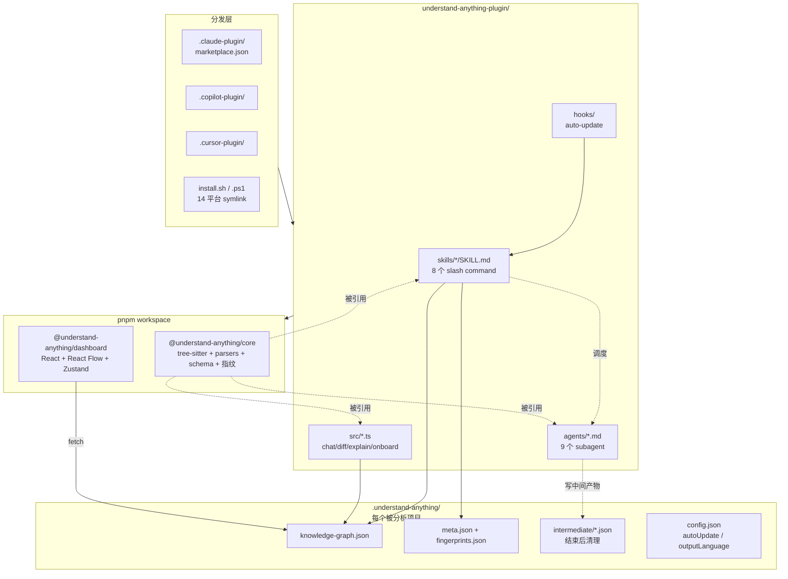
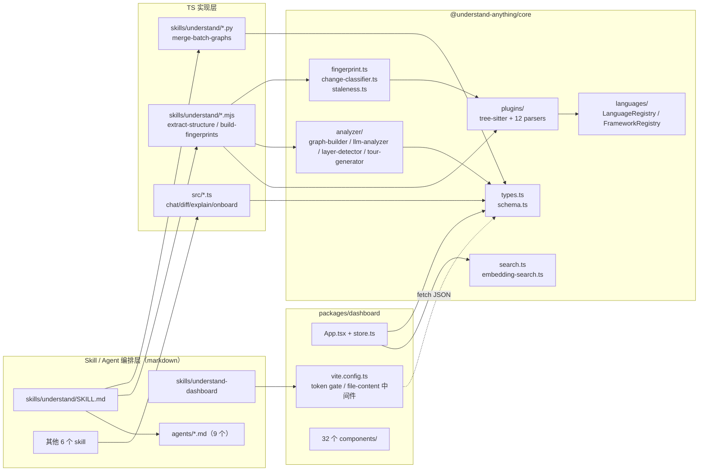
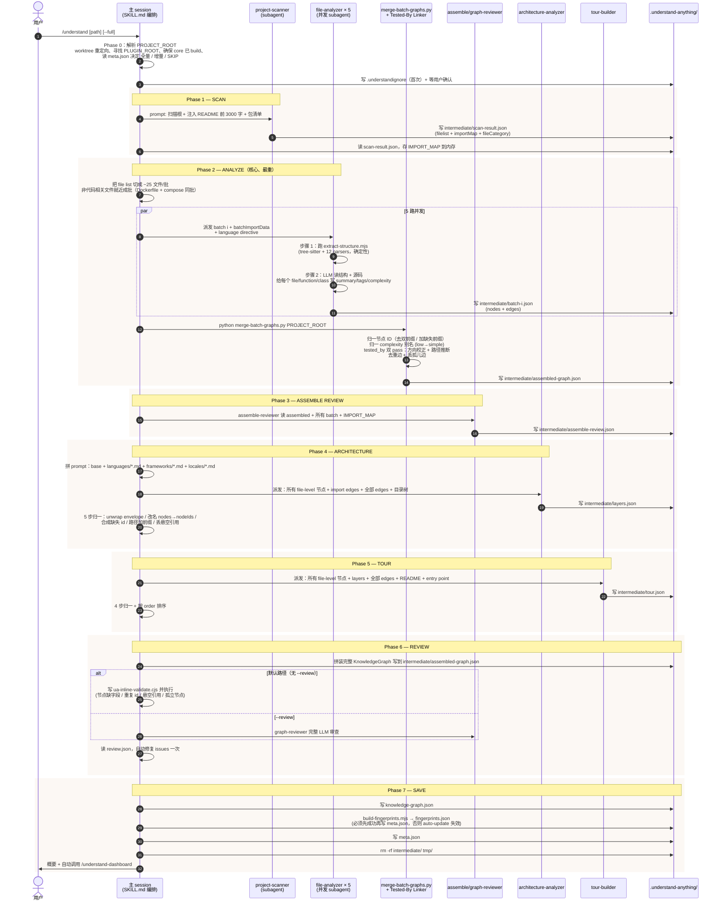
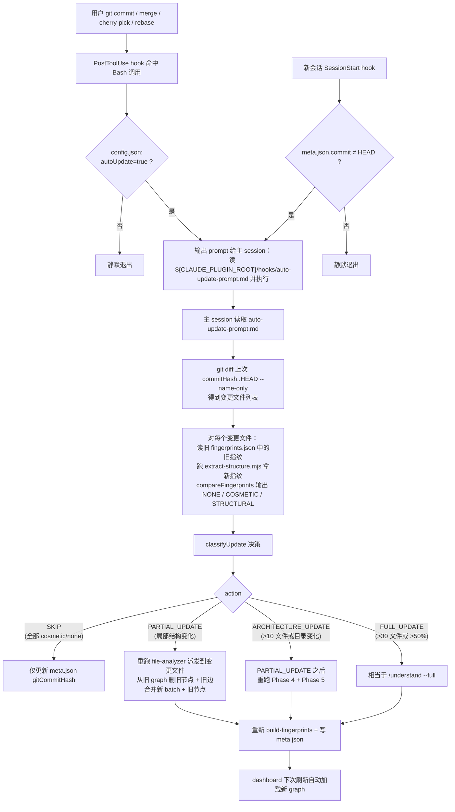

# Understand-Anything 源码学习笔记

> 仓库地址：[Lum1104/Understand-Anything](https://github.com/Lum1104/Understand-Anything)
> 学习日期：2026-05-24

---

> **以下为 AI 源码分析**
>
> ### 一句话概括
>
> Understand-Anything 是一个跨 14 个 AI 编程平台（Claude Code / Cursor / Copilot / Codex / Gemini CLI 等）的多 agent 插件，把任意代码库或知识库解析成可交互的知识图谱（节点 + 边 + 分层 + 引导浏览），并通过 React + React Flow 可视化 dashboard 探索。
>
> ### 要点速览
>
> | 模块 | 职责 | 关键产物 |
> |------|------|---------|
> | `skills/understand` | 7 阶段 pipeline，编排 6 个 subagent 把代码库变成图 | `.understand-anything/knowledge-graph.json` |
> | `skills/understand-dashboard` | 启动 Vite dev server 展示图 | localhost:5173（带 token） |
> | `skills/understand-domain/-knowledge/-chat/-diff/-explain/-onboard` | 业务领域 / 知识库 / 问答 / diff 影响 / 文件深读 / 新人 onboarding 派生命令 | 同样写到 `.understand-anything/` |
> | `agents/*.md` | 9 个 subagent 定义（scanner / analyzer / reviewer / 等） | 写中间 JSON 到 `.understand-anything/intermediate/` |
> | `packages/core` | tree-sitter + 12 种非代码 parser + 模式校验 + 增量指纹 | npm workspace 包 `@understand-anything/core` |
> | `packages/dashboard` | React + Zustand + Tailwind v4 + React Flow，token gated | Vite SPA |
> | `hooks/` | post-commit 与 SessionStart hook，自动触发增量更新 | `auto-update-prompt.md` |
> | `install.sh` / `install.ps1` | 跨平台安装器，clone + 创建 symlink | `~/.understand-anything/repo` |

---

## 项目简介

Understand-Anything 解决的核心问题是 **"加入新团队时面对 20 万行代码不知从何看起"**。它把"读代码"这件事拆成两层：

- **结构层（确定性）**：tree-sitter 静态解析 + 12 种非代码 parser（Markdown / YAML / SQL / GraphQL / Protobuf / Terraform / Dockerfile / Makefile 等），把每个文件、函数、类、import、export、endpoint、service、resource 都精确抽出来，每次跑结果一致。
- **语义层（LLM）**：再用一个多 agent pipeline 把"这个文件是干什么的""这个函数为什么存在""这些文件构成了什么架构层"用自然语言总结出来。

最终把两层合成一个 JSON：21 种节点类型 + 35 种边类型 + 分层 + 引导浏览（tour），存到 `.understand-anything/knowledge-graph.json` 中。这份图既可以提交进 git 给团队成员复用，也可以通过自带 React + React Flow dashboard 在浏览器里点击、搜索、过滤、按层折叠、看 diff 影响、跑引导浏览。

它的另一个野心是**跨平台**：同一份 SKILL.md / agent 定义通过 `install.sh` 在 14 个 AI 编程工具（Claude Code、Cursor、Copilot、Copilot CLI、Codex、OpenCode、OpenClaw、Antigravity、Gemini CLI、Pi Agent、Vibe CLI、Hermes、Cline、KIMI CLI）里都能跑，依靠 symlink 和约定目录把同一个 plugin 暴露给不同 agent 框架。

## 技术栈

| 类别 | 技术 |
|------|------|
| 语言 | TypeScript（strict mode）+ Python（合并/校验脚本）+ Bash / PowerShell（安装器） |
| 运行时 | Node.js ≥ 22 |
| 框架 | React 19 + React Flow（@xyflow/react）+ Zustand + Tailwind CSS v4 |
| 解析器 | web-tree-sitter（WASM）+ 12 个手写非代码 parser |
| 校验 | Zod 4 |
| 搜索 | Fuse.js（模糊搜索）+ 自实现 cosine similarity（语义搜索） |
| 构建工具 | TypeScript `tsc`（核心）+ Vite（dashboard）+ ESLint |
| 依赖管理 | pnpm ≥ 10（workspace） |
| 测试框架 | Vitest（含 v8 coverage） |
| 图形布局 | ELK.js + d3-force + @dagrejs/dagre + graphology |

## 目录结构

```text
Understand-Anything/
├── .claude-plugin/                    # Claude Code 仓库级 plugin 入口（marketplace.json + plugin.json）
├── .copilot-plugin/                   # GitHub Copilot 自动发现入口
├── .cursor-plugin/                    # Cursor 自动发现入口
├── install.sh / install.ps1           # 跨 14 平台 CLI 安装器，clone 到 ~/.understand-anything/repo 并建 symlink
├── homepage/                          # 静态主页 + live demo（独立 Vite 工程）
├── docs/                              # 用户文档
├── READMEs/                           # 多语言 README（zh-CN / zh-TW / ja / ko / es / tr / ru）
├── scripts/                           # 顶层辅助脚本（如 generate-large-graph.mjs 用于 perf 测试）
└── understand-anything-plugin/        # ★ 真正的 plugin 实现都在这里
    ├── .claude-plugin/plugin.json     # plugin metadata（name / version 2.7.4）
    ├── package.json                   # 包名 @understand-anything/skill
    ├── pnpm-workspace.yaml            # 包含 packages/core、packages/dashboard
    ├── agents/                        # 9 个 subagent 定义（纯 markdown，含 frontmatter）
    │   ├── project-scanner.md             # 文件扫描 + 语言/框架检测 + import 预解析
    │   ├── file-analyzer.md               # 单 batch 文件 → graph 节点 + 边
    │   ├── architecture-analyzer.md       # 文件分层
    │   ├── tour-builder.md                # 学习引导
    │   ├── assemble-reviewer.md           # 组装后审查
    │   ├── graph-reviewer.md              # --review 完整 LLM 审查
    │   ├── domain-analyzer.md             # /understand-domain 业务领域
    │   ├── article-analyzer.md            # /understand-knowledge 知识库
    │   └── knowledge-graph-guide.md       # 通用 schema 速查
    ├── hooks/                         # PostToolUse / SessionStart hook + auto-update prompt
    ├── skills/                        # 8 个 SKILL.md，每个就是一个 slash command
    │   ├── understand/                    # ★ 主流程，825 行 SKILL.md，附 .mjs / .py 工具脚本和 languages/ frameworks/ locales/ 上下文
    │   ├── understand-dashboard/          # 启动 Vite dev server 展示图
    │   ├── understand-chat/               # 命令行直接问代码库的问答
    │   ├── understand-diff/               # 当前 diff 的影响范围分析
    │   ├── understand-explain/            # 单文件/函数深读
    │   ├── understand-onboard/            # 自动产出 onboarding 文档
    │   ├── understand-domain/             # 业务领域/流程/步骤抽取
    │   └── understand-knowledge/          # Karpathy 风格 LLM wiki 解析
    ├── src/                           # 上面 4 个 chat/diff/explain/onboard skill 的 TS 实现
    │   ├── context-builder.ts             # 从 graph 中切出问答用的上下文片段
    │   ├── diff-analyzer.ts               # buildDiffContext / formatDiffAnalysis
    │   ├── explain-builder.ts             # 单文件深读上下文
    │   ├── onboard-builder.ts             # 新人 onboarding 文档生成
    │   └── understand-chat.ts             # /understand-chat 主入口
    └── packages/                      # pnpm workspace 真实代码
        ├── core/                          # @understand-anything/core，被 dashboard 和所有 .mjs 脚本引用
        │   └── src/
        │       ├── types.ts               # GraphNode/GraphEdge/Layer/TourStep/KnowledgeGraph 等类型
        │       ├── schema.ts              # Zod 校验 + 自动修复 + 别名归一
        │       ├── analyzer/              # graph-builder / llm-analyzer / layer-detector / tour-generator / language-lesson / normalize-graph
        │       ├── plugins/               # tree-sitter-plugin + 12 种 parser + extractor 注册中心 + discovery
        │       ├── languages/             # LanguageRegistry / FrameworkRegistry + 内置 configs
        │       ├── persistence/           # 读写 .understand-anything/ 下的多个 JSON
        │       ├── search.ts              # Fuse.js 模糊搜索
        │       ├── embedding-search.ts    # 余弦相似度语义搜索
        │       ├── fingerprint.ts         # 文件结构指纹（function/class/import 签名 + SHA-256）
        │       ├── change-classifier.ts   # SKIP / PARTIAL / ARCHITECTURE / FULL 决策
        │       ├── staleness.ts           # 检测 graph 过期 + 增量合并
        │       ├── ignore-filter.ts       # 复用 ignore npm 包的 .gitignore 兼容过滤
        │       └── ignore-generator.ts    # 从项目结构生成 .understandignore 起步模板
        └── dashboard/                     # React + React Flow Web UI
            ├── vite.config.ts             # ★ 自定义中间件：token gate + 文件路径白名单
            └── src/
                ├── App.tsx                # 顶层布局 + token gate + i18n + 主题
                ├── store.ts               # Zustand 全局状态（graph / 选中节点 / 过滤 / 层导航）
                ├── components/            # 32 个组件（GraphView / NodeInfo / FileExplorer / TokenGate 等）
                ├── hooks/                 # useIsMobile / useKeyboardShortcuts
                ├── contexts/              # I18nContext
                └── themes/                # 暗色奢华主题（#0a0a0a + 金色 #d4a574）
```

## 架构设计

### 整体架构

整个项目是一个三层架构：**插件分发层 → 多 agent 解析 pipeline → 知识图持久化 + 可视化**。

- **插件分发层**：仓库根的 `.claude-plugin/`、`.copilot-plugin/`、`.cursor-plugin/` 三个 plugin 入口被对应 IDE 自动发现；其他 11 个平台通过 `install.sh` clone 到 `~/.understand-anything/repo` 后给目标平台建立 symlink（如 `~/.codex/skills/understand` → `…/understand-anything-plugin/skills/understand`）。所有平台共用同一份 `understand-anything-plugin/` 源码。
- **多 agent 解析 pipeline**：`/understand` slash command（`skills/understand/SKILL.md`）按 7 个 phase 调度 6 个 subagent，subagent 之间通过 **写文件**（`.understand-anything/intermediate/*.json`）而不是返回值通信，这是为了避免长输出污染主 session context。
- **知识图持久化 + 可视化**：最终结果（`knowledge-graph.json`）既可被 `/understand-dashboard` 命令拉起的 Vite dev server 渲染成 React Flow 图，又可被 `/understand-chat` `/understand-diff` `/understand-explain` `/understand-onboard` 等命令通过 `src/` 下的 TS helper 当作上下文检索源。



### 核心模块

#### 1. `skills/understand` — 主 pipeline 编排（825 行 SKILL.md）

**职责**：把"分析这个 repo"翻译成 7 phase × 6 subagent 的具体执行计划。

**关键文件**：
- `understand-anything-plugin/skills/understand/SKILL.md`：唯一的事实源，详细到每个 phase 该写什么 prompt、读哪个文件、如何降级。
- `extract-structure.mjs`（335 行）：每批文件分析前先跑一次的确定性结构抽取，调用 `@understand-anything/core` 的 `TreeSitterPlugin + PluginRegistry`，输出 functions / classes / exports / sections / definitions / services / endpoints / steps / resources。
- `build-fingerprints.mjs`（91 行）：Phase 7 把全量结构指纹写到 `fingerprints.json`，作为后续增量更新的对照基线（issue #152 教训：必须 baseline 先成功再写 `meta.json`）。
- `merge-batch-graphs.py`（45KB）：Phase 2 后把所有 batch JSON 合并归一，处理节点 ID 双前缀、`tested_by` 边方向校正（test → prod 翻转成 prod → test）、孤立边丢弃等。
- `merge-subdomain-graphs.py`（12KB）：Phase 0 之前合并多个子域图（如 frontend / backend）。
- `languages/*.md`（23 个）+ `frameworks/*.md`（12 个）+ `locales/*.md`（6 个）：Phase 4 给 architecture-analyzer 拼 prompt 时按检测到的语言/框架/输出语言选择性 append 进去。

**关键接口**：每个 phase 的输入 / 输出契约都写死在 SKILL.md 里，例如 Phase 2 输出必须是 `intermediate/batch-<i>.json`，Phase 4 layers 必须包含 `id/name/description/nodeIds`。

#### 2. `agents/` — 9 个 subagent 定义

**职责**：每个 agent 都是独立 markdown，含 frontmatter（`name` / `description` / `model: inherit`），主 session 用 Task 工具调度它们。`model: inherit` 让插件在不同平台上自动用宿主模型而非硬编码 Claude。

**关键文件 + 职责**：
- `project-scanner.md`：用 Node.js 脚本枚举 `git ls-files` → 跑 12 种语言识别 → 预解析每个文件的 internal import → 写 `scan-result.json`，主 session 拿到 `importMap` 后传给后续 agent，避免他们再做一次 import 解析。
- `file-analyzer.md`（29KB，最大）：每批 20–30 个文件并行最多 5 个，先调 `extract-structure.mjs` 拿确定性结构，再 LLM 给每个文件/函数/类写 summary、tags、complexity、layer hint，最后吐 nodes + edges。
- `architecture-analyzer.md`：根据所有 file-level 节点 + import edges + 完整目录树，给出 layers 数组（如 `layer:api / layer:service / layer:data`）。
- `tour-builder.md`：基于 README 第一手叙事 + entry point + layers，编排"先看哪个文件再看哪个"。
- `assemble-reviewer.md`：Phase 3 在合并 batch 后做轻量审查，捕获明显错位。
- `graph-reviewer.md`：`--review` 时才跑的完整 LLM 审查（默认走 inline 确定性脚本，更快更便宜）。
- `domain-analyzer.md` / `article-analyzer.md` / `knowledge-graph-guide.md`：派生命令使用。

#### 3. `packages/core` — 共享分析引擎

**职责**：所有 `.mjs` 脚本和 dashboard 都依赖它。文件级分工：

- `types.ts`（203 行）：项目最关键的类型源头。`GraphNode` 21 种 type（`file/function/class/module/concept/config/document/service/table/endpoint/pipeline/schema/resource/domain/flow/step/article/entity/topic/claim/source`），`GraphEdge` 35 种 type 分 8 类（结构 / 行为 / 数据流 / 依赖 / 语义 / 基础设施 / 领域 / 知识）。
- `schema.ts`：Zod schema + `validateGraph` + `autoFixGraph`，含 `COMPLEXITY_ALIASES`（low→simple 等）、`DIRECTION_ALIASES` 用于容忍 LLM 的拼写漂移。
- `analyzer/graph-builder.ts`（337 行）：纯类，提供 `addFile / addFileWithAnalysis / addNonCodeFileWithAnalysis / addImportEdge / addCallEdge`，最后 `build()` 出一个完整 `KnowledgeGraph`。`KIND_TO_NODE_TYPE` 把 parser 输出的 `kind`（table/view/job/route 等）映射到节点类型。
- `plugins/tree-sitter-plugin.ts`：`AnalyzerPlugin` 实现，懒加载 WASM grammar；用 `web-tree-sitter`（WASM）而非原生 `tree-sitter` 是因为 darwin/arm64 + Node 24 上原生绑定挂掉。
- `plugins/parsers/*.ts`：12 个非代码 parser（Markdown / YAML / JSON / TOML / Env / Dockerfile / SQL / GraphQL / Protobuf / Terraform / Makefile / Shell），每个都实现 `analyzeFile` 返回 `StructuralAnalysis`，把 docker-compose 的 service 映射成 `service` 节点，把 SQL migration 映射成 `table`，把 GitHub Actions 步骤映射成 `pipeline:step`。
- `fingerprint.ts` + `change-classifier.ts` + `staleness.ts`：增量更新三件套。`extractFileFingerprint` 从结构分析里抽出"只关心 graph 上看得到的部分"（function 名 + 参数 + 行数 + 是否 export），`compareFingerprints` 输出 `NONE / COSMETIC / STRUCTURAL`，`classifyUpdate` 决定 `SKIP / PARTIAL_UPDATE / ARCHITECTURE_UPDATE / FULL_UPDATE`（>30 文件或 >50% 触发 FULL；新建/删除顶层目录或 >10 文件触发 ARCHITECTURE）。
- `ignore-filter.ts` + `ignore-generator.ts`：复用 npm `ignore` 包合并默认规则 + 用户 `.understandignore`（支持 `!` 反向规则）。
- 子路径导出（`./search`、`./types`、`./schema`、`./languages`）专门给 dashboard 用，避免 `node:fs` 等 Node-only 模块被 Vite 打进浏览器 bundle。这是 monorepo 必须遵守的硬约束。

#### 4. `packages/dashboard` — 可视化 Web UI

**职责**：把 `knowledge-graph.json` 渲染成可点击 / 搜索 / 过滤 / 引导浏览的图。

**关键文件**：
- `vite.config.ts`（500+ 行）：自带定制中间件 `serve-knowledge-graph`：进程启动随机生成 16 字节 token，所有数据请求都必须带 `?token=` 才能拿到；`/file-content.json` 不仅鉴权还要求路径在 graph 节点白名单里且不大于 1 MB 且不是二进制。
- `src/App.tsx`：组合 `TokenGate` → `Dashboard` → `ThemeProvider` + `I18nProvider`；用 React `lazy` 懒加载 `CodeViewer` `LearnPanel` `PathFinderModal` 等重组件；`shouldShowOnboarding` 控首访引导。
- `src/store.ts`：Zustand store。`buildGraphIndexes` 在 `setGraph` 时一次性建好 `nodesById` / `nodeIdToLayerId`（首匹配）/ `nodeIdToLayerIds`（全集），后者解决"一个节点属于多个层时过滤需要 any-match 而导航需要单一选层"的语义冲突。
- `src/components/`：32 个组件，关键的有 `GraphView`（结构图）、`DomainGraphView`（领域）、`KnowledgeGraphView`（知识库）、`NodeInfo`（节点详情）、`FileExplorer`（左 tree）、`TokenGate`（token 校验门）、`PathFinderModal`（找两节点最短路径）、`MobileLayout`（移动端单独布局）。
- `src/hooks/useKeyboardShortcuts.ts` + `App.tsx` 里的 `shortcuts` 数组：`?` 帮助、`Esc` 层层退出、`/` 聚焦搜索、方向键控引导浏览、`d/f/e/p` 切 diff/filter/export/path-finder。

#### 5. `hooks/` — 自动更新

**职责**：让 graph 跟着 commit 自动保持最新。

**关键文件**：
- `hooks.json`：`PostToolUse` 监听 `Bash` 工具里的 `git commit/merge/cherry-pick/rebase`；`SessionStart` 在新会话开始时比对 `meta.json.gitCommitHash` 与 `git rev-parse HEAD`。两个 hook 触发后都不会自己跑 pipeline，而是输出一段 prompt **指示主 session 去读 `auto-update-prompt.md` 并执行其中的指令**。
- `auto-update-prompt.md`（15KB）：详细的增量更新 SOP，按 `change-classifier` 的决策走相应的 phase 重跑路径。

#### 6. `src/` — 派生命令的 TS 实现

**职责**：除了主 `/understand` 之外，4 个轻量命令的实现。

**关键文件**：
- `diff-analyzer.ts`（199 行）：`buildDiffContext` 把 `git diff` 列表映射到 graph 节点，再扩展一跳邻居作为 affected nodes，`formatDiffAnalysis` 输出可读 markdown，包含 risk 评估（高复杂度 / 跨层 / 大爆炸半径 / 未映射文件）。
- `context-builder.ts` / `explain-builder.ts` / `onboard-builder.ts` / `understand-chat.ts`：各自把 `KnowledgeGraph` 切成"这个问题需要看到的最小上下文"喂回 LLM。

### 模块依赖关系



## 核心流程

### 流程一：`/understand` 全量分析（7 phase 多 agent pipeline）

这是项目最重的链路。下面用时序图展示，主 session 用 Task 工具同时拉起多个 subagent，subagent 之间靠写 JSON 通信。



每一步**关键设计**：

- **第 4 步（Phase 1 注入 README + 包清单）**：让 scanner 不必硬猜项目类型，README 和 manifest 是"信息密度最高的两个文件"。
- **第 7 步（5 路并发 + batchImportData）**：之所以 file-analyzer 不自己解析 import 而是用 scanner 预先算好的 `importMap`，是因为同一份 `import './foo'` 在两个 batch 间可能被解析成不同绝对路径，集中预解析能消除歧义。
- **第 12 步（merge-batch-graphs.py 的 tested_by 二阶段）**：LLM 在分析测试文件时只能看到 `import { foo } from '../foo'`，所以系统性地写出 `test → prod` 方向，merge 脚本必须翻转一遍；接着根据 `X.test.ts` ↔ `X.ts`、Python `tests/` 同包、Go `_test.go` 同目录、Java/.NET `src/test/...` ↔ `src/main/...` 等约定再补一遍漏掉的。
- **第 17 步（架构 prompt 三层注入）**：base 模板 + 该项目实际用到的语言文档（如 `python.md` / `dockerfile.md`）+ 框架文档（如 `django.md`）+ 输出语言指南（如 `zh.md`），LLM 拿到的 prompt 是"为这个项目量身定制"的。
- **第 22 步（默认走 inline 确定性 review）**：开发者发现 `--review` 走 LLM 又慢又贵又波动，就地写一段 Node 脚本做结构校验更可靠；只有想"换个角度看看"时才上 LLM 审查器。
- **第 26 步（fingerprints 必须先于 meta.json）**：issue #152 的教训：如果 baseline 没建成功就写 `meta.json`，下一次 commit hook 会发现没有指纹可比，对所有文件分类成 STRUCTURAL，触发 FULL_UPDATE，相当于每次 commit 都全量重跑。

### 流程二：commit 触发的自动增量更新

这是项目最优雅的"长期可用性"设计。`/understand` 跑完后只要在 `.understand-anything/config.json` 中开 `autoUpdate: true`，每次 commit 都会自动让 graph 跟上。



设计巧思：

- **hook 不直接跑 pipeline**：因为 hook 上下文不在主 session，无法用 Task 调度 subagent。所以它只输出一句"你必须做的事"让主 session 接管，巧妙绕过了 hook 能力局限。
- **指纹 vs 内容 hash 双层**：`contentHash` 只能告诉你"变了"，但很多 cosmetic 变化（注释、空行）其实不影响 graph，结构指纹（function 名 + 参数 + 行数）才是"graph-relevant 变化"的真实信号。这让多数 commit 走 SKIP / COSMETIC，无需重跑 LLM。
- **四档决策避免反应过度**：单文件 fix 走 PARTIAL，新加一个 `services/` 目录走 ARCHITECTURE，整理大半个 repo 才走 FULL。

## 关键设计亮点

### 1. Tree-sitter + LLM 混合策略

**解决问题**：纯 LLM 分析每跑一次结果都不一样且会幻觉；纯静态分析又抓不到"这个文件是干什么的"这种语义。

**实现方式**：
- `packages/core/src/plugins/tree-sitter-plugin.ts` 用 `web-tree-sitter`（WASM）把代码解析成 CST，跑 12 个语言的 extractor 抽出函数 / 类 / import / export。
- `skills/understand/extract-structure.mjs` 在每个 file-analyzer subagent 启动前先跑一次结构抽取，把结果作为 LLM prompt 的硬骨架。
- LLM 只负责"在已有结构上写 summary / tags / complexity / language notes / layer hint"，不再回答"这文件有哪些函数"。

**为什么这样设计**：让"图的边数"具备可重复性（同一份代码 → 同样的边），而"图的可读性"借助 LLM。`README.md` 里强调 "the graph is reproducible on the structural side"。

### 2. 多 agent 通过 disk 通信而非返回值

**解决问题**：5 个 file-analyzer 并行跑，每个返回值都是大 JSON，主 session 上下文很快就爆了。

**实现方式**：
- 每个 subagent dispatch prompt 都明确写"Write output to: `$PROJECT_ROOT/.understand-anything/intermediate/<name>.json`"，不要求 subagent 把内容回传。
- `agents/file-analyzer.md` 强制使用 `tmp/ua-file-analyzer-input-<batchIndex>.json` 路径，`<batchIndex>` 防止并发碰撞。
- `merge-batch-graphs.py` 在主 session 里读所有 batch JSON 一次性归一。
- `CLAUDE.md` 里专门提到 "Agents write intermediate results to `.understand-anything/intermediate/` on disk (not returned to context)"。

**为什么这样设计**：subagent 工作量与主 session context 解耦，能堆任意多 batch；中间产物可以审查和重用（`--review` 路径直接复用 assembled-graph.json）；流程结束统一 `rm -rf intermediate/` 清理。

### 3. 21 + 35 类型富化的领域模型

**解决问题**：早期用单一 `node = file/function/class` 三类无法描述真实项目——Dockerfile、SQL migration、CI 流水线、GraphQL schema 都是值得展示的"重要节点"。

**实现方式**：见 `packages/core/src/types.ts:2-19` 和 `analyzer/graph-builder.ts` 的 `KIND_TO_NODE_TYPE`：
- 21 种节点：5 代码 + 8 非代码 + 3 领域 + 5 知识。
- 35 种边分 8 类。`tested_by` 边经过 `merge-batch-graphs.py` 的二阶段校正后语义保证 `production → test`。
- `addNonCodeFileWithAnalysis` 会基于 parser 输出的 `definitions / services / endpoints / steps / resources` 自动 emit 子节点 + `contains` 边，让 docker-compose 的每个 service、Terraform 的每个 resource、GitHub Actions 的每个 step 都成为可点击节点。

**为什么这样设计**：让 dashboard 上不只看到"代码文件之间的依赖"，还能看到"哪个 SQL migration 创建了哪个 table，哪个 endpoint 写到哪个 table，哪个 CI step 部署到哪个 service"，这是真实工程问题需要的视野。

### 4. monorepo 子路径导出隔离 Node-only 模块

**解决问题**：`@understand-anything/core` 同时被 `.mjs` 脚本（Node 环境）和 `dashboard`（浏览器）引用。直接 `import * from "@understand-anything/core"` 会把 `node:fs`、`tree-sitter` 等模块拉进浏览器 bundle，构建直接挂掉。

**实现方式**：
- `packages/core/package.json` 的 `exports` 字段定义 `.`、`./search`、`./types`、`./schema`、`./languages` 五个子路径。
- 浏览器代码（`packages/dashboard/`）严格只用 `@understand-anything/core/schema` `/search` `/types`，不碰主入口。
- `vite.config.ts` 的 `resolve.alias` 还显式把这三条子路径指向 `dist/*.js`，避免 Vite resolve 时绕路。
- `CLAUDE.md` 把这条作为 "Gotchas" 写死提醒后来人。

**为什么这样设计**：避免 monorepo 常见的"打包巨胖 + 浏览器跑挂"陷阱，又不需要拆成两个独立包；让 core 既能给 Node 脚本用又能给浏览器用。

### 5. token gate + 路径白名单的 dev server 安全模型

**解决问题**：`/understand-dashboard` 本地起 Vite dev server 暴露源代码内容到 HTTP，如果不防护，同一 LAN 任何人都能 GET `/file-content.json?path=../../etc/passwd`。

**实现方式**：见 `packages/dashboard/vite.config.ts:12-176`：
- 进程启动时 `crypto.randomBytes(16).toString("hex")` 生成 16 字节 token，控制台打印一次。
- 自定义中间件 `serve-knowledge-graph` 拦截所有请求，所有 JSON / file-content 请求都必须带 `?token=` 才放行。
- `server.host: "127.0.0.1"` 显式只绑回环口，注释里特别写明 "FIX 1 — bind only to localhost, not 0.0.0.0 / This blocks access from any other device on the same LAN / WiFi"。
- 文件读取走 `readSourceFile`：先 `path.normalize` 拒绝 `..` / 绝对路径 / 含 `\0`，再校验落在 `projectRoot` 下，最后**关键一步**：检查路径是否在 `graphFilePathSet` 集合里（即 `knowledge-graph.json` 中所有 `node.filePath` 的并集）；不在白名单的文件即使存在也 404。
- 还限制 ≤ 1 MB 且非二进制（含 `\0` 字节就拒）。
- 前端 `App.tsx` 用 `resolveInitialToken` 从 URL 抓 token 后存到 sessionStorage 并清除地址栏的 query 串，避免分享链接时泄露。

**为什么这样设计**：dev server 暴露源代码是一种"为了好用而打开的口子"，作者用了 4 重防御（绑回环 + token 鉴权 + 路径白名单 + 大小/二进制限制）把口子收得既能用又安全。这是开源项目里非常少见的认真做安全的本地工具。
