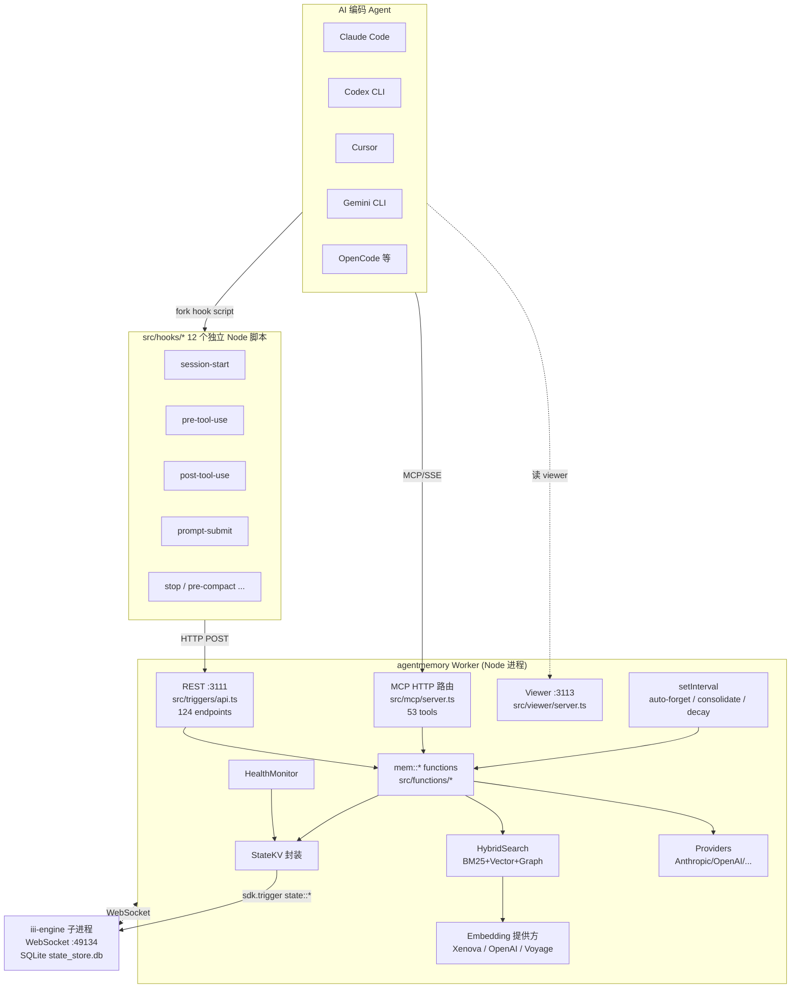
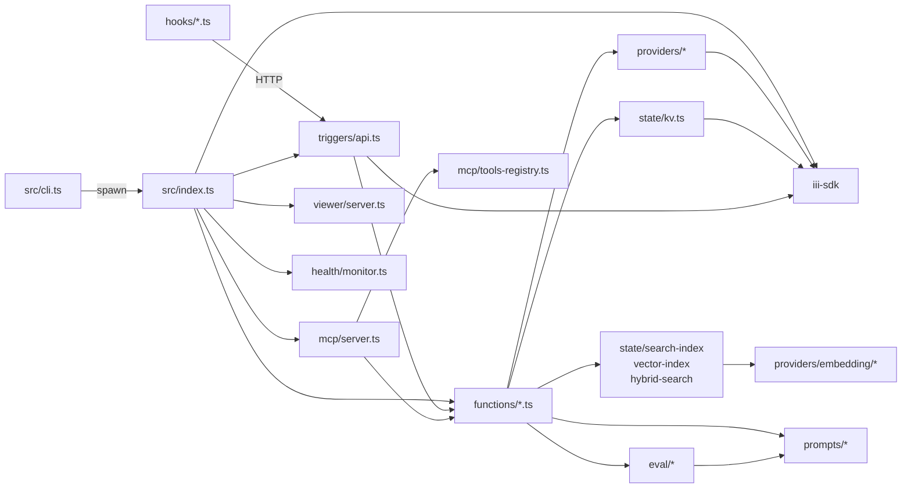
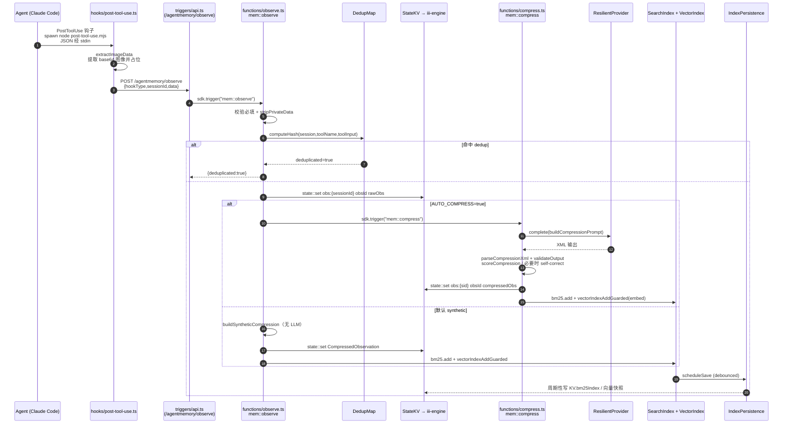
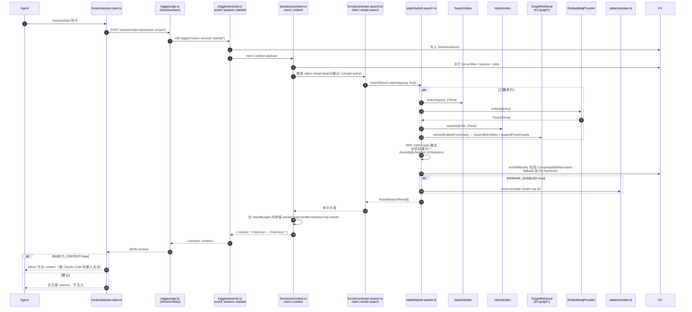

# agentmemory 源码学习笔记

> 仓库地址：[rohitg00/agentmemory](https://github.com/rohitg00/agentmemory)
> 学习日期：2026-05-22

---

> **以下为 AI 源码分析**
>
> ### 一句话概括
>
> 跨 AI 编码 Agent（Claude Code / Codex CLI / Cursor / Gemini CLI / OpenCode 等）共享的持久化记忆层：通过 hook 自动采集会话观察、用 LLM 压缩成结构化片段，并以 BM25+向量+知识图谱的三流混合检索把上下文按需注回新会话。
>
> ### 要点速览
>
> | 模块 | 职责 | 关键文件 |
> |------|------|----------|
> | 入口与启动编排 | 注册 50+ 个 iii-engine function、装载索引、启动定时任务 | `src/index.ts` |
> | CLI / 安装器 | 下载并 spawn iii-engine、`connect` 各 Agent、`doctor` 诊断 | `src/cli.ts`、`src/cli/*` |
> | 采集 hooks | 12 个独立 Node 脚本，从 stdin 读 JSON，POST 到本地 REST | `src/hooks/*.ts` |
> | 业务函数 (mem::*) | 观察、压缩、搜索、整合、知识图谱、leases、reflect 等 | `src/functions/*.ts` |
> | 状态层 | StateKV 封装 iii-engine state；BM25 / Vector / Hybrid 索引 | `src/state/*` |
> | LLM/Embedding 适配 | 多厂商 Provider + 弹性重试 + Fallback 链 | `src/providers/*` |
> | API/MCP 接口层 | 124 REST endpoints + 53 MCP tools | `src/triggers/api.ts`、`src/mcp/server.ts` |
> | Viewer | 内置实时浏览界面（HTML + SSE） | `src/viewer/*` |
> | 评估与质量 | 压缩输出 schema 校验、自纠错重试、metrics | `src/eval/*` |

---

## 项目简介

agentmemory 是面向 AI 编码 Agent 的持久化记忆服务。问题域：每开一段新会话，CLAUDE.md / .cursorrules 那种静态 200 行规则文件无法承载真实的项目状态，Agent 不得不重新解释架构、重新踩同一颗雷。它的解法是：把 Agent 每个工具调用都通过 hook 静默采集 → LLM（或零调用的 synthetic 路径）压缩成带 facts/concepts/files 的结构化 observation → 入库后建立 BM25、向量、知识图谱三套索引 → 下次会话开始时，按 token 预算混合检索回相关片段直接注入到 Agent 上下文。整个系统跑在 iii-engine 的 Worker / Function / Trigger 三原语之上，对外暴露 REST 与 MCP 两套表面，因此理论上任何支持 hook、MCP 或 HTTP 的 Agent 都能复用同一份记忆。

## 技术栈

| 类别 | 技术 |
|------|------|
| 语言 | TypeScript（ESM only，`"type": "module"`） |
| 运行时 | Node.js ≥ 20 |
| 框架/引擎 | iii-engine + iii-sdk（pinned `0.11.2`，WebSocket 注册 Worker/Function/Trigger） |
| LLM 适配 | `@anthropic-ai/sdk`、`@anthropic-ai/claude-agent-sdk`、自实现 OpenAI/Gemini/OpenRouter/Minimax/Noop |
| 本地嵌入 | `@xenova/transformers` + `onnxruntime-node`（`all-MiniLM-L6-v2`），可选 |
| CJK 分词 | `@node-rs/jieba`、`tiny-segmenter`（optionalDeps） |
| 校验 | zod |
| CLI 交互 | `@clack/prompts` |
| 构建 | tsdown（rolldown 后端，输出 `dist/*.mjs`） |
| 包管理 | npm（发布到 `@agentmemory/agentmemory`） |
| 测试 | vitest（950+ tests，集成测试隔离） |
| 可观测 | OpenTelemetry（meter）+ 自建 metrics-store |

## 目录结构

```text
agentmemory/
├── src/                       # 主源码（仅 TypeScript）
│   ├── index.ts               # 主进程 main()：连 engine、注册所有 function、装载索引
│   ├── cli.ts                 # bin 入口：spawn engine、connect agent、doctor
│   ├── config.ts              # 环境变量与 ~/.agentmemory/.env 加载
│   ├── auth.ts                # timingSafeCompare 鉴权
│   ├── logger.ts version.ts types.ts
│   ├── cli/                   # connect / onboarding / doctor / splash 子命令
│   ├── hooks/                 # 12 个独立 hook 脚本（session-start、post-tool-use、stop ...）
│   ├── functions/             # 50+ 个 mem::* 业务函数（observe / compress / search / consolidate ...）
│   ├── state/                 # StateKV、BM25 SearchIndex、VectorIndex、HybridSearch、IndexPersistence
│   ├── providers/             # LLM Provider + ResilientProvider + FallbackChainProvider + embedding/
│   ├── prompts/               # compression / consolidation / graph-extraction / vision XML 模板
│   ├── mcp/                   # MCP server.ts + tools-registry.ts + standalone.ts + transport.ts
│   ├── triggers/              # api.ts（REST 路由表）+ events.ts（durable subscriber）
│   ├── eval/                  # zod schema、quality scoring、self-correct 重试、metrics-store
│   ├── viewer/                # 实时浏览器界面（index.html + server.ts + document.ts）
│   ├── replay/                # JSONL 解析与 timeline 重放
│   ├── health/                # 资源/吞吐 monitor 与阈值
│   └── telemetry/             # OTel meter 初始化
├── test/                      # 100+ 测试文件，对应 src/functions
├── eval/                      # LongMemEval / coding-agent-life 评估 harness
├── benchmark/                 # load-100k 压测 + COMPARISON / QUALITY / SCALE 报告
├── plugin/                    # Claude Code 原生 plugin manifest（hooks、commands、skills）
├── integrations/              # OpenClaw / Hermes / pi 等 Agent 的 wiring
├── packages/                  # 子包（如 fs-watcher）
├── deploy/ docker-compose.yml # 部署相关
├── website/                   # 官方站点 agent-memory.dev
└── docs/                      # benchmarks / architecture 文档
```

## 架构设计

### 整体架构

agentmemory 是一个**单进程多职责** Node 服务，自身不持有数据库——所有持久化通过本地启动的 iii-engine 子进程完成。Worker（agentmemory）通过 WebSocket 连到 iii-engine（端口 49134），把自己的能力以 `function_id` 注册上去；REST、durable topic、定时器等"触发器"都由 engine 路由到对应 function。两条价值链横穿这个架构：**写入链**（Agent hook → REST → mem::observe → mem::compress → 索引）和**读取链**（mem::context / smart-search → HybridSearch → BM25+Vector+Graph 融合 → 注入回 Agent）。



启动时 `src/index.ts: main()` 的关键步骤：

1. 加载 `~/.agentmemory/.env` 与各类配置（`loadConfig` / `loadEmbeddingConfig` / `loadFallbackConfig` / `loadClaudeBridgeConfig` / `loadTeamConfig` / `loadSnapshotConfig`）。
2. `createProvider()` 或 `createFallbackProvider()` 包装出 `ResilientProvider`；`createEmbeddingProvider()` 与 `createImageEmbeddingProvider()` 同上，未配置时为 BM25-only。
3. `registerWorker(engineUrl, ...)` 通过 iii-sdk 连接 engine，拿到 `sdk` 实例。
4. 串行调用 ~50 个 `registerXxxFunction(sdk, kv, ...)`（参见 `src/index.ts:204-303`），把所有业务函数注册到 engine。
5. `registerApiTriggers / registerEventTriggers / registerMcpEndpoints` 把 REST 路由、durable subscriber、MCP HTTP tool 路由也挂到 engine。
6. `IndexPersistence.load()` 读回上次落盘的 BM25 / Vector 索引，并对维度做严格校验：发现混维直接拒绝启动，除非 `AGENTMEMORY_DROP_STALE_INDEX=true`（防 cosineSimilarity 静默返回 0 导致召回崩塌）。
7. 索引为空则 fire-and-forget 一次 `rebuildIndex(kv)`；非空则 backfill 漏索引的 memory 记录（处理 `<0.9.5` 升级遗留）。
8. `startViewerServer(restPort+2, ...)` 启动浏览器 UI；按需开启 auto-forget / consolidate / decay 三个 `setInterval`，全部 `unref()` 以免阻塞退出。
9. 注册 `SIGINT / SIGTERM` 优雅关闭：先停 health 监控、dedup map、index 持久化，再 `viewerServer.close()` → `indexPersistence.save()` → `sdk.shutdown()`。

### 核心模块

#### 1. CLI 与 Engine Bootstrap（`src/cli.ts` + `src/cli/*`）
- 职责：作为 bin 入口；从 GitHub release 下载并 pin 住 `iii-engine v0.11.2`（避免 `latest` 引入 worker 模型变动），spawn engine 进程，再以子进程形式拉起 `dist/index.mjs` 自己。
- 提供 `agentmemory connect <claude-code|codex|cursor|gemini-cli|...>` 的非交互式 wiring（写 plugin manifest、`.mcp.json`、hook 脚本路径等），以及 `doctor` 诊断（`src/cli/doctor-diagnostics.ts`）和 `remove`（`src/cli/remove-plan.ts`）的"先 dry-run 再执行"模式。
- 关键决策：通过 `AGENTMEMORY_III_VERSION` 让用户可手动覆盖 pin。

#### 2. Hooks（`src/hooks/*.ts`）
- 12 个**完全独立**的 Node 脚本，**不导入 iii-sdk**，仅依赖标准库，从 stdin 读 JSON，向 `http://localhost:3111/agentmemory/*` 发 POST，所有调用统一 `AbortSignal.timeout()` 兜底（`session-start.ts` 会把 inject 路径设为 1500ms、纯 register 路径设为 800ms 以避免高并发下的级联超时 OOM——issue #221）。
- 设计：`session-start` 在 `AGENTMEMORY_INJECT_CONTEXT=true` 时把 REST 返回的 context 写到 stdout，被 Claude Code 自动前置进会话；默认关（issue #143，避免烧 Claude Pro 配额）。`post-tool-use` 在 hook 端就识别 base64 图像并替换为占位字符串以减小 payload。

#### 3. 业务函数 mem::*（`src/functions/*.ts`，60+ 文件）
- 全部以 `registerXxxFunction(sdk, kv, ...)` 形态导出，内部统一 `sdk.registerFunction("mem::xxx", handler)`。
- 关键函数：
  - `mem::observe`（`functions/observe.ts`）— 写入入口。先 dedup（`DedupMap` LRU+TTL），再 `stripPrivateData` 隐私清洗，再写 KV，最后视开关同步触发 `mem::compress` 或 `compress-synthetic` 走零 LLM 路径。
  - `mem::compress`（`functions/compress.ts`）— LLM 压缩。Provider 输出 XML，`parseCompressionXml` 解析；输出经 `validateOutput`（zod）+ `scoreCompression` 评分；评分低于阈值会调 `compressWithRetry` 自纠错。压缩结果同时写入 BM25（`getSearchIndex().add`）和向量索引（`vectorIndexAddGuarded`）。
  - `mem::context` / `mem::working-memory`（`functions/context.ts`、`functions/working-memory.ts`）— 在 token 预算内拼接 pinned slots、project profile、lessons、最近 summary、相关 memories，输出注入用 XML。
  - `mem::smart-search`（`functions/smart-search.ts`）— 调用注入的 `HybridSearch.search`，可选叠加 query expansion。
  - `mem::consolidate-pipeline`（`functions/consolidation-pipeline.ts`）— 周期性把 `summaries` 合并为 SemanticMemory，把行为序列抽出 ProceduralMemory；带按访问时间的指数衰减（每过 `decayDays` 强度乘 0.9）。
  - `mem::auto-forget`、`mem::lesson-decay-sweep`、`mem::insight-decay-sweep` — 带强度衰减/过期清理的"遗忘"机制。
  - `mem::graph`（`functions/graph.ts`）— 用 Provider 抽实体/关系（XML 解析容错处理 `[^>]*?` 自闭合 vs 双标签），写 `KV.graphNodes` / `KV.graphEdges`。
  - `mem::leases / mem::actions / mem::frontier / mem::routines / mem::signals / mem::checkpoints / mem::sentinels / mem::sketches / mem::crystallize` — 多 Agent 协作所需的"动作图谱"与租约。

#### 4. State 与索引（`src/state/*`）
- `StateKV`（`state/kv.ts`）— 仅封装 5 个 sdk.trigger 调用：`state::get/set/update/delete/list`。所有读写都走 iii-engine 的 SQLite，因此 agentmemory 自己不持有任何文件锁。
- `KV` 常量（`state/schema.ts`）— 以 `mem:` 前缀的 scope 命名空间表，覆盖 sessions、observations(sessionId)、memories、summaries、graphNodes/Edges、teamShared(teamId)、commits、leases…，新增 scope 必须在这里登记（AGENTS.md 强约束）。
- `SearchIndex`（`state/search-index.ts`）— 自实现 BM25（`k1=1.2`、`b=0.75`），自带：英文 stem（`stemmer.ts`）+ 同义词扩展（`synonyms.ts`，权重 0.7）+ CJK 兜底分词（`cjk-segmenter.ts`，可选 jieba/tiny-segmenter）。
- `VectorIndex`（`state/vector-index.ts`）— 内存中 Map 装 `Float32Array`，cosine 相似度线性扫描；把全维度校验暴露给 `IndexPersistence` 用。
- `HybridSearch`（`state/hybrid-search.ts`）— BM25/Vector/Graph 三流并行召回，按 RRF（`1/(60+rank)`）融合，权重在缺失流时动态归一；`diversifyBySession`（每 session 最多 3 条）+ `enrichResults`（fallback 把 `KV.memories` 装回成 CompressedObservation）+ 可选 cross-encoder rerank。
- `IndexPersistence`（`state/index-persistence.ts`）— 防抖落盘 + 启动加载；加载时 `validateDimensions` 拒绝混维以避免静默腐蚀（issue #248）。
- `keyed-mutex.ts` `kv` `withKeyedLock` — 对 sessionId 级临界区做并发保护（observe 链路重要）。

#### 5. Providers（`src/providers/*`）
- `MemoryProvider` 抽象：`complete(prompt, opts)` + 可选 `completeJSON`。
- 具体实现：`anthropic.ts`、`agent-sdk.ts`（用 `@anthropic-ai/claude-agent-sdk`，能复用 Claude Code 当前 session 的 OAuth token）、`openai.ts` / `openrouter.ts` / `minimax.ts`（三家共用 `_openai-shared.ts` 的请求封装）、`noop.ts`（无 LLM 模式）。
- `ResilientProvider`（`providers/resilient.ts`）— 装饰器：超时、退避重试、`CircuitBreaker`（`circuit-breaker.ts`）。
- `FallbackChainProvider`（`providers/fallback-chain.ts`）— 主 Provider 失败时按顺序降级；与 `ResilientProvider` 是双层包装。
- `providers/embedding/*` — 同样的"接口+多实现"：`local.ts`（Xenova/all-MiniLM-L6-v2，零成本路径）、`openai.ts`、`voyage.ts`、`cohere.ts`、`gemini.ts`、`openrouter.ts`，外加 `clip.ts` 走图像 embedding 用于 vision-search。

#### 6. 接口层
- REST（`src/triggers/api.ts`，2700+ 行）— 注册 124 endpoints，`checkAuth` 用 `timingSafeCompare(req.headers.authorization, "Bearer "+secret)` 防时序攻击；feature flag 关闭时返回 `503` 带 `flag/enableHow/docsHref` 的结构化错误。所有 endpoint 内部都走 `sdk.trigger("mem::xxx", whitelistedPayload)`，强约束**禁止把 raw body 透传给 trigger**（AGENTS.md）。
- MCP（`src/mcp/server.ts` + `src/mcp/tools-registry.ts`）— `mcp::tools::list` 返回 `getVisibleTools()`（默认仅核心 8 个，`AGENTMEMORY_TOOLS=all` 才会全开 53 个）；`mcp::tools::call` 是大 switch，逐个 tool 验参后转发到对应 `mem::*`。`standalone.ts` 把 MCP 包成可独立 spawn 的子进程，但其实是个 HTTP 反向代理转发到主 server——保证 hook、viewer、MCP 看到的状态一致。
- Viewer（`src/viewer/server.ts`）— Node `http.createServer`，对外服务静态 `index.html`、SSE 流（`KV.STREAM` 的 `mem-live`）、JSON API。

#### 7. Eval 与质量保障（`src/eval/*`）
- `schemas.ts` — zod schema 定义压缩输出契约。
- `validator.ts` — `validateOutput(schema, raw)` 返回 `{ ok, errors }`。
- `quality.ts` — `scoreCompression` 多维打分（覆盖率、长度、关键概念命中等）。
- `self-correct.ts` — `compressWithRetry`，分数过低时把错误反馈给 Provider 让它重写，最多 N 次。
- `metrics-store.ts` — 把 quality / latency / fail rate 写到 `KV.metrics`，供 viewer 展示。

### 模块依赖关系



## 核心流程

### 流程一：观察采集与压缩入索引（Write Path）

从 Agent 触发工具调用到记忆落盘 + 索引更新的完整链路：



要点：
- Hook 端就做 image 占位与 8KB 截断，避免大 payload 阻塞 REST。
- `mem::observe` 内部加 `withKeyedLock(sessionId)` 串行化同会话写，避免 dedup 与 KV 列表的竞态。
- 默认走 **synthetic 压缩**（不调 LLM），代价可控；`AGENTMEMORY_AUTO_COMPRESS=true` 才会用 LLM 路径，并经过 `validateOutput → scoreCompression → compressWithRetry` 的质量闸门。
- 向量写入用 `vectorIndexAddGuarded`：维度不一致时 `logger.warn` 跳过，绝不静默写入坏向量（参见 issue #248 防腐蚀注释）。

### 流程二：跨会话上下文召回（Read Path）

新会话起点 / Agent 主动检索时拼装 token 预算内的最优上下文：



要点：
- "三流融合"是核心卖点：单独 BM25 容易丢同义改写，单独向量丢精确文件名/标识符，加图谱后能把"`auth.ts` 改过 → JWT → jose 中间件"这种跨观察的关系也召回出来。
- RRF 用 `k=60` 是经验常数；缺失流的权重在该 query 维度上归一为 0，避免凭空给召回结果加分。
- `enrichResults` 兜底：BM25 索引中可能存有 `mem::remember` 写入的 memory id（属于 `KV.memories` 而非 `KV.observations(sid)`），用 `memoryToObservation` 适配后才能正常呈现，处理 `<0.9.5` 的索引/存储割裂（issue #257）。
- 默认**不注入** context（issue #143）：避免每次 PreToolUse 都吃 ~4000 字 session token；hook 仍持续注册 session、采集观察，只是不主动塞回。

## 关键设计亮点

### 1. 把存储外包给 iii-engine，自己只做"记忆语义"
仓库自始至终通过 `StateKV.get/set/list/update/delete`（仅 5 个 trigger，`src/state/kv.ts`）访问数据，从不直接打开 SQLite。AGENTS.md 把这条钉成强约束："never bypass iii-engine with standalone SQLite or in-process alternatives"。
- **解决了什么问题**：把锁、事务、持久化、跨进程共享一并交给 engine；Worker 重启不丢数据，且天然支持 viewer/MCP 看到同一份状态。
- **为什么这样设计**：iii-engine 的 Worker/Function/Trigger 三原语本质就是"插件即函数"，写到 KV 的成本和写普通 Map 一样低，但获得了远程可调用、可被定时器/HTTP/事件 trigger、可被 OpenTelemetry 监控这些能力。代价是所有 KV 调用都过 WebSocket，因此用了 `unhandledRejection` 全局兜底（`index.ts:120`，issue #204：高写入压力下 `state::set` 偶尔超 30s SDK 超时）。

### 2. 三层"质量闸门"对 LLM 输出做校验—评分—自纠错
`functions/compress.ts` 把 Provider 当作不可信源处理：先用 `parseCompressionXml` 容错解析，再用 zod schema (`eval/schemas.ts`) 强类型校验，再用启发式 `scoreCompression` 打分，分数过低就走 `compressWithRetry`（`eval/self-correct.ts`）把校验错误反喂给 LLM 让它重写，所有指标记到 `MetricsStore`。
- **解决了什么问题**：LLM 偶发把 facts 写空、type 越界、`importance` 越界 1-10，下游索引质量直接崩。
- **为什么这样设计**：把"质量"放进默认数据通路而不是临时脚本，调试期就能从 metrics 看出 P95 失败率，演进到"自纠错可证伪"的状态比"加更多 prompt 提示"稳健得多。同样的 schema 验证也用在导出/导入路径——版本号写在 `types.ts`、`version.ts`、`functions/export-import.ts` 三处，AGENTS.md 把"版本号必须同时更新"列为发版红线。

### 3. RRF 三流混合检索 + 动态权重归一 + 会话多样化
`state/hybrid-search.ts` 不是简单地 0.4 BM25 + 0.6 Vector，而是：
- 当 vector / graph 流为空时把对应权重置 0 然后整组归一（`tripleStreamSearch` 第 197-206 行），单 BM25 时退化得干净；
- RRF 用 `1/(60+rank)` 而不是直接相加 score，跨度量量纲安全；
- `diversifyBySession` 限制每 session 最多 3 条，避免一个超长会话淹没结果；
- 顶部 20 条可选过 cross-encoder rerank（`state/reranker.ts`）。

**解决了什么问题**：纯 BM25 R@5 86% / 纯向量在 LongMemEval-S 上不如混合；硬加权对缺失模态不鲁棒。
**为什么这样设计**：作者 README 给出的对照基准是 R@5 95.2% / Top-5 hit 100%，比 grep baseline 精度高 2.2×；用 RRF 而非加权和的根本原因是不需要校准多模态分数，只用排名即可。

### 4. Hook 端"完全独立 + 极低耦合 + 严苛超时"的边界设计
`src/hooks/*.ts` 全部是 standalone 脚本，**不导入 iii-sdk**，仅靠 `fetch` + `AbortSignal.timeout()` 与主进程对话。`session-start.ts` 把 inject 路径设 1500ms、register 路径 800ms，并且在 register 路径上故意 `fetch().catch(()=>{})` 不 await，让 socket 排空但不阻塞 hook 退出。
- **解决了什么问题**：hook 是 Agent 启动时 spawn 的同步阻塞链路；服务挂了或慢就直接拖死 Agent 启动。issue #221 是真实事故：高并发下慢响应级联累加，把 iii-engine 拖到 OOM。
- **为什么这样设计**：hook 不依赖 SDK 意味着部署时不需要 hook 端能 require iii-sdk；不 await register 响应是承认"这条路径是纯遥测，挂掉就静默丢一条观察 OK，绝不能拖慢用户的 Tab 补全"。这种"边界处放弃可靠性以换可用性"的选择遍布全栈：REST endpoint 用 timing-safe 比较；hook 用最严超时；图像在 hook 端就剥离避免 8KB+ payload 反复传。

### 5. Provider 三件套：抽象 + 弹性 + 链式降级
`providers/index.ts: createFallbackProvider` 把同一个 LLM 接口包了两层装饰器：内层 `FallbackChainProvider` 维持一个 provider 列表顺序尝试，外层 `ResilientProvider` 加超时、退避、`CircuitBreaker`。Embedding 也是类似模式（local Xenova → OpenAI → Voyage 等可串联）。
- **解决了什么问题**：单 Provider 受限于 rate limit / 区域故障；切 Provider 不应该需要重启服务或修改业务函数。
- **为什么这样设计**：把"可靠性"和"业务"拆开成可独立测试的单元——`circuit-breaker.ts` 里的失败率统计可以单测，业务函数 `mem::compress` 拿到的始终是 `MemoryProvider` 接口，看不到底下是 Anthropic 还是 OpenRouter，未来加 Bedrock/Mistral 只需多一份 provider 实现。
