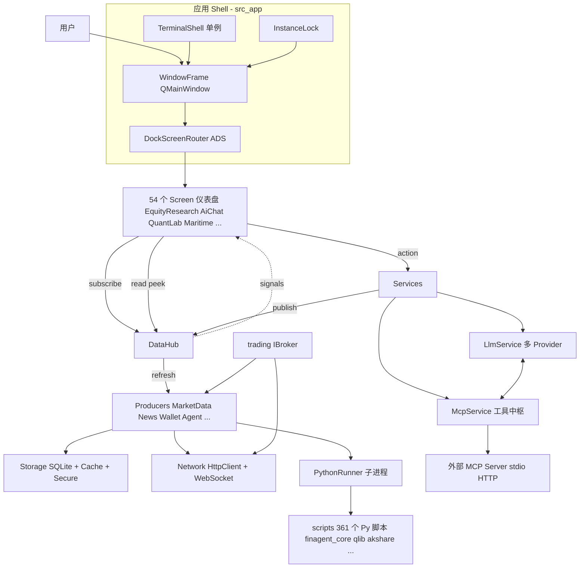
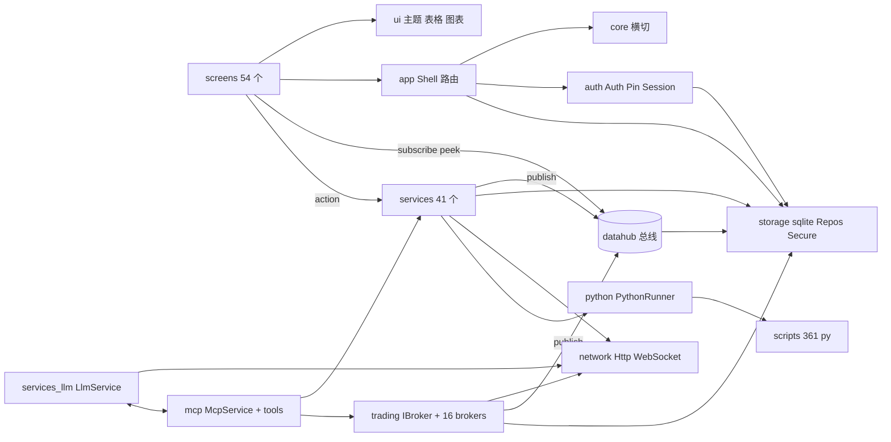
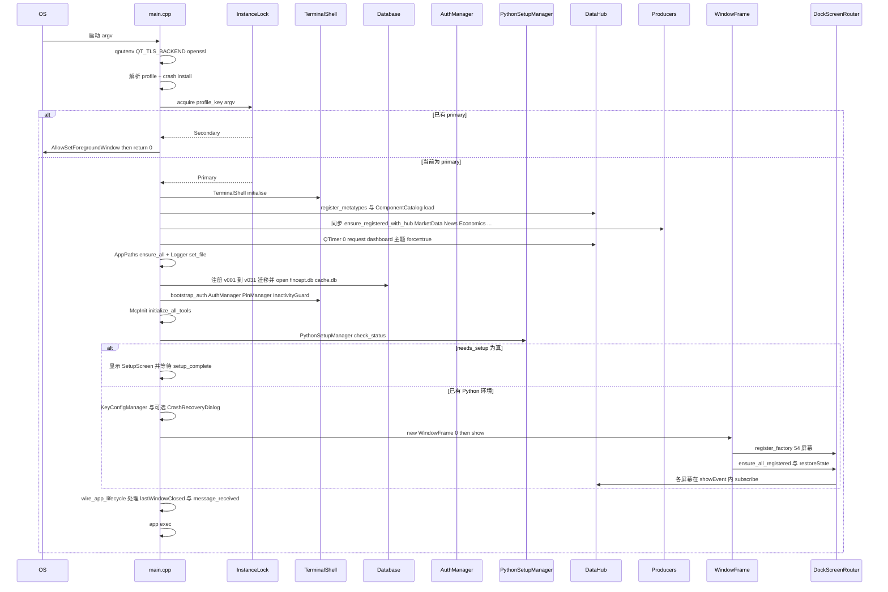
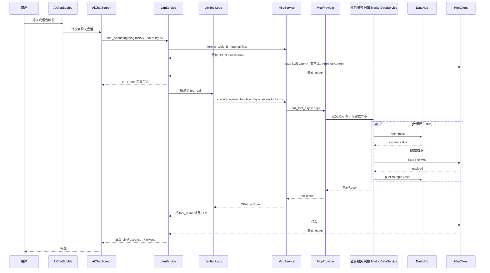

# FinceptTerminal 源码学习笔记

> 仓库地址：[FinceptTerminal](https://github.com/Fincept-Corporation/FinceptTerminal)
> 学习日期：2026-05-22

---

> **以下为 AI 源码分析**
>
> ### 一句话概括
>
> 一个用纯 C++20 + Qt6 实现的"机构级金融工作台"——以 DataHub 主题总线为核心，把 100+ 数据连接器、37 个 AI Agent、16 个券商、QuantLib/QLib 量化套件、MCP 工具系统和 Solana 钱包装进一个本地原生桌面单二进制，并通过嵌入式 Python 子进程承担分析层。
>
> ### 要点速览
>
> | 子系统 | 关键目录 | 角色 |
> |---|---|---|
> | 应用 Shell / 多窗口 | `src/app/` | `main.cpp`、`WindowFrame`、`DockScreenRouter`（Qt-Advanced-Docking）、`InstanceLock`、`TerminalShell` |
> | 数据中枢（核心） | `src/datahub/` | `DataHub` pub/sub 总线 + `Producer` 接口 + `TopicPolicy` 调度 |
> | 服务层 | `src/services/`（41 个子目录） | 行情、新闻、地缘、期权、Alpha Arena、Agents、QuantLib、Workflow、钱包、计费等 |
> | 数据持久化 | `src/storage/` | SQLite（`fincept.db` + `cache.db`）+ 31 条 migration + Repository 套件 + AES-GCM SecureStorage |
> | 交易层 | `src/trading/` | `IBroker` 抽象 + 16 家券商适配器 + Kraken/HyperLiquid 原生 WS |
> | AI/MCP | `src/services/llm/`、`src/mcp/` + `src/screens/ai_chat/` | 多 Provider LLM（OpenAI/Anthropic/Gemini/...）+ MCP 工具中枢（30+ 内部工具集） |
> | Python 嵌入 | `src/python/` + `scripts/` | `PythonRunner` 子进程池 + 361 个分析脚本 + `finagent_core/main.py` agent 调度器 |
> | UI 屏幕 | `src/screens/`（54 个屏幕） | 仪表盘、Equity Research、QuantLab、Node Editor、Maritime、Geopolitics 等 |
> | UI 控件库 | `src/ui/` | 主题、表格、图表工厂、命令栏、Markdown 渲染、通知 |

---

## 项目简介

Fincept Terminal v4 定位为一个开源、可商用的"金融工作台"，对标 Bloomberg/Refinitiv 这类终端，但全部以**纯本地、单二进制**形态交付。它把以下能力收拢到同一个 Qt 主窗口里：

- **多资产分析**：股票、期权（链/PCR/Max Pain/IV 历史）、固收、衍生品、组合优化、风险（VaR、Sharpe）、DCF 估值；
- **AI Agent**：Buffett、Graham、Lynch、Munger 等投资者人格 + 经济/地缘 Agent + AgenticRunner（任务化、可中断、可恢复）+ 多 LLM Provider；
- **数据连接器**：DBnomics、FRED、IMF、World Bank、Polygon、Yahoo Finance、AkShare、Databento、政府 API、Polymarket/Kalshi 预测市场；
- **实时交易**：Kraken/HyperLiquid 原生 WebSocket、16 家券商（含印度本土 Zerodha/AngelOne/Upstox/Fyers/Dhan 等 + 全球 IBKR/Alpaca/Tradier/SaxoBank）、Paper Trading；
- **量化套件**：服务侧有 QuantLib HTTP 客户端 + 18 个 Python QLib 模块（高频、特征工程、组合优化、强化学习交易）；
- **可视化工作流**：Node Editor + 14 类节点（触发、控制流、市场数据、交易、风控、通知、Agent…）；
- **MCP 工具中枢**：30+ 工具集（Markets/Watchlist/Portfolio/Equity/Edgar/Forum/Excel/Workspace/...），既给内部 LLM 用，也对外暴露 MCP server。

差异化卖点是"native + 单二进制 + 100+ 数据源开放"，许可证策略是 AGPL-3.0 + 商业双许可。

## 技术栈

| 类别 | 技术 |
|------|------|
| 语言 | C++20（主体）+ Python 3.11.9（嵌入分析） |
| 框架 | Qt 6.8.3（Widgets/Charts/Network/Sql/WebSockets/Concurrent/Multimedia/TextToSpeech）、Qt-Advanced-Docking、QGeoView、QXlsx、md4c、ed25519、OpenSSL 3 |
| 构建工具 | CMake 3.27 + Ninja，三平台 CMakePresets，Unity Build + ccache/sccache，可选 LTO |
| 依赖管理 | C++ 端用 `FetchContent`（pin commit）；Python 端 `requirements-numpy1.txt` / `requirements-numpy2.txt` 双方案 |
| 测试框架 | `tests/` 子目录（`add_subdirectory(tests)` 末尾接入）+ Python `tests/` |
| 数据存储 | SQLite（WAL 模式，主库 + 缓存库 + workspace ring buffer + audit log）+ AES-256-GCM SecureStorage |
| 网络 | `QNetworkAccessManager` + 自封装 `HttpClient`，强制 `QT_TLS_BACKEND=openssl`（macOS SecureTransport / Windows Schannel 在 Qt 6.8 上有 WS 关闭崩溃） |

## 目录结构

```text
FinceptTerminal/
├── fincept-qt/                            ← C++/Qt 主工程
│   ├── CMakeLists.txt                     ← 3354 行，FetchContent + 32 模块源码列表
│   ├── CMakePresets.json                  ← win/linux/macos × debug/release 预设
│   ├── cmake/                             ← qgeoview AGL 补丁等
│   ├── packaging/                         ← CPack/IFW 安装器配置
│   ├── resources/                         ← 图标、组件目录、demo_portfolio、Python 依赖清单
│   ├── translations/                      ← Qt i18n .ts/.qm
│   ├── src/
│   │   ├── app/                           ← 进程级 Shell（main、WindowFrame、DockScreenRouter、TerminalShell、InstanceLock）
│   │   ├── core/                          ← 横切关注点：actions/components/config/crash/events/i18n/keys/layout/logging/panel/screen/session/symbol/telemetry…
│   │   ├── datahub/                       ← 主题 pub/sub 数据总线（DataHub + Producer + TopicPolicy）
│   │   ├── network/                       ← HttpClient + WebSocketClient
│   │   ├── auth/                          ← AuthManager / PinManager / SessionGuard / InactivityGuard / SecurityAuditLog
│   │   ├── storage/                       ← sqlite Database + 31 条 migration + 28 个 repositories + AES SecureStorage + workspace 快照环
│   │   ├── python/                        ← PythonSetupManager / PythonRunner（子进程池）/ PythonWorker / OptionGreeksWorker / ScriptCatalog
│   │   ├── mcp/                           ← MCP 工具中枢：Provider/Service/Manager/Client/Bridge + tools/ 30 套工具实现
│   │   ├── trading/                       ← IBroker + 16 家券商 + Kraken/HyperLiquid 原生 WS + InstrumentRepository/SymbolResolver/PaperTrading
│   │   ├── services/                      ← 41 个业务域服务（agents/llm/markets/news/economics/options/quantlib/portfolio/wallet/billing/workflow/notifications/…）
│   │   ├── screens/                       ← 54 个独立 Screen（Dashboard/EquityResearch/AiChat/QuantLab/AlphaArena/NodeEditor/Maritime/Geopolitics/…）
│   │   └── ui/                            ← 主题、表格、图表工厂、CommandBar、NotifBell、PushpinBar、Markdown 渲染
│   └── scripts/                           ← 361 个 Python 脚本（数据连接器 + agents/finagent_core + ai_quant_lab/qlib + agno_trading…）
├── docs/                                  ← Contributing、Commercial License、Python 贡献指南
├── images/                                ← README 截图素材
├── Dockerfile                             ← Linux + X11 CI 镜像
└── setup.sh                               ← 一键依赖安装 + 构建脚本（compiler/cmake/Qt/Python/build/launch）
```

## 架构设计

### 整体架构

Fincept Terminal 不是单层 MVC 应用，而是"四层 + 一根总线"的形状：

1. **应用 Shell**（`src/app/`）：`TerminalShell` 单例做进程级生命周期协调，`InstanceLock`（QLocalServer 域套接字）保证单实例 + 命令转发；`WindowFrame` 是 `QMainWindow` 子类，每个窗口内嵌 `ads::CDockManager`，由 `DockScreenRouter` 把 54 个 `Screen` 工厂化注册为可拖动 `CDockWidget`。
2. **DataHub 总线**（`src/datahub/`）：唯一的"读"入口。所有 Screen 都通过 `subscribe(owner, topic, slot)` 订阅主题（如 `market:quote:AAPL`、`news:general`、`option:chain:NIFTY`），所有"写"由 `Producer` 实现者推送（`MarketDataService`、`NewsService`、`ExchangeSessionManager`、`AgentService`、各券商…）。`TopicPolicy` 控制 `ttl_ms`、`min_interval_ms`、`max_requests_per_sec`，实现冷启动 pre-warm + request 合流。
3. **服务层**（`src/services/` + `src/trading/`）：业务域逻辑落在这层；多数服务是单例 + `Producer`，少数（QuantLibClient、LlmService）走 HTTP 客户端 + 同步/异步双 API。
4. **数据/工具底座**（`src/storage/` + `src/mcp/` + `src/python/`）：SQLite 持久化（主库 31 条迁移）、SecureStorage（AES-GCM）、MCP 内/外部工具，以及 Python 子进程池（`PythonRunner` + `finagent_core/main.py` 通过 stdin JSON 调度）。



### 核心模块

#### 1. `src/app/` — 应用 Shell

- **职责**：进程入口、单实例锁、多窗口管理、ADS 面板路由、生命周期 wiring。
- **核心文件**：
  - `main.cpp`（931 行）— 启动序列：①TLS 切 OpenSSL → ②`--profile` 解析（多 profile 隔离 InstanceLock 键）→ ③`crash::install` 安装异常过滤 → ④`QApplication` 构造 + `setQuitOnLastWindowClosed(false)` → ⑤`InstanceLock::acquire`（secondary 直接退出，primary 继续）→ ⑥`TerminalShell::initialise` → ⑦注册 31 条 migration + 打开 `fincept.db`/`cache.db` → ⑧`AuthManager`/`PinManager`/`SessionGuard` 引导 → ⑨`McpInit::initialize_all_tools` → ⑩Python 环境检查（`PythonSetupManager::check_status`）→ ⑪可选 `SetupScreen` → ⑫`WindowFrame(0)` 主窗口 + 恢复 secondary 窗口 → ⑬`QTimer::singleShot(0)` 两批服务延迟注册（核心 dashboard 主题 vs F&O/钱包/Alpha Arena 等）。
  - `WindowFrame.{h,cpp}`（1137 行）— 每窗口持有 `CDockManager` + `DockScreenRouter` + `DockToolBar/DockStatusBar/PushpinBar/QuickCommandBar`。源文件被切成 `_Layout/_Auth/_Setup/_Actions` 四份保持单文件可读。
  - `DockScreenRouter.{h,cpp}` + 三份 `_Materialize/_Navigation/_PanelOps`：屏幕懒加载工厂、`navigate/tab_into/add_alongside/replace_screen/duplicate_panel/tile_2x2/tear_off_to_new_window`。
  - `InstanceLock.{h,cpp}` — 替代 `SingleApplication`，用 `QLocalServer` + 域套接字/命名管道做单实例 + 跨进程 argv 转发。
  - `TerminalShell.{h,cpp}` — 进程级单例，`bootstrap_auth/crash_recovery/snapshot_ring/shutdown` 等 hook。
- **对外接口**：`WindowFrame` 通过 `DockScreenRouter` 调度 Screen；secondary instance 通过 `InstanceLock::message_received` → `WindowCycler::new_window_on_next_monitor()` 触发新建窗口。

#### 2. `src/datahub/` — 主题数据总线

- **职责**：进程内 pub/sub，是整个应用唯一的"读"路径。
- **核心文件**：`DataHub.{h,cpp}`、`Producer.h`、`TopicPolicy.h`、`DataHubMetaTypes.{h,cpp}`。
- **关键概念**：
  - `Producer::topic_patterns()` 用 `*`-suffix 通配（`market:quote:*`），`refresh(QStringList topics)` 由 hub 调度器调用，producer 异步取数完后 `DataHub::publish(topic, value)`；
  - `TopicPolicy{ttl_ms, min_interval_ms, ...}` 既配置缓存新鲜度，也节流上游请求；
  - `subscribe(owner, topic, slot)` 自动跟随 `owner` 的 `destroyed()` 信号清理（QPointer 守护）；
  - `subscribe_pattern("market:quote:*", slot)` 支持通配订阅；
  - `request(topics, force=true)` 用于"用户点了刷新"——绕过 `min_interval_ms` 但保留 producer 速率上限；
  - 内部用 `coalesce_window_ms_=100` 做请求合流，`pattern_index_` 是按前缀长度倒序的扁平表，避免 O(N×M) 扫描。
- **关键不变量**：`publish` 线程安全（队列连接到 hub 主线程），`peek/peek_raw` 由调用者承担线程安全（持有锁副本）；`publish_error` 不更新缓存值，让上次成功值留在 UI。

#### 3. `src/services/` — 业务域服务

41 个子目录，按业务划分。代表性：

| 服务 | 职责 | 设计要点 |
|---|---|---|
| `markets/MarketDataService` | 行情核心 producer | 注册 `market:quote:*`、`market:history:*`、`market:sparkline:*`，给出 indices/forex/crypto/commodity 的 default 列表用于 pre-warm |
| `news/NewsService_*` | 新闻主题、聚类、监控、NLP、相关性 | 单类拆 5 文件（LiveFeed/Parsing/Classification/Feeds/...） |
| `agents/AgentService_*` | C++ 包装 `finagent_core/main.py`；Producer + AgenticRunner | 同时是 Producer（`agent:*` push-only）、Discovery、Execution、Workflows、Repositories 五份；执行通过 PythonRunner 或自管 `QProcess + stdin JSON` |
| `llm/LlmService` | 多 Provider 抽象（OpenAI/Anthropic/Gemini/Groq/DeepSeek/MiniMax/OpenRouter/Ollama/xAI/Fincept） | `ToolPolicy{All, NoNavigation, None}` 控制工具注入；流式 SSE；`ResolvedLlmProfile` 按 ai_chat/agent/team 上下文解析 |
| `quantlib/QuantLibClient` | 远程 QuantLib HTTP 服务桥（异步 + 同步双签名） | 单例，UI 用异步、MCP 工具用 `call_sync(QEventLoop)` |
| `workflow/WorkflowExecutor` + `nodes/*` | 节点式可视化工作流引擎 | 14 类节点（触发、控制流、市场数据、交易、分析、安全、通知、Agent、文件、数据格式、集成…）+ `ExpressionEngine`、`AuditLogger`、`RiskManager`、`ConfirmationService`、`WorkflowCache` |
| `alpha_arena/AlphaArenaEngine` | LLM-vs-LLM 模拟交易竞技场 | `TickClock + ModelDispatcher + OrderRouter + PaperVenue + RiskEngine + AlphaArenaRepo`，崩溃可恢复 |
| `prediction/*` | 预测市场抽象 | `PredictionExchangeAdapter` 抽象 + Polymarket/Kalshi/FinceptInternal 三个适配器；`PredictionExchangeRegistry` 选路 |
| `wallet/*` + `billing/*` | Solana 钱包 + 实时余额 + STAKE/veFNCPT/real-yield + 折扣计费 | `Ed25519Verifier`（orlp/ed25519）+ `SolanaRpcClient` + `WalletTxBridge` 负责签名重定向；`TierService` 把 veFNCPT 等级映射为跨屏 gating |
| `notifications/NotificationService` + `providers/*` | 15 个通知通道 | Telegram/Discord/Slack/Email/WhatsApp/Pushover/Ntfy/Pushbullet/Gotify/Mattermost/Teams/Webhook/PagerDuty/Opsgenie/SMS |

#### 4. `src/trading/` — 交易适配层

- **抽象**：`IBroker`（`BrokerInterface.h`）+ `BrokerProfile`（声明 UI 需要哪些 credential 字段、产品类型、交易所、是否 native paper trading 等）。
- **登录流**：`exchange_token(api_key, api_secret, auth_code)` 统一签名；Zerodha 单独有 `Totp.cpp` + `ZerodhaAutoLogin.cpp` + `auth/RedirectServer.cpp`（OAuth 回跳本地 HTTP 服务）。
- **运行时**：`AccountManager`（多账户）+ `AccountDataStream`（推单/持仓/资金到 DataHub）；`ExchangeSessionManager` + `ExchangeService` + `ExchangeDaemonPool` 负责 Kraken/HyperLiquid 这类有自己 WS 协议的交易所；`OrderMatcher` + `PaperTrading` 是本地撮合。
- **Instrument 系统**：`InstrumentRepository` + `ZerodhaInstrumentParser`/`GrowwInstrumentParser` + `SymbolResolver`，把每家券商的合约表归一化。

#### 5. `src/mcp/` + `src/services/llm/` — AI/工具中枢

- **MCP 内部工具**：30 套（`MarketsTools/WatchlistTools/PortfolioTools/EquityResearchTools/EdgarTools/MAAnalyticsTools/Forum/Excel/Workspace/QuantLab/Agents/...`）。每套实现 `McpProvider`，集中由 `McpService` 暴露统一 `execute_tool/execute_openai_function/execute_openai_function_async`。
- **MCP 外部 server**：`McpManager` + `McpClient` 走 stdio/HTTP，外部 server 同样进 `get_all_tools()` 的统一目录；`SchemaValidator` 在调用前做参数校验。
- **工具消费侧**：`LlmService::chat_streaming` 透过 `LlmToolLoop` 实现工具循环（`max_tool_rounds_` 默认 40），`format_tools_for_openai(filter)` 还实现了 `ToolFilter` + `filtered_tools_cache_/openai_format_cache_` 缓存，避免每轮重新序列化 ~150KB 的 tool schema。

#### 6. `src/python/` + `scripts/` — 嵌入分析层

- **PythonSetupManager**：检测 venv、装包、写哨兵文件；冷启动可同步阻塞 + Set up Screen 兜底，热启动是 fast-path。
- **PythonRunner**：子进程池（`max_concurrent=3`）+ 行级流式回调 + 队列；`build_python_env()` 注入 `PYTHONPATH/FINAGENT_DATA_DIR/...`。
- **PythonWorker** / **OptionGreeksWorker**：把单次重计算放到 `QtConcurrent::run` 的 worker。
- **scripts/**：361 个 Python 文件，三大块：
  - `agents/finagent_core/main.py` 是统一调度入口（C++ 通过 stdin 喂 JSON 选 action）；含 `agentic/`（任务态机）、`persona_runtime`、`super_agent`、`task_state`、`tools/` 等；
  - `agents/{TraderInvestorsAgent, hedgeFundAgents, EconomicAgents, GeopoliticsAgents, rdagents, deepagents}`：人格化 agent 配置；
  - 大量数据连接器脚本（akshare_*、yfinance、acled_data、abs_data、afdb_data…）+ `ai_quant_lab/qlib_*`（特征工程、组合优化、HFT、强化学习交易等）。

#### 7. `src/storage/` — 持久化

- 主库 `fincept.db` + 缓存库 `cache.db`，皆走 WAL；
- 31 条迁移按 `register_migration_vNNN()` 显式注册，避免 MSVC `/OPT:REF` 把静态注册 TU 剥掉；
- 28 个 `Repository` 单例对应业务表（`SettingsRepository/PortfolioRepository/AlphaArenaRepo/NewsArticleRepository/...`）；
- `secure/SecureStorage`：跨平台 AES-256-GCM + SQLite，弃用过 macOS Keychain/Windows DPAPI 等平台特定 API；
- `workspace/`：`WorkspaceDb` + `WorkspaceSnapshotRing` + `CrashRecovery` 实现"上次崩溃前的窗口/面板/订阅"快照与恢复。

#### 8. `src/screens/` + `src/ui/` — 表现层

- 54 个屏幕都是独立的 `QWidget` 子类，由 `DockScreenRouter` 用 `register_factory(id, factory)` 懒注册；
- 复杂 Screen（`AiChatScreen`、`SupportScreen`、`DocsScreen`、`QuantLibScreen`、`AgentConfigScreen`、`SettingsScreen`、`EquityResearchScreen`...）会按职能切多个 .cpp（`_Layout/_Sessions/_Messaging/_Pages_*` 等）；
- `ui/` 提供主题（`ThemeManager` 默认 Obsidian）、`ChartFactory`、`DataTable`、`MarkdownRenderer`（基于 md4c）、`CommandBar/QuickCommandBar/CommandPalette`、`NotifBell/NotifToast/NotifPanel` 等通用控件。

### 模块依赖关系



## 核心流程

### 流程一：冷启动 → 主窗口可交互



要点：
- 多 profile 隔离体现在 `InstanceLock` 用 `profile_key`，"work" 和 "personal" 是两个独立 primary；
- 启动期只把 dashboard 第一屏会用到的 producer **同步注册**到 hub，其余通过两次 `QTimer::singleShot(0, ...)` 延后到事件循环首轮，保证 cold-start 感知延迟尽量短；
- `pre-warm`：登录/setup 用户停留时间内提前 `hub.request(topics, force=true)`，等 dashboard 真出现，subscribe 时 hub 直接走 `deliver_initial_value` 命中暖缓存；
- 崩溃恢复路径在 SetupScreen 完成与无 setup 两条分支都会走同一个 `CrashRecoveryDialog → WorkspaceShell::apply` 入口，避免重复创建窗口。

### 流程二：AI Chat 一次工具调用（LLM ↔ MCP ↔ 内部服务）



要点：
- `McpService` 把"内部 Provider"和"外部 MCP server"统一成同一份 `UnifiedTool` 列表，工具名规则是 `serverId__toolName`，`format_tools_for_openai_async` 兼容多 Provider；
- `LlmToolLoop` 用 `max_tool_rounds_` 防失控；`ToolPolicy::NoNavigation` 让浮动 bubble 不会突然把用户跳转到别的屏幕；
- 工具如果触发 `peek/publish`，立刻反向影响所有订阅了该 topic 的屏幕——AI 拉一次行情，仪表盘、沸点页面、Alpha Arena 同步看见。

## 关键设计亮点

1. **DataHub 是真正的"系统级"主题总线**
   - 解决了什么问题：54 个屏幕 + 41 个服务 + 16 个券商如果两两直接调用，会变成"任意服务被任意屏幕直接拽"的网状耦合，而且每屏自己写缓存/限流。
   - 实现方式：`src/datahub/DataHub.{h,cpp}` 单例 + `Producer` 接口（`topic_patterns/refresh/max_requests_per_sec`） + `TopicPolicy{ttl_ms, min_interval_ms}` + `request(force=true)` + `coalesce_window_ms_=100ms` 合流 + `pattern_index_` 前缀长度排序的扁平 LUT；订阅自动跟 `QObject::destroyed` 清理，避免悬空槽。
   - 为什么这样设计：屏幕只关心"我要 `market:quote:AAPL`"，不关心数据从 Polygon / Yahoo / 哪个 producer 来；切换 provider 只要换 producer 实现，UI 0 改动。pre-warm 模式（登录界面期间提前 `request`）天然把 cold-start 延迟摊到用户必然花的时间里。

2. **多 LLM Provider + MCP 工具中枢的"双向桥"**
   - 解决了什么问题：要同时支持 OpenAI/Anthropic/Gemini/Groq/DeepSeek/Ollama/xAI/Fincept 这种异构 API，并把 30+ 内部工具 + 任意外部 MCP server 提供给它们；如果各 Provider 各写一份 tool 接入，是 N×M 复杂度。
   - 实现方式：`src/services/llm/LlmService` 在 Provider 维度抽象 `chat/chat_streaming/fetch_models`，按 `provider_supports_streaming/provider_requires_api_key` 分支；`src/mcp/McpService::format_tools_for_openai(filter)` 把内部 + 外部统一成 OpenAI function schema，用 `filter_signature` + `filtered_tools_cache_/openai_format_cache_` 把 `ToolFilter` 当 hash key 缓存（`CACHE_TTL_MS=5000`），避免每轮 LLM 调用重新序列化 150KB JSON；`McpProvider::call_tool` 内部强制走 `mcp::validate_args`（Schema 校验）。
   - 为什么这样设计：把"翻译 LLM 协议"和"翻译工具协议"两件事彻底拆开；新 LLM 厂商接入只动 `LlmRequestBuilders/LlmContentExtractors`，新工具只实现一份 `McpProvider`。`ToolFilter` 让浮动 chat bubble 只暴露安全工具，避免 AI 把用户从 IBKR 实盘屏幕"导航"走。

3. **AGPL 项目里"嵌入 Python 但不污染 C++ 进程地址空间"**
   - 解决了什么问题：金融分析重度依赖 pandas/numpy/QLib/AkShare 这些 Python 生态；但要在 Qt 单二进制 + AGPL 商用许可下工作，不能 link `libpython` 到主进程（崩溃域、依赖冲突、许可叠加都难处理）。
   - 实现方式：`src/python/PythonRunner`（子进程池，`DEFAULT_MAX_CONCURRENT=3`）+ `extract_json` 从行流里挑最后一段 JSON；`PythonSetupManager` 检测哨兵 + 可选 SetupScreen；`finagent_core/main.py` 提供"一个入口 + JSON 派发 actions"的统一协议；大型 streaming 调用用 `QProcess + stdin JSON` 直接管理，把 stderr/stdout 行流回调到 `services/agents/AgentService_*`；环境变量（`PYTHONIOENCODING/PYTHONPATH/FINAGENT_RUNTIME_CACHE_SIZE/...`）由 `build_python_env` 集中拼。
   - 为什么这样设计：进程隔离 → Python 段错误不拖死 GUI；JSON 行协议 → 跨语言诊断容易；子进程池 + 队列 → 用户连点也不会同时拉 50 个 Python；`PythonSetupManager` fast-path → 热启动几乎没成本，但首次能 fall back 到带 UI 的 SetupScreen。

4. **多窗口 + 多显示器 + 崩溃恢复一体化**
   - 解决了什么问题：交易员习惯把不同屏幕摆到不同显示器、把面板拉成浮窗；同时希望 Qt 崩溃后能恢复，又要保证多 profile 同时运行不互相挤占。
   - 实现方式：放弃 `SingleApplication`，自写 `InstanceLock`（`QLocalServer` + 域套接字/命名管道，键里带 `--profile`）； `WindowFrame` 内嵌 Qt-Advanced-Docking `CDockManager`；`DockScreenRouter` 提供 `tab_into/add_alongside/replace_screen/duplicate_panel/tile_2x2/tear_off_to_new_window`；`SessionManager::load_window_ids` + `WA_DeleteOnClose` 让 secondary window 自洽；`storage/workspace/{WorkspaceDb, WorkspaceSnapshotRing, CrashRecovery}` 存"窗口拓扑 + 面板状态"快照环，`CrashRecoveryDialog` 在 SetupScreen 路径与无 setup 路径都从同一个 hook 进入。
   - 为什么这样设计：原生比 Electron 在多显示器/拖拽/输入法响应上明显强；自写 InstanceLock 规避了 `SingleApplication` 在 macOS Qt 6.6+ 的 `QSharedMemory + QSystemSemaphore` 泄漏 (QTBUG-111855)；profile-scoped lock 让"work / personal" 像两个独立 app 共存；每窗口独立 `DockScreenRouter` 让每个 PanelRegistry 不会被关闭窗口悬空指针污染。

5. **构建系统对"toolchain 漂移"零容忍**
   - 解决了什么问题：三平台 + Qt6.8.3 + Python3.11.9 + MSVC/GCC/Clang 任一漂移都可能引发"线上偶现崩溃"（README #215 提到 STATUS_STACK_BUFFER_OVERRUN 26H2）。
   - 实现方式：`fincept-qt/CMakeLists.txt` 顶部强制版本检查（MSVC≥1940 / GCC≥12.3 / Clang≥15.0）失败即 `FATAL_ERROR`；ccache/sccache 通过自生成 launcher 脚本注入 `CCACHE_SLOPPINESS=pch_defines,time_macros,...` + `CCACHE_PCH_EXTSUM=true` 让 PCH 命中；`set(CMAKE_UNITY_BUILD ON)` + `BATCH_SIZE=14` 控制 unity TU 大小；`FetchContent_Declare` 全部 pin commit hash；Windows 下还有 clang-cl + RC 编译器二步包装的反向 patch（issue #20198）；macOS QtNetwork 强制 `QT_TLS_BACKEND=openssl`、Apple Clang 还要在 `setup.sh` 里 patch Qt 的 `FindWrapOpenGL.cmake` 把 macOS 14 已删掉的 `-framework AGL` 抠掉。
   - 为什么这样设计：金融工具最怕"自己机器没复现到的崩溃"。通过把"漂移"挪到 configure 阶段失败 + 三方依赖钉到固定 commit + ccache 配 PCH 兼容，CI 与开发机产生的二进制达到"位级别可复现"，bug 出现位置可重复。

```

