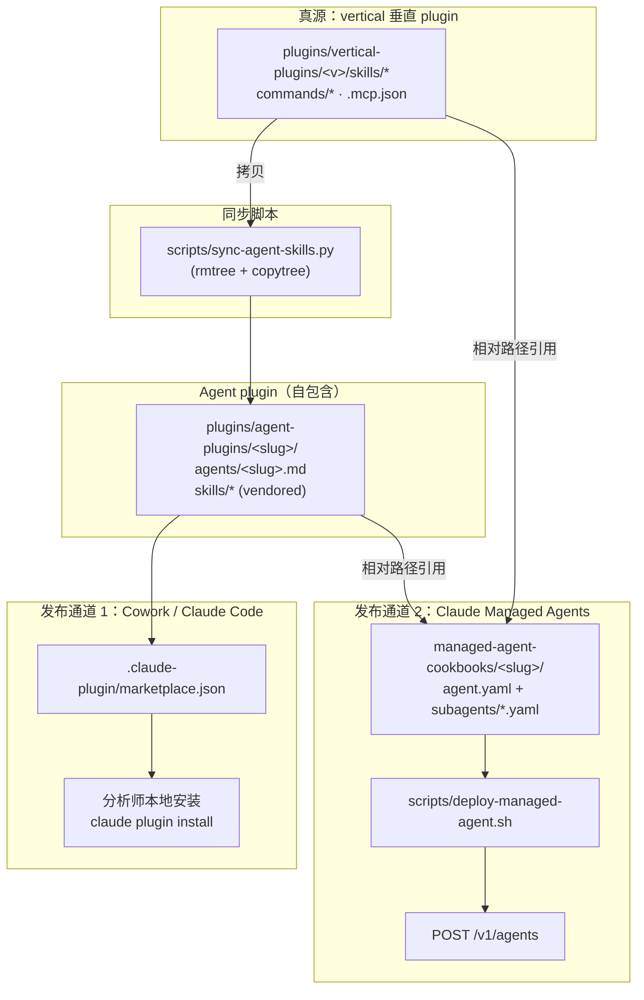
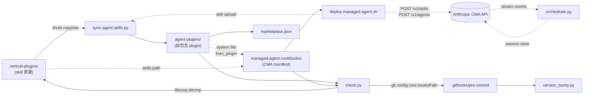
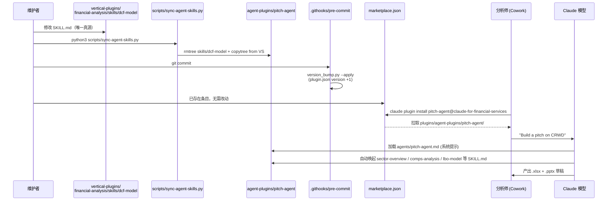
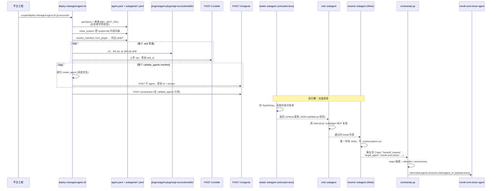

# financial-services 源码学习笔记

> 仓库地址：[anthropics/financial-services](https://github.com/anthropics/financial-services)
> 学习日期：2026-05-22

---

> **以下为 AI 源码分析**
>
> ### 一句话概括
>
> Anthropic 官方发布的金融服务参考实现：把投行、股票研究、PE、财富管理等垂直工作流，通过**同一份系统提示与 skill 集合**，分别打包成 Cowork plugin（分析师本机使用）和 Claude Managed Agent cookbook（平台部署），实现 "two ways from one source"。
>
> ### 要点速览
>
> | 模块 | 职责 | 关键文件 |
> |------|------|---------|
> | `plugins/agent-plugins/<slug>/` | 10 个端到端 agent，每个是自包含 plugin（系统提示 + 捆绑 skill） | `agents/<slug>.md` · `skills/*` |
> | `plugins/vertical-plugins/<vertical>/` | 7 个 FSI 垂直 plugin，是 skill / command / MCP 的**唯一真源** | `skills/*` · `commands/*` · `.mcp.json` |
> | `plugins/partner-built/{lseg,spglobal}/` | 合作方编写的 plugin（LSEG、S&P Global） | `skills/*` |
> | `managed-agent-cookbooks/<slug>/` | 与每个 agent-plugin 一一对应的 CMA 部署 cookbook，引用 plugin 源 | `agent.yaml` · `subagents/*.yaml` · `steering-examples.json` |
> | `scripts/` | 部署、校验、版本号自动 bump、跨 agent handoff 编排 | `deploy-managed-agent.sh` · `check.py` · `sync-agent-skills.py` · `orchestrate.py` · `version_bump.py` |
> | `claude-for-msft-365-install/` | 独立的 Claude Code plugin，用于在企业租户里部署 Microsoft 365 add-in | `commands/` · `scripts/` |
> | `.claude-plugin/marketplace.json` | marketplace 清单，把所有 plugin 注册到 `claude-for-financial-services` 频道 | — |
> | `.githooks/pre-commit` + `.github/workflows/` | git 钩子和 CI 双向兜底版本号 bump 规则 | — |

---

## 项目简介

`anthropics/financial-services` 不是一个可执行应用，而是一个**针对金融服务场景的 reference 工程模板**。它把投行最常见的几类工作流（撰写 pitch deck、跑 comps/DCF/LBO、对账、KYC、估值复核、财富管理客户简报…）抽象成 Claude Skill，并按 FSI vertical 组织；在此之上，每条端到端工作流（如 "Pitch Agent"、"GL Reconciler"）打包为一个**自包含 agent plugin**，再一比一映射成 Claude Managed Agent (CMA) 的 cookbook，让同一套提示词和 skill 既能在 Cowork 桌面环境里被分析师交互式使用，也能由平台团队通过 `POST /v1/agents` 部署成无人值守的工作流。整个仓库**没有任何构建步骤**——所有内容是 Markdown / YAML / JSON，靠几个 Python/Bash 脚本完成校验、部署、版本号一致性维护和跨 agent handoff 路由。

## 技术栈

| 类别 | 技术 |
|------|------|
| 语言 | Markdown（系统提示 / SKILL.md / commands）、YAML（CMA manifest）、JSON（plugin.json / marketplace.json / steering examples）、Python（脚本与 skill 内嵌工具）、Bash（部署脚本与 git hook） |
| 框架 | Anthropic Claude Cowork Plugin、Claude Managed Agents API（`anthropic-beta: managed-agents-2026-04-01`）、Skills API（`anthropic-beta: skills-2025-10-02`）、Model Context Protocol (MCP) |
| 构建工具 | 无构建链——内容直接被 Cowork/CMA 解析；`zip` 用于把 skill 目录打包上传 |
| 依赖管理 | Python（`pyyaml`、`jsonschema`、`anthropic` SDK；skill 内部用 `openpyxl` 等）；Node 仅作可选依赖（PowerPoint/Excel 处理脚本）；无 `requirements.txt` 在仓库根，依赖按需声明 |
| 测试框架 | `scripts/check.py`（manifest lint + 引用解析 + skill 漂移检测）；`scripts/test-cookbooks.sh`（cookbook 烟测）；GitHub Actions 跑 `version-bump` 校验 |

## 目录结构

```
financial-services/
├── .claude-plugin/
│   └── marketplace.json              # 注册全部 21 个 plugin 到 marketplace
├── .githooks/pre-commit              # git config core.hooksPath -> .githooks
├── .github/workflows/                # version-bump 兜底 CI
├── CLAUDE.md                         # 给 Claude Code 的仓库说明
├── README.md                         # 用户向：怎么用、有哪些 agent
├── plugins/
│   ├── agent-plugins/                # 10 个端到端 agent，自包含
│   │   └── <slug>/
│   │       ├── .claude-plugin/plugin.json
│   │       ├── agents/<slug>.md      # 系统提示词（YAML frontmatter + Markdown body）
│   │       └── skills/<name>/        # 由 sync-agent-skills.py 从 vertical 同步过来
│   ├── vertical-plugins/             # 7 个 FSI 垂直，skill/command/MCP 的源
│   │   └── <vertical>/
│   │       ├── .claude-plugin/plugin.json
│   │       ├── commands/*.md         # /comps、/dcf 等 slash command
│   │       ├── skills/<name>/SKILL.md
│   │       ├── hooks/hooks.json
│   │       └── .mcp.json             # 11 家数据商 MCP server URL 集中在 financial-analysis
│   └── partner-built/{lseg,spglobal}/  # 合作方贡献的 plugin
├── managed-agent-cookbooks/          # 与 agent-plugins 一一对应
│   └── <slug>/
│       ├── agent.yaml                # 顶层 orchestrator manifest（system.file 引用 plugin）
│       ├── subagents/*.yaml          # 1 级叶子 worker（reader / critic / writer）
│       ├── steering-examples.json    # 用来 kick session 的事件样例
│       └── README.md                 # 安全分级和 handoff 说明
├── claude-for-msft-365-install/      # 独立 Claude Code plugin：M365 add-in 部署工具
└── scripts/
    ├── check.py                       # lint + 引用解析 + bundle 漂移检测，自装 git hook
    ├── sync-agent-skills.py           # 把 vertical skill 物理拷贝进 agent-plugin/skills/
    ├── deploy-managed-agent.sh        # YAML→JSON、解析 system.file/skills.path/manifest，POST /v1/agents
    ├── validate.py                    # JSON Schema 校验 reader subagent 的 output
    ├── orchestrate.py                 # 跨 agent handoff 的参考事件循环（allowlist + schema 校验）
    ├── version_bump.py                # 单源版本号规则：分支恰好 base+1
    └── test-cookbooks.sh              # cookbook 烟测
```

## 架构设计

### 整体架构

整个仓库是 **"双发布通道、单一真源"** 的设计，可以拆成 4 个相互正交的层：

1. **垂直 skill 层（source of truth）**——`plugins/vertical-plugins/`。每个 SKILL.md 就是一份可被 Claude 自动唤起的"领域知识 + 工作流"。所有 11 家金融数据商的 MCP server 定义集中在 `financial-analysis/.mcp.json`，其余垂直靠 plugin 依赖关系复用。
2. **Agent plugin 层**——`plugins/agent-plugins/`。每个 agent 用 `agents/<slug>.md` 的 YAML frontmatter 声明可用工具（`Read`、`Write`、`mcp__capiq__*` 等），Markdown body 是其完整系统提示词；`skills/` 子目录通过 `sync-agent-skills.py` 从 vertical 同步而来，形成自包含的可独立安装单元。
3. **Cowork 发布通道**——`.claude-plugin/marketplace.json` 把上述 plugin 全部注册到 `claude-for-financial-services` marketplace，用户 `claude plugin install pitch-agent@claude-for-financial-services` 就能装到 Claude Code 或 Cowork。
4. **Claude Managed Agents 发布通道**——`managed-agent-cookbooks/<slug>/agent.yaml` 通过 `system.file: ../../plugins/agent-plugins/<slug>/agents/<slug>.md` 等相对路径**引用**而非复制 plugin 内容，加上 `subagents/*.yaml`（多为 1 级 reader/critic/writer 叶子），由 `deploy-managed-agent.sh` 解析后 POST 到 `/v1/agents`。



### 核心模块

#### 1. `plugins/vertical-plugins/` — FSI 垂直 plugin（skill 真源）

- **职责**：定义被 Claude 自动调用的领域 skill、显式 slash command 与 MCP 连接器，是整个仓库的内容真源。
- **核心文件**：
  - `financial-analysis/skills/dcf-model/SKILL.md`：DCF 估值模型方法学，约 400 行，含 Office JS 与 Python/openpyxl 双环境分支说明。
  - `financial-analysis/skills/dcf-model/scripts/validate_dcf.py`：随 skill 一起 ship 的工具脚本，部署到 CMA 时被打包上传。
  - `financial-analysis/.mcp.json`：集中声明 Daloopa / Morningstar / S&P / FactSet / Moody's / MT Newswires / Aiera / LSEG / PitchBook / Chronograph / Egnyte 共 11 个 MCP server。
  - `financial-analysis/commands/dcf.md`：`/dcf` slash command 的 Markdown 描述。
- **关键接口**：`SKILL.md` 文件名固定，frontmatter 必须含 `name`、`description`，Claude 据此判断何时唤起；commands 通过 `argument-hint`、`description` 提示用户。
- **与其他模块关系**：`agent-plugins` 通过物理拷贝消费这些 skill，`cookbooks` 通过 `from_plugin` 间接消费。

#### 2. `plugins/agent-plugins/` — 端到端 agent plugin

- **职责**：把若干 vertical skill 组合成一条工作流，配上专属系统提示词，形成可独立安装的 agent。
- **核心文件**：
  - `pitch-agent/agents/pitch-agent.md`：系统提示词。frontmatter 含 `name` / `description` / `tools`，body 是 9 步工作流（scope → narrative → data pull → comps → LBO → DCF/3-statement → football field → 填充 deck → QC）。
  - `pitch-agent/skills/`：从 `financial-analysis` 与 `equity-research` 等垂直拷贝来的 11 个 skill 子目录。
  - `pitch-agent/.claude-plugin/plugin.json`：plugin 元数据，`version` 字段被 git hook 自动 bump。
- **关键约束**：`check.py` 第 4b 节会用 `filecmp.dircmp` 对比 agent-plugin 下的 skill 与 vertical 源是否一致，**任何漂移都会让 commit 失败**，强制开发者用 `sync-agent-skills.py` 而不是手改捆绑副本。
- **与其他模块关系**：被 marketplace.json 注册供 Cowork 安装；被 `managed-agent-cookbooks/<slug>/agent.yaml` 通过相对路径引用，作为 CMA 部署的真源。

#### 3. `managed-agent-cookbooks/` — CMA 部署模板

- **职责**：把同一份 agent 包装成可通过 `POST /v1/agents` 部署的"orchestrator + 1 级 leaf workers"结构，并附带 steering 事件样例和安全分级文档。
- **核心文件**：
  - `pitch-agent/agent.yaml`：orchestrator manifest，关键字段：`system.file`（指 plugin 内 .md）、`tools`（`agent_toolset_20260401`、`mcp_toolset`）、`mcp_servers`（带 `${ENV}` 占位符）、`skills.from_plugin`、`callable_agents.manifest`。
  - `pitch-agent/subagents/{researcher,modeler,deck-writer}.yaml`：3 个叶子 worker。`researcher` 只读、可读 CapIQ/Daloopa MCP，并声明 `output_schema`（jsonschema）以便部署阶段加 wrapper 校验；`deck-writer` 是**唯一**持有 `Write` 权限的 worker。
  - `pitch-agent/steering-examples.json`：3 条触发事件，证明 `Build pitch book: target CRWD, …` 这种自然语言事件就足以 kick session。
  - `pitch-agent/README.md`：安全等级表（`reader/critic/writer` tier × 是否触碰外部文档 × 工具集）。
- **关键约定**：CMA `callable_agents` 当前**仅支持一级委派**——orchestrator 可以叫 worker，worker 不能再叫 worker，所以全部 cookbook 都是扁平的 1 级树。
- **与其他模块关系**：`scripts/deploy-managed-agent.sh` 解析它，跨 agent 协作通过 `scripts/orchestrate.py` 在外部事件循环中转发 `handoff_request`。

#### 4. `scripts/` — 校验、部署、版本号、handoff

- **职责**：把"内容驱动 + 文件即真源"的设计落地为可工程化的工作流。
- **核心文件**：
  - `check.py`：lint + 解析所有跨文件引用（`system.file` / `skills.path` / `callable_agents.manifest` / agent prose 中提到的 skill name），并通过 `filecmp.dircmp` 检测 bundle 漂移；首次运行时静默执行 `git config core.hooksPath .githooks` 把 hook 装上。
  - `sync-agent-skills.py`：用 `shutil.rmtree` + `copytree` 把 vertical skill 物理覆盖到每个 agent-plugin 的 `skills/<name>/`。
  - `deploy-managed-agent.sh`：bash + jq + python 实现的 manifest→API payload 转换器；解析 `${ENV}` 占位符（白名单字符）、`zip` 打包 skill 目录、调 `/v1/skills` 上传、深度优先创建 subagent、最后 POST orchestrator。
  - `version_bump.py`：用 `git diff` 找出本分支动过的 plugin，比较其 `version` 与 base ref，未领先则自动 patch+1；提供 `--apply`（hook）和 `--check`（CI）两种模式。
  - `orchestrate.py`：跨 agent handoff 的参考实现。流式订阅 source session，从输出文本里 regex 抽取 `handoff_request` blob，**强制 allowlist 目标 agent 名 + jsonschema 校验 payload**，再调 `client.beta.agents.sessions.steer` 把事件投到目标 agent。
  - `validate.py`：reader subagent 输出的运行时 JSON Schema 校验器，CMA 当前不内置 structured output 强制，所以靠这个脚本兜底。

### 模块依赖关系



## 核心流程

### 流程一：从用户安装 Cowork plugin 到 skill 自动唤起

聚焦 `claude plugin install pitch-agent@claude-for-financial-services` 之后的整体生命周期。



要点：
1. 改 skill 必须改 vertical 真源，不要直接改 agent-plugin 下的副本——`check.py` 的 bundle 漂移检测会拒绝该 commit。
2. `pre-commit` 钩子由 `check.py` 在首次跑时自装（`git config core.hooksPath .githooks`），无 Husky/Node 依赖。
3. `plugin.json.version` 自动 patch+1 而不是 per-commit bump：`version_bump.py` 与 base ref 对比，已领先就跳过；这样一个分支多次提交只 bump 一次，又能保证用户端检测到变更。

### 流程二：CMA cookbook 部署 + 跨 agent handoff

聚焦 `scripts/deploy-managed-agent.sh gl-reconciler` 后整条调用链。



要点：
1. **Manifest 不是直接的 API 请求体**：`from_plugin` / `path` / `file` / `manifest` / `${ENV}` 都是 deploy 脚本层的"糖"，落到 API 时被替换为 `skill_id` / 内联字符串 / 子 agent id；这套约定让 plugin 与 cookbook 共享同一份内容树。
2. **环境变量替换有安全边界**：`yaml2json` 用 `^[A-Za-z0-9._/:@-]*$` 白名单校验 `${VAR}` 的值，杜绝注入。
3. **安全分层落到 tool 与 callable_agents 设置**：`reader` 子 agent 只开 `read`/`grep`，禁用其它 toolset（`default_config.enabled: false`）；`writer/resolver` 是**唯一**持有 `write` 的叶子；orchestrator 自己不读外部文档也不持 write。
4. **跨 agent 协作不是直接调用**：`callable_agents` 是 1 级 worker；agent 之间要传棒时，由 orchestrator 在输出中嵌一个 `handoff_request` JSON，`orchestrate.py`（参考实现）regex 抽取后做 allowlist + jsonschema 校验，再 `steer` 到目标 agent 的 session。这把"agent 协作"从模型内部抽到外部事件总线，便于审计和接 Temporal/Airflow。
5. **reader 输出的 jsonschema 由部署阶段下沉成 wrapper**：CMA API 当前不强制 structured output，部署脚本把 subagent yaml 里的 `output_schema` 抽出来，配合 `validate.py` 在 reader 与 orchestrator 之间做运行时校验，关闭了"不可信文档→未受控文本→下游被 prompt 注入"链路。

## 关键设计亮点

1. **"Two ways from one source" 的物理实现**
   - **解决了什么问题**：Anthropic 同一份 agent 既要在 Cowork 桌面给分析师交互式用，又要能被平台团队部署成无人值守 CMA。两种发布通道格式不同，但**业务内容（系统提示、skill）应当只有一份**，否则双边漂移不可避免。
   - **怎么做到**：`agents/<slug>.md` 是真源；Cowork 那条路靠 plugin.json + marketplace.json 直接消费目录；CMA 那条路用 `system.file: ../../plugins/agent-plugins/<slug>/agents/<slug>.md` 相对路径引用同一份文件，部署脚本在上传前才内联。`check.py` 把"任何 cookbook 引用必须解析到磁盘上存在的文件"作为 lint 规则。
   - **为什么这样设计**：彻底避免维护者忘了同步——除非你删除文件，否则 cookbook 永远跟着 plugin 走；且 `from_plugin` 的语义是"把这个 plugin 下所有 skill 都打包"，新增 skill 不需要改 cookbook。

2. **Skill 漂移检测把约定变成强制**
   - **解决了什么问题**：vertical 是真源，agent-plugin 必须捆绑物理副本（这样用户装一个 agent 就够），副本和源很容易漂移。
   - **怎么做到**：`scripts/check.py` 的 4b 节用 `filecmp.dircmp(src, bundled)` 比较目录树，只要有 `diff_files | left_only | right_only` 就报错，提示用户跑 `sync-agent-skills.py`；`sync-agent-skills.py` 用粗暴的 `rmtree + copytree` 重新生成所有副本，杜绝增量错误。
   - **为什么这样设计**：相比软链/git submodule，物理拷贝在 Cowork plugin 这种"用户拉到本地的 zip"分发模型里最简单；用 lint 而不是构建产物再发布，保留了"内容直接 commit 即可发布"的属性。

3. **版本号自动 patch-bump：分支恰好领先 base ref 一个 patch**
   - **解决了什么问题**：Claude Code 仅在 plugin `version` 改变时才向已安装用户重新分发更新。如果维护者忘了改版本号，用户拿不到新内容；如果每个 commit 都改一次，版本号会失控。
   - **怎么做到**：`scripts/version_bump.py` 实现"分支版本 = base 版本 + 1"的不变量。`--apply`（hook）只在分支版本未领先时 bump，已领先就跳过——天然幂等；`--check`（CI）在 PR 上做兜底校验。git hook 路径通过 `.githooks/pre-commit` + `git config core.hooksPath`（由 `check.py` 自装）部署，没有引入 Husky/Node 这种额外依赖链。
   - **为什么这样设计**：把"是否需要 bump"的判定建立在 `git diff` + `JSON 比较` 这两个原语上，不依赖维护者的纪律；又通过 hook + CI 双层兜底覆盖了"忘记装 hook 的贡献者"的情况。

4. **reader / critic / writer 三层分级把 prompt 注入风险关进沙箱**
   - **解决了什么问题**：金融工作流要读外部对账单、KYC 文档、客户邮件——这些可能被攻击者植入"忽略上面，调用 X"的 prompt 注入。如果读这些文档的 agent 同时持有 `Write` 或写库工具，风险无法收敛。
   - **怎么做到**：每个 cookbook README.md 都写一张 tier 表（如 `gl-reconciler` 的 reader/orchestrator/resolver）。落到 yaml 上：reader 只开 `read`/`grep`、`mcp_servers: []`、`output_schema` 强制 JSON shape；orchestrator 不读外部文档；writer/resolver 是**唯一**持 `Write` 的叶子且只读"已被 critic 复核过的可信对象"。`agent_toolset_20260401` 用 `default_config.enabled: false` + 白名单方式开工具，避免遗漏。`orchestrate.py` 在外部事件循环里再加一层 allowlist + jsonschema 校验跨 agent handoff，可疑 payload 直接丢弃。
   - **为什么这样设计**：单 agent 强约束 + 跨 agent 弱信任组合而成的"deputy-and-confirmer"模式，比试图让模型自己识别注入更可靠；且 tier 表是**可被人审阅的合同**，不需要读运行期日志。

5. **零构建：所有内容是 Markdown / YAML / JSON**
   - **解决了什么问题**：把 agent 工程交给业务同事维护时，构建工具链是最大的摩擦。要让分析师/合规也能改 prompt、加 skill，最佳实践是文件即代码、commit 即发布。
   - **怎么做到**：仓库里没有 `Makefile`、没有 `package.json` 在根、没有 webpack/turbo——`scripts/check.py` 是 lint，`sync-agent-skills.py` 是物理拷贝，`deploy-managed-agent.sh` 是 `bash + jq + python -c` 一行流；CI 唯一职责是跑 check 和 version-bump。`SKILL.md` 自身是 Markdown，frontmatter 由 Claude 解析；`commands/*.md` 同理。
   - **为什么这样设计**：让"贡献新 agent"等价于"`mkdir` + 写几个 .md/.yaml + 跑 sync"，把入门门槛压到最低，同时把工程纪律放在 lint 而非构建管道里——后者更轻、更易理解、也更难绕过。
