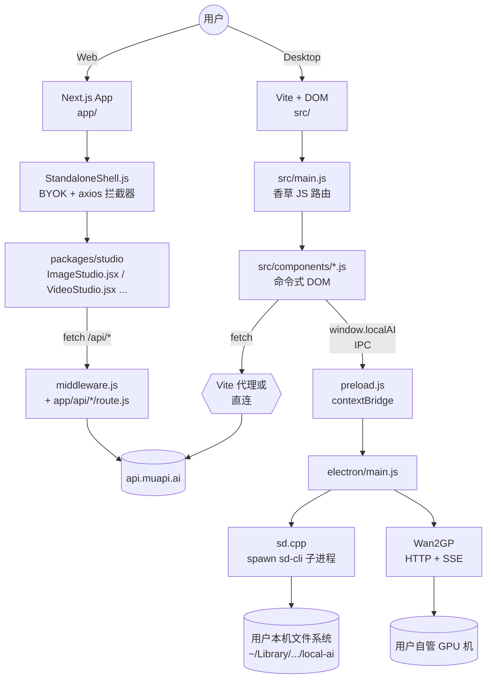
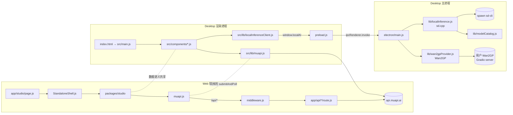
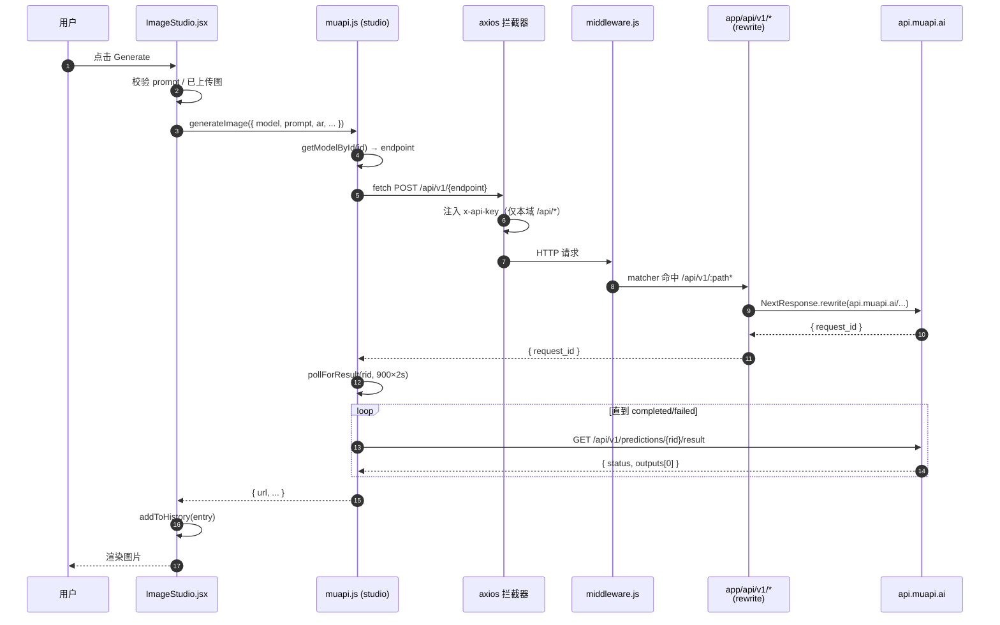
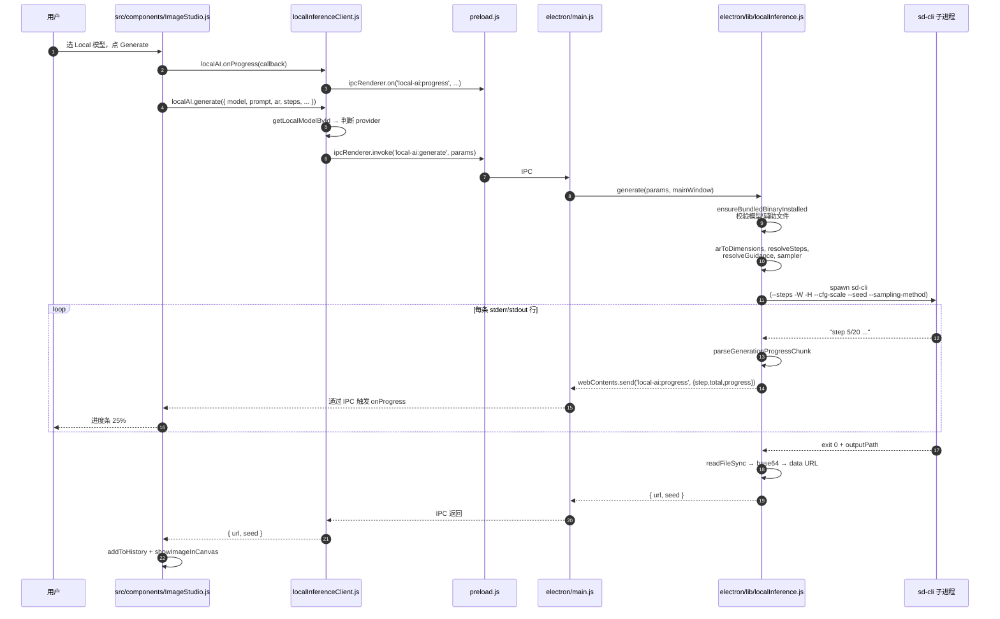

# Open-Generative-AI 源码学习笔记

> 仓库地址：[Anil-matcha/Open-Generative-AI](https://github.com/Anil-matcha/Open-Generative-AI)
> 学习日期：2026-05-22

---

> **以下为 AI 源码分析**
>
> ### 一句话概括
>
> 一个 BYOK（自带 API key）的 AI 图片/视频/口型同步生成 studio，**同一份 React UI 既以 Next.js 形式跑在 Web，又以 Vite + Electron 形式跑在桌面**；桌面端额外通过 IPC 接入两套本地推理引擎（bundled `sd.cpp` + 远端 Wan2GP Gradio 服务器），200+ 模型的目录是写死的元数据驱动，运行时所有推理都收敛到 muapi.ai 的「提交 + 轮询」契约。
>
> ### 要点速览
>
> | 维度 | 关键事实 | 关键文件 |
> |------|---------|----------|
> | 双前端 | Web = Next.js App Router；Desktop = Vite 构建的香草 JS（DOM API），由 Electron 加载 | `app/`、`src/main.js` |
> | 共享层 | `packages/studio` 仅给 Next.js 复用；Vite 端走自己一套 `src/components/*.js` | `packages/studio/src/index.js` |
> | 模型目录 | 200+ 远端模型由 `models.js`（自动生成，8000+ 行）声明 endpoint 与 input schema | `packages/studio/src/models.js`、`src/lib/models.js` |
> | API 契约 | POST endpoint → `request_id` → 轮询 `/predictions/{id}/result`，所有形态统一 | `packages/studio/src/muapi.js`、`src/lib/muapi.js` |
> | 代理层 | Web 端用 Next.js middleware + route handler 把 `/api/*` 重写到 `api.muapi.ai`，并桥接 S3 上传绕开 CORS | `middleware.js`、`app/api/upload-binary/route.js` |
> | 本地引擎 | 桌面端 Electron 主进程通过 IPC 暴露两套引擎：sd.cpp 本机进程 + Wan2GP HTTP 远端 | `electron/lib/localInference.js`、`electron/lib/wan2gpProvider.js` |
> | 二进制管理 | 自动从 GitHub Releases 抓取与平台匹配的 sd.cpp zip，断点续传 + 重定向 + 失败重试 | `electron/lib/localInference.js` 第 63-138 行 |
> | 鉴权 | API key 永不上送服务器：浏览器存 `localStorage`，axios 拦截器仅注入到本域 `/api/*` | `components/StandaloneShell.js` 第 158-179 行 |

---

## 项目简介

Open Generative AI 是 Muapi.ai 官方的开源「客户端壳」：用户用自己的 Muapi access key 在 Web 或桌面端访问 Flux、Nano Banana、Kling、Sora、Veo、Seedance 等 200+ 图像/视频/口型同步模型。仓库不实现任何模型推理算法，本质是一个**模型路由 UI + API 适配层**：

- 远端：把用户的 prompt/参数封装成 muapi 的两阶段任务（提交 → 轮询），通过 Web 代理或直连完成调用；
- 本地（仅桌面）：把同一份 UI 的「Generate」按钮分流到本机进程运行的 `sd.cpp`，或者用户自己跑的 Wan2GP Gradio 服务器，让 Mac 用户也能在没有 NVIDIA 卡时使用本地图片模型。

它解决的是「AI 多模态平台被绑定订阅 + 内容审查 + 单模型独占」的问题，提供一个可自托管、无过滤、可扩展的通用前端壳。

## 技术栈

| 类别 | 技术 |
|------|------|
| 语言 | JavaScript（无 TypeScript），少量 JSX |
| 框架 | **Web**：Next.js 15（App Router）+ React 19；**Desktop**：Electron 33 + Vite 5（vanilla JS DOM 组件） |
| 构建工具 | Next.js 自带 / Vite / electron-builder（DMG、NSIS、AppImage、deb） |
| 依赖管理 | npm workspaces（4 个 workspace：studio、Vibe-Workflow、Open-Poe-AI agents、Open-AI-Design-Agent） |
| 测试框架 | 仅 Node `assert` 风格的本地推理单元测试（`tests/localInference*.test.js`），无 jest/vitest 配置 |
| 样式 | Tailwind CSS v3 + 全局 `globals.css`，Inter 字体 |
| HTTP 客户端 | 浏览器侧 `fetch` + axios（仅作为 BYOK 拦截器载体）；Electron 主进程用 Node 内置 `http`/`https`（避免额外依赖） |
| 本地推理 | sd.cpp（leejet/stable-diffusion.cpp 编译产物）+ Wan2GP（Gradio v4 SSE 协议） |

## 目录结构

```
Open-Generative-AI/
├── app/                          # Next.js App Router（Web 端入口）
│   ├── layout.js                 # 根 layout（Inter 字体 + Tailwind）
│   ├── page.js                   # 直接 redirect → /studio
│   ├── studio/[[...slug]]/       # catch-all：所有 tab 都进 StandaloneShell
│   ├── agents/、workflow/         # 子页面（agents、workflow 详情）
│   └── api/                      # Route Handlers（关键：muapi 反向代理、S3 上传桥）
│       ├── app/[[...path]]/      # 通用 muapi /app/* 转发，鉴权来自 cookie 或 header
│       └── upload-binary/        # 浏览器 → S3 直传的服务端中继，绕开 CORS
├── components/                   # Web 端壳层（仅两文件）
│   ├── StandaloneShell.js        # 顶部导航 + tab 切换 + BYOK + axios 拦截器
│   └── ApiKeyModal.js            # 首次输入 key 弹窗
├── packages/
│   ├── studio/                   # ★ Web 端复用的 React 组件库
│   │   └── src/
│   │       ├── index.js          # 导出所有 *Studio 组件 + muapi 客户端
│   │       ├── models.js         # 200+ 模型元数据（自 models_dump.json 自动生成）
│   │       ├── muapi.js          # submitAndPoll、generateImage、processLipSync 等
│   │       └── components/*.jsx  # ImageStudio / VideoStudio / LipSync ... 11 个 studio
│   ├── Vibe-Workflow/            # git submodule：节点工作流编辑器
│   ├── Open-Poe-AI/              # git submodule：agents 实现
│   └── Open-AI-Design-Agent/     # git submodule：design agent
├── electron/                     # Electron 主进程（仅桌面）
│   ├── main.js                   # BrowserWindow + 注册两套 IPC handler
│   ├── preload.js                # contextBridge 暴露 window.localAI
│   └── lib/
│       ├── localInference.js     # sd.cpp 二进制下载、模型下载、spawn 推理、解析 stderr 进度
│       ├── wan2gpProvider.js     # Wan2GP HTTP 客户端（Gradio v4 + SSE 流式）
│       ├── modelCatalog.js       # 6 个本地 sd.cpp 模型条目
│       ├── localInferenceAssets.js # GitHub release 资产匹配（按平台/架构/AVX 选 zip）
│       ├── localInferencePaths.js  # 解析 OPEN_GENERATIVE_AI_LOCAL_AI_DIR 等环境变量
│       └── localInferenceRuntime.js # 解析 sd-cli stdout 的 step N/M 进度
├── src/                          # ★ 桌面端 Vite 入口（与 packages/studio 是另一套实现）
│   ├── main.js                   # 香草 JS 路由 + DOM 装载
│   ├── components/*.js           # 与 packages/studio/components 同名但独立的 DOM 组件
│   └── lib/
│       ├── localInferenceClient.js # 浏览器侧封装 window.localAI IPC
│       ├── localModels.js          # 桌面端额外的本地模型信息
│       ├── pendingJobs.js          # localStorage 持久化未完成任务，刷新后续轮询
│       └── muapi.js / models.js    # 与 packages/studio/src 内容近似但相互独立
├── build/                        # 二进制资产（installer 脚本、AppArmor profile）
├── docker-compose.yml + Dockerfile # 仅构建 Next.js 容器
├── middleware.js                 # Edge middleware：把 /api/v1/* 透明转发到 api.muapi.ai
├── next.config.mjs               # transpilePackages: ['studio']
├── vite.config.mjs               # 本地 dev server 把 /api 代理到 api.muapi.ai
└── models_dump.json              # 模型 schema 真相源（生成 packages/studio/src/models.js）
```

> 关键观察：**`packages/studio` 与 `src/` 是两套独立组件**，命名几乎一致但实现不同——前者是 React/JSX 给 Next.js 用，后者是命令式 DOM 给 Vite/Electron 渲染进程用。它们共享的是 `models.js` 的语义（数据结构相同）以及 muapi 调用模式，但代码不复用。`README.md` 所写的「`packages/studio` 同时被两个端复用」与代码实际不符——桌面端走的是 `src/`。

## 架构设计

### 整体架构

整个仓库可以被理解为一个「分流到三种执行后端」的前端：

- **远端模型（默认路径）**——所有 200+ 远端模型走 `muapi.ai` 的统一 HTTP 契约：`POST /api/v1/{endpoint}` 拿到 `request_id`，再 `GET /api/v1/predictions/{id}/result` 轮询直到 `completed`。Web 端做了 Next.js 反向代理来规避 CORS，桌面端直接走 `https://api.muapi.ai`。
- **sd.cpp 本地引擎（Electron 专属）**——Electron 主进程下载并 `spawn` `sd-cli` 进程，stdout 解析 `step N/M` 反馈进度，最后把 PNG 转 base64 data URL 回传。
- **Wan2GP 远端引擎（Electron 专属）**——用户自己跑的 Gradio 服务器，主进程通过 Gradio v4 协议（`POST /gradio_api/call/<fn>` → SSE 流）转发请求，并在第一次握手时用 `/info` 端点动态修复 `api_name` 漂移。



### 核心模块

#### 1. UI 壳层（Web）：`components/StandaloneShell.js`

- **职责**：提供 9 个 studio tab 的导航；管理 Muapi API key 的 localStorage 生命周期；通过全局 axios 请求拦截器把 `x-api-key` **只**注入到本域 `/api/*`，避免 key 被泄漏到 S3 等外部域。
- **关键实现**：第 158-179 行的拦截器是核心安全设计——`isRelative` + `isInternalProxy` 判断后才注入；第 132-140 行从 localStorage 拉取 key 后**还会同步写一份 cookie** `muapi_key`，目的是让 SSR/Edge middleware 也能识别用户身份。
- **依赖**：动态 `import('studio')` 加载 `DesignAgentStudio` 以避免 SSR；`getUserBalance` 每 30 秒轮询余额。

#### 2. Studio 组件库：`packages/studio/`

- **职责**：以 React JSX 实现 11 个 studio 视图。每个视图封装一种「模式选择 + 参数面板 + 上传 + 历史记录」的交互范式。
- **关键文件**：
  - `models.js`（8087 行）：所有远端模型的元数据真相源，按 `t2iModels`/`t2vModels`/`i2iModels`/`i2vModels`/`v2vModels`/`lipsyncModels` 6 个数组分类，并导出按 ID 查找的辅助函数 `getModelById` 等。**注释写明「自 `models_dump.json` 自动生成」**——意味着模型升级是数据驱动的，添加新模型只要更新 dump 文件再重新生成，无需改 UI 代码。
  - `muapi.js`（656 行）：HTTP 客户端，所有生成函数都收敛到内部 `submitAndPoll(endpoint, payload, key)`。轮询 `pollForResult` 默认最多 900 次 × 2 秒（共 30 分钟），通过监听 401/403 派发 `muapi:auth-required` 自定义事件，让 UI 层弹重新输入 key 的 modal。
  - `components/ImageStudio.jsx`（1471 行）：图像视图。`UploadButton` 内嵌一个带历史记录的 picker，最多支持 14 张参考图（Nano Banana 2 Edit），按选择顺序赋予 order badges。
- **接口**：`index.js` 导出全部组件 + 全部 muapi 函数；`StandaloneShell` 用 named import 消费。

#### 3. API 代理层（Web）：`middleware.js` + `app/api/*/route.js`

- **职责**：把浏览器以为发往本域的 `/api/v1/*`、`/api/app/*`、`/api/workflow/*` 透明转发到 `api.muapi.ai`，避免暴露 Muapi 域名给 CORS 校验。
- **两层实现**：
  - `middleware.js` 用 `NextResponse.rewrite` 处理通用 `/api/v1/*`（除被 route handler 显式接管的 3 条路径）。
  - `app/api/app/[[...path]]/route.js` 是有逻辑的代理：除了透传，还会在 `get_file_upload_url` 响应里把 S3 直传 URL 重写为本域 `/api/upload-binary` 并把原始 S3 URL 塞进 `fields['x-proxy-target-url']`，这样浏览器后续上传不会触碰 S3 跨域。
  - `app/api/upload-binary/route.js` 是配套的上传中继：从 formData 取出 `x-proxy-target-url` 字段，服务端发起 `POST` 到真正的 S3 签名 URL。
- **鉴权**：`getApiKey(request)` 优先 header，其次 `muapi_key` cookie——和 `StandaloneShell` 写 cookie 的行为对应。
- **`cleanHeaders` 故意 `delete cookie`**：防止把浏览器的 cookie 一股脑转给 muapi 引发权限混乱。

#### 4. Electron 主进程：`electron/main.js` + `electron/lib/*`

- **职责**：在桌面端开窗加载本地编译的 Vite 产物（`dist/index.html`），并注册两组 IPC handler（sd.cpp、Wan2GP）。
- **核心子模块**：
  - `localInference.js`（562 行）：完整的 sd.cpp 引擎管理。
    - 二进制管理：`getBinaryStatus` / `downloadBinary`，按平台拼接 GitHub Releases URL，自定义 `downloadFile` 支持 HTTP redirect、Range 续传（断点续）、5 次重试、60 秒超时。
    - 模型管理：`listModels` / `downloadModel` / `downloadAuxiliary` / `deleteModel`，把目录里 6 个 sd.cpp 模型 + Z-Image 的 2 个辅助文件（Qwen3-4B 文本编码器 + FLUX VAE）的状态以 `state` 字段返回。
    - 推理：`generate` 把 `prompt`、`negative_prompt`、aspect ratio、steps、guidance、sampler 等参数 spawn 给 `sd-cli`，并把 stdout 通过 `parseGenerationProgressChunk` 解析为 `{step, totalSteps, progress}` 事件流回前端。
  - `wan2gpProvider.js`（466 行）：Wan2GP HTTP 客户端。
    - `WAN2GP_CATALOG` 写死 6 个模型（Flux/Qwen/Wan22 T2V&I2V/Hunyuan/LTX）每个有 `fn`、`fnAliases`、`family` 三层标识。
    - **核心稳健性设计**：`fetchApiNames` + `resolveFnNames`——Wan2GP 在不同版本里会重命名 Gradio `api_name`，所以 probe 时主动拉 `/info` 列出实际注册的 endpoint，按精确→别名→fuzzy 三级 fallback 映射回目录条目。
    - `gradioCall`：先 `POST /gradio_api/call/<fn>` 拿 `event_id`，再 `GET /gradio_api/call/<fn>/<event_id>` 读 SSE 流，按 `event:` 行分流 `generating`/`complete`/`error` 三种事件。
  - `localInferenceAssets.js`：负责按 `(platform, arch)` 在 `leejet/stable-diffusion.cpp` releases 的资产名里挑出最优 zip（Mac 仅 arm64；Windows 按 `avx2 > avx > avx512 > noavx > cuda12` 顺序；Linux 优先纯 CPU/Vulkan，最后 ROCm）。
  - `localInferenceRuntime.js`：纯函数模块，把 `sd-cli` stderr 里 `step 3/20` 这种字符串解析为单调递增的进度事件，专门设计为可单元测试（`tests/localInferenceProgress.test.js`）。

#### 5. 桌面端渲染层：`src/`

- **职责**：Electron 渲染进程实际执行的代码。**不是 React，而是命令式 DOM**——每个组件是个返回 `HTMLElement` 的工厂函数。
- **关键文件**：
  - `lib/localInferenceClient.js`：浏览器侧的 `window.localAI` 包装，提供 `localAI.generate({...})` 这种 Promise API。`generate` 会按目标模型 `provider` 字段分流到 sd.cpp 或 Wan2GP，**两个 cancelGeneration 都调一次**——只有正在跑的那个会响应。
  - `lib/pendingJobs.js`：用 `localStorage` 持久化「已经 POST 但还没轮询出结果」的任务的 `request_id`，刷新页面或重启 app 后用 `getPendingJobs(studioType)` 恢复并继续轮询。这是和 Web 端最大的差异——Web 端假设单次会话，桌面端假设长时间运行。
  - `components/ImageStudio.js`：在 `handleGenerate` 里**先 if 分支判断 `useLocalModel`**，true 就走 `localAI.generate`、订阅 `onProgress` 更新进度条；false 才走 `muapi.generateImage` / `generateI2I`，把 `onRequestId` 回调写进 pendingJob。

### 模块依赖关系



## 核心流程

### 流程一：远端图像生成（点击 Generate → 拿到图）

`packages/studio/src/components/ImageStudio.jsx::handleGenerate` 是 Web 端最具代表性的流程。



关键细节：
- **第 5 步** `getModelById` 的 fallback 写法 `modelInfo?.endpoint || params.model`——意味着 model id 默认就是 endpoint，只有特殊映射才需要在 `models.js` 里显式写 `endpoint: 'flux-dev-image'`。
- **第 11 步** middleware **没用 fetch 重新发**而是用 `NextResponse.rewrite`，这意味着 Edge runtime 直接代理流，而不是 Node.js 处理后转发——更省 CPU，但代价是无法在请求里塞 cookie 鉴权（所以 Open Generative AI 用了带逻辑的 `app/api/app/[[...path]]/route.js` 作为补丁）。
- **轮询次数 900**：每 2 秒一次允许长达 30 分钟，匹配视频生成的真实耗时；图像生成用了更短的 60 次，就是一份 muapi 函数文件里给 image vs video 各设了一个上限。

### 流程二：桌面端本地图像生成（sd.cpp）

`src/components/ImageStudio.js` 在 `useLocalModel === true` 时切到本地路径：



关键设计：
- **不返回文件路径，返回 data URL**——这样渲染进程的 `` 不需要 `webSecurity: false` 也能直接显示（虽然项目实际上设置了 `webSecurity: false`，但这种返回方式让任何渲染容器都能即插即用）。
- **进度从 stderr 解析**：`sd-cli` 的进度日志带 ANSI 颜色码，`stripAnsiSequences` 先剥离再 grep `step (\d+)/(\d+)`。`parseGenerationProgressChunk` 维护 `tail`（缓存上次未消费的尾巴）+ `lastStep` 单调递增校验，避免重复事件——这部分被刻意拆为纯函数模块以便单测。
- **macOS 特殊处理**：第 305-308 行下载完二进制后用 `xattr -cr` 清掉 Gatekeeper 的 quarantine 属性，否则用户首次 Generate 会被 Gatekeeper 拦下。Mac dylib 通过 spawn 时设 `DYLD_LIBRARY_PATH=BIN_DIR` 来让 `sd-cli` 找到 `libstable-diffusion.dylib`。
- **`sd-cli` 模型加载方式按类型分流**：z-image / flux 必须用 `--diffusion-model`（注释写明：`-m` 会触发 SD 版本检测，对这些 GGUF 失败），SDXL 用 `--sd-version sdxl`，SD2 用 `--sd-version sd2`，SD1.5 不加 flag。

## 关键设计亮点

### 1. 模型目录数据驱动 + endpoint 一致化

仓库里没有任何 if/switch 处理「不同模型不同字段」——所有差异收敛到 `models.js` 里每个 model 对象的 `endpoint`、`imageField`、`hasPrompt`、`inputs.name.default` 等元数据。`muapi.js::generateI2I` 第 87-92 行典型地体现了这一思路：

```js
const imageField = modelInfo?.imageField || 'image_url';
if (imagesList) {
    if (imageField === 'images_list') payload.images_list = imagesList;
    else payload[imageField] = imagesList[0];
}
```

- **解决了什么问题**：200+ 模型每个都有自己的 schema（Flux Kontext 用 `image_url`、Nano Banana 2 Edit 用 `images_list`、Vidu Q2 用 `reference_images_list`），如果在 muapi 客户端写 if-else 会变成不可维护的「卷积函数」。
- **怎么实现**：`models_dump.json` 是真相源，`models.js` 是它的派生品（注释「Auto-generated」）。新模型只需要在 dump 文件加一项，重新生成，UI 代码无需改动。
- **为什么这样设计**：Muapi 后端在快速迭代加模型，Open Generative AI 不想跟着每个新模型 PR 一次。把元数据外部化让 UI 代码冻结，接近一个解释器架构。

### 2. axios 拦截器只注入本域 key —— BYOK 安全的关键

`StandaloneShell.js` 第 158-179 行（**别忽略这段代码**）：

```js
useEffect(() => {
    delete axios.defaults.headers.common['x-api-key'];
    if (!apiKey) return;
    const interceptorId = axios.interceptors.request.use((config) => {
      const isRelative = config.url.startsWith('/') || !config.url.startsWith('http');
      const isInternalProxy = config.url.includes('/api/app') || ...
      if (isRelative || isInternalProxy) {
        config.headers['x-api-key'] = apiKey;
      }
      return config;
    });
    return () => axios.interceptors.request.eject(interceptorId);
  }, [apiKey]);
```

- **解决了什么问题**：BYOK 模式下，如果一不小心把 `x-api-key` 注入到所有 axios 请求（包括 S3 直传 URL、CDN 视频下载），用户的 Muapi key 就会被泄漏到第三方域。
- **关键技巧**：使用「URL 白名单」拦截器而不是 `axios.defaults`，并在 `useEffect` 第 162 行**先显式 `delete` 全局默认头**——防御之前可能存在的全局污染。
- **细节**：第 138 行还把同一个 key 写到了 `muapi_key` cookie——这给 SSR/Edge 路径鉴权提供了通道（middleware 不能读 localStorage）。两份 key 同步，但 cookie 的 `SameSite=Lax` 让它不会泄漏到第三方域。

### 3. 用 Gradio `/info` 在运行时修复 api_name 漂移

`wan2gpProvider.js` 第 158-215 行的 `fetchApiNames` + `resolveFnNames`。

- **解决了什么问题**：Wan2GP 是个上游开源项目，每次 release 都可能改 Gradio handler 的 `api_name`（比如 `flux` → `flux_dev` → `flux_1_dev`），如果客户端写死会导致用户升级 Wan2GP 后所有模型都「不可用」。
- **怎么实现**：每个目录条目带 3 层标识：`fn`（首选名）、`fnAliases`（已知历史名）、`family`（fuzzy 关键字 + 类型 hint）。`probe` 时拉 `/info` 拿到服务器实际注册的 api_name 列表，按这三层精度匹配，结果缓存在 `fnResolutionCache` 供 `listModels` 和 `generate` 共用。
- **为什么这样设计**：Open Generative AI 不能控制 Wan2GP 的发版节奏，与其每次写死失败再发版本，不如把「自适应」变成系统能力。这种思路在面对快速演化的开源生态时特别有用。

### 4. Next.js middleware + Route Handler 的混合代理策略

仓库里有两套并存的 muapi 反向代理：

- `middleware.js` 用 `NextResponse.rewrite` 处理「无脑透传」的 `/api/v1/*`——Edge runtime，性能最好。
- `app/api/app/[[...path]]/route.js` 用传统 Node 处理「需要逻辑」的请求——例如 `get_file_upload_url` 要把 S3 URL 重写成本域中继。

这个分层是 **「快路径 vs. 慢路径」** 的经典权衡：80% 流量走 Edge（毫秒级），20% 需要修改 body 的请求走 Node（多几十毫秒但能改字段）。`middleware.js::matcher` 显式声明哪些路径走它管辖，剩下的 fallthrough 到 route handler。

### 5. sd.cpp 二进制下载的「断点续传 + redirect + 重试」一体化

`localInference.js::downloadFile` 第 63-138 行重新实现了一个 mini-curl：

- 跟踪 `tmp + '.part'` 文件大小作为断点续传起点；
- 自动跟随 301/302/303/307/308（最多 10 次）；
- 区分 200（服务器忽略 Range 头，重置文件）和 206（部分内容，append 模式追加）；
- 5 次自动重试 + 60 秒超时；
- 全程通过 `onProgress` 回调把 `received / knownTotal` 推回前端。

**为什么不直接用 axios/got？** 主进程要尽量避免引入额外依赖以减少 electron-builder 打包体积。Electron 应用的安装包大小是发行体验的核心瓶颈，作者选择用 Node 内置 `https`/`http` 写 138 行也比拉 axios 划算。值得借鉴的是：**把 Range 续传和 redirect 写在同一个 `attempt` 闭包里**，重试时不重置 `knownTotal`，让进度条不会回退——这种细节决定了用户感知。

---

## 学习建议

如果想从这个仓库学到东西，**按以下顺序**最高效：

1. 先读 `packages/studio/src/muapi.js`（656 行）——把 muapi 两阶段 HTTP 契约读懂，整个项目的远端调用都是这个模式的变体。
2. 再读 `models.js` 头部 200 行体会数据驱动的 schema 风格，结合 `getXxxModelById` 的导出感受「元数据 + 工厂查询」如何替代多态。
3. 跳到 `electron/lib/localInference.js`，重点看 `downloadFile`（健壮的下载）、`generate`（spawn 进程并解析进度）、`getBundledBinaryResourceDir`（如何在 electron-builder 的 `extraResources` 与运行期 `process.resourcesPath` 之间建立映射）。
4. 最后看 `wan2gpProvider.js` 的 `fetchApiNames` + `resolveFnNames` 学习「面对快速演化的上游 API 时如何写自适应客户端」。

未深入分析（属于 git submodule，本仓库不直接维护）：
- `packages/Vibe-Workflow`（节点工作流编辑器）
- `packages/Open-Poe-AI`（agent runtime）
- `packages/Open-AI-Design-Agent`

如需深入这些子模块，请独立 clone 各自的 GitHub 仓库再做学习。
