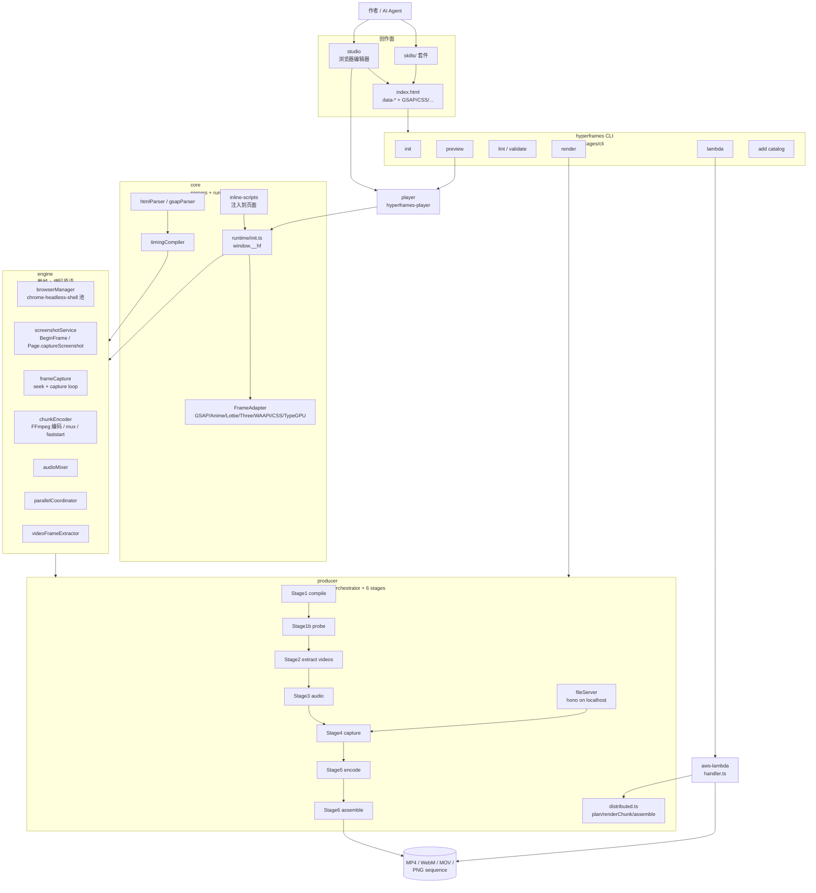
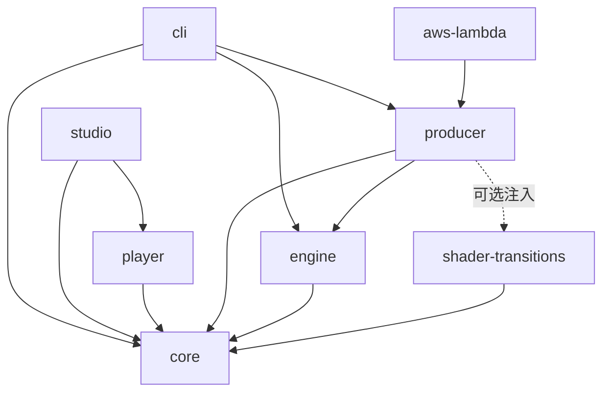
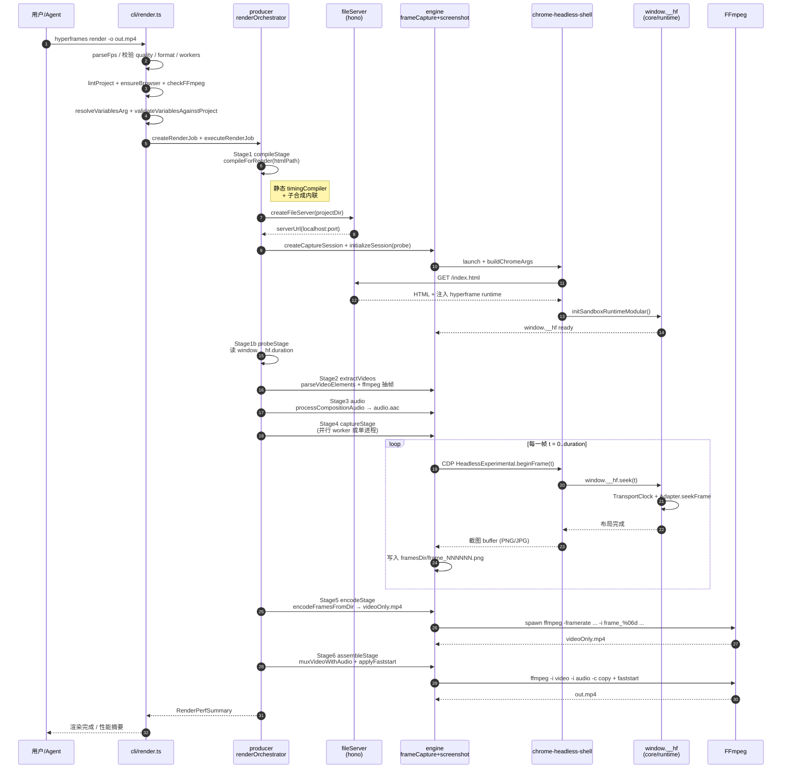
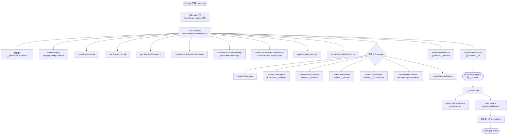

# hyperframes 源码学习笔记

> 仓库地址：[heygen-com/hyperframes](https://github.com/heygen-com/hyperframes)
> 学习日期：2026-05-22

---

> **以下为 AI 源码分析**
>
> ### 一句话概括
>
> HeyGen 开源的「Write HTML, Render Video」框架：把任意 HTML 当成可寻帧的视频时间线，由 Headless Chrome + FFmpeg 把它逐帧渲染为 MP4 / WebM / MOV / PNG 序列，并面向 AI Agent 提供 skills 与 CLI。
>
> ### 要点速览
>
> | 维度 | 关键事实 |
> |------|---------|
> | 定位 | HTML-native、Agent-first、确定性渲染的视频合成框架；可视为 Apache-2.0 版的 Remotion-for-HTML |
> | 输入 | 一份带 `data-*` 属性的 `index.html`（视频 / 图片 / 音频 / GSAP timeline / shader 过渡 / 子合成） |
> | 输出 | MP4（H.264/HEVC + HDR10）、WebM（VP9 + alpha）、MOV（ProRes 4444 + alpha + 10bit）、PNG sequence |
> | 渲染原理 | Puppeteer 驱动 chrome-headless-shell，使用 CDP `HeadlessExperimental.beginFrame` 原子推进时钟并截图，Frame Adapter 把 GSAP / Anime / Lottie / Three.js / WAAPI / CSS / TypeGPU / Shader 都注册到 `window.__hf` 协议上做帧对齐 seek |
> | 核心 packages | `core`（解析 / 编译 / 运行时 / 适配器）、`engine`（截帧 + 编码原语）、`producer`（六阶段流水线）、`cli`（hyperframes 命令）、`player`（`<hyperframes-player>` web component）、`studio`（浏览器编辑器）、`shader-transitions`（WebGL 过渡）、`aws-lambda`（分布式渲染适配器） |
> | 关键命令 | `hyperframes init / preview / lint / validate / inspect / render / add / lambda` |
> | 关键文件 | `packages/producer/src/services/renderOrchestrator.ts`、`packages/engine/src/services/frameCapture.ts`、`packages/engine/src/services/screenshotService.ts`、`packages/core/src/runtime/init.ts`、`packages/core/src/inline-scripts/hyperframe.ts` |

---

## 项目简介

Hyperframes 把「视频合成」表述为：一份普通的 `index.html` 加上若干 `data-start` / `data-duration` / `data-track-index` 等数据属性，外加一个 GSAP（或其他动画运行时）时间线脚本。框架在浏览器里注入一份运行时 `window.__hf`，把页面变成一个**可寻帧（seek-by-frame）的播放器**：preview 时由 `<hyperframes-player>` 走 wall-clock 播放，render 时由 Producer 驱动 Chrome 在 BeginFrame 控制下 1 帧 1 帧地确定性截图，再送 FFmpeg 编码。整体同时面向人类作者（CLI + Studio 编辑器）和 AI Agent（一整套 `skills/` 子目录、Claude Code / Codex / Cursor 插件 manifest）。

设计灵感公开承认来自 [Remotion](https://www.remotion.dev)（README 与源码注释里多处声明 attribution），但作了相反的关键决策：**主作者面写的是 HTML 而不是 React 组件**，所以无需打包步骤、可以原样粘贴现有 HTML/CSS、且 GSAP 等"库时钟"动画在渲染期可被精确寻帧，而不是 wall-clock 播放。

## 技术栈

| 类别 | 技术 |
|------|------|
| 语言 | TypeScript（严格 mode；少量浏览器端 JS） |
| 运行时 | Node.js >= 22；浏览器侧依赖 chrome-headless-shell |
| 包管理 / 构建 | bun workspaces + tsup（CLI / player）+ Vite（studio）+ tsc（其余） |
| 关键依赖 | `puppeteer-core`（CDP 驱动 Chrome）、`linkedom`（HTML 解析）、`hono`（render 期文件服务器）、`citty`（CLI 框架）、`@clack/prompts`（CLI 交互）、`@aws-sdk/client-s3`（Lambda 分发）、GSAP / anime.js / lottie-web / three / typegpu（运行时适配器） |
| 编码工具链 | FFmpeg（`-r/-framerate` 接受精确有理数 fps）、Chrome BeginFrame、SwiftShader（GPU 不可用时的软光栅）、ProRes / VP9 / H.264 / HEVC + HDR10 |
| Lint / Format | **oxlint + oxfmt**（明确不用 ESLint/Prettier/Biome），lefthook pre-commit |
| 测试 | Vitest（`*.test.ts`）+ `Dockerfile.test` 中的 PSNR 黄金回归基线 |
| 文档 | Mintlify（`docs/` 下，部署到 hyperframes.heygen.com） |

## 目录结构

```
hyperframes/
├── packages/                       # bun workspace 根
│   ├── cli/          src/commands/ 下 ~30 个子命令；citty 定义 + lazy import
│   ├── core/         core.types / parsers / generators / compiler / runtime / adapters / inline-scripts / lint
│   │   ├── parsers/        HTML & GSAP script → 中间数据
│   │   ├── runtime/        在浏览器里执行的 window.__hf；含 7 种动画 adapter
│   │   ├── inline-scripts/ 注入到页面里的 hyperframe runtime / parityContract
│   │   ├── adapters/       FrameAdapter 接口 + GSAP 实现
│   │   └── compiler/       timing 计算（data-start/duration → data-end）
│   ├── engine/       src/services/ 下截帧/编码/抽帧/混音/并行协调原语
│   ├── producer/     src/services/render/stages/ 下六阶段；distributed.ts 暴露 plan/renderChunk/assemble
│   ├── player/       <hyperframes-player> Web Component，把 iframe 变成播放器
│   ├── studio/       Vite + React 19 编辑器（时间线/属性面板/预览）
│   ├── shader-transitions/ WebGL 过渡 + page-side 复合
│   └── aws-lambda/   把 distributed 三个原语包装成单 Lambda 三角色 handler
├── registry/         50+ 可安装 blocks（shader / 社交浮层 / 数据图表）+ components + examples
├── skills/           面向 AI agent 的 SKILL.md（hyperframes / hyperframes-cli / gsap / lottie / three …）
├── docs/             Mintlify 文档站源（hyperframes.heygen.com）
├── examples/         端到端示例项目
├── scripts/          set-version / sync-schemas / lint-skills / 模板预览生成
├── .claude-plugin/   Claude Code 插件 manifest（marketplace 发布物）
├── .codex-plugin/    OpenAI Codex 插件 manifest
├── .cursor-plugin/   Cursor 插件 manifest
├── Dockerfile.test   黄金基线回归 Docker（强制 CI 用同一 Chrome+ffmpeg）
├── DESIGN.md         设计系统（颜色 / 字体 / spacing）—— Mintlify 配置依据
├── CONTRIBUTING.md / CLAUDE.md / AGENTS.md   仓库与 Agent 协作约定
└── package.json      monorepo 根（bun workspaces + 全局 scripts）
```

## 架构设计

### 整体架构

Hyperframes 是一个**「编辑期 - 预览期 - 渲染期」三态共享同一份 HTML + 同一份 `window.__hf` 运行时协议**的框架。core 提供数据模型、HTML/GSAP 解析与运行时；engine 把"在 Chrome 里抓一帧画面 / 在 FFmpeg 里写一段视频"沉淀成最小原语；producer 把这些原语按六阶段流水线编排成一次完整渲染；CLI / Studio / Player / aws-lambda 都构建在 producer + core 之上。



整体有几条贯穿性的设计主轴：

- **数据契约统一在 `data-*` 属性 + `window.__hf` 协议**：浏览器端的 runtime（`packages/core/src/runtime/init.ts`）和 Node 端的 engine（`packages/engine/src/services/frameCapture.ts`）都按 `window.__hf.seek(time)` / `window.__hf.transitions` / `window.__hfMedia` 这套公共协议沟通，第三方动画库通过 Frame Adapter 接进同一时钟。
- **同一份 runtime 在 preview 和 render 中复用**：runtime 由 `packages/core/src/inline-scripts/hyperframe.ts` 打包成内联脚本，preview 时 player 注入到 iframe，render 时 producer `fileServer` 在 GET `index.html` 时即时注入（`injectScriptsAtHeadStart`）。preview 与 render 之间没有第二份运行时。
- **engine 是无状态原语集合，producer 是 stage 编排器**：engine 暴露 `acquireBrowser` / `createCaptureSession` / `captureFrame` / `encodeFramesFromDir` / `muxVideoWithAudio` 等独立原语；producer 的 `renderOrchestrator` 在 try/finally 里把它们组合成 6 个 stage 并管理 fileServer / capture session / streaming encoder / HDR 临时文件等资源生命周期。
- **确定性优先，wall-clock 是次选**：CLAUDE.md 明文禁止 `Date.now()` / 未播种 `Math.random()` / 渲染期网络抓取。BeginFrame 模式下时间由 `frameTimeTicks` 整数推进；GSAP timeline 必须 paused 注册到 `window.__timelines`，由 adapter 主动 seek。

### 核心模块

#### 1. `@hyperframes/core` — 数据 + 编译 + 运行时

- **职责**：定义所有公共类型（`TimelineElement` / `CompositionSpec` / `Fps` / `CanvasResolution`），提供 HTML/GSAP 解析与生成、timing 编译、运行时协议以及七种动画 Frame Adapter。整个仓库唯一的"宪法"层。
- **关键文件**：
  - `src/core.types.ts`：所有跨包类型
  - `src/parsers/htmlParser.ts`：把 HTML 元素 → `TimelineElement`，识别 `data-type` / `data-start` / `data-track-index` / `data-layer`、合并 `gsapParser` 提取的关键帧
  - `src/parsers/gsapParser.ts`：用 AST 在 GSAP 脚本里增删改查动画，与时间线 keyframes 双向转换
  - `src/compiler/timingCompiler.ts`：`compileTimingAttrs` / `injectDurations` / `clampDurations` —— 把 `data-start + data-duration → data-end` 静态算清，未知 duration 留给 producer 用 ffprobe 解析
  - `src/runtime/init.ts`：`initSandboxRuntimeModular()`，在浏览器里建好 `state` / `TransportClock` / `WebAudioTransport` / `RuntimePlayer`、注册 7 个 adapter、做 stage 归零、装好诊断回调
  - `src/runtime/clock.ts`：`TransportClock`，支持 monotonic 与 audio-master 两种时钟，渲染期由 BeginFrame 推 monotonic
  - `src/runtime/timeline.ts`：合成 / 视频 / 图片 / 元素 / 音频混轨拆分（`KIND_ORDER`）
  - `src/inline-scripts/hyperframe.ts` + `hyperframesRuntime.engine.ts`：把 runtime 打包成可注入的内联脚本，附 `HYPERFRAME_RUNTIME_CONTRACT`
  - `src/adapters/types.ts` + `src/adapters/gsap.ts`：`FrameAdapter` 接口 + GSAP 默认实现（pause + `timeline.seek(seconds, suppressEvents=false)`）
  - `src/runtime/adapters/{gsap,animejs,lottie,three,waapi,css,typegpu}.ts`：浏览器端的 7 个具体适配器
- **对外暴露**：见 `src/index.ts`，向 cli / engine / producer / studio / player 全方位输出。

#### 2. `@hyperframes/engine` — 截帧与 FFmpeg 原语

- **职责**：所有"和 Chrome / FFmpeg 打交道"的低层操作。Producer 不直接 spawn Chrome 也不直接 spawn FFmpeg，全部经 engine。
- **关键文件**：
  - `src/services/browserManager.ts`：`acquireBrowser` / `releaseBrowser` / 浏览器池（`ENABLE_BROWSER_POOL`）、`buildChromeArgs`、`resolveHeadlessShellPath`、`resolveBrowserGpuMode`（hardware/software/auto）
  - `src/services/screenshotService.ts`：`beginFrameCapture`（CDP `HeadlessExperimental.beginFrame`，含 `Another frame is pending` 指数回退）、`pageScreenshotCapture` 兜底、`initTransparentBackground`、`captureAlphaPng`
  - `src/services/frameCapture.ts`：`createCaptureSession` / `initializeSession` / `captureFrame` —— 启动 Chrome、导航到 fileServer、等 `window.__hf` 出现、跑 warmup（`LOCKED_WARMUP_TICKS=60` 让所有机器同步），然后逐帧 seek + 截图
  - `src/services/chunkEncoder.ts`：`encodeFramesFromDir` / `encodeFramesChunkedConcat` / `muxVideoWithAudio` / `applyFaststart` / `detectGpuEncoder`
  - `src/services/streamingEncoder.ts`：边截边编模式（`spawnStreamingEncoder` + `createFrameReorderBuffer`），吃掉 PNG 落盘开销
  - `src/services/videoFrameExtractor.ts`：源视频抽帧成 raw rgb48le 文件，供 HDR 合成时按帧索引读取（`FrameLookupTable`）
  - `src/services/videoFrameInjector.ts`：把抽好的视频帧再注回 page（`hideVideoElements` / `injectVideoFramesBatch`）
  - `src/services/audioMixer.ts`：`processCompositionAudio`，把多个音轨按 `data-start/duration/volume` 混到一条 AAC
  - `src/services/parallelCoordinator.ts`：`distributeFrames` / `executeParallelCapture` / `mergeWorkerFrames`，并行渲染时一份 plan 拆 N 个 Chrome
  - `src/services/hdrCapture.ts`：HDR readback、`buildHdrChromeArgs`、`launchHdrBrowser`
- **错误约定**（`src/index.ts` 顶部注释）：编排 throw、FFmpeg 包装层 return `{ success, error? }`、cleanup 全部 swallow、可选查找 return `T | undefined`。这 4 条贯穿整个 package。

#### 3. `@hyperframes/producer` — 渲染编排器

- **职责**：把 engine 原语按"compile → probe → extractVideos → audio → capture → encode → assemble" 6 阶段拼成完整渲染。同时暴露 `distributed.ts` 中的 `plan / renderChunk / assemble` 三原语，供 aws-lambda / Step Functions / Temporal 等分发器复用。
- **关键文件**：
  - `src/services/renderOrchestrator.ts` (~3000 行)：核心 `executeRenderJob`，统一管理 fileServer / probeSession / hdrPerf / memorySampler；在 try/finally 中保证 Chrome / ffmpeg / 临时目录都会清理；定义 `RenderConfig` / `RenderJob` / `RenderPerfSummary` / `executeDiskCaptureWithAdaptiveRetry`（worker 数自适应回退） 等公共类型
  - `src/services/render/stages/*.ts`：每个 stage 一个文件，stage 文件顶部都写明"Hard constraints preserved verbatim" 列出在重构中不能改的副作用（log payload、updateJobStatus 时机、变量赋值次数）
  - `src/services/htmlCompiler.ts`：`compileForRender`（两阶段：core 静态 timing + ffprobe 解析），递归内联 `data-composition-src` 子合成
  - `src/services/fileServer.ts`：`createFileServer`（Hono 起 localhost http，按 GET 路径返回项目文件，并把 hyperframe runtime 注入 `<head>` 起始处）；含 `isPathInside` 防止路径穿越
  - `src/services/hyperframeRuntimeLoader.ts`：从 core 拿 runtime 源码并校验 hash
  - `src/services/render/captureCost.ts`：`runCaptureCalibration` 抽样测量每帧成本，再 `resolveRenderWorkerCount` 决定 worker 数
  - `src/services/render/cleanup.ts`：`cleanupRenderResources` / `safeCleanup` / `buildRenderErrorDetails`
  - `src/services/distributed/{plan,renderChunk,assemble}.ts`：分布式 3 原语，`renderChunk(planDir, chunkIndex, outputPath)` 按 plan 渲染一段、字节级幂等（同一 planHash 重试结果一致）
  - `src/services/{pngDecodeBlitWorkerPool,shaderTransitionWorkerPool}.ts`：worker_threads 池，CPU 密集的 PNG 解码 / shader 复合扔到 worker

#### 4. `@hyperframes/cli` — 用户入口

- **职责**：把 producer 包装成 ~30 个子命令；离 producer 最近的一层。
- **关键文件**：
  - `src/cli.ts`：citty `defineCommand`，**所有命令都 lazy import**（避免 `--version` 都要加载 puppeteer）；含 `.env` 自动加载和 worker entry 路径桥接（`HF_SHADER_WORKER_ENTRY` / `HF_PNG_DECODE_BLIT_WORKER_ENTRY`，因为 tsup 把 worker 内联会让 `import.meta.url` 找错路径）
  - `src/commands/init.ts`：模板脚手架（含 `--tailwind`、视频/音频起步、AI skills 自动安装）
  - `src/commands/preview.ts`：起 studio 子进程，端口扫描 + 复用同项目已开服务器
  - `src/commands/render.ts`：参数验证 → lint → 选择 `renderLocal` / `renderDocker` → 调 `loadProducer`（dynamic import producer）
  - `src/commands/lint.ts` / `validate.ts`：静态结构 lint + headless Chrome 运行时校验
  - `src/commands/lambda/`：`deploy / destroy / render-batch / render` 等 CDK 子命令，调 `aws-lambda` 包
  - `src/commands/{tts,transcribe,remove-background}.ts`：媒体预处理（Kokoro / Whisper / u2net）
  - `src/commands/add.ts`：从 `registry/` 拉 block / component 装到当前项目
- **CLI 命令开发约定**（CLAUDE.md）：定义 `defineCommand` + 导出 `examples` + 在 `cli.ts` `subCommands` 注册 + 在 `help.ts` 加到 `GROUPS` + 在 `docs/packages/cli.mdx` 写文档，缺一不可。

#### 5. `@hyperframes/player` — 嵌入式播放器

- **职责**：以 Web Component `<hyperframes-player>` 形式把任意 hyperframes composition 当成 `<video>` 用。
- **关键文件**：
  - `src/hyperframes-player.ts`：自定义元素，构造时建 ShadowRoot + 内嵌 iframe + shader-loader（把 shader 过渡当封面） + ResizeObserver 自适应缩放 + 控件
  - `src/composition-probe.ts`：等 iframe 内 `window.__hf` 出现并报告 duration / dimensions
  - `src/direct-timeline-clock.ts`：当父级 wall-clock 与 iframe runtime 直连时绕过 postMessage 直接同步
  - `src/parent-media.ts`：把 iframe 内的音视频媒体事件代理到外层（dispatchEvent / volume / playbackRate 同步）
  - `src/runtime-message-handler.ts`：处理 runtime 投出的 diagnostic / state / shader 消息
  - `src/timeline-adapters.ts`：在 player 侧也实现一份 timeline adapter，与 runtime adapter 镜像

#### 6. `@hyperframes/studio` — 浏览器编辑器

- **职责**：基于 React 19 + Vite 的 IDE 风格编辑器，按时间线 + 属性面板 + 预览三栏组织。preview 命令默认起的就是它。
- **结构**（`packages/studio/src/`）：`App.tsx` / `main.tsx` / `components/` / `contexts/` / `hooks/` / `player/` / `captions/` / `telemetry/` / `utils/`，多个 `vite.*.ts` 配置（adapter / browser / producer / studioMotion / thumbnail / request-body），是编辑器内嵌的多个独立打包目标。

#### 7. `@hyperframes/shader-transitions` — WebGL 过渡

- **职责**：把"两段 scene 间的过渡"实现为 WebGL fragment shader（`src/shaders/`），并支持两条复合路径：
  - **Engine-mode**：Node 端 layered blend，HDR/alpha/video 自动走这路（`engineModePageComposite.ts`）
  - **Page-side compositing**（`HF_PAGE_SIDE_COMPOSITING=true` 默认开）：在 page 内放一个 WebGL canvas 直接合成，SDR 场景下 ~6× 加速；HDR/alpha 自动回落到 layered。

#### 8. `@hyperframes/aws-lambda` — 分布式适配器

- **职责**：把 producer 的 `plan / renderChunk / assemble` 三原语包装成单 Lambda 三角色 handler。`event.Action` 字段决定走哪一支，公用 S3 上下载 + chrome 解析逻辑。
- **关键文件**：`src/handler.ts`（thin glue）、`src/chromium.ts`（解析 Lambda layer chrome）、`src/s3Transport.ts`（tar dir / parse uri / 上下载）、`src/cdk/`（CDK 部署栈）、`src/sdk/`（生成 client SDK 方便 Step Functions 调用）。

### 模块依赖关系



数据/类型流向：`core` 是单源真实，向所有人输出；`engine` 仅消费 core 类型；`producer` 同时消费 core 与 engine；`cli` / `studio` / `player` / `aws-lambda` 都是顶层消费者。`shader-transitions` 只依赖 core，由 producer 在需要时注入到 page 中。

## 核心流程

### 流程一：`hyperframes render` 一次本地渲染

从用户敲下 `hyperframes render -o out.mp4` 到 MP4 落盘，跨 cli → producer → engine → FFmpeg。



关键细节：

- **第 1-3 步 lazy import**：cli.ts 只 import VERSION，命令体内才 dynamic import producer，所以 `--version` 仍是 ~10ms。`.env` 在主流程之前被手写解析（不依赖 dotenv，去掉了一层依赖）。
- **第 4 步 fileServer 注入**：核心 trick 是请求 `index.html` 时把 `getHyperframeRuntimeScript()` 注入到 `<head>` 起始处，所以原始 HTML 不需要 `<script src=".../hyperframe.js">`，作者写的就是干净的 HTML。
- **第 5 步 BeginFrame 模式**：当 chrome-headless-shell 可用且非 alpha 输出时走 BeginFrame，CDP `HeadlessExperimental.beginFrame({ frameTimeTicks, interval })` 一次调用就完成 layout-paint-composite-screenshot 原子操作；alpha 输出（webm/mov/png-sequence）回落到 `Page.captureScreenshot`，因为 BeginFrame 在 Linux 上不保留 alpha 通道。
- **streaming-encode fusion**：当 `enableStreamingEncode=true` 时，Stage4 与 Stage5 融合，PNG 不落盘，直接通过 `spawnStreamingEncoder` 走 FFmpeg stdin（`createFrameReorderBuffer` 保证乱序到达的 worker 帧按序送入 ffmpeg）。
- **adaptive worker retry**：`executeDiskCaptureWithAdaptiveRetry` 检测漏帧后自动 `getNextRetryWorkerCount` 减并发重试，对 CPU 抖动鲁棒。

### 流程二：`window.__hf` 在浏览器里的初始化与 seek

与流程一并存的另一条主线：每次 Chrome 加载 `index.html` 时，`initSandboxRuntimeModular()` 是怎么把一个普通 HTML 变成可寻帧的「微型播放器」的。



要点：

- **window.__timelines 契约**：作者写 GSAP 时被强约束 `gsap.timeline({ paused: true })` 并挂到 `window.__timelines`，runtime 在 `init.ts` 里读这个全局再交给 GSAP adapter（`createGSAPFrameAdapter` 的 `timeline.pause()` + `timeline.seek(seconds, false)`）。这一行约定贯穿了 `gsap` skill / `lint` 检查 / runtime adapter / FrameAdapter 默认实现四个层面。
- **parityContract**：`packages/core/src/inline-scripts/parityContract.ts` 的 `quantizeTimeToFrame(time, fps)` 在 runtime 与 producer 同时调用（同一份代码！engine `index.ts` 直接 `export { quantizeTimeToFrame } from "@hyperframes/core"`），保证浏览器看到的时间和 producer 写入 ffmpeg 的时间像素级一致——这是 hyperframes 的「确定性」承诺的根因。
- **诊断回调**：runtime 通过 `postRuntimeMessage({ source: "hf-preview", type: "diagnostic" })` 投出问题，`postedDiagnosticKeys` 做去重（`code:JSON.stringify(details)` 作 key），player 与 producer 端都能消费这个统一通道。

## 关键设计亮点

1. **「同一份运行时跨预览/渲染」消除了 preview-render parity gap**

   - **解决了什么**：传统视频合成框架在编辑器里看到的与最终渲染出来的常常不一致（颜色管理、字体替换、margin 默认值差异等）。
   - **怎么实现**：runtime 在 `packages/core/src/runtime/init.ts` 里直接对 `document.documentElement` / `document.body` 强制清零 `margin/padding/overflow`，源码注释写明 *"Runs in both preview and render contexts, eliminating the preview/render parity gap that existed when only the React component's normalizePreviewViewport call applied this normalization."* `parityContract.quantizeTimeToFrame` 也做到了 producer 与 runtime 共享一份代码。fileServer 在 render 期注入的就是 preview 期同一个 IIFE 包。
   - **为什么这么设计**：把 parity 当成一等公民放在编译产物层，而不是靠"编辑器里多写一段 normalize 代码"。

2. **engine = 无副作用原语 + 三段式错误约定**

   - **解决了什么**：渲染流水线异常路径的鲁棒性：Chrome 进程泄漏、ffmpeg 半挂、临时目录残留是音视频框架的高频问题。
   - **怎么实现**：`packages/engine/src/index.ts` 顶部用注释把整个 package 的错误处理切成 4 段 ——「编排函数 throw、ffmpeg 包装层 return `{success, error?}`、cleanup `.catch(()=>{})`、可选查找 return T|undefined」。producer `renderOrchestrator` 在 try/finally 里登记每一个资源（fileServer / probe session / streaming encoder / hdr raw fd），失败时一律走 `cleanupRenderResources`，不会因为后置失败掩盖原始错误。
   - **为什么**：因为 engine 是被 producer + studio + 第三方分发器（aws-lambda 也直接用）多处复用的，统一错误语义让组合代价从 O(N) 降到 O(1)。

3. **Frame Adapter pattern：把多种动画运行时统一成 `seekFrame(frame: number)`**

   - **解决了什么**：GSAP / Lottie / Three.js / WAAPI / CSS / Anime.js / TypeGPU 的内部时钟模型完全不同，但都需要在 BeginFrame 控制下被精确寻帧。
   - **怎么实现**：`packages/core/src/adapters/types.ts` 只声明四个方法的最小接口（`init` / `getDurationFrames` / `seekFrame` / `destroy`）；`packages/core/src/runtime/adapters/` 下七个具体实现各自把自己运行时的 wall-clock 入口换成响应 `__hf.seek` 事件。譬如 `gsap.ts` 里 `timeline.pause()` + `timeline.seek(seconds, suppressEvents=false)`，`three.ts` 里把 `Three.Clock` 替换成读 `window.__hfThreeTime`。
   - **为什么**：这是 hyperframes 与 Remotion 的核心差异——Remotion 在渲染期 GSAP 仍是 wall-clock 播放（README 表格里明文承认），hyperframes 通过 Adapter 让所有库都"假装"在被外部时钟驱动。

4. **BeginFrame + warmup-lock：跨机器一致的 PSNR 黄金基线**

   - **解决了什么**：不同机器上 Chrome 启动耗时不同 → BeginFrame warmup tick 计数不同 → 同一帧画面像素级不一致 → PSNR 失败。
   - **怎么实现**：`frameCapture.ts` 暴露 `LOCKED_WARMUP_TICKS = 60`，当 `lockWarmupTicks=true` 时强制 warmup 阶段跑满 60 个 tick（无视 wall-clock），让所有机器的 `beginFrameTimeTicks` 起点完全一致。配合 `Dockerfile.test`（CLAUDE.md 强制说 *"baselines MUST be generated inside Dockerfile.test, not on your host"*），实现了"代码不变 → 输出字节级一致"。
   - **为什么**：黄金基线回归测试是音视频项目的命脉，hyperframes 用单一 docker 镜像 + 锁定 warmup tick 这两件具体工程，把 determinism 落到了字节层。

5. **CLI 全 lazy-import + worker entry env 桥**

   - **解决了什么**：`hyperframes --version` 这种高频调用不能等 puppeteer 加载；同时 tsup 打包后，producer 内部 worker_threads 池用 `import.meta.url` 找 sibling worker 文件会因为 module graph 错乱找错路径。
   - **怎么实现**：`packages/cli/src/cli.ts` 头部先做 `--version` fast path（直接 `console.log(VERSION); process.exit(0)`，~10ms vs ~80ms）；然后用 IIFE 在 import 任何 producer 代码之前，把构建产物中位于 cli.js 同目录的 `shaderTransitionWorker.js` / `pngDecodeBlitWorker.js` 路径写进 `process.env.HF_SHADER_WORKER_ENTRY` / `HF_PNG_DECODE_BLIT_WORKER_ENTRY`，让 worker pool 通过 env 兜底。
   - **为什么**：CLI 的"启动延迟"和"打包后路径漂移"是两件经常被忽视但严重影响 Agent 体验的细节，cli.ts 顶部那 30 行注释把动机和坑详细写在源码中——本身就是值得借鉴的工程文档化方式。

6. **distributed.ts：把六阶段折叠成 `plan/renderChunk/assemble` 三原语**

   - **解决了什么**：要让 hyperframes 跑在 AWS Lambda / Cloud Run Jobs / Temporal / K8s Jobs / SSH 上，必须把"控制器调度"与"workers 真正干活"解耦。
   - **怎么实现**：`packages/producer/src/distributed.ts` 暴露三个纯函数 `plan(projectDir, config, planDir)` → 生成自描述 planDir + 内容寻址 planHash；`renderChunk(planDir, chunkIndex, outputChunkPath)` → 同 (planDir, chunkIndex) 字节级幂等；`assemble(planDir, chunkPaths, audioPath, outputPath)` → 拼接最终交付物。`packages/aws-lambda/src/handler.ts` 是 thin glue：解析 event.Action → S3 拉文件 → 调一个原语 → S3 推回 → 返回 JSON。
   - **为什么**：把"网络/SDK/调度"与"渲染逻辑"严格分层，用户可以选 Step Functions、Temporal 或自家调度器，而 hyperframes 不需要为每种环境出一个 SDK——README 顶部的 *"Single-machine today"* 表格条目只是用户视角，源码层早就为分布式留好了 OSS 三原语的接口。
