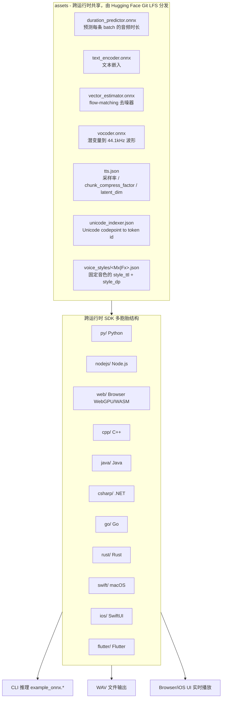
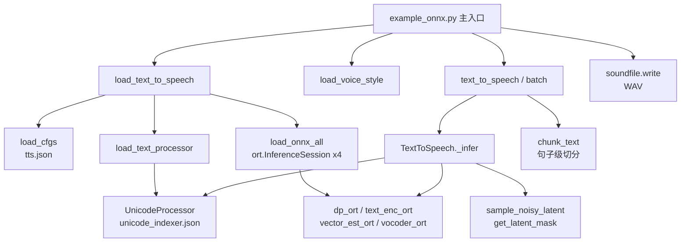
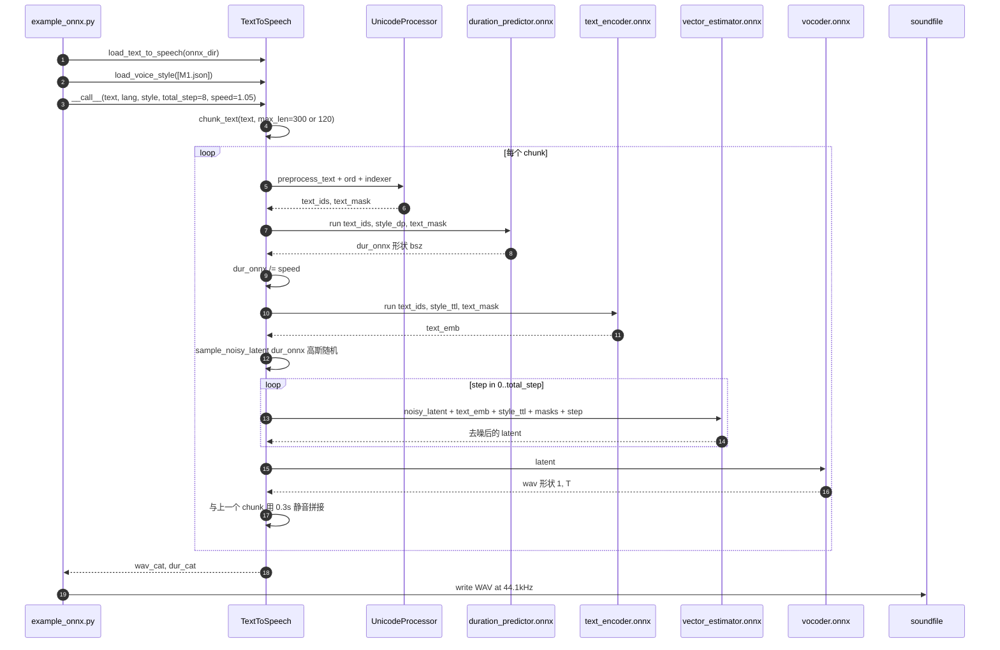
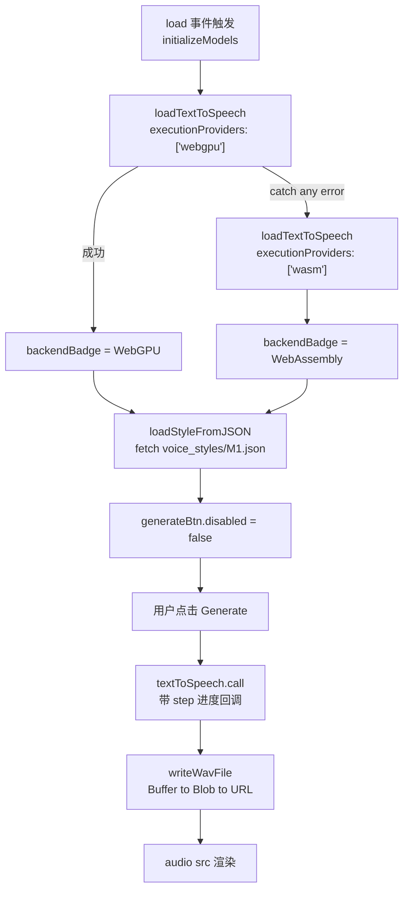

# supertonic 源码学习笔记

> 仓库地址：[supertone-inc/supertonic](https://github.com/supertone-inc/supertonic)
> 学习日期：2026-05-24

---

> **以下为 AI 源码分析**
>
> ### 一句话概括
>
> Supertonic 是一套以 ONNX Runtime 为推理底座、支持 31 种语言的端侧 TTS 系统，仓库通过 11 套语言/平台的 example workspace（Python、Node.js、Browser/WebGPU、Java、C++、C#、Go、Swift、iOS、Rust、Flutter）演示同一份 4-stage 流模型管线如何跨语言复用。
>
> ### 要点速览
>
> | 模块/目录 | 职责 | 关键文件 |
> |-----------|------|---------|
> | `py/` | Python 参考实现，最完整、最先更新；CLI 入口与所有 helper 函数 | `example_onnx.py`、`helper.py`、`example_pypi.py` |
> | `nodejs/` | Node.js 端 ONNX Runtime（onnxruntime-node）实现 | `example_onnx.js`、`helper.js` |
> | `web/` | 浏览器内 WebGPU 推理（onnxruntime-web，自动 WASM fallback）+ Vite Demo UI | `main.js`、`helper.js`、`index.html` |
> | `cpp/` `java/` `csharp/` `go/` `rust/` `swift/` | 后端/系统语言移植，复用同一份 ONNX assets 与 tokenizer | 各目录 `helper.*` + `example_onnx.*` |
> | `ios/` `flutter/` | 移动端示例，封装为 App + UI | `ios/ExampleiOSApp/TTSService.swift`、`flutter/lib/helper.dart` |
> | `assets/`（外部） | 4 个 ONNX 模型、`tts.json`、`unicode_indexer.json`、voice style JSON | 通过 `git clone https://huggingface.co/Supertone/supertonic-3 assets` 获取 |
> | `test_all.sh` | 跨运行时端到端回归脚本，按目录依次跑各 SDK 示例 | 仓库根目录 |

---

## 项目简介

Supertonic 是 Supertone Inc. 开源的端侧多语言 TTS（Text-to-Speech）系统。它将训练好的 99M 参数模型导出为四个独立的 ONNX 子模型，然后用十一种语言/平台分别实现完全等价的推理管线，让同一份模型可以在 Raspberry Pi、电子书阅读器、浏览器（WebGPU/WASM）、iOS/Android、桌面后端服务等任意环境本地运行，无需 GPU、无网络依赖、无云端调用。仓库本身不包含训练代码，定位是"工程模板 + 多语言 SDK 参考"——核心价值是展示一套 ONNX-first 的跨平台推理工程实践。

## 技术栈

| 类别 | 技术 |
|------|------|
| 语言 | Python、JavaScript/TypeScript、C++、C#、Go、Java、Rust、Swift、Dart |
| 推理框架 | ONNX Runtime（CPU / WebGPU / WebAssembly / iOS Bindings / 各语言 binding） |
| 模型架构 | SupertonicTTS（speech autoencoder + flow-matching text-to-latent + LARoPE 对齐 + neural vocoder） |
| 构建工具 | uv（Python）、npm + Vite（Web）、CMake（C++）、Maven（Java）、go mod、cargo、swift build、xcodegen（iOS）、flutter |
| 资产管理 | Hugging Face + Git LFS（`assets/onnx/*.onnx`） |
| 多语言文本 | NFKD Unicode 归一化 + 自定义 unicode_indexer.json codepoint → token id 映射 |

## 目录结构

```text
supertonic/
├── README.md                 仓库主文档：模型版本、性能榜、生态项目
├── test_all.sh               一键跑通所有运行时的回归脚本（含 default/batch/longform 三档模式）
├── img/                      性能/演示用图
│
├── py/                       【参考实现】Python + onnxruntime
│   ├── example_onnx.py        CLI 入口
│   ├── example_pypi.py        高阶 PyPI 包 supertonic 的最小调用样例
│   ├── helper.py              UnicodeProcessor / TextToSpeech / loader 全部逻辑
│   └── pyproject.toml         uv 同步用
│
├── nodejs/                   Node.js + onnxruntime-node
├── web/                      Browser + onnxruntime-web（WebGPU 优先，WASM 兜底）
│   ├── main.js                UI 控件 + executionProviders 选择
│   ├── helper.js              fetch 版资源加载 + 同款管线
│   ├── index.html / style.css 交互页
│   └── vite.config.js
│
├── cpp/                      原生 ONNX Runtime C++ API（`Ort::Session`）
├── csharp/                   .NET 9，OnnxRuntime NuGet
├── go/                       yalue/onnxruntime_go（依赖系统 onnxruntime 动态库）
├── java/                     Maven + onnxruntime-java
├── rust/                     ort crate
├── swift/                    SwiftPM + OnnxRuntimeBindings（macOS/Swift 命令行）
├── ios/ExampleiOSApp/        SwiftUI + xcodegen，封装 TTSService / TTSViewModel / AudioPlayer
└── flutter/                  Flutter + macOS plugin
```

每个语言子目录的文件命名几乎完全平行：`example_onnx.*`（参数解析 + 主流程） + `helper.*`（UnicodeProcessor / TextToSpeech / I/O / WAV writer），并通过 symlink `assets -> ../assets` 共享同一份模型与 voice style。

## 架构设计

### 整体架构

仓库本身不是一个"应用"，而是 **一份 ONNX 模型 + 一份语言无关的推理协议 + N 套语言 SDK** 的多胞胎结构。模型与 tokenizer 由 Hugging Face 单独分发（`assets/onnx/*.onnx`），所有语言示例对模型的输入/输出 tensor 名约定完全一致；每个语言 SDK 内部都重新实现 UnicodeProcessor 与四阶段调用流程。



### 核心模块

仓库内可识别的"模块"实际上是 **一组在每个语言里都被复刻的角色**，不存在跨语言的代码复用：

#### 1. UnicodeProcessor — 文本预处理与 token 化

- **职责**：把任意 Unicode 字符串变成 ONNX 模型可接受的 `text_ids`（int64 矩阵）+ `text_mask`（float32 mask）。
- **核心文件**：`py/helper.py:16-131`、`nodejs/helper.js:13-128`、`web/helper.js:13-145`，`cpp/helper.cpp`、`java/Helper.java`、`go/helper.go` 等也都各自完整实现。
- **流水线**：
  1. NFKD Unicode 归一化
  2. 移除 emoji（覆盖 emoticon、symbols、flags 等多个 Unicode 区段）
  3. 字符替换表：各种破折号/弯引号/方括号/竖线/`@`/`e.g.,` 等统一化
  4. 修正标点前的空白、去除重复引号/反引号
  5. 句尾不带终结标点时补 `.`
  6. 用 `<lang>...</lang>` 标签包裹（`AVAILABLE_LANGS` 含 31 种语言 + `na`）
  7. 每个字符 `ord()` 后查 `unicode_indexer.json`，得到模型 vocab 中的 token id

> 关键约束：所有运行时实现的字符替换表与正则**完全一致**，否则就会出现"同样文本在 Web 与 Python 输出音频不同"的对齐 bug。

#### 2. TextToSpeech — 推理管线编排

- **职责**：按固定顺序调用 4 个 ONNX session，串起 [`text_ids → duration → text_emb → noisy_latent → ... → vocoder → wav`] 的全链路。
- **核心文件**：`py/helper.py:140-254`（最干净版本）、`nodejs/helper.js:143-302`、`cpp/helper.cpp:410-680`、`java/Helper.java:267-400`、`go/helper.go:616-800`。
- **关键接口**：
  - `__call__/call(text, lang, style, total_step, speed, silence_duration)` — 单条推理（自动 chunk）
  - `batch(text_list, lang_list, style, total_step, speed)` — 批量推理（不 chunk）
  - `_infer(...)` — 内部统一实现
  - `sample_noisy_latent(duration)` — 根据 duration 预先采样标准正态潜变量并 mask

#### 3. 模型加载与配置

- **职责**：构造 `ort.InferenceSession`、读取 `tts.json` / `unicode_indexer.json` / 各 voice style JSON。
- **入口**：`load_text_to_speech(onnx_dir, use_gpu)`（py），相同函数在每个运行时都存在。
- **统一约定**：
  - 4 个模型固定文件名：`duration_predictor.onnx`、`text_encoder.onnx`、`vector_estimator.onnx`、`vocoder.onnx`。
  - 配置 schema：`cfgs["ae"]["sample_rate"]`、`cfgs["ae"]["base_chunk_size"]`、`cfgs["ttl"]["chunk_compress_factor"]`、`cfgs["ttl"]["latent_dim"]`。
  - voice style 在磁盘上是 JSON：包含 `style_ttl.{dims,data}` + `style_dp.{dims,data}` 两段预先算好的张量；这是 Voice Builder 工具的产物，仓库不含训练管线。

#### 4. CLI / UI 适配层

- **职责**：解析参数（含批量 voice/text/lang）、循环执行 `n_test` 次、把 wav 切片后落盘。
- **核心文件**：`py/example_onnx.py:9-116`、`nodejs/example_onnx.js`、`cpp/example_onnx.cpp`、`go/example_onnx.go`。
- **Web/iOS 变体**：`web/main.js` 用 DOM 控件替代 argparse，渲染 `<audio>` 与下载按钮；`ios/ExampleiOSApp/TTSService.swift` 把它收成 `init() / synthesize(...)` 两个方法供 SwiftUI ViewModel 消费。

#### 5. 长文本切分与 WAV 编码

- **职责**：超长输入按段落 + 句子边界切分；输出 16-bit PCM WAV。
- **核心文件**：`py/helper.py:388-429` 的 `chunk_text`、`nodejs/helper.js:522-559`、`web/helper.js`、各语言 helper 中的 `writeWavFile`。
- **关键策略**：
  - `max_len = 120` 当 `lang` ∈ {ko, ja}，否则 `300`（CJK 字符更密，需要更短 chunk）。
  - 句子分隔正则使用大量 `(?<!Mr\.)(?<!e\.g\.)(?<!\b[A-Z]\.)` 等负向回顾，避免在缩写后误切。
  - 段间插入 `silence_duration = 0.3s` 静音，保持自然停顿。

### 模块依赖关系

下图以 Python 实现为代表，其它语言完全同构：



## 核心流程

### 流程一：单条文本端到端合成（默认模式）

下图描述 `python example_onnx.py --text "..." --voice-style M1.json` 的完整调用，等价于其他运行时 `example_onnx.*` 的非 batch 路径：



要点：
- **flow-matching 去噪**是循环的核心。`total_step` 越大质量越好（README 推荐 5–12，默认 8）。每步把 `current_step / total_step` 作为标量喂给 vector_estimator，让模型自己根据进度收敛。
- **batch 模式**直接走 `_infer`（不 chunk），要求 `len(voice_style) == len(text) == len(lang)`，所有 batch 在同一 vector_estimator 调用里并行去噪。
- **speed** 通过缩放预测出来的 `dur_onnx` 实现：duration 越短 → latent 时间步越少 → vocoder 出更短波形。

### 流程二：浏览器 WebGPU/WASM 加载与降级

`web/main.js:78-122` 演示了端侧 WebGPU 优先、WASM 兜底的运行时探测策略：



要点：
- 与 Node.js 版本不同，Web 版本用 `fetch()` 替代 `fs`，因此 `helper.js:364-423` 在 voice style/`tts.json`/`unicode_indexer.json` 加载处都做了 `await fetch(...).then(r => r.json() / r.arrayBuffer())` 的差异化处理。
- 进度回调（`(step, total) => showStatus(...)`）只在 web/ios 等交互场景启用，CLI 端不传。
- `<audio>` 直接消费 `Blob` URL，**不需要任何后端中转**——这是 README 强调"把整页网页变成音频 < 1 秒"的工程基础。

## 关键设计亮点

### 亮点 1：四阶段独立 ONNX 子图，让推理可控可剪裁

- **解决了什么**：传统端到端 TTS 把 acoustic model + vocoder 打成单个 graph，无法控制 denoising step、batch、speed 等运行期参数，移植到 WebGPU/iOS 也容易出现算子不支持。
- **怎么做**：把模型拆成 `duration_predictor`（标量输出）→ `text_encoder`（embedding）→ `vector_estimator`（flow-matching denoiser，多次调用）→ `vocoder`（latent→wav）四块独立 graph，对外暴露统一命名的 input/output（`text_ids` / `style_ttl` / `style_dp` / `text_mask` / `latent_mask` / `noisy_latent` / `current_step` / `total_step` / `latent` / `wav_tts`）。
- **为什么**：
  1. `vector_estimator` 是热点，业务侧可以用 `total_step` 直接调档（5–12）做 quality/latency 权衡，无需重训。
  2. `speed` 在 Python 侧 `dur_onnx /= speed` 实现，模型本身不需要任何条件输入。
  3. 把潜变量采样、mask 计算这些"非神经网络"逻辑下放到宿主语言，反而避免了 ONNX op 在 WebGPU/iOS 上的兼容问题。

### 亮点 2：宿主语言完全平行的 SDK 多胞胎结构

- **解决了什么**：让一份模型 day-1 就具备 11 套语言生态的现成 SDK，并且后续任何模型升级（如 v2 → v3）只要保持 ONNX 输入名兼容，所有 SDK 不改一行业务代码。
- **怎么做**：
  - 文件命名约定：每个语言都是 `example_onnx.<ext>` + `helper.<ext>`，类名 `UnicodeProcessor` / `TextToSpeech` / `Style`、字段名 `ttl` / `dp` / `sampleRate` / `baseChunkSize` 完全一致。
  - 资产共享：`py/assets`、`nodejs/assets`、`web/assets` 等全部是 `-> ../assets` 的 symlink（见 `.gitattributes` 与目录列表）。
  - 跨语言回归：`test_all.sh` 一键跑所有 SDK，并对比生成的 `.wav` 文件数量与平均大小（`show_stats` 函数）。
- **为什么**：跨语言重写而不是用 FFI 绑定一份核心库，是为了 ONNX Runtime 在每个生态内都有"正宗"的 binding（`onnxruntime-node` / `onnxruntime-web` / `OnnxRuntimeBindings` for iOS 等），避开胶水层带来的部署复杂度。

### 亮点 3：voice style 作为外置 JSON 资产，与"模型权重"解耦

- **解决了什么**：开源仓不想绑定训练管线，又要支持"自己的音色"。
- **怎么做**：voice style JSON 内只有两段预先算好的张量（`style_ttl` 给 text_encoder/vector_estimator，`style_dp` 给 duration_predictor），由独立的 [Voice Builder](https://supertonic.supertone.ai/voice-builder) Web 工具产生。SDK 端 `load_voice_style` 只做读 JSON + reshape + batch 拼装。
- **为什么**：
  1. 推理代码完全不用关心音色生成的细节，纯粹是张量加载。
  2. v2/v3 各出一份 voice style，`load_voice_style` 通过 `dims` 字段自适应不同维度。
  3. Voice cloning pipeline 留在闭源服务端，开源端只暴露 fixed-voice 推理能力，避免合规/隐私风险。

### 亮点 4：Unicode codepoint 直查表，绕开 BPE/SentencePiece tokenizer

- **解决了什么**：跨 11 种语言部署一个 BPE/SentencePiece tokenizer 在 C++/Swift/Dart 上既麻烦又容易踩字符边界 bug。
- **怎么做**：把 tokenizer 退化成"对每个字符做 NFKD 后查 `unicode_indexer.json`"。`indexer` 是一个超长数组/字典，索引就是 Unicode codepoint，值就是模型 vocab 内的 token id。每个语言只需要 `ord()`/`charCodeAt()`/`codepoint()` + 数组查表，全平台都能在 50 行内实现。
- **为什么**：模型在训练时已经把语言信息显式注入到了 `<lang>...</lang>` 标签中，并通过 `style_ttl/style_dp` 提供说话人控制，不再需要语言专属的复杂分词器；以"字符级 codepoint 索引"作为 token，是把跨语言部署成本压到最低的关键工程取舍。

### 亮点 5：长文本 chunk + 静音拼接，让小模型撑住整页 TTS

- **解决了什么**：单次推理上限受 `latent_len`、显存/内存制约，但产品宣传"整网页 < 1s"必须支持长文本。
- **怎么做**：`chunk_text(text, max_len)` 先按段落分（`\n\s*\n+`），再按句子分（一组带负向回顾的正则忽略 `Mr.`/`e.g.,`/`F.` 等缩写），生成 ≤300（或中日 ≤120）字符的 chunk，逐段推理，段间插入 `silence = np.zeros(int(0.3 * sample_rate))` 拼成单条 wav。
- **为什么**：
  1. 让每个 chunk 都落在模型训练分布里，避免极长输入时 attention 退化。
  2. 0.3s 静音承担"段落停顿"的语义，实验上比直接相邻拼接自然得多。
  3. CJK 用 120 而非 300——中日韩字符密度更高，相同字符数对应更长发音时间，是同一个工程经验的两个分支。
