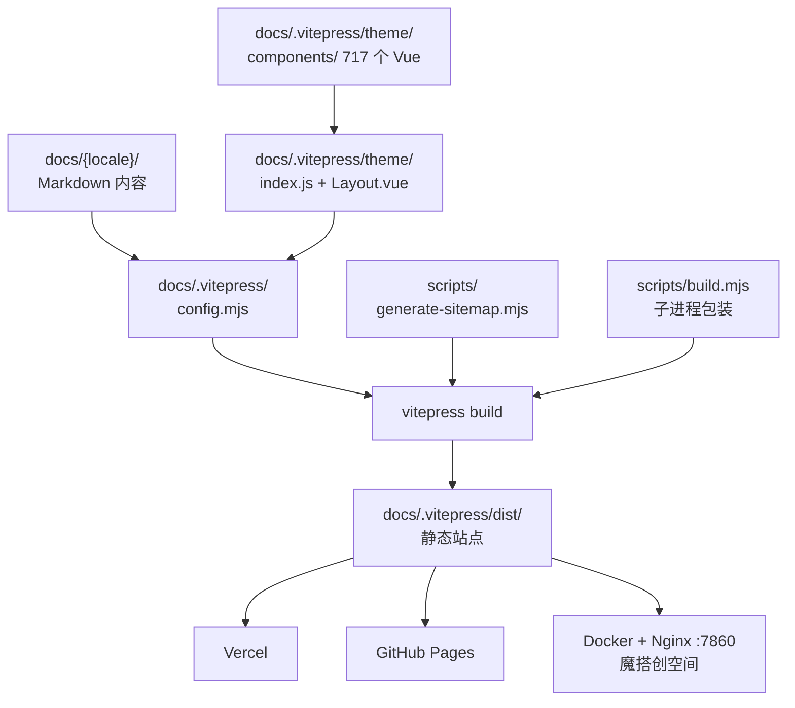
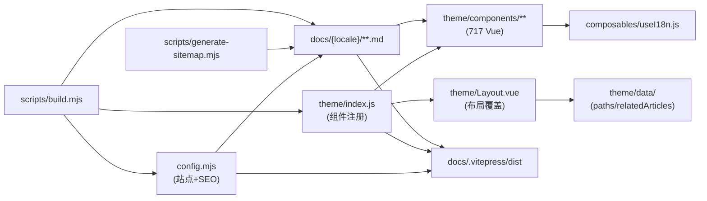
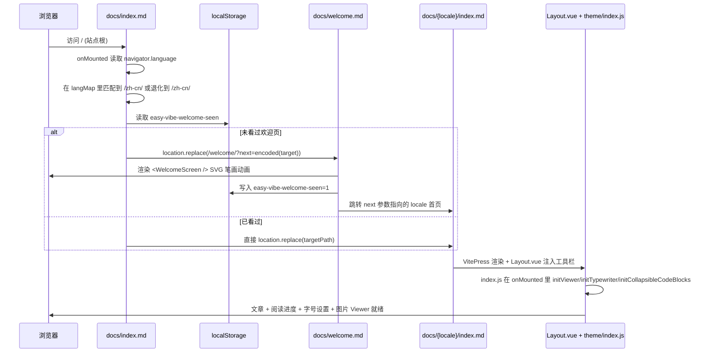
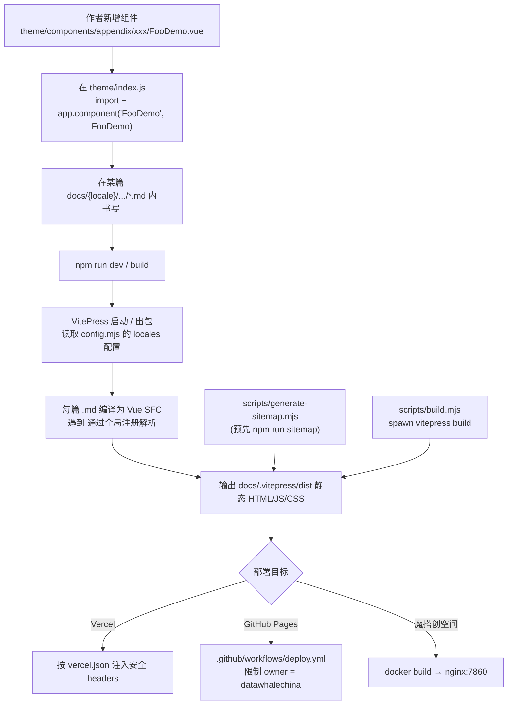

# easy-vibe 源码学习笔记

> 仓库地址：[datawhalechina/easy-vibe](https://github.com/datawhalechina/easy-vibe)
> 学习日期：2026-05-24

---

> **以下为 AI 源码分析**
>
> ### 一句话概括
>
> Easy-Vibe 是 Datawhale 出品的「AI Vibe Coding」教程站点——本质是一份基于 VitePress 2.0 alpha 的多语言 (10 种语言) 静态文档站，但通过 700+ 个 Vue 交互组件把 AI/前后端/计算机基础等抽象概念可视化，并叠加自研主题（阅读设置、图片查看器、欢迎动画、SEO、面包屑结构化数据）形成一个「教学 IDE」。
>
> ### 要点速览
>
> | 维度 | 关键事实 |
> |------|----------|
> | 项目类型 | VitePress 2.0 alpha 教学文档站，非应用代码 |
> | 入口配置 | `docs/.vitepress/config.mjs`（3172 行）+ `docs/.vitepress/theme/index.js`（2122 行） |
> | 主题层 | `Layout.vue` 重写默认布局；阅读字号/行高、侧边栏宽度、欢迎页、阅读进度自包含 |
> | 内容组织 | `docs/{locale}/stage-{1,2,3}/...` + `appendix` 四阶递进 |
> | 多语言 | 10 个 locale，每个都在 config.mjs 中独立声明 nav + sidebar，主语言 zh-cn |
> | 交互组件 | `theme/components/appendix/` 下 77 个子目录、共 717 个 `.vue`，每个对应一个知识点动画 |
> | 构建产物 | Vercel / GitHub Pages / ModelScope（Dockerfile + Nginx 7860） |
> | 关键脚本 | `scripts/generate-sitemap.mjs`（生成 sitemap）+ `scripts/build.mjs`（绕过 VitePress 2.0 alpha 不退出 bug） |

---

## 项目简介

Easy-Vibe 面向「零基础到 AI-native 工程师」的渐进式教学项目，目标是让用户「会说话就会做应用」。它解决的核心问题是：当 AI 编程工具（Cursor / Claude Code / Trae）成熟后，初学者缺乏一条把「想法 → 原型 → 全栈产品 → 跨平台交付」串起来的体系化路径。仓库本身不是一个「应用」，而是一个「课程载体」——通过 VitePress 把 Markdown 教程、可点击的 Vue 知识动画、用户故事、外语翻译统一编排成一个学习站点。其差异化价值在于：每个知识点配套一个可在浏览器里点击/拖拽的演示组件（如 LLM tokenization、Git 提交流、TCP 三次握手、扩散模型），把传统教材里的静态截图替换成可操作的交互。

## 技术栈

| 类别 | 技术 |
|------|------|
| 语言 | JavaScript (ESM)、Vue 3、Markdown |
| 框架 | VitePress 2.0.0-alpha.16、Vue 3.5、Element Plus 2.13 |
| 构建工具 | Vite（VitePress 内嵌）、自研 `scripts/build.mjs` 包装 |
| 依赖管理 | npm（package.json + package-lock.json，`engines.node >= 18`） |
| 测试框架 | `node --test`（原生测试运行器，覆盖 `docs scripts` 下 `*.test.js`） |
| 其他 | Mermaid 11、TypeIt 8（打字机）、Viewer.js（图片缩放）、Reveal.js（PPT 模式）、KaTeX（数学公式）、ESLint 9 + Prettier 3 + Husky |

## 目录结构

```
easy-vibe/
├── docs/                              # VitePress 内容根目录
│   ├── .vitepress/
│   │   ├── config.mjs                 # 站点配置（10 语言 nav/sidebar/SEO，单文件 3172 行）
│   │   └── theme/
│   │       ├── index.js               # 主题入口：注册 717 组件 + 全局 hook
│   │       ├── Layout.vue             # 重写默认布局，注入字号/行高/欢迎入口
│   │       ├── components/            # 交互演示组件
│   │       │   ├── appendix/          # 77 个知识子领域目录
│   │       │   ├── home/              # 首页 Stage1/2/3 卡片
│   │       │   └── *.vue              # 通用组件（NavGrid、StepBar、ReadingProgress）
│   │       ├── composables/useI18n.js # 极简 i18n hook（基于 useData().lang）
│   │       ├── data/easyVibePaths.json# 欢迎动画的 SVG 笔画路径
│   │       └── locales/               # 局部组件多语言文案（ai-history 等）
│   ├── index.md                       # 根入口：依据 navigator.language 重定向
│   ├── welcome.md                     # 欢迎屏（layout: false + WelcomeScreen 组件）
│   ├── zh-cn/  en/  zh-tw/  ja-jp/    # 各语言独立内容树（stage-1/2/3 + appendix + vibe-stories）
│   ├── ko-kr/  es-es/  fr-fr/  de-de/
│   ├── ar-sa/  vi-vn/                 # 共 10 个 locale
│   └── public/                        # 站点静态资源（logo、favicon）
├── docs-readme/                       # 各语言版的 README（仅展示用）
├── assets/                            # 图片、Banner（被 docs/assets 软链复用）
├── scripts/
│   ├── generate-sitemap.mjs           # 扫 docs 下 .md 生成 sitemap.xml
│   └── build.mjs                      # spawn vitepress build 子进程，规避 alpha 不退出问题
├── config/mcporter.json               # 站点的 MCP 端口/路由清单
├── Dockerfile + nginx.conf            # 多阶段构建 → Nginx :7860（魔搭部署）
├── vercel.json                        # Vercel framework=vitepress，安全 headers
├── ms_deploy.json                     # ModelScope 创空间部署描述
├── llms.txt                           # 给 AI Agent (Claude/Cursor/Trae) 阅读的项目摘要
├── AGENTS.md / CLAUDE.md              # 给协作 AI 的工作约定
└── package.json                       # 脚本：dev / build / sitemap / test / verify
```

## 架构设计

### 整体架构

整个项目可以理解为「内容层 → 主题层 → 部署层」三段式：

- **内容层**：`docs/{locale}/...` 下的 Markdown 文件 + 同目录或全局 `assets`，是唯一可独立生长的部分。每种语言的目录树几乎对称，但只有 `zh-cn` 和 `en` 是「全量翻译」，其余 8 种语言主要覆盖 stage-1，进入 stage-2/3 时 nav 会回跳到 `zh-cn`（见 config.mjs 中各 locale 的 nav 定义）。
- **主题层**：`docs/.vitepress/theme/` 通过 `extends: DefaultTheme` 在 VitePress 默认主题之上叠加：① `Layout.vue` 包覆 DefaultTheme.Layout，注入欢迎页入口、字号/行高调节器、阅读进度条、PageSlidesButton（PPT 模式）；② `index.js` 在 `enhanceApp` 里全局注册 700+ Vue 组件，使任意 `.md` 都能直接 `<TokenizationDemo />`；③ 在路由变化时统一执行图片 Viewer 初始化、代码块折叠、Mermaid 主题刷新、首页打字机。
- **部署层**：四种发布形态共用同一个 `vitepress build` 产物 `docs/.vitepress/dist`，通过 `BASE`/`VERCEL`/`EDGEONE` 环境变量决定 base path（GitHub Pages 用 `/easy-vibe/`、Vercel/EdgeOne 用 `/`），通过 `SITE_URL` 决定 SEO canonical/og:url。Dockerfile 把 dist 塞进 Nginx 监听 7860，对应魔搭创空间。



### 核心模块

#### 1. `docs/.vitepress/config.mjs` — 站点中枢

- 职责：声明 10 种语言的 `locales`，每种语言独立配置 `nav`、`sidebar`、`themeConfig.docFooter`、`title`、`description`、`head`（含 SEO/JSON-LD）。
- 关键内容：
  - `localeMap` (config.mjs:32) — 10 个 locale 的 og/twitter/lang 元数据。
  - `getSeoHead(locale, title, description, path)` (config.mjs:96) — 动态拼接每页 head：canonical、Open Graph、Twitter Card、hreflang、`Schema.org WebSite + Course` JSON-LD、动态 BreadcrumbList。
  - `getStage1Sidebar(locale)` 等 sidebar 工厂 — 复用 sidebar 树，被各 locale 共享。
  - 部署感知 base：`process.env.BASE || (isVercel || isEdgeOne ? '/' : '/easy-vibe/')`（config.mjs:13）。
- 与外部关系：被 VitePress CLI 加载；`getSeoHead` 输出的 head 直接由 VitePress 注入到 HTML。

#### 2. `docs/.vitepress/theme/index.js` — 主题装配 + 组件总线

- 职责：① 通过 `enhanceApp({ app })` 把全部交互组件注册成全局；② 在 `setup()` 里订阅 `useRoute()` 与 `useData().frontmatter`，绑定多个生命周期钩子。
- 注册的组件按知识领域聚合：`appendix/llm-intro/*`、`appendix/vlm-intro/*`、`appendix/audio-intro/*`、`appendix/git-intro/*`、`appendix/auth-design/*`、`appendix/cache-design/*`、`appendix/database-intro/*`、`appendix/network/*`、`computer-fundamentals/*` 等共 77 个子领域。
- 关键全局行为：
  - `initCollapsibleCodeBlocks()` (index.js:1933)：扫描 `.vp-doc` 下所有非 mermaid 代码块，超过阈值行数追加「展开/收起」按钮，并按当前路由 (`/zh-cn/` / `/zh-tw/`) 切换中英文标签。
  - `initViewer()` (index.js:1971)：在每次路由切换销毁旧 Viewer，对 `.vp-doc` 重建 Viewer.js 实例，过滤掉 `nav-title-logo` 与 `no-viewer` 类的图片。
  - `initTypewriter()` (index.js:2015)：仅当 `frontmatter.hero.tagline` 是数组时启用 TypeIt 多句循环。

#### 3. `docs/.vitepress/theme/Layout.vue` — 用户感知层

- 职责：包覆 `DefaultTheme.Layout`，在 `<Layout>` 插槽里塞入：① 顶栏右侧的「阅读设置」Element Plus Popover（字号 12-18、行高 1.25-1.8，localStorage 持久化）；② 顶栏的 GitHubStars 实时星标；③ 「页面 Slides」按钮（基于 reveal.js 把当前文档变 PPT）；④ 阅读进度条 ReadingProgress；⑤ 欢迎屏入口（点击站名 logo 触发 `/welcome/?next=...`）。
- 关键变量：`FONT_SIZE_STORAGE_KEY`、`SIDEBAR_COLLAPSED_KEY`、`SIDEBAR_WIDTH_KEY` — 通过 CSS 变量 `--ev-doc-font-size` / `--ev-doc-line-height` 把状态注入文档树。

#### 4. `docs/.vitepress/theme/components/appendix/**` — 知识动画库

- 717 个 `.vue` 组件按知识领域分目录，例如 `llm-intro/TokenizationDemo.vue`、`git-intro/GitCommitFlow.vue`、`computer-fundamentals/HalfAdderDemo.vue`、`audio-intro/MelSpectrogramDemo.vue`。
- 设计契约（来自 CLAUDE.md）：用 props 控制变量，scoped 样式，少量文字以 props 注入或交由 `useI18n.js` 翻译。每个组件都被 `index.js` 显式 import + `app.component(name, comp)` 注册，再在对应教程 Markdown 里直接以 `<TokenizationDemo />` 形式调用。

#### 5. `scripts/` — 构建辅助

- `generate-sitemap.mjs`：递归扫描 `docs/{locale}` 下所有 `.md`，跳过 `.vitepress`/`node_modules`/`dist`/`public`，按 `siteUrl` 拼接 URL 输出到 `docs/public/sitemap.xml`。`SITEMAP_NO_WRITE=1` 时仅打印不落盘，方便 CI dry-run。
- `build.mjs`：用 `node:child_process spawn` 起 `npx vitepress build docs --force` 子进程，监听 `close` 事件 `process.exit(code)`，绕开 VitePress 2.0 alpha 已知的「构建结束后主进程不退出」问题（issue #562）。
- `verify.sh`：被 `npm run verify` 调用的本地校验脚本（链接/文件命名/图片有效性）。

#### 6. 部署描述

- `vercel.json`：framework=vitepress，输出 `docs/.vitepress/dist`，挂全站安全 headers（X-Frame-Options/CSP/Permissions-Policy）和 sitemap/robots.txt 缓存。
- `Dockerfile` + `nginx.conf`：node:20-alpine 多阶段构建 → nginx:alpine，端口 7860（魔搭创空间硬要求）。
- `.github/workflows/deploy.yml`：限定 `github.repository_owner == 'datawhalechina'` 才执行，构建产物用 `actions/upload-pages-artifact` + `actions/deploy-pages` 推上 GitHub Pages。
- `ms_deploy.json` / EdgeOne 环境变量分支：分别对接魔搭和 EdgeOne 边缘部署。

### 模块依赖关系



## 核心流程

### 流程一：用户首次访问 → 语言识别 → 进入对应教程



要点：① 入口逻辑全在前端，没有服务端，靠 `navigator.language` + localStorage 记忆；② `withBase()` 处理 base 路径差异（GitHub Pages 与 Vercel）；③ 欢迎屏 SVG 笔画来自 `theme/data/easyVibePaths.json`，以三色主题循环；④ 跳转使用 `location.replace`，避免给历史栈留垃圾。

### 流程二：在文档中插入交互组件 → 编译 → 部署



要点：① 组件注册必须在 `theme/index.js` 中显式 import，否则 VitePress SSR 解析 Markdown 时找不到组件；② sitemap 在 `npm run build` 中作为前置步骤运行，保证生产产物包含最新的 `sitemap.xml`；③ 多语言部署共用同一份 dist，base 与 SITE_URL 由环境变量切换，无需为每个部署目标重新构建。

## 关键设计亮点

1. **Markdown 内嵌「可点击知识动画」：把教学内容做成应用而非纯文本**
   - 解决问题：传统电子书/MOOC 的图文是死的，读者无法操作 LLM tokenization、TCP 报文、Git 三区状态。
   - 实现方式：在 `docs/.vitepress/theme/index.js` 用 717 次 `app.component(name, comp)` 把组件注册成全局，然后在 Markdown 里直接 `<TokenizationDemo />` 即可使用；组件按知识领域分桶（`appendix/llm-intro/`、`appendix/vlm-intro/`、`appendix/audio-intro/`、`appendix/computer-fundamentals/`…）。
   - 设计动机：VitePress 把 Markdown 视为 Vue SFC，全局注册让作者「写文档 = 写 Vue」，零成本插入交互；按领域分目录避免单文件爆炸，便于按章节维护。

2. **配置驱动的 10 语言路由：单 `config.mjs` 兜住所有 locale**
   - 解决问题：既要 SEO（每种语言独立 canonical / hreflang / og:locale / JSON-LD），又要避免每语言单独维护一份配置。
   - 实现方式：`config.mjs` 中 `getSeoHead(locale, title, description, path)` 是一个返回 `head[]` 的纯函数，对 10 个 locale 复用；`getStage1Sidebar(locale)` 等 sidebar 工厂返回同一棵节点树供各 locale 引用；`localeMap` 集中维护语言-地域-twitter handle 映射。
   - 设计动机：教程内容会快速增长，把翻译留在 Markdown，把样板留在工厂函数，新增一种语言只需注册一个 `localeMap` 项 + 一个 `getXxxSidebar(locale)` 调用。

3. **部署目标无关的 base path 与 SITE_URL 协商**
   - 解决问题：GitHub Pages 必须用 `/easy-vibe/`，Vercel/EdgeOne 用 `/`，魔搭/EdgeOne 域名又是动态生成。
   - 实现方式：`config.mjs:5-13` 通过 `process.env.BASE || (isVercel || isEdgeOne ? '/' : '/easy-vibe/')` 动态决策 base；`getSiteUrl()` 优先看 `VERCEL_URL`/`EDGEONE_URL`/`SITE_URL`，回退到 GitHub Pages。
   - 设计动机：单产物多目标部署。同一份 `dist` 可以喂给 Vercel、GitHub Pages、Docker，避免「每个平台一次构建」。

4. **VitePress 2.0 alpha 不退出 bug 的工程化兜底**
   - 解决问题：VitePress 2.0 alpha 已知 bug — `vitepress build` 完成后主进程不退出（issue #562），导致 CI 卡死。
   - 实现方式：`scripts/build.mjs` 用 `child_process.spawn('npx', ['vitepress','build','docs','--force'])` 起子进程，监听 `close` 事件 `process.exit(code ?? 0)`，把退出码透传出来。
   - 设计动机：在不放弃 alpha 新特性的前提下保持 CI 可用；同时把 workaround 局部化，将来上游修复后只需删一个文件即可。

5. **欢迎屏 + 阅读体验的「IDE 化」叠加层**
   - 解决问题：默认 VitePress 是开发者文档样式，对零基础学习者过于朴素。
   - 实现方式：`Layout.vue` 注入字号/行高调节器（CSS 变量 `--ev-doc-font-size` / `--ev-doc-line-height` + localStorage），加上 PageSlidesButton（即时把当前 .md 转为 reveal.js PPT）、ReadingProgress 进度条、首页 typeit 多句打字机；`docs/welcome.md` + `WelcomeScreen.vue` 用 `easyVibePaths.json` 中的 SVG 笔画三主题循环动画做仪式感入口。
   - 设计动机：教学场景下仪式感与可控阅读节奏（字号/行高/进度）能显著降低退出率；通过 localStorage 记忆，让「老用户即看即学，新用户先看欢迎」自然分层。
