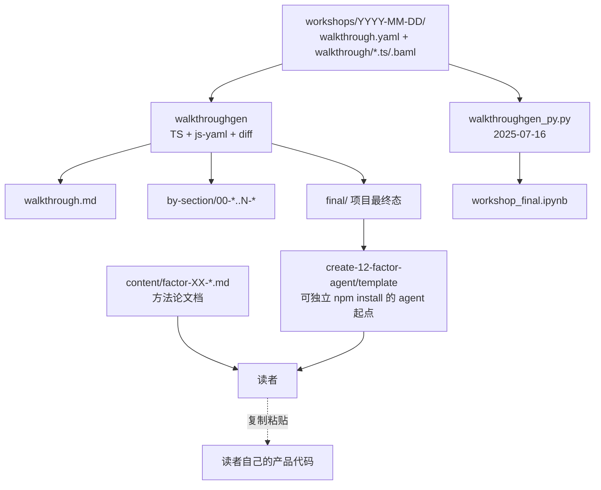
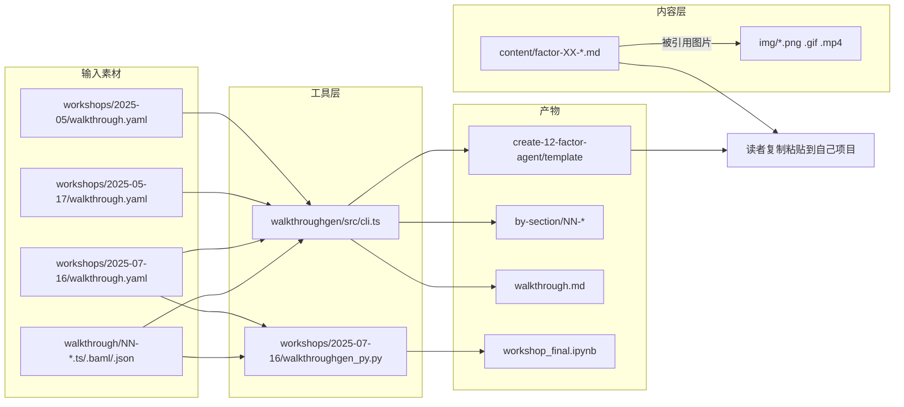
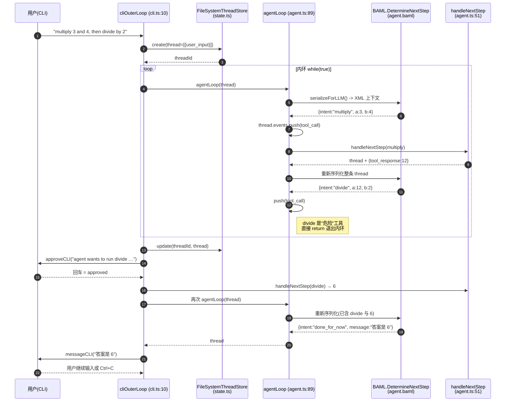
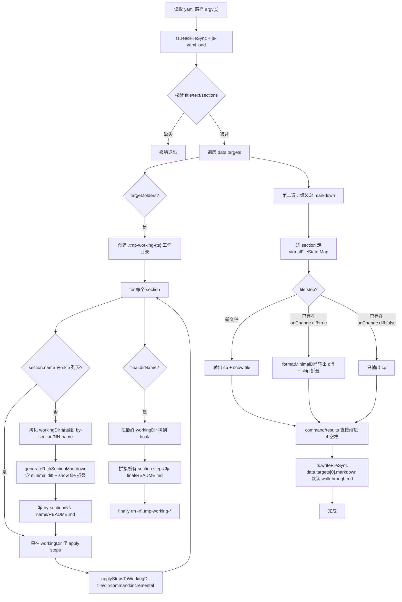

# 12-factor-agents 源码学习笔记

> 仓库地址：[humanlayer/12-factor-agents](https://github.com/humanlayer/12-factor-agents)
> 学习日期：2026-05-24

---

> **以下为 AI 源码分析**
>
> ### 一句话概括
>
> 一份模仿 *12 Factor App* 的方法论指南，配套一个 TypeScript + BAML 的可运行参考实现 (`create-12-factor-agent`)、一个 YAML 驱动的文档教程生成器 (`walkthroughgen`)，以及若干 workshop 资料，目的是教工程师把 LLM 当成"软件中的局部组件"而不是端到端框架来构建可控、可恢复、可介入人类审批的 agent。
>
> ### 要点速览
>
> | 模块 | 类型 | 职责 | 关键文件 |
> |------|------|------|----------|
> | `content/` | 文档 | 12 条 factor 的论述与配图，是仓库主交付物 | `factor-01-…md` ~ `factor-12-…md`、`appendix-13-pre-fetch.md`、`brief-history-of-software.md` |
> | `packages/create-12-factor-agent/template/` | 参考实现 | 一个完整的 calculator agent，演示 thread/事件流、CLI 外环、Express webhook 服务、HumanLayer 介入 | `src/agent.ts`、`src/cli.ts`、`src/server.ts`、`src/state.ts`、`baml_src/agent.baml` |
> | `packages/walkthroughgen/` | 文档工具 | 把 `walkthrough.yaml` 渲染为 Markdown 教程 + 逐章子目录，带 diff/copy/run | `src/cli.ts`、`readme.md`、`examples/typescript/`、`examples/walkthroughgen/` |
> | `workshops/2025-05`、`2025-05-17`、`2025-07-16` | 教学素材 | 历次现场 workshop 的 step-by-step 文件与配置，最新一期为 Python + Colab Notebook | `walkthrough.yaml`、`walkthroughgen_py.py`、`workshop_final.ipynb` |
> | `img/` | 资源 | factor 1–12 的全部插图、动画、DAG 演化图 | `010-software-dag.png` … `1c5-agent-foldl.png` |

---

## 项目简介

12-factor-agents 不是一个会被 `npm install` 进生产代码的库，而是 HumanLayer 创始人 Dex Horthy 的方法论文集 + 教学资料集。作者总结了大量 SaaS 创始人的实战经验后给出一个核心论断：**好的 agent 主要是软件，LLM 只是其中负责"自然语言到结构化输出"那一小步的组件**。仓库用 12 条 factor 把这个论断拆成可执行的工程要点（拥有自己的 prompt、拥有自己的 context window、把 tool call 当作结构化输出、统一执行状态与业务状态、把 agent 设计成 stateless reducer 等），并通过 `template/` 里一个支持人类审批的 calculator agent，把这些要点落到 ~500 行 TypeScript + BAML 代码里，作为读者的复制起点。

## 技术栈

| 类别 | 技术 |
|------|------|
| 语言 | TypeScript 5.8（参考实现与 walkthroughgen）、Python 3（最新 workshop）、Markdown（主体内容） |
| 框架 | Express.js（webhook server）、BAML（@boundaryml/baml，prompt + 结构化输出 DSL）、HumanLayer SDK（人机介入） |
| 构建工具 | `npx tsx`、TypeScript `tsc`、`uv`（Python workshop）、Jest（walkthroughgen 单元测试） |
| 依赖管理 | npm（`package.json`/`package-lock.json`）、`bun`/`yarn` 兜底（Makefile）、`pyproject.toml` + `uv.lock`（workshops/2025-07-16） |
| 测试框架 | Jest（`jest.config.js`，仅 walkthroughgen），BAML 内置 `test` 块（agent.baml 内 `HelloWorld`/`MathOperation` 等用例） |

## 目录结构

```
12-factor-agents/
├── README.md                        # 仓库主入口，列出 12 factor 链接 + 视觉导航 + 历史背景
├── CLAUDE.md                        # 给 Claude Code 的 persona 选择指引（与项目主体松耦合）
├── LICENSE / Makefile               # Apache 2.0 + CC BY-SA 4.0 双协议；Makefile 仅 setup/teardown
├── content/                         # ⭐ 仓库主交付物：12 个 factor 的论述
│   ├── brief-history-of-software.md # 软件 → DAG → agent loop 的演化故事
│   ├── factor-01-natural-language-to-tool-calls.md   # 自然语言 → 结构化工具调用
│   ├── factor-02-own-your-prompts.md                 # 拥有自己的 prompt
│   ├── factor-03-own-your-context-window.md          # 拥有自己的 context（Context Engineering 章节）
│   ├── factor-04-tools-are-structured-outputs.md     # tool 只是结构化输出
│   ├── factor-05-unify-execution-state.md            # 统一执行状态与业务状态
│   ├── factor-06-launch-pause-resume.md              # 用简单 API 实现启动/暂停/恢复
│   ├── factor-07-contact-humans-with-tools.md        # 通过 tool call 联系人类
│   ├── factor-08-own-your-control-flow.md            # 自掌控流程
│   ├── factor-09-compact-errors.md                   # 把错误压进 context window
│   ├── factor-10-small-focused-agents.md             # 小而专注的 agent
│   ├── factor-11-trigger-from-anywhere.md            # 任何入口都能触发 agent
│   ├── factor-12-stateless-reducer.md                # agent = stateless reducer
│   ├── appendix-13-pre-fetch.md                      # 附加建议：能预取就预取 context
│   └── factor-{1..9}-….md           # 与 01–09 同名的短重定向页（仅给历史链接兼容用）
├── img/                             # 全部插图、GIF、MP4 演示，README 与 content/* 大量直链
├── packages/
│   ├── create-12-factor-agent/
│   │   └── template/                # ⭐ 参考实现：可运行的 12-factor calculator agent
│   │       ├── src/                 # agent.ts / cli.ts / server.ts / state.ts / a2h.ts / index.ts
│   │       ├── baml_src/            # agent.baml / clients.baml / generators.baml / tool_calculator.baml
│   │       └── README.md            # 757 行 chapter-by-chapter 教学手册（实际从 walkthrough 生成）
│   └── walkthroughgen/              # ⭐ YAML → 多目标 Markdown/子目录 教程生成器
│       ├── src/cli.ts               # 594 行核心：解析 yaml、apply step、生成 diff、写产物
│       ├── src/index.ts             # 6 行 entry，转发到 cli()
│       ├── readme.md                # 自我演示用的 yaml 配置完整说明
│       ├── examples/typescript/     # 演示一个最小 ts 项目教程
│       └── examples/walkthroughgen/ # walkthroughgen 自举生成自己的文档
├── workshops/                       # 历次现场 workshop 的素材
│   ├── 2025-05/                     # walkthrough.yaml + sections + Makefile + final 状态
│   ├── 2025-05-17/                  # 第二期，结构同上但带 package.json/tsconfig
│   └── 2025-07-16/                  # ⭐ 最新一期：Python + Colab，含 walkthroughgen_py.py 与 workshop_final.ipynb
├── drafts/                          # 旧规范草稿（a2h-spec.md / ah2-openapi.json）
└── hack/contributors_markdown       # 自动生成贡献者头像 markdown 的脚本
```

## 架构设计

### 整体架构

仓库本身有四层各自独立的"产物层"，没有统一入口：内容文档 → 参考实现 → 教程生成工具 → 历次 workshop。它们之间是**编译/分发关系**而不是模块依赖关系：`walkthroughgen` 把 `workshops/*/walkthrough.yaml` 加上同目录下 `walkthrough/*.{ts,baml,json}` 切片，生成 `final/`、`by-section/`、`workshop_final.ipynb` 等产物；其中一份产物就是 `packages/create-12-factor-agent/template/` 里的 README + src/ 文件，供读者作为脚手架复制。



### 核心模块

#### 1. `content/` — 方法论文档（仓库一等公民）

- **职责**：按"先讲背景 → 再讲 12 条 factor → 再补附录"的线性顺序，给出每条 factor 的"问题-反例-推荐做法-代码片段"四段式论述。
- **核心文件**：`brief-history-of-software.md` 是整套方法论的认知底座（DAG → agent loop → micro-agent in deterministic DAG 的演化）；`factor-01-…md` 至 `factor-12-…md` 各自约 60–250 行；`appendix-13-pre-fetch.md` 作为彩蛋附录。
- **关键约定**：每篇文档使用 `[← Back to README](…)` 锚点回主页，并在结尾用 `[← Prev]…[Next →]` 形成手工链表。仓库根 `README.md` 第 60–71、197–209 行重复列出同一组链接，分别对应"摘要导航"和"再次列出"——是对方法论"重要的事说三遍"风格的刻意。
- **依赖**：纯 Markdown，无代码依赖；图片来源全部链接到 `img/` 目录的 raw URL。

#### 2. `packages/create-12-factor-agent/template/` — 12-factor 的代码化身

最值得读的部分。它把 factor 4/5/6/7/8/12 几乎一比一映射到了 ~500 行代码：

- **`src/agent.ts`（116 行）**：定义 `Event = { type, data }` 与 `Thread = { events: Event[] }`，`Thread.serializeForLLM()` 把整条事件流序列化成 `<intent>…</intent>` XML 风格字符串塞进 prompt——这就是 *factor 5 unify state* 与 *factor 12 stateless reducer*。`agentLoop()` 是一个内层 while 循环，从 BAML 拿到 `nextStep`，把它当成事件 push 进 thread，根据 `nextStep.intent` 决定执行 calculator tool（`add/subtract/multiply`）、还是退出循环把控制权交还给 outer loop（`done_for_now/request_more_information/request_approval_from_manager/divide`）——这就是 *factor 7 contact humans with tools* 与 *factor 8 own your control flow*。
- **`src/cli.ts`（137 行）**：CLI 形态的外环（outer loop）。`cliOuterLoop()` 不停跑 `agentLoop`，遇到要联系人类的 intent 就 readline 提问；`divide` 这个被作者标注为"危险"的 tool 必须先经过 `approveCLI()` 人工审批才会真的执行——演示 *factor 7 + 8* 在 CLI 通道下的最小实现。
- **`src/server.ts`（182 行）**：把同一个内环搬到 Express + HumanLayer webhook 上。它消费三种事件类型 `conversation.created` / `human_contact.completed` / `function_call.completed`，从 `body.event.spec.state.thread_id` 取回 thread，跑完 inner loop 后通过 `hl.createHumanContact` / `hl.createFunctionCall` 把控制权异步交给人类——这就是 *factor 6 launch/pause/resume*：进程随时崩没事，因为状态全部在 thread 里。
- **`src/state.ts`（48 行）**：`ThreadStore` 接口 + `FileSystemThreadStore`，`create/update` 同时写 `<id>.json` 与 `<id>.txt`（人读 + 机器读两份）。注释明示"可替换为 redis/sqlite/postgres"，暗示这是 *factor 5* 的最小可工作实现而非生产建议。
- **`baml_src/`**：BAML DSL 文件。`agent.baml` 定义了 5 个 class（`ClarificationRequest` / `DoneForNow` / `RequestApprovalFromManager` / `ProcessRefund` 与函数 `DetermineNextStep`，输出 union 类型），`tool_calculator.baml` 定义 4 个数学 tool，`clients.baml` 定义 GPT-4o / Sonnet / Haiku / round-robin / fallback 客户端 + 重试策略。BAML 在编译期生成 TS 客户端到 `baml_client/`，这就是 *factor 2 own your prompts* + *factor 4 tools are structured outputs* 的工程化体现。

#### 3. `packages/walkthroughgen/` — 教程文档生成器

它是仓库内部的 build 工具，外部读者不一定关心，但它是 12 factor 论调"用代码生成内容"的元示范：

- **入口**：`src/index.ts` 6 行；`src/cli.ts` 594 行单文件解析 + 渲染。
- **配置 schema**（`cli.ts:7–37`）：
  - `WalkthroughData = { title, text, sections[], targets[] }`
  - `Section = { name, title, text, steps[] }`
  - `step` 支持 4 种动作：`file: {src, dest}` 拷文件；`dir: {create, path}` 建目录；`command + incremental?` 跑命令（`incremental: true` 时也会在生成 by-section 目录时真实执行）；`results: [{text, code}]` 内嵌"你应该看到的输出"。
- **三种输出 target**：
  - `markdown: "./out.md"` —— 单文件长教程，使用 `formatMinimalDiff` 计算文件差异，新增文件展示 `<details><summary>show file</summary>` 折叠，已有文件改动展示 `cp` + diff。
  - `folders: { path, skip?, final? }` —— 为每个非 skip 章节生成 `00-section`、`01-section` 子目录，每章自带带 diff 的 `README.md`，并把当前虚拟工作目录全量复制为该章节"快照"。
  - `final.dirName` —— 把所有 step 累计应用后的最终态落到 `final/` 目录，再生成一份不含 diff 的简单 README。
- **关键算法 `formatMinimalDiff`（cli.ts:148–207）**：跳过 patch header 与 hunk 元数据（`---`/`+++`/`@@`），把"删一行立刻加一行内容相同"的伪改动消除，最后只保留有效 `+ - <space>` 行——这是为什么同一份 `walkthrough.yaml` 重新生成时 diff 不会被无意义改动淹没。

#### 4. `workshops/` — 把 walkthroughgen 的输入/输出都签入仓库

每个 workshop 子目录都有一份 `walkthrough.yaml`、一份按 `00-`、`01-` 编号的源码切片目录（`walkthrough/`），以及生成出来的最终态（`final/` 或 `sections/`）。`workshops/2025-07-16` 比较特殊：它额外有一份 `walkthroughgen_py.py`（~220 行）把同样的 yaml 改写成 Jupyter Notebook 单元格序列，产出 `workshop_final.ipynb`，搭配 `test_notebook_colab_sim.sh` 在 Colab 模拟下做端到端验证——这是仓库里唯一的"可执行测试"。

### 模块依赖关系



## 核心流程

### 流程一：参考实现的 agent 一次完整对话（CLI 形态）

下面以 `npx tsx src/index.ts "can you multiply 3 and 4, then divide by 2?"` 为例，展示"用户输入 → 内环 → 危险工具触发外环人类审批 → 内环继续 → 完成"这条最值得抓住的链路。涉及文件：`src/cli.ts:10-37`、`src/agent.ts:89-114`、`src/agent.ts:51-87`、`baml_src/agent.baml`。



关键观察：

- **状态只有一个**：整个流程读写的都是同一个 `thread.events`，没有平行的 "current_step / waiting_for / retry_count"——这是 factor 5 的代码形态。
- **危险工具被显式列白名单**：`agentLoop` 的 `switch` 把 `divide` 与 `done_for_now/request_more_information/request_approval_from_manager` 一并归为"return 出内环"，由外环决定该联系谁——这是 factor 7 与 factor 8 的同时落地。
- **重启零成本**：进程随时被 kill 也无所谓，因为 `threadStore.update` 在每次内/外环边界都会把 `thread` 落盘成 `<id>.json` + `<id>.txt`——这是 factor 6 launch/pause/resume。

### 流程二：`walkthroughgen generate workshops/2025-05/walkthrough.yaml` 的执行链路

涉及文件：`packages/walkthroughgen/src/cli.ts:345-590`，几乎所有逻辑都在这一个函数里。



关键观察：

- **两遍渲染**：先用 `folders` target 把每个章节落成独立目录，再用 `virtualFileState` Map 重头渲染单文件 Markdown。两遍都各自维护一份内存 Map，不复用——为了让两种产物在 diff 计算时互不干扰。
- **`incremental: true` 是唯一会真实跑命令的开关**（`cli.ts:105-112`）；普通 `command` 只是写到 markdown 里给读者看，不会在生成时真正执行 `npm install`。这是把"教程指令"和"build 副作用"拆开的关键。
- **`finally` 里 rm -rf 工作目录**（`cli.ts:462-467`）：保证即便中途抛异常也不会留垃圾目录污染仓库。

## 关键设计亮点

### 亮点一：把 agent 状态压成"事件流字符串"塞进 prompt

- **解决了什么问题**：传统 agent 框架要维护一份"对话历史" + 一份"当前步骤/重试次数"的执行状态，二者不一致就会出 bug；序列化也复杂。
- **怎么做的**：`Thread.serializeForLLM()`（`agent.ts:16-32`）把每个 `Event` 渲染成 ` <${data.intent || type}>…</${…}> ` 这样的伪 XML 块，整条 thread 拼成一段字符串。LLM 看到的"上下文"就是"业务事件流"，没有第二份执行状态。`FileSystemThreadStore` 同时把 thread 落成 `.json`（机器吃）与 `.txt`（serializeForLLM 的结果，人吃）两份，调试时直接 `cat` 就能看完整对话。
- **为什么这样设计**：对应 *factor 5 unify execution state* 与 *factor 12 stateless reducer*——agent 退化成 `(thread, event) => thread'` 的纯函数，重启、fork、回放都是"加载一段字符串再继续 reduce"，不需要任何运行时元数据。

### 亮点二：危险工具走外环 + HumanLayer 通道异步审批

- **解决了什么问题**：让 LLM 直接执行"会扣钱、会发邮件、会改生产数据"的工具是产品事故的常见来源，但加同步审批又会卡死流程。
- **怎么做的**：在 `agentLoop`（`agent.ts:99-113`）把 `divide`、`request_approval_from_manager` 与 `done_for_now/request_more_information` 一并 return 出内环；外环（CLI 是 `cliOuterLoop`，server 是 `outerLoop`）拿到 thread 后，根据 `lastEvent.data.intent`：
  - CLI 形态调 `approveCLI()` 阻塞等用户回车；
  - Webhook 形态调 `hl.createFunctionCall({ spec: { fn, kwargs, state: { thread_id }}})`（`server.ts:140-149`）异步把审批请求推到 HumanLayer，进程立刻返回 `{ status: "ok" }`。等待人类下次 `function_call.completed` webhook 回调时，从 `body.event.spec.state.thread_id` 找回 thread 继续。
- **为什么这样设计**：直接对应 *factor 7 contact humans with tools*——人类介入也是一个 tool，只是这个 tool 的执行体不在内环里。`thread_id` 通过 `state` 字段往返携带，让 webhook 端无需任何 server-side session，纯 stateless（factor 6 + factor 12 同时受益）。

### 亮点三：BAML 把 prompt 与 tool schema 当编译期工程产物

- **解决了什么问题**：直接把 prompt 字符串散落在 TS 代码里，工程团队就失去了类型检查、版本控制粒度和可测试性，正是 *factor 2 own your prompts* 警告的反例。
- **怎么做的**：`baml_src/agent.baml`、`tool_calculator.baml`、`clients.baml` 用 BAML DSL 声明 class（每个 class 自带 `intent` literal 区分 union 分支）、`function DetermineNextStep(thread: string) -> HumanTools | CalculatorTools | CustomerSupportTools` 与多套 LLM 客户端策略（`round-robin`、`fallback`、`Constant`/`Exponential` retry）。`npx baml-cli generate` 在编译期产出 TS 客户端到 `baml_client/`，业务代码 `import { b, AddTool, … } from "../baml_client"` 直接得到带类型的函数。`agent.baml` 还内嵌了 5 个 `test` 块（如 `LongMath`、`MathOperationWithClarification`），用 `@@assert(intent, …)` 在 BAML 内部跑 prompt 单测。
- **为什么这样设计**：把 prompt 升级成"带类型的源码"——既能 git diff 评审、又能跑测试、又能在不同 client 间切换、又顺带得到 *factor 4 tools are structured outputs*（tool 的 JSON schema 是从同一份 class 自动派生的）。这是整个仓库工程化程度最高的一处。

### 亮点四：walkthroughgen 用同一份 yaml 同时产出"教程 Markdown" "可运行项目骨架" 与 "Colab Notebook"

- **解决了什么问题**：传统 step-by-step 教程的写法要么是手写 Markdown（更新一次代码就要全篇改 diff），要么是 Notebook（无法呈现"分章项目快照"）。
- **怎么做的**：`walkthroughgen/src/cli.ts` 把 yaml 的每个 `step` 抽象成"对虚拟工作目录的小 patch"，三种输出共享同一份 patch 序列：
  - `targets[].markdown` 写出连续教程 + 自动生成的最小 diff 块；
  - `targets[].folders` 把每一章应用到那一步为止的工作目录全量快照成独立目录；
  - `2025-07-16/walkthroughgen_py.py` 用同一套 step 概念（`run_main`、`regenerate_baml` 等扩展字段）渲染成 Jupyter cell 序列，最终生成 `workshop_final.ipynb`。
- **为什么这样设计**：把"内容"和"展示形态"解耦，让 12 factor 文档体系自身就遵循 factor 4（结构化输入产出多种结构化输出）。这也是为什么 `packages/create-12-factor-agent/template/` 里的 README 长达 757 行却看起来像手写的——它是从 yaml 渲染出来的 final 目录直接 commit 进仓库的产物，而不是手抄的。

### 亮点五：仓库本身的"软交付"哲学

- **解决了什么问题**：作者反复说"框架在 80% 之后就成为枷锁"，但又必须给读者一份能跑的代码。
- **怎么做的**：仓库故意不发 npm 包（`walkthroughgen` 的 `package.json` 里 `name: "walkthroughgen"` 但没人 `npm publish`），`create-12-factor-agent` 也没有 `bin/`——读者拿到的是 `template/` 目录里的源文件，预期是手动复制到自己产品里改。`README.md` 顶部反复用三遍同样的 12 factor 链表，正文里又强调"我们用 typescript 但 python 也行"。`Makefile` 全仓只有 `setup/teardown` 两条 dummy 目标，象征性而非真正构建系统。
- **为什么这样设计**：与 *factor 10 small focused agents*、*factor 8 own your control flow* 一致——作者不希望读者把 12-factor-agents 当框架装进项目，而是把每条 factor 拆出来挑着用。仓库结构本身就是这种主张的物理投影：内容、参考实现、生成器、workshop 四类产物彼此独立可复制、互不绑定。
