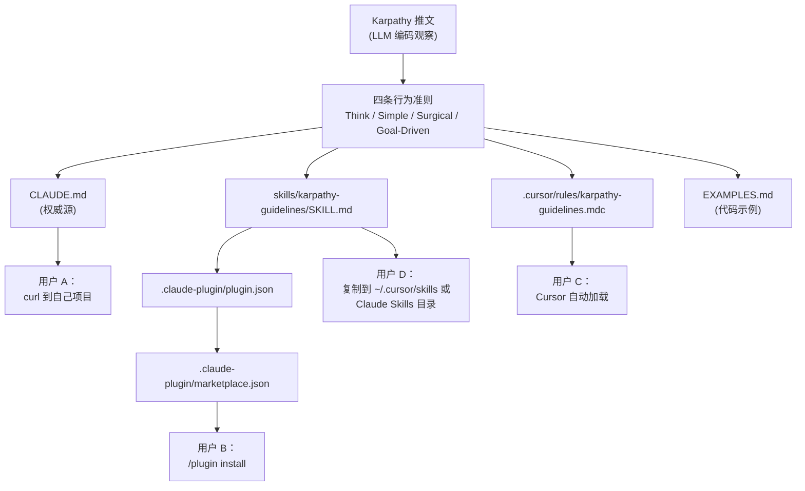
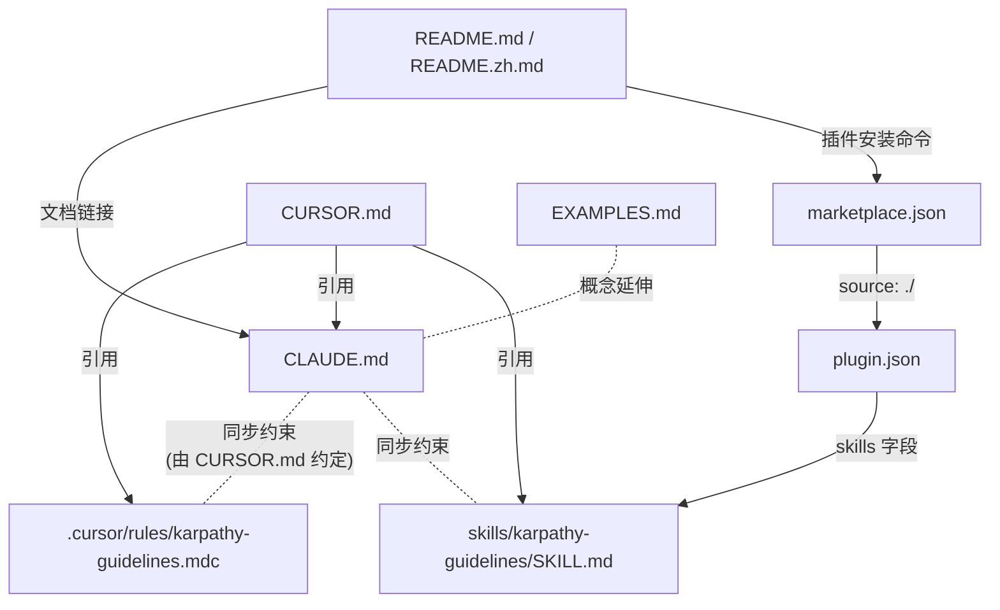
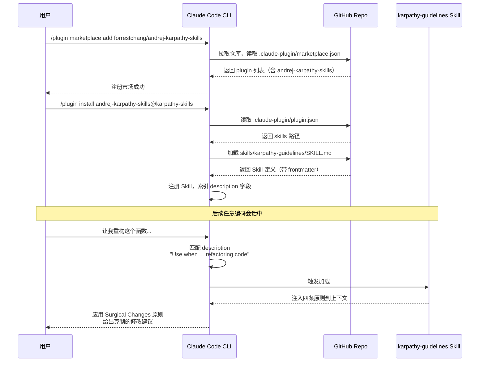
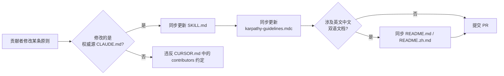

# andrej-karpathy-skills 源码学习笔记

> 仓库地址：[multica-ai/andrej-karpathy-skills](https://github.com/multica-ai/andrej-karpathy-skills)
> 学习日期：2026-05-22

---

> **以下为 AI 源码分析**
>
> ### 一句话概括
>
> 一个把 Andrej Karpathy 关于 LLM 编码陷阱的观察提炼成"四条行为准则"的纯文档项目，并以 Claude Code Plugin、Cursor Rule、`CLAUDE.md` 三种形态分发同一份准则。
>
> ### 要点速览
>
> | 模块 | 职责 | 关键文件 |
> |------|------|---------|
> | 核心准则文档 | 四条行为原则的"权威源" | `CLAUDE.md` |
> | Claude Code 插件 | 通过 plugin marketplace 分发 | `.claude-plugin/plugin.json`、`.claude-plugin/marketplace.json` |
> | Claude Skill 定义 | Skill 形态承载相同内容 | `skills/karpathy-guidelines/SKILL.md` |
> | Cursor Rule | Cursor 编辑器自动加载的项目规则 | `.cursor/rules/karpathy-guidelines.mdc` |
> | 示例与说明 | 文档与对外说明 | `README.md`、`README.zh.md`、`EXAMPLES.md`、`CURSOR.md` |

---

## 项目简介

`andrej-karpathy-skills` 不是一个"代码项目"——它没有可执行代码、没有依赖、没有构建过程。它的全部价值在于把 Andrej Karpathy 在 X 上发布的关于 LLM 编码陷阱的观察（[原推](https://x.com/karpathy/status/2015883857489522876)）凝练成 **四条可直接灌输给 AI 编码助手的行为准则**：

1. **Think Before Coding**（编码前思考）—— 反对模型默默猜测、隐藏困惑
2. **Simplicity First**（简洁优先）—— 反对过度抽象与臆造功能
3. **Surgical Changes**（精准修改）—— 反对修复某个 bug 时顺手"改进"无关代码
4. **Goal-Driven Execution**（目标驱动执行）—— 把模糊指令转化为带验证循环的可验证目标

它的核心解决的是"LLM 写代码时的常见行为偏差"问题。技术上的工程量极轻，但其设计选择（同一份内容多通道分发、契约文档同步约束）是值得学习的——这是一个典型的 **"prompt 即产品"** 的项目。

## 技术栈

| 类别 | 技术 |
|------|------|
| 语言 | Markdown（无可执行代码） |
| 框架 | Claude Code Plugin Spec、Cursor Rules（`.mdc` with frontmatter）、Claude Agent Skill Spec |
| 构建工具 | 无 |
| 依赖管理 | 无 |
| 测试框架 | 无 |

> 唯一的"运行时"是承载这些准则的 LLM Agent（Claude Code、Cursor）。项目通过 frontmatter 元数据（YAML）把同一份 Markdown 装配到不同 Agent 平台上。

## 目录结构

```
andrej-karpathy-skills/
├── CLAUDE.md                          # 准则的"权威源"：四条原则的纯净版本
├── README.md                          # 项目主文档（英文）
├── README.zh.md                       # 项目主文档（中文）
├── EXAMPLES.md                        # 四个原则的反例/正例代码示例集
├── CURSOR.md                          # 在 Cursor 中使用的说明
├── .claude-plugin/                    # Claude Code 插件元数据
│   ├── plugin.json                    # 单个插件描述（指向 skills 目录）
│   └── marketplace.json               # 插件市场清单（容器，列出本仓库提供的插件）
├── .cursor/
│   └── rules/
│       └── karpathy-guidelines.mdc    # Cursor 项目规则（alwaysApply: true）
└── skills/
    └── karpathy-guidelines/
        └── SKILL.md                   # Claude Agent Skill 定义（带 frontmatter）
```

## 架构设计

### 整体架构

整个项目可以理解为 **"一份内容、三种封装"** 的发布模型：

- **内容层**：四条原则的文本（约 60 行）作为 Single Source of Truth，主体内容在 `CLAUDE.md`、`SKILL.md`、`karpathy-guidelines.mdc` 中以几乎相同的措辞出现
- **封装层**：每种分发渠道用各自规范的 frontmatter 包装（Skill 用 `name/description/license`、Cursor 用 `description/alwaysApply`、Plugin 用 JSON 元数据）
- **示例层**：`EXAMPLES.md` 提供独立的"反例 vs 正例"代码片段，加深读者对每条原则的理解
- **入口层**：`README.md` / `CURSOR.md` 告诉用户如何选择合适的安装方式



### 核心模块

#### 模块 1：核心准则文档（`CLAUDE.md`）

- **职责**：作为四条原则的"权威源"，被 README、SKILL、Cursor Rule 共同引用
- **关键文件**：`CLAUDE.md`（66 行）
- **内容结构**：每条原则一个 H2 段落，每段开头一句加粗"slogan"，后跟项目符号清单
- **与其他模块的关系**：`CONTRIBUTING` 约定（见 `CURSOR.md` 末段）要求修改原则时同步更新 `CLAUDE.md`、`.cursor/rules/karpathy-guidelines.mdc`、`skills/karpathy-guidelines/SKILL.md` 三处

#### 模块 2：Claude Code 插件分发（`.claude-plugin/`）

- **职责**：把仓库注册成一个可被 `/plugin marketplace add` + `/plugin install` 安装的 Claude Code 插件
- **关键文件**：
  - `plugin.json`：描述单个插件，关键字段 `"skills": ["./skills/karpathy-guidelines"]`，把仓库中的 skill 挂到插件下
  - `marketplace.json`：定义市场容器 `id: "karpathy-skills"`，内含一个插件 `name: "andrej-karpathy-skills"`
- **关键接口**：Claude Code 插件 spec 要求 `marketplace.json` 在仓库根的 `.claude-plugin/` 下被 `plugin marketplace add` 发现
- **与其他模块的关系**：`plugin.json` 通过相对路径 `./skills/karpathy-guidelines` 引用 skill 模块

#### 模块 3：Claude Agent Skill 定义（`skills/karpathy-guidelines/SKILL.md`）

- **职责**：以 Claude Skill 规范封装四条准则，使其在 Claude 环境中作为可触发 Skill 加载
- **关键文件**：`SKILL.md`（68 行）
- **关键 frontmatter**：
  - `name: karpathy-guidelines`
  - `description: ...Use when writing, reviewing, or refactoring code...`（这一行决定 Skill 何时被触发）
  - `license: MIT`
- **与其他模块的关系**：被 `.claude-plugin/plugin.json` 通过路径引用；`description` 字段是 Claude 触发该 Skill 的关键 hint

#### 模块 4：Cursor Rule（`.cursor/rules/karpathy-guidelines.mdc`）

- **职责**：Cursor 编辑器项目规则的标准文件，打开仓库时被 Cursor 自动加载
- **关键文件**：`karpathy-guidelines.mdc`（70 行）
- **关键 frontmatter**：
  - `description: ...`
  - `alwaysApply: true` —— 这是 Cursor 规则的关键开关，决定该规则在所有对话中始终生效，无需 Cursor 主动 retrieval
- **与其他模块的关系**：内容与 `CLAUDE.md` 几乎逐字一致，仅 frontmatter 不同

#### 模块 5：代码示例集（`EXAMPLES.md`）

- **职责**：用真实代码场景演示"LLM 常见错误做法 vs 应有的正确做法"
- **关键文件**：`EXAMPLES.md`（约 520 行）
- **结构**：每条原则下 2-3 个例子，每个例子都给出 ❌ 反例 + ✅ 正例 + 关键点标注
- **与其他模块的关系**：在 `CLAUDE.md`/`SKILL.md` 中没有直接引用，是面向人类读者的"延伸阅读"

### 模块依赖关系



## 核心流程

### 流程一：用户通过 Plugin Marketplace 安装并触发 Skill

这是项目的"主路径"——读者作为 Claude Code 用户如何拿到这套准则并让它生效。



**关键步骤说明：**

1. `marketplace.json` 的 `id: "karpathy-skills"` 决定了用户安装命令中 `@karpathy-skills` 的后缀
2. `plugin.json` 的 `skills: ["./skills/karpathy-guidelines"]` 是 Claude Code 找到 Skill 文件的唯一线索——路径写错则插件加载失败
3. Skill 的 `description` frontmatter 是触发关键——本项目使用 `"Use when writing, reviewing, or refactoring code..."` 这种"动词触发"措辞，覆盖大多数编码场景，几乎相当于 `alwaysApply`

### 流程二：内容多通道同步流程（贡献者视角）

由于同一份内容存在于三个文件，仓库存在隐式的"内容同步"流程，这是项目最值得学习的"工程约定"之一。



**关键点：** `CURSOR.md` 末段以"For contributors"小节明文规定了同步要求——这是文档项目里很重要的"软契约"。没有 CI 自动校验时，这条规则的执行靠 reviewer 人工把关。

## 关键设计亮点

### 亮点 1：用 frontmatter 把同一份 Markdown 装配到不同 Agent 平台

**解决了什么问题：** Claude Code Plugin、Cursor Rule、Claude Skill 三个平台的元数据规范完全不同，但项目希望让同一组准则在三处都能正确触发。

**具体实现方式：**

- `CLAUDE.md`：无 frontmatter，作为"裸"参考内容
- `SKILL.md`：YAML frontmatter `name + description + license`，符合 Claude Skill spec
- `karpathy-guidelines.mdc`：YAML frontmatter `description + alwaysApply: true`，符合 Cursor Rule spec
- `.claude-plugin/plugin.json` 和 `marketplace.json`：JSON 元数据，符合 Claude Code Plugin spec

**为什么这样设计：** 与其在每个平台独立维护内容（容易腐烂），不如让正文逐字对齐、只在 frontmatter 上做平台差异化。维护成本几乎只剩"修改时记得三处都改"。

### 亮点 2：用 `description` 措辞做 Skill 触发设计

**解决了什么问题：** Claude Skill 的触发不是基于关键字精确匹配，而是基于 `description` 字段的语义检索。措辞写得太窄会漏触发，写得太宽会污染所有对话。

**具体实现方式：**

`skills/karpathy-guidelines/SKILL.md` 第 3 行：

> `description: Behavioral guidelines to reduce common LLM coding mistakes. Use when writing, reviewing, or refactoring code to avoid overcomplication, make surgical changes, surface assumptions, and define verifiable success criteria.`

这一句包含了：
- **触发动词清单**：writing / reviewing / refactoring code（覆盖三大编码场景）
- **目标关键词**：overcomplication / surgical changes / surface assumptions / verifiable success criteria（与四条原则一一对应）

**为什么这样设计：** 这种"动词 + 目标"的双层措辞，让 Claude 在用户提到"重构""审查""写函数"等任何编码相关请求时都能高概率召回此 Skill，同时通过四个目标关键词确保召回准确性。这是 Skill 设计的一个典型范本。

### 亮点 3：把"反例 vs 正例"的代码示例独立成 EXAMPLES.md

**解决了什么问题：** 行为准则若只是抽象口号，LLM 和人类读者都难以落地。把每条原则配上"❌ 错误做法 + ✅ 正确做法"的真实代码 diff，比纯文字描述高一个量级地有说服力。

**具体实现方式：**

`EXAMPLES.md` 给每条原则配 2-3 个完整的代码场景，例如：

- "Add a function to calculate discount" 的反例展示了一个用 `ABC + Strategy + dataclass` 的 30 行过度抽象，正例只有 2 行函数（对应 *Simplicity First*）
- "Fix the bug where empty emails crash the validator" 用真实的 git diff 风格展示了"只改两行 vs 顺手改了 5 行无关代码"的区别（对应 *Surgical Changes*）

**为什么这样设计：** 一个有趣的取舍——`EXAMPLES.md` 没有被打包进 Skill / Cursor Rule（这两个都是只引用核心 60 行原则）。原因可能是：
- Skill 上下文宝贵，500 行示例会挤占 token
- 示例对人类的教育价值大于对 LLM 的指导价值（LLM 已经"见过"无数好坏代码）
- 这就把 `EXAMPLES.md` 定位为 **"给人看的训练材料"**，与 Skill/Rule 的 **"给 LLM 看的运行时约束"** 分离

### 亮点 4：在 `CURSOR.md` 中显式声明同步契约

**解决了什么问题：** 三处内容并存的 Markdown 项目，最大风险是修改时漏改某一份。

**具体实现方式：**

`CURSOR.md` 末尾的 "For contributors" 段落（第 26-28 行）明文写道：

> "When you change the four principles, keep **CLAUDE.md** and **.cursor/rules/karpathy-guidelines.mdc** in sync. If the published skill/plugin text should match, update **skills/karpathy-guidelines/SKILL.md** as well."

**为什么这样设计：** 在缺少 CI 自动同步检查的情况下，把约定写进面向贡献者的文档是低成本但有效的"治理手段"。这是文档型仓库管理跨文件一致性的常见做法——**用人类约定代替自动化**，因为这种项目本身体量极小，不值得为它搭一套校验工具。

### 亮点 5：内容设计本身体现了它推广的原则

**解决了什么问题：** "推广简洁原则的项目本身却很臃肿"是常见的反讽。

**具体实现方式：**

- `CLAUDE.md` 仅 66 行，每条原则 10 行左右
- 项目无依赖、无构建、无测试代码
- frontmatter 只填必要字段，没有冗余配置
- 只用 4 条原则覆盖 LLM 编码主要陷阱，没有第 5、第 6 条试图穷尽

**为什么这样设计：** 这是项目最优雅的一点——它在自身形态上贯彻了 "Simplicity First"。如果作者堆砌出一个庞大的"AI 行为规范框架"，反而违背了项目本身要传达的价值。读者可以从仓库的"克制"看出作者对这套准则的真实态度，这种"言行一致"本身就是说服力的一部分。
