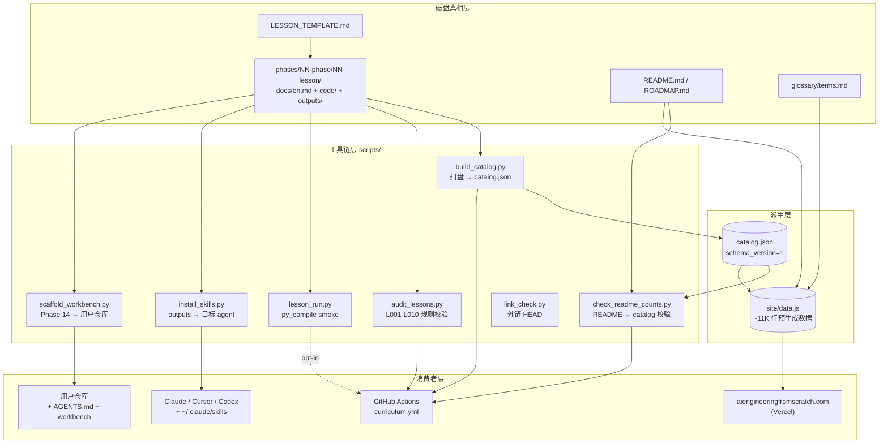
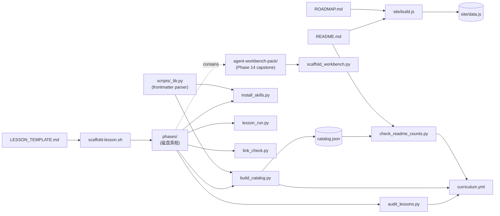
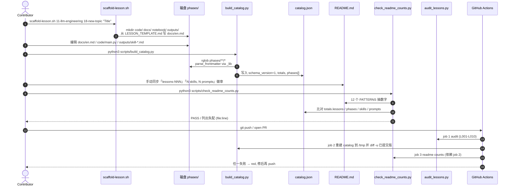
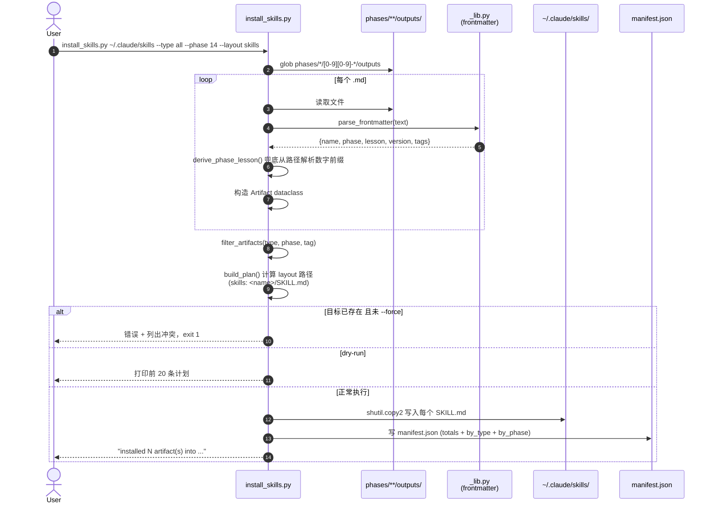

# ai-engineering-from-scratch 源码学习笔记

> 仓库地址：[rohitg00/ai-engineering-from-scratch](https://github.com/rohitg00/ai-engineering-from-scratch)
> 学习日期：2026-05-24

---

> **以下为 AI 源码分析**
>
> ### 一句话概括
>
> 一份从线性代数一路到多 Agent 集群的开源 AI 工程课程，用「文件系统即数据库」的方式把 20 个阶段、435 节课、378 个 SKILL 制品组织成可被 catalog/install/audit 三类 Python 工具自动消费的统一仓库。
>
> ### 要点速览
>
> | 维度 | 内容 |
> |------|------|
> | 仓库性质 | 课程仓库（curriculum repo），不是单一应用，文件系统即真相 |
> | 课程规模 | 20 phases · 435 lessons · 378 skills · 99 prompts · 435 个 code 入口 |
> | 关键路径 | `phases/<NN-phase>/<NN-lesson>/{docs/en.md, code/, outputs/, quiz.json}` |
> | 核心工具 | `scripts/build_catalog.py` 扫盘出 `catalog.json`，`audit_lessons.py` 检查目录契约，`install_skills.py` 把 SKILL 拷到 agent 里 |
> | 静态站点 | `site/build.js`（纯 Node + 正则）从 `README.md` 解析出 `data.js`，托管在 Vercel |
> | CI 红线 | `catalog.json` / `README.md` 计数与磁盘三方一致，任一漂移即 PR fail |
> | Agent 制品 | Phase 14 capstone 输出可移植的 Agent Workbench Pack（AGENTS.md + schemas + scripts） |
> | 核心模式 | 制品驱动学习（Build It → Use It → Ship It），每节课交付一个 prompt/skill/agent |

---

## 项目简介

`ai-engineering-from-scratch` 是 Rohit Ghumare 维护的一份 MIT 开源 AI 工程课程，号称用 320 小时把零基础学习者带到能写 LLM、Agent、MCP 服务器的水平。它的「源码价值」不在于一份算法实现，而在于**如何用文件系统组织一门 435 节课的课程并让 CI 帮你守住一致性**：每节课是 `docs/en.md` + `code/main.py` + `outputs/skill-*.md` 的统一壳，根目录的 `catalog.json` 是磁盘内容的镜像，README 里所有计数都被 CI 钉死在这份 catalog 上。学习者收获的是一套「Build It / Use It / Ship It」的教学循环；二次开发者收获的是一套可复用的 curriculum 工具链（catalog 构建、目录不变量审计、SKILL 安装器、Agent Workbench 脚手架）。

## 技术栈

| 类别 | 技术 |
|------|------|
| 语言 | Python 3.10+（脚本与课程主语言）、TypeScript / JavaScript（站点 build + 部分 lesson）、Rust / Julia（少量 lesson） |
| 框架 | 无服务端框架；课程依赖 PyTorch / Transformers / Anthropic SDK / OpenAI SDK 等（`requirements.txt`） |
| 构建工具 | `node site/build.js`（站点）、`python3 scripts/build_catalog.py`（数据） |
| 依赖管理 | `requirements.txt`（pip）、Vercel `installCommand: "echo skip"` 跳过 npm |
| 测试框架 | 自研 `scripts/audit_lessons.py`（10 条 L001–L010 规则）+ `scripts/lesson_run.py`（py_compile 语法 smoke test）+ `scripts/link_check.py`（外链检查） |
| 部署 | Vercel 静态站（`vercel.json` 指定 `outputDirectory: site`）+ GitHub Actions（`curriculum.yml`） |

## 目录结构

```
ai-engineering-from-scratch/
├── README.md                # 1000+ 行的课程门户，所有计数会被 CI 校验
├── ROADMAP.md               # 每节课的进度（✅/🚧/⬚），site/build.js 会解析
├── LESSON_TEMPLATE.md       # 新课模板，scaffold-lesson.sh 复制
├── catalog.json             # 由 build_catalog.py 自动生成；schema_version=1
├── requirements.txt         # 全部 lesson 共用的 Python 依赖
├── vercel.json              # 静态站点路由 + 缓存策略
├── phases/                  # 课程主体：phases/NN-phase/NN-lesson/
│   ├── 00-setup-and-tooling/
│   ├── 01-math-foundations/
│   ├── ...
│   └── 19-capstone-projects/
│       └── NN-lesson/
│           ├── docs/en.md   # 必含 H1，>200 字节（L002/L003/L004 规则）
│           ├── code/main.py # 至少一个非占位文件（L005 规则）
│           ├── outputs/     # skill-*.md / prompt-*.md / agent-*.md，带 YAML frontmatter
│           ├── quiz.json    # 可选；schema 由 audit 校验
│           ├── notebook/    # 可选；jupyter 入口
│           └── assets/      # 可选；图片/数据
├── scripts/                 # 课程工具链（stdlib only Python 3.10+）
│   ├── _lib.py              # 共享 frontmatter 解析（YAML 子集）
│   ├── build_catalog.py     # 扫盘 → catalog.json
│   ├── audit_lessons.py     # 目录不变量校验（CI gate）
│   ├── check_readme_counts.py # 校验 README 中的计数 ↔ catalog
│   ├── install_skills.py    # 把 outputs/*.md 拷给 Claude/Cursor/...
│   ├── scaffold_workbench.py# 把 Phase 14 capstone 注入任意目标仓库
│   ├── lesson_run.py        # py_compile 全部 lesson；可选 --execute
│   ├── link_check.py        # HTTP HEAD 校验外链 + 7 天缓存
│   └── scaffold-lesson.sh   # 用 LESSON_TEMPLATE.md 创建新课
├── site/                    # 纯静态前端（无打包器）
│   ├── build.js             # Node 解析 README+ROADMAP+glossary 生成 data.js
│   ├── data.js              # 11K 行的预生成数据，被 *.html 直接引用
│   ├── index.html / lesson.html / catalog.html / glossary.html / prereqs.html
│   ├── app.js / cmdpalette.js / progress.js / header.js / style.css
│   └── assets/              # SVG / OG image
├── glossary/terms.md        # 术语表（被 site/build.js 解析）
├── projects/, web/          # 留空占位（.gitkeep）
└── .github/
    └── workflows/curriculum.yml  # 三段 CI：audit / catalog drift / readme drift
```

## 架构设计

### 整体架构

整个仓库是一个**「磁盘即数据库 + 工具链 + 静态站」**的三层结构：

- **磁盘真相层（Source of Truth）**：每节课就是一个目录，结构由 `audit_lessons.py` 的 10 条规则锁死。课程内容（Markdown / 代码 / 制品）以人类可读形式提交，git 是唯一存储。
- **派生数据层（Derived Index）**：`build_catalog.py` 扫盘生成 `catalog.json`，作为「真相的索引」。任何外部消费者（站点、CI、计数校验）都读它而不是重扫磁盘。
- **消费者层（Consumers）**：站点 `site/build.js` 把 README/ROADMAP 渲染成 `data.js`；`install_skills.py` 把 `outputs/*.md` 安装到 Claude / Cursor 等 agent；`scaffold_workbench.py` 把 Phase 14 capstone 注入到用户仓库。

CI 是这套架构的「警察」：在 PR 上同时跑 `audit_lessons.py`（磁盘合规）、`catalog drift`（catalog 是否过期）、`README counts`（README 计数是否对得上 catalog），三关任一失败即拒。



### 核心模块

#### 模块 1：lesson 目录契约（`phases/`）

- **职责**：用「目录即记录」的方式承载所有课程内容。每个 lesson 是一个 `NN-slug` 目录，结构固定。
- **核心文件 / 路径**：
  - `phases/<NN-phase>/<NN-lesson>/docs/en.md`：课程正文，必须有 H1、字节数 ≥ 200。
  - `phases/<NN-phase>/<NN-lesson>/code/`：可运行实现，至少 1 个非占位文件。
  - `phases/<NN-phase>/<NN-lesson>/outputs/`：以 `skill-` / `prompt-` / `agent-` 前缀命名的 Markdown，YAML frontmatter 必须含 `name` / `description` / `version` / `phase` / `lesson`。
  - `phases/<NN-phase>/<NN-lesson>/quiz.json`：可选，新 schema `{stage, question, options, correct, explanation}`，旧 schema `{q, choices, answer}` 会被 L007 拒收。
- **关键约束**：
  - `LESSON_DIR_RE = ^[0-9]{2}-[a-z0-9][a-z0-9-]*[a-z0-9]$`（`audit_lessons.py:25`）——名称必须双数字前缀 + kebab-case。
  - 内部链接必须能解析到磁盘文件（L010）。
- **与其他模块关系**：被 `build_catalog.py` 扫描、被 `audit_lessons.py` 校验、被 `install_skills.py` 收割 outputs、被 `scaffold-lesson.sh` 创建。

#### 模块 2：catalog 引擎（`scripts/build_catalog.py` + `_lib.py`）

- **职责**：把磁盘上 1000+ 个文件压缩成一份扁平 `catalog.json`，作为站点和 CI 的唯一索引。
- **核心文件 / 函数**：
  - `build_catalog.py:build_catalog()`：顶层入口，返回 `{schema_version, totals, phases}`。
  - `build_catalog.py:slug_to_title()`：用一个 hardcode 的 `fixups` 字典把 kebab slug 转成展示标题（`llm` → `LLM`、`rewoo` → `ReWoo`）。
  - `build_catalog.py:list_outputs()` + `parse_artifact()`：扫描 outputs/ 下 `skill-*.md` / `prompt-*.md` / `agent-*.md`，从 frontmatter 抽 `name` / `tags` / `version`。
  - `_lib.py:parse_frontmatter()`：自研 YAML 子集解析器，只支持 bare / quoted / 单行数组三种值类型，stdlib only。
- **关键设计**：`code_files` / `outputs` / `has_quiz` 全是磁盘探测结果而非 frontmatter 自报，避免课程作者写错 frontmatter 后污染索引。
- **关系**：上游被 `audit_lessons.py` 通过磁盘共享间接消费；下游产物 `catalog.json` 被 `check_readme_counts.py`、`site/build.js`、CI drift gate 同时读取。

#### 模块 3：不变量审计（`scripts/audit_lessons.py`）

- **职责**：在 CI 上守住 lesson 目录的 10 条结构规则，让磁盘永远是干净的「真相」。
- **规则编号**：
  - L001：lesson 目录名匹配 `NN-slug` 正则。
  - L002 / L003 / L004：`docs/en.md` 存在、UTF-8 合法、≥200 字节、含 H1。
  - L005：`code/` 非空（排除 `.gitkeep` 等噪声文件）。
  - L006 / L007 / L008 / L009：`quiz.json` 是非空数组、非 legacy schema、`options` 长度在 2-6、`correct` 是合法索引（issue #102 留下的疤痕）。
  - L010：`docs/en.md` 中的相对链接都能解析。
- **关键设计**：用 `dataclass Issue / Audit` 累加错误，每条记录到 `(rule, lesson, file, message)`；`--json` / `--phase` 让 CI 和本地都能用同一脚本。
- **关系**：CI `curriculum.yml` 第一个 job 直接调它，失败即整条流水线红。

#### 模块 4：双向漂移防线（`build_catalog.py` ↔ `check_readme_counts.py`）

- **职责**：解决「README 上的计数总是过期」这个开源仓库通病。
- **核心机制**：
  - `check_readme_counts.py:PATTERNS` 是一组 `CountPattern(regex, field, description)`：把 README 里 `lessons-435-3553ff` / `alt="20 phases"` / `(\d+) lessons\. \d+ phases\.` / `portfolio of (\d+) artifacts` / `(\d+) skills and (\d+) prompts` 等硬编码 12 处计数全部钉到 catalog 的 `totals.<field>`。
  - 跑 `python3 scripts/check_readme_counts.py` 比对，任何失配带行号 + snippet 报出。
  - 提供 `--fix` 反向用 catalog 重写 README（人为审阅后才打开）。
- **CI 配合**：`curriculum.yml` 中 `catalog-drift` job 重建 catalog 与 git 中的 `catalog.json` 做 `diff -u`，再触发 `readme-counts-drift`。任意一处不一致都 fail。
- **关系**：CI 三段串联——`audit_lessons` → `catalog drift` → `readme counts`，构成「磁盘 → 索引 → 文档」的双向闭环。

#### 模块 5：制品分发器（`scripts/install_skills.py`）

- **职责**：把分散在 lesson 里的 378 个 SKILL 一键拷贝到 agent 期望的目录布局。
- **关键设计**：
  - `Artifact` dataclass 把 frontmatter（`phase` / `lesson` / `version` / `tags`）和磁盘路径（兜底 `derive_phase_lesson()` 从路径段反推数字前缀）合并成一条记录。
  - 三种 layout：`skills`（`<name>/SKILL.md`，Claude / Cursor 默认布局）、`by-phase`（按 phase 分目录）、`flat`。
  - `build_plan()` 先做 dry-run、检测目标碰撞，`--force` 才覆盖；总是写一份 `manifest.json` 记录全部安装产物。
- **支持的过滤**：`--type {skill,prompt,agent,all}` / `--phase N` / `--tag X`。
- **关系**：被 README 推荐为「`python3 scripts/install_skills.py ~/.claude/skills`」，是把课程产出真正塞回 agent 的执行入口。

#### 模块 6：Agent Workbench Pack（`phases/14-agent-engineering/42-agent-workbench-capstone/outputs/agent-workbench-pack/`）

- **职责**：Phase 14 capstone 沉淀的「可移植 agent 工作台」——把 AGENTS.md + JSON Schema + 状态机脚本打包成一个 pack，再由 `scripts/scaffold_workbench.py` 注入到外部仓库。
- **pack 内容**：
  - `AGENTS.md`：builder agent 的根契约。
  - `schemas/`：`agent_state.schema.json` / `task_board.schema.json` / `scope_contract.schema.json` 三套 JSON Schema。
  - `scripts/`：`init_agent.py`、`run_with_feedback.py`、`verify_agent.py`、`generate_handoff.py` 四脚本。
  - `docs/`：`agent-rules.md`、`reviewer-rubric.md`、`handoff-protocol.md`、`reliability-policy.md`。
  - `VERSION`：版本号文本，安装后落到目标仓库的 `.workbench-version`。
- **scaffold 流程**（`scaffold_workbench.py`）：
  1. `validate_pack()` 检查 pack 完整性。
  2. `plan_copies()` 生成 file/tree/version 三类动作。
  3. `detect_collisions()` + `--force` 控制覆盖。
  4. `seed_task_board()` / `seed_agent_state()` 写入种子 JSON（不覆盖已有）。
  5. 末尾打印 next steps，引导用户「编辑 task_board → 编辑 AGENTS.md → 跑 init_agent → 把契约交给 agent」。
- **关系**：是「课程制品的最高级形态」——既是 lesson 产物，也是被 `scaffold_workbench.py` 二次包装成可执行工具。

### 模块依赖关系



## 核心流程

### 流程一：贡献者新增一节课，PR 进 CI

这是这套架构最日常的循环。一名贡献者用 `scaffold-lesson.sh` 落盘新课，编辑 docs/code/outputs，然后让 CI 替他守住计数和契约。



**关键点**：CI 的 `catalog-drift` job 不是再扫一遍磁盘和 `check_readme_counts` 比对，而是直接和**仓库里 git 提交的** `catalog.json` 做 diff——逼迫贡献者本地必须先重建 catalog 才能合上去。这种「checked-in derived artifact」的做法等价于把 catalog 当成 lockfile，强迫 PR 作者承担漂移修复成本，而不是让 CI 帮他自动 fix。

### 流程二：用户把课程产物装进自己的 Agent

学习者跑完一段课程后想用学到的 SKILL，调一行命令把全部 378 个 SKILL（或某个子集）安装到 `~/.claude/skills/` 这种 agent 期望的目录。



**关键点**：
- 安装器不依赖 `catalog.json`——它在执行时实时扫盘解析 frontmatter，对环境零外部依赖（stdlib only）。这是合理的：用户拿到的可能是 `pip install` 后没有完整 git 历史的 tarball。
- `derive_phase_lesson()` 用「路径段以 0/1/2 开头 + 含 `-`」的启发式抽出数字前缀，作为 frontmatter 缺失时的兜底。这保证了即使作者忘填 `phase: 14`，安装器也能凭路径恢复正确的 by-phase 布局。
- `manifest.json` 既是 audit log 也是回滚依据——下次 `install_skills.py` 再跑时，用户能看到目标目录已有的旧版本。

## 关键设计亮点

1. **「文件系统即数据库 + 派生 lockfile」模式（catalog.json drift gate）**
   - **解决问题**：开源课程仓库的「README 计数过期」「目录结构不统一」「贡献者口径漂移」三大顽疾。
   - **实现方式**：`scripts/build_catalog.py` 把磁盘扫成 `catalog.json`（schema_version=1）；`scripts/check_readme_counts.py` 用 12 个正则把 README 里所有硬编码计数钉到 catalog 字段；CI（`.github/workflows/curriculum.yml` 的 `catalog-drift` + `readme-counts-drift` 两个 job）在 PR 上重建 catalog 并 `diff -u` 已提交版本，任一漂移就 fail。
   - **设计动机**：把派生数据 commit 进仓库（而不是 CI 自动生成）等于把 catalog 当成 lockfile——审阅者能在 diff 里直接看到课程结构变化，PR 作者必须本地先跑 `build_catalog.py` 才能合并。这套机制让一份 1000 行 README 维持 7.5K star 规模仍然准确。

2. **stdlib-only 工具链 + 自研 YAML 子集解析器**
   - **解决问题**：课程脚本如果用 `pyyaml` / `requests` 这类第三方依赖，贡献者环境会变得脆弱、CI 会变慢、跑 `install_skills.py` 的最终用户还得 `pip install`。
   - **实现方式**：`scripts/_lib.py` 写了一个 60 行的 YAML 子集 `parse_frontmatter()`，只支持课程实际用到的形态——bare strings、`'…'` / `"…"` 引号、`[a, b, "c"]` 单行数组、`#` 注释。`scripts/link_check.py` 用 `urllib` + `ThreadPoolExecutor` 自己实现并发 HEAD 请求 + 7 天本地缓存。`scripts/lesson_run.py` 用 stdlib `py_compile` 做语法 smoke test。
   - **设计动机**：限制依赖等同于限制 attack surface 也限制版本漂移，让 8 个核心脚本一起只有 ~2100 行，完全可以一口气读完。代价是 frontmatter 解析器不支持嵌套 / 多行——但课程作者从未真正需要它们。

3. **教学循环结构「Build It → Use It → Ship It」物化为目录契约**
   - **解决问题**：常见的 AI 教程要么纯讲算法（不能用），要么纯调 API（不知道底层）。这门课要求每节课都先用裸数学实现、再过 PyTorch / sklearn、最后产出一个 prompt/skill/agent/MCP 制品。
   - **实现方式**：
     - 「Build It」=`code/main.py`（Phase 14 Lesson 1 的 ReAct 循环只有 178 行 stdlib 代码，含 `ToolRegistry` / `ToyLLM` / `AgentLoop`，可以脱机跑出确定性 trace）。
     - 「Use It」= `docs/en.md` 中引用 PyTorch / Transformers / Anthropic SDK 的对照实现。
     - 「Ship It」= `outputs/skill-*.md`（`skill-agent-loop.md` 是一份 ReAct 写作 SKILL，含 hard rejects / refusal rules，可被 Claude 直接读取）。
   - **设计动机**：每节课都强制产出可重用制品，使学完之后「学习者」自然变成「贡献者 + 用户」——他装 `scripts/install_skills.py` 把自己写过的 SKILL 拼成日常工具集。这把课程从「视频观看」变成「构建工具」。

4. **Agent Workbench：从课程产物到生产工具的最后一跃**
   - **解决问题**：一节课产生一个 SKILL 已经有用，但真正在仓库上让 agent 自动跑还需要 AGENTS.md、状态机、reviewer rubric、handoff protocol 这一整套契约——课程不能只把它写在文档里。
   - **实现方式**：Phase 14 第 42 节（capstone）把这套契约打包成 `agent-workbench-pack/`：4 个 docs（agent-rules / reviewer-rubric / handoff-protocol / reliability-policy）+ 3 个 JSON Schema（agent_state / task_board / scope_contract）+ 4 个 Python 脚本（init / run_with_feedback / verify / generate_handoff）+ 一个 VERSION 文件。`scripts/scaffold_workbench.py` 把 pack 注入到任意外部仓库，并自动 seed 一份 `task_board.json` (`T-001` 占位任务) 和 `agent_state.json`（`schema_version: 1`）。
   - **设计动机**：将「论文级 agent 工程经验」固化成可被 `pip-installable / git clone-and-copy` 的目录脚手架，是开源 AI 工程的稀缺能力——别的课程会写「The Agent Loop」，这门课直接给一份能塞进真仓库的 pack。

5. **零打包器静态站 + Vercel 缓存哲学**
   - **解决问题**：要做 50K 月活的课程门户，但又不想引入 Next.js / 任何打包器（README 明示 `installCommand: "echo skip"`）。
   - **实现方式**：`site/build.js`（456 行纯 Node + 正则）解析 `README.md`、`ROADMAP.md`、`glossary/terms.md`，输出一份 ~11K 行的 `data.js` 全局变量；`*.html`（`index.html` / `lesson.html` / `catalog.html` / `glossary.html` / `prereqs.html`）通过 `<script src="data.js">` 直接消费。`vercel.json` 把 `*.html` 配 5 分钟浏览器缓存 + 1 天 CDN 缓存 + 1 周 SWR；静态资源（css/js/png/svg/woff2）则 1 天浏览器 + 1 周 CDN + 1 月 SWR。
   - **设计动机**：build.js 唯一依赖是 Node 自带的 `fs/path`，本地和 CI 都不需要 `npm install`，部署就是 `node site/build.js && vercel deploy`。同时 `vercel.json` 的 `rewrites`（`/glossary` → `/glossary.html`）让 URL 看起来像有路由系统，实则全是静态。整套站点是「让 README 成为真实数据源」的最直观体现——课程作者改 README，CI 自动重生成 `data.js`，站点自动更新。
