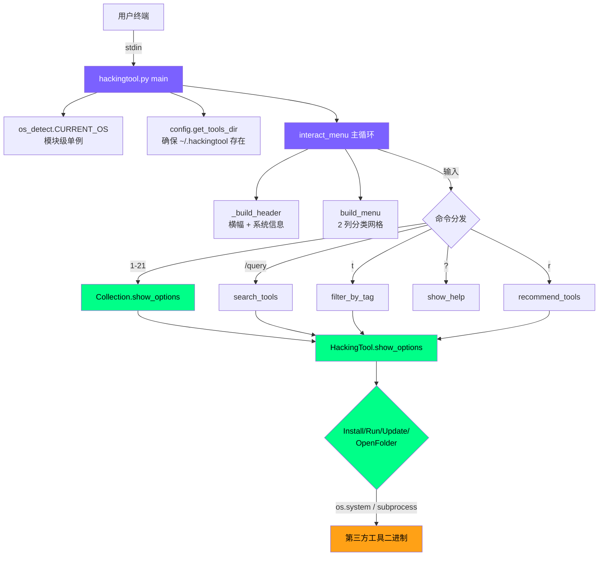
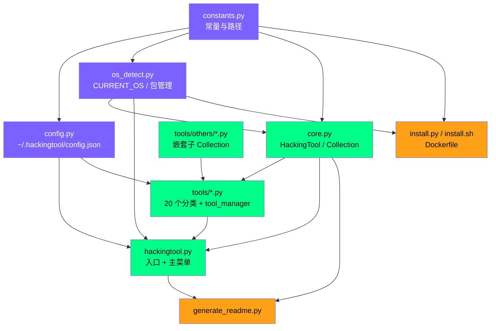
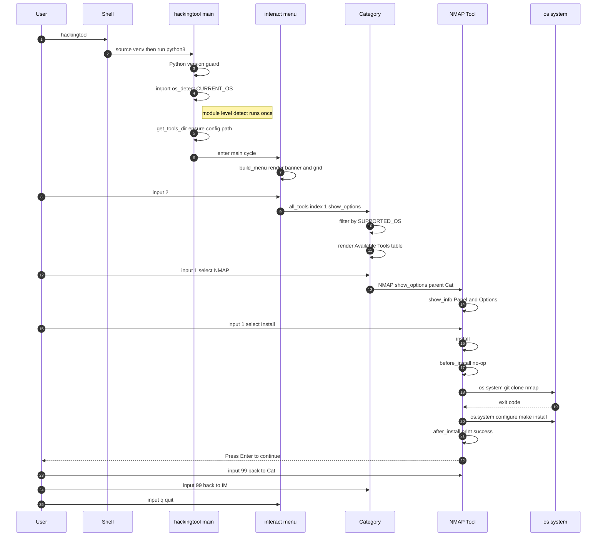
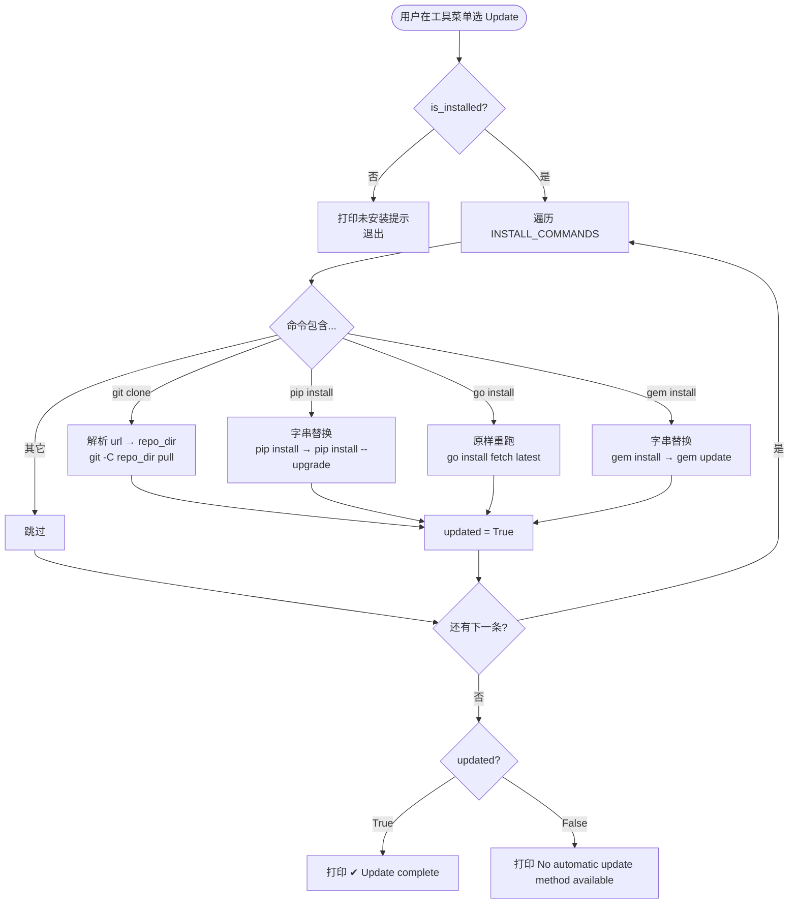

# hackingtool 源码学习笔记

> 仓库地址：[Z4nzu/hackingtool](https://github.com/Z4nzu/hackingtool)
> 学习日期：2026-05-22

---

> **以下为 AI 源码分析**
>
> ### 一句话概括
>
> hackingtool 是一个用 Python + Rich 库打造的纯 CLI 菜单驱动器，把 185+ 个第三方安全测试工具按 20 个分类聚合到一个统一交互入口下，统一处理 install / run / update / open-folder 四类操作，本身**不实现任何攻击逻辑**——只做"工具的工具"。
>
> ### 要点速览
>
> | 模块 | 职责 | 关键文件 |
> |------|------|---------|
> | 入口 + 主菜单 | 启动横幅、主菜单渲染、搜索 / 标签 / 推荐 / 帮助等顶层交互 | `hackingtool.py` |
> | 核心抽象 | `HackingTool`（单工具基类）+ `HackingToolsCollection`（分类容器） | `core.py` |
> | OS 探测 | 系统 / 发行版 / 包管理器检测，单例 `CURRENT_OS` | `os_detect.py` |
> | 配置中心 | 路径常量、版本号、主题色、默认配置 | `constants.py` `config.py` |
> | 工具注册表 | 20 + 1 个分类，每个文件即一个 Collection | `tools/*.py` |
> | 安装器 | 一键 shell 安装 / Python 安装、Docker | `install.sh` `install.py` `Dockerfile` |
> | README 自动生成 | 反射式遍历工具树生成文档 | `generate_readme.py` |

---

## 项目简介

hackingtool 把渗透测试常用的 185+ 个开源工具——从 nmap、BloodHound 到 SQLMap、SETOOLKIT——封装成一个**统一的 TUI 菜单**。它不重新实现这些工具，而是把每个工具的"git clone / pip install / go install"安装命令、运行命令、项目主页和分类标签建模成一个 Python 类（`HackingTool` 子类），然后用 Rich 库把这些类渲染成多级菜单和漂亮的表格。本质上它是一个**工具元数据数据库 + 菜单驱动 shell**，解决的核心问题是「分散的安全工具如何在一个入口下被发现、安装、更新和启动」。

## 技术栈

| 类别 | 技术 |
|------|------|
| 语言 | Python 3.10+ |
| 框架 | [Rich](https://github.com/Textualize/rich) （TUI 渲染：Panel / Table / Prompt / Theme） |
| 构建工具 | 无（纯解释执行）+ Docker（kali-rolling 基础镜像）+ shell installer |
| 依赖管理 | `requirements.txt`（运行期仅 `rich>=13.0.0`） |
| 测试框架 | 无单元测试；通过 `os.system` / `subprocess` 调用真实工具二进制 |

## 目录结构

```
hackingtool/
├── hackingtool.py          # CLI 入口 + 主菜单 + 搜索/标签/推荐
├── core.py                 # HackingTool / HackingToolsCollection 基类，菜单循环
├── constants.py            # 路径、版本、主题、PRIV_CMD 等不变量
├── config.py               # ~/.hackingtool/config.json 读写
├── os_detect.py            # 系统/发行版/包管理器探测（模块级单例 CURRENT_OS）
├── install.sh              # 一行 curl | sudo bash 安装器
├── install.py              # Python 版完整安装器（venv + 启动器）
├── update.sh               # 简易升级脚本
├── Dockerfile              # 基于 kali-rolling 的容器化运行环境
├── docker-compose.yml      # Compose 编排
├── generate_readme.py      # 反射工具树生成 README.md
├── README_template.md      # README 模板（含 {{toc}} {{tools}} 占位符）
├── requirements.txt        # 仅 rich>=13.0.0
└── tools/                  # 20+1 个分类，每个文件 = 1 个 HackingToolsCollection
    ├── __init__.py
    ├── information_gathering.py   # 27 个 OSINT/侦察工具
    ├── web_attack.py              # 21 个 Web 攻击工具
    ├── active_directory.py        # 6 个 AD 工具
    ├── cloud_security.py          # 5 个云安全工具
    ├── ...                        # 其余 17 个分类
    ├── tool_manager.py            # Update/Uninstall hackingtool 自身
    └── others/                    # other_tools.py 的子分类（嵌套 Collection）
        ├── android_attack.py
        ├── hash_crack.py
        └── ...                    # 11 个嵌套小集合
```

## 架构设计

### 整体架构

整体是一个**三层菜单 + 元数据驱动**的 TUI 应用：

- **入口层**（`hackingtool.py`）：渲染 ASCII 横幅 + 系统信息 + 2 列分类网格，监听 `/`（搜索）、`t`（标签过滤）、`r`（推荐）、`?`、`q`、`1–21` 等指令。
- **菜单循环层**（`core.py`）：`HackingToolsCollection.show_options()` 与 `HackingTool.show_options()` 都是**迭代式 while 循环**（注释明确写 "no recursion, no stack growth"），通过 `parent` 参数返回上级。Collection 在每次循环里调用 `_active_tools()` / `_archived_tools()` / `_incompatible_tools()` 三个分流方法，按当前 OS 与归档状态裁剪显示。
- **工具元数据层**（`tools/*.py`）：每个分类 `.py` 文件声明一组 `HackingTool` 子类（设置 `TITLE` / `DESCRIPTION` / `INSTALL_COMMANDS` / `RUN_COMMANDS` / `PROJECT_URL` / `SUPPORTED_OS` 等类属性），最后用一个 `XxxTools(HackingToolsCollection)` 把它们组装成 `TOOLS = [...]` 列表。



### 核心模块

#### 1. `core.HackingTool` —— 单个工具的基类

- **职责**：把"一个开源安全工具"抽象为一组类属性 + 一组钩子方法。子类只需声明数据，几乎不写代码。
- **关键文件**：`core.py:79-338`
- **关键类属性**：

  | 属性 | 类型 | 含义 |
  |------|------|------|
  | `TITLE` / `DESCRIPTION` | str | 菜单显示名 / 描述 |
  | `INSTALL_COMMANDS` | list[str] | 安装命令链（`os.system` 顺序执行） |
  | `RUN_COMMANDS` | list[str] | 启动命令链 |
  | `OPTIONS` | list[(name, fn)] | 额外操作（在 `__init__` 里追加） |
  | `PROJECT_URL` | str | 项目主页（Option 98 打开浏览器） |
  | `SUPPORTED_OS` | list[str] | `["linux", "macos"]`，Collection 据此过滤 |
  | `REQUIRES_ROOT/WIFI/GO/...` | bool | 依赖能力声明（目前只用于元数据） |
  | `TAGS` | list[str] | 手动标签（搜索/过滤用） |
  | `ARCHIVED` / `ARCHIVED_REASON` | bool/str | 归档标记（被收纳到子菜单 98） |

- **关键方法**：
  - `is_installed`（property）：先看 `RUN_COMMANDS[0]` 的二进制是否在 `PATH` 上（`shutil.which`），再看 `INSTALL_COMMANDS` 中的 `git clone` 目标目录是否存在。
  - `install()` / `run()` / `uninstall()`：模板方法模式，调用 `before_*` → 遍历命令 → `after_*`。
  - `update()`：**智能更新**——遍历 `INSTALL_COMMANDS`，对 `git clone` 调 `git -C <dir> pull`、`pip install` 改 `--upgrade`、`go install`/`gem install` 直接复跑。
  - `open_folder()`：调用 `_get_tool_dir()` 找到工具目录后 `os.system("cd ... && $SHELL")` 起一个交互 shell。
  - `show_options(parent)`：本工具的 4 项动作菜单循环。
- **依赖**：仅依赖 `core.console` 与 `constants.THEME_*`；与 `os_detect`、`config` 解耦。

#### 2. `core.HackingToolsCollection` —— 分类容器

- **职责**：聚合一组 `HackingTool`（或嵌套 Collection），渲染分类菜单，处理 OS 兼容过滤、批量安装（`97`）、归档子菜单（`98`）。
- **关键文件**：`core.py:340-489`
- **关键方法**：
  - `_active_tools()`：跳过 `ARCHIVED` 且 OS 不匹配的工具。
  - `_show_archived_tools()`：option 98 进入归档列表，仍可对归档工具进行 install/run。
  - `show_options(parent)`：与 `HackingTool` 同名方法呈对称结构，菜单循环里：option `97` 触发"批量安装当前分类未装工具"、`98` 看归档、`99` 返回。
- **嵌套支持**：`other_tools.OtherTools` 把 `SocialMediaBruteforceTools()`、`HashCrackingTools()` 等 11 个 **子 Collection** 直接当作 `TOOLS` 元素塞进去——`hackingtool.py:_collect_all_tools` 用递归 `_walk` 解决嵌套展平。

#### 3. `hackingtool.py` —— 入口与顶层交互

- **职责**：Python 版本守卫、构建总注册表 `all_tools`、横幅渲染、主循环、跨分类的搜索 / 标签 / 推荐三大入口。
- **关键文件**：`hackingtool.py:1-687`
- **关键代码点**：
  - `tool_definitions`（L61-83）+ `all_tools`（L85-107）：两份并行的列表，定义 21 个顶层条目。
  - `_get_all_tags()`（L346-381）：一组 `r'(...)'` 正则规则把 `TITLE+DESCRIPTION` 自动归类到 `osint / scanner / web / c2 / cloud / mobile / ...` 等 19 个标签。
  - `_RECOMMENDATIONS`（L432-455）：22 条「我想做 X → 用这些标签」的预设映射，是 `r` 推荐功能的硬编码大脑。
  - `interact_menu()`：`while True` + `try/except KeyboardInterrupt`，把 `/query`、`s`、`t`、`r`、`?`、`q`、整数选项分发到对应 handler。
- **健壮性**：`main()` 在跑主循环前显式拒绝 Windows、对 macOS 给出降级提示，并 `get_tools_dir()` 强制创建 `~/.hackingtool/tools`。

#### 4. `os_detect.py` —— OS 与包管理器探测

- **职责**：一次性探测系统、发行版、是否 root、是否 WSL、可用包管理器，导出**模块级单例** `CURRENT_OS`。
- **关键文件**：`os_detect.py:1-131`
- **关键事实**：
  - `detect()` 返回 `OSInfo` dataclass，按 `apt-get → pacman → dnf → zypper → apk → brew → pkg` 的优先级查找包管理器。
  - 同模块导出 `PACKAGE_INSTALL_CMDS` / `PACKAGE_UPDATE_CMDS` / `REQUIRED_PACKAGES` 三张表，按管理器选模板。
  - `install_packages()`：组装 `sudo|doas <pkg_mgr> install` 命令并 `subprocess.run(shell=True)`，**Linux 非 root 才加 `sudo`**，macOS / Docker root 跳过。
- **依赖反向流向**：`core.HackingToolsCollection._active_tools` 在过滤时**惰性 import** `os_detect.CURRENT_OS`，保证测试 / 独立调用 `tool_manager` 也能跑。

#### 5. `constants.py` + `config.py` —— 路径与配置

- **`constants.py`**：所有"不应被改"的常量。亮点：
  - 用 `Path.home() / f".{REPO_NAME}"` 而非硬编码 `/root/.hackingtool`，root / 普通用户 / macOS 通用。
  - 按 `platform.system()` 分流 `APP_INSTALL_DIR`：Linux `/usr/share/hackingtool`、macOS `/usr/local/share/hackingtool`。
  - `PRIV_CMD`：探测到 `doas` 优先用 doas，否则 `sudo`——给 OpenBSD 等环境留口子。
- **`config.py`**：`load()` / `save()` 读写 `~/.hackingtool/config.json`，加载时 `{**DEFAULT_CONFIG, **on_disk}` 合并新字段；`get_tools_dir()` 顺手 `mkdir -p`。
- **不可变 vs 可变 的分离**：constants 永远是源代码常量，config 是用户可改的运行期状态——这条边界很清晰。

#### 6. `tools/*.py` —— 工具注册表

- 每个文件是一个 `.py`，约 100–500 行，顶部 `from core import HackingTool, HackingToolsCollection`，中部连续 N 个 `class XxxTool(HackingTool): TITLE/DESCRIPTION/INSTALL_COMMANDS/...`，底部一个 `class XxxTools(HackingToolsCollection): TOOLS = [Tool1(), Tool2(), ...]`。
- 极个别工具（如 `information_gathering.PortScan` / `Host2IP`、`other_tools.HatCloud`）**重写 `run()`**，用 `Prompt.ask` 收集输入再 `subprocess.run(["sudo","nmap",...], cwd=...)` 自己跑——这是命令行不够用的逃生口。
- `tools/others/` 子包：`other_tools.OtherTools` 是一个**两层嵌套**的 Collection，里面装的是其它 Collection（不是 Tool），`core` 的菜单代码用 `isinstance` 自然处理两类对象的子菜单展开。

#### 7. `tools/tool_manager.py` —— hackingtool 自管理

- 与其它分类不同：它操作的不是第三方工具，而是 hackingtool 自己。
- `UpdateTool.update_sys`：调 `os_detect.PACKAGE_UPDATE_CMDS[mgr]`（`apt-get update && upgrade`、`brew update && upgrade` 等），macOS 跳过 sudo。
- `UpdateTool.update_ht`：进入 `APP_INSTALL_DIR` 跑 `git pull --rebase`，再用 `venv/bin/pip install -r requirements.txt`。
- `UninstallTool.uninstall`：交互式确认后 `shutil.rmtree(APP_INSTALL_DIR)`、删 `/usr/bin/hackingtool` 启动器，可选连 `~/.hackingtool/` 也删掉。

#### 8. 安装器三件套：`install.sh` / `install.py` / `Dockerfile`

- **`install.sh`**：纯 bash + ANSI 色彩，`curl | sudo bash` 一行装好。逻辑：root 检查 → 嗅探包管理器 → 装 git/python3/pip → `git clone --depth 1` → 创 venv → `pip install -r` → 写 `/usr/bin/hackingtool` 启动脚本。
- **`install.py`**：Rich 美化的 Python 版"大安装"，多了：互联网探测（curl 两个 host）、`_is_source_dir()` 已在 clone 中就 `cp -a` 而不是再 clone、强制 root 守卫、`Progress` 进度条。
- **`Dockerfile`**：`kali-rolling` 基础镜像 + BuildKit `--mount=type=cache` 的 pip 缓存 + `--break-system-packages`（PEP 668 绕过）。容器里 `ENTRYPOINT ["python3", ".../hackingtool.py"]`，跑起来直接进 TUI。

### 模块依赖关系



## 核心流程

### 流程一：从启动到运行一个工具

以"用户运行 `hackingtool` → 选择 `2 Information Gathering` → 选择 nmap → 选择 Install"为例，追踪完整调用链：



**关键观察**：
- 三层菜单都用同名 `show_options(parent)` 方法和迭代 `while True` 循环——同一种交互范式套娃，没有递归压栈。
- "Install" 不做任何错误恢复：`os.system` 失败也照常进入 `after_install`，`✔ Successfully installed` 只是一句固定打印，并不真验证。这把「是否真的装上」的判断后置到下一次进入菜单时由 `is_installed` 的启发式（PATH + clone dir）回答。

### 流程二：智能更新（`update()` 自动识别安装方式）

`HackingTool.update()` 是设计上比较精彩的一段——同一个 `update` 入口，能正确处理 git clone / pip / go / gem 四种安装方式：



**关键观察**：
- 没有给每种安装方式开一个子类——直接在基类用一组 `if "git clone" in ic / elif "pip install" in ic / ...` 字符串嗅探。**用「文本规则」代替「类型多态」**，在工具数量远多于安装方式的场景下省掉了大量样板代码，但代价是 `cd Foo && pip install .` 这种复合命令需要靠先后顺序避免误判。
- `is_installed` 同样走启发式（`shutil.which` + `os.path.isdir(clone_dir)`），不读 lockfile / 不查 pip metadata——足够快、足够稳，对 200 多个外部工具是合理 trade-off。

## 关键设计亮点

### 1. 用类属性把"工具元数据"和"工具行为"对齐到一个抽象上

每个 `HackingTool` 子类几乎是**纯声明**：

```python
class BloodHound(HackingTool):
    TITLE = "BloodHound (AD Attack Paths)"
    DESCRIPTION = "Uses graph theory to reveal hidden attack paths..."
    INSTALL_COMMANDS = ["pip install --user bloodhound", "sudo apt-get install -y neo4j"]
    RUN_COMMANDS = ["bloodhound-python --help"]
    PROJECT_URL = "https://github.com/BloodHoundAD/BloodHound"
    SUPPORTED_OS = ["linux", "macos"]
```

- **解决了什么问题**：要把 200+ 工具塞进同一菜单，传统做法是 JSON/YAML 配置 + 解释器，hackingtool 直接用 Python 类，让"配置文件"既能被 IDE 跳转、又能在需要时随时 override 方法（如 `PortScan.run` 重写为交互式 nmap）。
- **实现位置**：`core.py:79-115` 定义所有类属性默认值与 `__init__` 中按 `installable/runnable` flags 动态拼 `OPTIONS`。
- **为什么这样设计**：声明式数据 + 偶尔的命令式逃生口，是"配置即代码"在 CLI 工具上的轻量实现，避免引入额外 DSL。

### 2. 模块级单例 `CURRENT_OS` —— 一处探测，全局复用

`os_detect.py` 末尾一行：

```python
CURRENT_OS: OSInfo = detect()
```

- **解决了什么问题**：`platform.system()` / `shutil.which()` / 读 `/etc/os-release` 都不便宜（特别是 200+ 工具菜单每次刷新都要过滤 OS 时）。
- **实现位置**：`os_detect.py:72`，并在 `core._active_tools()`（`core.py:355-360`）里**惰性 `from os_detect import CURRENT_OS`** 引入，避免 `core` 顶层强依赖 `os_detect`。
- **为什么这样设计**：Python 模块的"加载即执行"特性天然提供单例语义——任何 `import os_detect` 都拿到同一个 `OSInfo`，不需要 lazy / lru_cache 装饰。

### 3. 自动标签派生 + 任务推荐：用正则替代手动打标

`hackingtool.py:_get_all_tags()`（L346-381）维护一份正则规则字典：

```python
_rules = {
    r'(osint|harvester|maigret|holehe|spiderfoot|sherlock|recon)': 'osint',
    r'(subdomain|subfinder|amass|sublist|subdomainfinder)': 'recon',
    r'(scanner|scan|nmap|masscan|rustscan|nikto|nuclei|trivy)': 'scanner',
    ...
}
```

- **解决了什么问题**：让 200+ 工具支持"按标签过滤"和"按任务推荐"，但不希望每个 `HackingTool` 子类都手填 `TAGS=[...]`——遗漏率高、命名不一致。
- **实现位置**：`_get_all_tags` 把所有工具的 `TITLE+DESCRIPTION` 拼成一个小写串，按规则匹配；手填 `TAGS` 与自动派生的 `tags` 取并集；`recommend_tools()` 再用 `_RECOMMENDATIONS` 任务 → 标签映射做二次聚合。
- **为什么这样设计**：用 19 条正则一次性给 200+ 工具贴 19 个标签，覆盖率 ≈ 100%，新增工具只要 TITLE/DESCRIPTION 写得正常就自动归类——典型的"一段轻量启发式胜过繁琐的手工标注"。

### 4. 三种安装入口共享同一份元数据

- **`install.sh`**：`curl … | sudo bash`，零 Python 依赖，先把仓库装好；
- **`install.py`**：Rich 美化 + venv 隔离 + 启动器写入 `/usr/bin/hackingtool`；
- **`Dockerfile`**：直接基于 `kali-rolling`，PEP 668 用 `--break-system-packages` 绕过、用 BuildKit cache mount 加速 pip。

三者都共享 `constants.APP_INSTALL_DIR` / `USER_CONFIG_DIR` 等同一份路径常量，再加上 `tool_manager.UpdateTool` 自管理逻辑，形成「安装 → 升级 → 卸载」闭环。**关键约束**：路径常量必须基于 `Path.home()` 与 `platform.system()` 分流（见 `constants.py:21-39`），不允许硬编码 `/root` 或 `/home/kali`，这是同一份代码能在 Docker root、Linux 普通用户、macOS Homebrew 三种环境跑通的基石。

### 5. 反射生成 README —— 工具列表永远不会和代码失同步

`generate_readme.py` 直接 `from hackingtool import all_tools`，递归 walk Collection / Tool 树，把 `TITLE` 转成锚点、`PROJECT_URL` 转成链接，替换 `README_template.md` 里的 `{{toc}}` / `{{tools}}` 占位符：

```python
def get_toc(tools, indentation=""):
    md = ""
    for tool in tools:
        if isinstance(tool, HackingToolsCollection):
            md += indentation + "- [{}](#{})\n".format(tool.TITLE, sanitize_anchor(tool.TITLE))
            md += get_toc(tool.TOOLS, indentation + '    ')
    return md
```

- **解决了什么问题**：当工具数量到 200+ 时，README 和代码很容易脱节——这里**让代码即真相**，README 永远从 Python 对象树重新派生。
- **实现位置**：`generate_readme.py:19-54`。
- **为什么这样设计**：避免双重维护。新增 / 删除一个工具，只动 `tools/*.py`，跑一次 `python generate_readme.py` 文档自动同步——这是把"声明式工具元数据"思想贯彻到底的体现。
